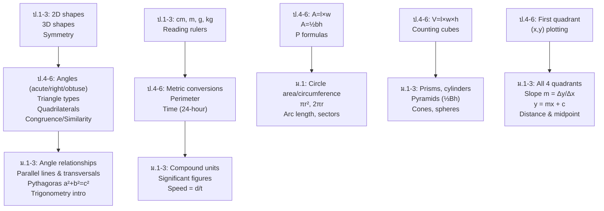

# Geometry and Measurement — เรขาคณิตและการวัด

> **Category:** Fundamental Mathematics (ป.1–ม.3)
> **Covering:** Geometry Shapes, Measurement, Area & Perimeter, Volume & Surface Area, Coordinate Plane
> **Duration:** 9 years — from recognizing shapes to Pythagoras and coordinates

## Overview

Geometry and Measurement spans the visual and spatial side of mathematics. Students progress from recognizing basic shapes in ป.1 to applying Pythagoras' theorem and working in all four quadrants by ม.3. Measurement ties geometry to the physical world — length, mass, capacity, time — and area/volume formulas bridge 2D and 3D thinking.

---

## Concept Areas

| # | Concept Area | Thai Name | ป.1–3 | ป.4–6 | ม.1–3 |
|---|---|---|---|---|---|
| 12 | [[12_Geometry_Shapes|Geometry Shapes]] | เรขาคณิต | Basic 2D/3D shapes | Angles, triangles, quadrilaterals, symmetry | Angle relationships, Pythagoras, constructions |
| 13 | [[13_Measurement|Measurement]] | การวัด | Standard units, rulers | Unit conversion, compound units | Precision, significant figures |
| 14 | [[14_Area_and_Perimeter|Area and Perimeter]] | พื้นที่และเส้นรอบรูป | Counting squares | Rectangle, triangle formulas | Circles, composite shapes |
| 15 | [[15_Volume_and_Surface_Area|Volume and Surface Area]] | ปริมาตรและพื้นที่ผิว | — | Rectangular prisms | Prisms, cylinders, pyramids, cones, spheres |
| 16 | [[16_Coordinate_Plane|Coordinate Plane]] | ระนาบพิกัด | — | First quadrant plotting | All 4 quadrants, slope, distance, midpoint |

---

## Learning Progression

---

## Key Formulas

### Area (พื้นที่)

| Shape | Formula | Thai |
|---|---|---|
| Rectangle | A = l × w | สี่เหลี่ยมผืนผ้า |
| Square | A = s² | สี่เหลี่ยมจัตุรัส |
| Triangle | A = ½ × b × h | สามเหลี่ยม |
| Parallelogram | A = b × h | สี่เหลี่ยมด้านขนาน |
| Trapezoid | A = ½ × (a+b) × h | สี่เหลี่ยมคางหมู |
| Circle | A = π × r² | วงกลม |

### Volume (ปริมาตร)

| Shape | Formula | Notes |
|---|---|---|
| Rectangular Prism | V = l × w × h | ปริซึมสี่เหลี่ยม |
| Prism (general) | V = B × h | B = base area |
| Cylinder | V = πr² × h | ทรงกระบอก |
| Pyramid | V = ⅓ × B × h | พีระมิด |
| Cone | V = ⅓ × πr² × h | กรวย |
| Sphere | V = ⁴⁄₃ × π × r³ | ทรงกลม |

### Key Relationships

| Relationship | Formula |
|---|---|
| **Pythagoras** | a² + b² = c² (right triangle) |
| **Slope** | m = (y₂−y₁)/(x₂−x₁) |
| **Distance** | d = √[(x₂−x₁)² + (y₂−y₁)²] |
| **Midpoint** | M = ((x₁+x₂)/2, (y₁+y₂)/2) |
| **Interior angle sum** | (n−2) × 180° (n-gon) |
| **Circle circumference** | C = 2πr = πd |

---

## Key Thai Terminology

| Thai | English |
|---|---|
| เส้นขนาน | Parallel lines |
| เส้นตั้งฉาก | Perpendicular |
| มุมฉาก | Right angle (90°) |
| มุมแหลม | Acute angle (<90°) |
| มุมป้าน | Obtuse angle (>90°) |
| ทฤษฎีบทพีทาโกรัส | Pythagoras' theorem |
| ความชัน | Slope |
| จุดกำเนิด | Origin (0,0) |
| พื้นที่ | Area |
| ปริมาตร | Volume |

---

## Common Misconceptions

- **"Area always increases when perimeter increases"** — Different shapes with same perimeter can have different areas
- **"π = 22/7 exactly"** — 22/7 is an approximation; π is irrational
- **"The longer side is always the hypotenuse"** — True, but only in right triangles
- **"Volume of pyramid is ½ × base × height"** — It's actually ⅓ (the same base and height prism holds 3× more)

---

## Exam Relevance

| Exam | Key Topics |
|---|---|
| **O-NET ป.6** | Area/perimeter of rectangles and triangles, measurement conversions |
| **O-NET ม.3** | Circle area/circumference, volume of prisms, Pythagoras, coordinate plane |
| **O-NET ม.6** | Trigonometry, advanced geometry (as part of broader math) |

---

## Cross-Links

- [[00_Fundamental Mathematics - Overview|← Back to Fundamental Mathematics]]
- [[01 Numbers and Operations - Overview|01 Numbers and Operations]] — Measurement calculations use arithmetic
- [[02 Algebra and Patterns - Overview|02 Algebra and Patterns]] — Coordinate plane connects algebra/geometry
