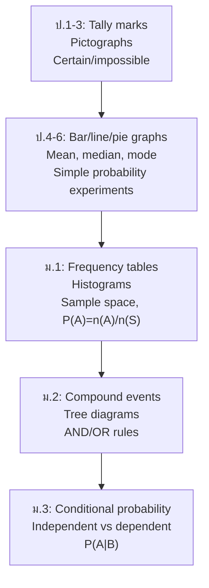

# Data, Statistics, and Probability — ข้อมูล สถิติ และความน่าจะเป็น

> **Category:** Fundamental Mathematics (ป.1–ม.3)
> **Covering:** Sets, Statistics & Data Handling, Probability
> **Duration:** 9 years — from tally marks to probability rules

## Overview

Data literacy begins with simple tally marks in ป.1 and grows into formal probability by ม.3. Sets provide the language for describing collections and events. Together, these three concept areas build the foundation for statistical reasoning — arguably the most practically useful branch of mathematics in everyday life.

---

## Concept Areas

| # | Concept Area | Thai Name | ป.1–3 | ป.4–6 | ม.1–3 |
|---|---|---|---|---|---|
| 17 | [[17_Sets|Sets]] | เซต | Sorting/classifying objects | Informal Venn diagrams | Notation, union, intersection, complement, Venn (2-3 sets) |
| 18 | [[18_Statistics_Data_Handling|Statistics and Data Handling]] | สถิติ | Tally marks, pictographs | Bar/line/pie graphs, mean/median/mode | Frequency tables, histograms, stem-and-leaf |
| 19 | [[19_Probability|Probability]] | ความน่าจะเป็น | Certain/likely/impossible vocabulary | Simple experiments | Theoretical/experimental, sample space, compound events |

---

## Learning Progression

---

## Key Concepts

### Measures of Central Tendency

| Measure | Thai | How to Find | Example: {3,7,7,8,10} |
|---|---|---|---|
| **Mean** | ค่าเฉลี่ย | Sum ÷ count | (3+7+7+8+10)÷5 = **7** |
| **Median** | มัธยฐาน | Middle value (sorted) | **7** |
| **Mode** | ฐานนิยม | Most frequent | **7** (appears twice) |
| **Range** | พิสัย | Max − Min | 10−3 = **7** |

### Set Operations

| Operation | Symbol | Meaning |
|---|---|---|
| Union | A ∪ B | Elements in A OR B |
| Intersection | A ∩ B | Elements in BOTH |
| Complement | A' | Elements NOT in A |
| Cardinality | n(A) | Number of elements |
| Formula | n(A∪B) = n(A) + n(B) − n(A∩B) | Avoid double-counting |

### Probability Rules

| Rule | Formula |
|---|---|
| Simple event | P(A) = n(A) / n(S) |
| Complement | P(not A) = 1 − P(A) |
| Mutually exclusive OR | P(A or B) = P(A) + P(B) |
| Non-exclusive OR | P(A or B) = P(A) + P(B) − P(A and B) |
| Independent AND | P(A and B) = P(A) × P(B) |
| Conditional | P(A\|B) = P(A and B) / P(B) |

---

## Key Thai Terminology

| Thai | English |
|---|---|
| แผนภูมิแท่ง | Bar graph |
| แผนภูมิเส้น | Line graph |
| แผนภูมิรูปวงกลม | Pie chart |
| ตารางแจกแจงความถี่ | Frequency table |
| ฮิสโทแกรม | Histogram |
| ค่าเฉลี่ย / มัธยฐาน / ฐานนิยม | Mean / Median / Mode |
| ความน่าจะเป็น | Probability |
| แซมเปิลสเปซ | Sample space |
| เหตุการณ์ | Event |
| ยูเนียน / อินเตอร์เซกชัน | Union / Intersection |

---

## Common Misconceptions

- **"Mean is always the best average"** — Median is better when data has outliers (e.g., average income)
- **"If I flip heads 5 times, tails is 'due'"** — Gambler's fallacy; each flip is independent, P(tails) = ½ always
- **"Probability and statistics are the same"** — Probability predicts future from known model; statistics infers model from past data
- **"n(A∪B) = n(A) + n(B)"** — Only true if A and B don't overlap; otherwise subtract the intersection

---

## Exam Relevance

| Exam | Key Topics |
|---|---|
| **O-NET ป.6** | Reading graphs, mean, simple probability |
| **O-NET ม.3** | Frequency tables, histograms, probability of simple events |
| **O-NET ม.6** | Sets, compound probability, distributions |

---

## Cross-Links

- [[00_Fundamental Mathematics - Overview|← Back to Fundamental Mathematics]]
- [[01 Numbers and Operations - Overview|01 Numbers and Operations]] — Fractions and percentages in probability
- [[02 Algebra and Patterns - Overview|02 Algebra and Patterns]] — Algebraic expressions in probability formulas
- [[09 Probability and Statistics - Overview|09 Probability and Statistics]] — ม.4–ม.6 continuation
