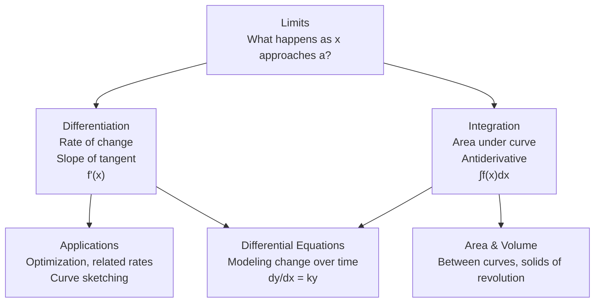

# Calculus — แคลคูลัส

> **Category:** Advanced Mathematics (ม.4–ม.6, Sci-Math track)
> **Courses:** ค302 (ม.5) + ค303 (ม.6)
> **Covering:** Limits, Differentiation, Integration, Differential Equations

## Overview

Calculus is the mathematics of **change** — invented independently by Newton and Leibniz in the 17th century. For Thai วิทย์-คณิต students, calculus is the capstone of high school mathematics and the essential toolkit for university-level physics, engineering, and economics.

---

## Topic Areas

| # | Topic | Thai | Key Content |
|---|---|---|---|
| 10 | [[Limits and Continuity]] | ลิมิตและความต่อเนื่อง | Limit definition, techniques, continuity, squeeze theorem, limits at infinity |
| 11 | [[Differentiation]] | อนุพันธ์ | Derivative definition, rules (power, product, quotient, chain), implicit differentiation |
| 12 | [[Applications of Differentiation]] | การประยุกต์อนุพันธ์ | Tangent lines, rate of change, maxima/minima, related rates, curve sketching, L'Hôpital's rule |
| 13 | [[Integration]] | ปริพันธ์ | Antiderivatives, definite integrals, Fundamental Theorem, substitution, integration by parts |
| 14 | [[Applications of Integration]] | การประยุกต์ปริพันธ์ | Area between curves, volume of revolution, arc length |
| 15 | [[Differential Equations]] | สมการเชิงอนุพันธ์ | First-order ODEs, separation of variables, applications (growth, decay, motion) |

---

## The Calculus Story

The **Fundamental Theorem of Calculus** connects differentiation and integration — they are inverse operations:

$$\frac{d}{dx} \int_a^x f(t)\,dt = f(x) \quad \text{and} \quad \int_a^b f'(x)\,dx = f(b) - f(a)$$

---

## Key Formulas

### Differentiation Rules

| Rule | Formula |
|---|---|
| Power | d/dx (xⁿ) = n·xⁿ⁻¹ |
| Product | d/dx (uv) = u'v + uv' |
| Quotient | d/dx (u/v) = (u'v − uv') / v² |
| Chain | d/dx f(g(x)) = f'(g(x)) · g'(x) |

### Common Derivatives

| f(x) | f'(x) |
|---|---|
| sin x | cos x |
| cos x | −sin x |
| eˣ | eˣ |
| ln x | 1/x |

### Integration Techniques

| Technique | For |
|---|---|
| **Power rule** | ∫ xⁿ dx = xⁿ⁺¹/(n+1) + C (n ≠ −1) |
| **Substitution** | ∫ f(g(x))·g'(x) dx — let u = g(x) |
| **By parts** | ∫ u dv = uv − ∫ v du |
| **Partial fractions** | Rational functions |

---

## Key Thai Terminology

| Thai | English |
|---|---|
| ลิมิต | Limit |
| อนุพันธ์ | Derivative |
| ปริพันธ์ | Integral |
| การหาอนุพันธ์ | Differentiation |
| การหาปริพันธ์ | Integration |
| กฎลูกโซ่ | Chain rule |
| สมการเชิงอนุพันธ์ | Differential equation |
| ทฤษฎีบทหลักมูล | Fundamental Theorem (of Calculus) |

---

## Exam Relevance

| Exam | Calculus Content |
|---|---|
| **A-Level Math 1** | ~25-30% — Limits, differentiation, integration |
| **PAT1** | ~20% — Applied calculus problems |

---

## Cross-Links

- [[01_Advance Mathematics (Sci-Math) - Overview|← Back to Advanced Mathematics]]
- [[06 Foundations and Functions|Foundations and Functions]] — Functions are what calculus acts upon
- [[10 Discrete and Advanced Topics|Discrete Math]] — Proof techniques used in calculus
- **Physics** — Calculus is the language of mechanics (velocity = dx/dt, acceleration = d²x/dt²)
