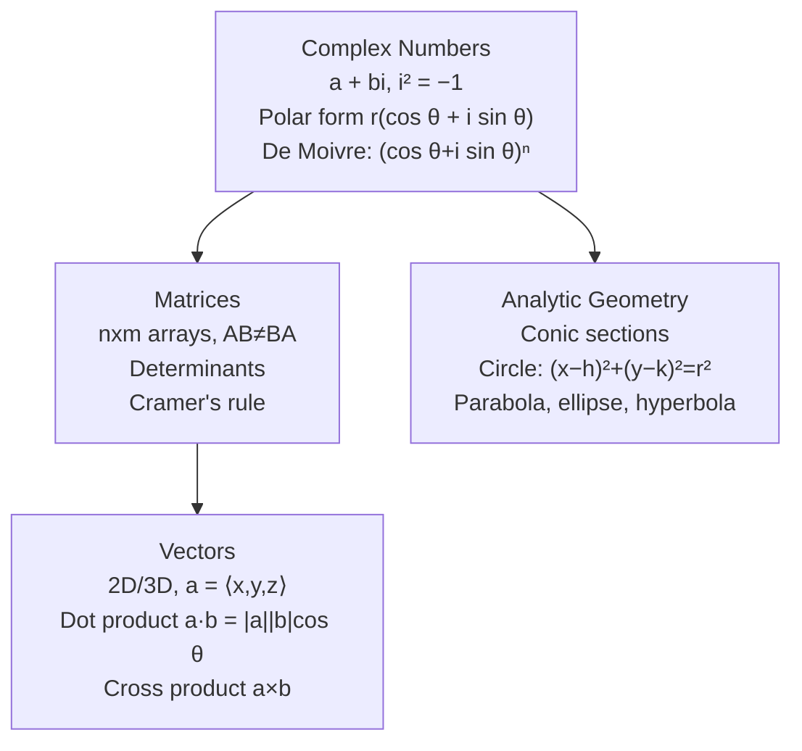

# Algebra and Geometry — พีชคณิตและเรขาคณิต

> **Category:** Advanced Mathematics (ม.4–ม.6, Sci-Math track)
> **Course:** ค302 (ม.5)
> **Covering:** Complex Numbers, Matrices, Analytic Geometry, Vectors

## Overview

This category extends algebra and geometry into higher dimensions — literally. Complex numbers open the door to the complex plane. Matrices enable systematic solution of linear systems. Vectors bring direction and magnitude into computation. Analytic geometry unites algebra and geometry through coordinates.

---

## Topic Areas

| # | Topic | Thai | Key Content |
|---|---|---|---|
| 10 | [[10_Complex_Numbers\|Complex Numbers]] | จำนวนเชิงซ้อน | Imaginary unit i, operations, polar form, De Moivre's theorem, roots of unity |
| 11 | [[11_Matrices_and_Determinants\|Matrices and Determinants]] | เมทริกซ์และดีเทอร์มิแนนต์ | Matrix operations, inverses, Cramer's rule, systems of equations |
| 12 | [[12_Analytic_Geometry\|Analytic Geometry]] | เรขาคณิตวิเคราะห์ | Lines, circles, parabolas, ellipses, hyperbolas — equations and graphs |
| 13 | [[13_Vectors\|Vectors]] | เวกเตอร์ | 2D/3D vectors, dot product, cross product, vector equations of lines and planes |

---

## Learning Progression

---

## Key Formulas

### Complex Numbers
| Concept | Formula |
|---|---|
| i definition | i² = −1 |
| Polar form | z = r(cos θ + i sin θ) = r·cis θ |
| De Moivre | (cos θ + i sin θ)ⁿ = cos(nθ) + i sin(nθ) |
| nth roots | zₖ = r¹⁄ⁿ·cis((θ+2πk)/n), k = 0,1,...,n−1 |

### Matrices
| Concept | Formula |
|---|---|
| 2×2 determinant | det(A) = ad − bc |
| 2×2 inverse | A⁻¹ = (1/det) [d −b; −c a] |
| Cramer's rule | xᵢ = det(Aᵢ)/det(A) |

### Vectors
| Concept | Formula |
|---|---|
| Dot product | a·b = |a||b| cos θ |
| Cross product (3D) | a×b = |a||b| sin θ n̂ |
| Line equation | r = r₀ + t v |
| Plane equation | n·(r − r₀) = 0 |

### Conic Sections
| Curve | Standard Form |
|---|---|
| Circle | (x−h)² + (y−k)² = r² |
| Parabola (vertical) | (x−h)² = 4p(y−k) |
| Ellipse | (x−h)²/a² + (y−k)²/b² = 1 |
| Hyperbola | (x−h)²/a² − (y−k)²/b² = 1 |

---

## Key Thai Terminology

| Thai | English |
|---|---|
| จำนวนเชิงซ้อน | Complex number |
| ส่วนจริง / ส่วนจินตภาพ | Real part / Imaginary part |
| เมทริกซ์ | Matrix |
| ดีเทอร์มิแนนต์ | Determinant |
| เวกเตอร์ | Vector |
| ผลคูณเชิงสเกลาร์ | Dot product |
| ผลคูณเชิงเวกเตอร์ | Cross product |
| ภาคตัดกรวย | Conic section |

---

## Exam Relevance

| Exam | Topics |
|---|---|
| **A-Level Math 1** | Matrices, vectors, analytic geometry |
| **PAT1** | Complex numbers, vectors, conic sections |

---

## Cross-Links

- [[01_Advance Mathematics (Sci-Math) - Overview|← Back to Advanced Mathematics]]
- [[06 Foundations and Functions|Foundations and Functions]] — Functions underpin analytic geometry
- [[07 Calculus|Calculus]] — Vectors essential for multivariable calculus
- **Physics** — Vectors describe forces, velocity, acceleration; complex numbers in AC circuits
