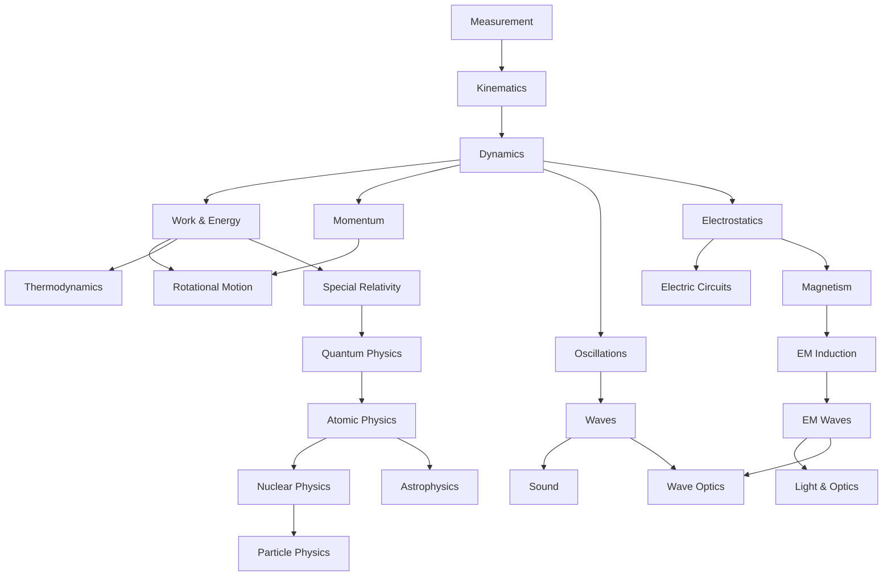

# Physics — ฟิสิกส์

> **Subject Area:** Physical Sciences for Science-Math High School (สายวิทย์-คณิต ม.4–ม.6)
> **Course Codes:** ว301 (ม.4), ว302 (ม.5), ว303 (ม.6) | 3 credits each
> **Total Topics:** ~23 | **Duration:** 3 years (6 semesters)
> **Source:** IPST (สสวท.) Basic Education Core Curriculum B.E. 2551 (2008), revised 2560 (2017)
> **Foundation for:** Engineering, Physical Sciences, Earth Science, Astrophysics

## What Is This?

Physics is the fundamental science of matter, energy, and their interactions. For วิทย์-คณิต students, physics builds the intuition for how the physical world works — from falling objects to electromagnetic waves to quantum particles. The Thai high school physics curriculum (ว301–ว303) progresses from classical mechanics through modern physics, with increasing mathematical sophistication each year.

The curriculum follows สสวท./IPST standards and emphasizes both conceptual understanding and mathematical problem-solving. Laboratory work and real-world applications are integrated throughout. IPST textbooks are freely available at [ipst.ac.th](https://www.ipst.ac.th).

## The ~23 Topic Areas

### 🔧 ม.4 (ว301) — Classical Mechanics & Thermodynamics
- [[01_Measurement_and_Scientific_Method]] — SI units, significant figures, dimensional analysis, error analysis, scientific method
- [[02_Kinematics]] — Displacement, velocity, acceleration, projectile motion, free fall
- [[03_Dynamics]] — Newton's laws, friction, inclined planes, circular motion, gravity
- [[04_Work_Energy_and_Power]] — KE, PE, work-energy theorem, conservation of energy, power
- [[05_Momentum]] — Impulse, conservation of momentum, collisions (elastic, inelastic)
- [[06_Rotational_Motion]] — Torque, angular velocity, moment of inertia, angular momentum
- [[07_Oscillations]] — Simple harmonic motion, springs, pendulums, damped oscillations
- [[08_Waves]] — Wave properties, types (transverse, longitudinal), superposition, standing waves, resonance
- [[09_Sound]] — Speed of sound, Doppler effect, beats, musical acoustics
- [[10_Heat_and_Thermodynamics]] — Temperature, heat transfer, thermal expansion, ideal gas law, laws of thermodynamics, entropy, heat engines

### ⚡ ม.5 (ว302) — Electricity, Magnetism & Optics
- [[11_Electrostatics]] — Coulomb's law, electric field, Gauss's law, electric potential, capacitors
- [[12_Electric_Circuits]] — Ohm's law, series/parallel circuits, Kirchhoff's laws, RC circuits
- [[13_Magnetism]] — Magnetic fields, magnetic force on charges/currents, Earth's magnetic field
- [[14_Electromagnetic_Induction]] — Faraday's law, Lenz's law, generators, transformers, inductance
- [[15_Electromagnetic_Waves]] — EM spectrum, properties, light as EM wave
- [[16_Light_and_Optics]] — Reflection, refraction, Snell's law, lenses, mirrors, optical instruments
- [[17_Wave_Optics]] — Interference, diffraction, polarization

### 🔬 ม.6 (ว303) — Modern Physics
- [[18_Special_Relativity]] — Postulates, time dilation, length contraction, mass-energy equivalence
- [[19_Quantum_Physics]] — Photoelectric effect, wave-particle duality, de Broglie, uncertainty principle
- [[20_Atomic_Physics]] — Bohr model, hydrogen atom, energy levels, emission/absorption spectra
- [[21_Nuclear_Physics]] — Nuclear structure, radioactivity, decay, half-life, fission, fusion, nuclear energy
- [[22_Particle_Physics]] — Standard model (intro), fundamental particles, quarks, leptons
- [[23_Astrophysics_and_Cosmology]] — Stars, stellar evolution, galaxies, Big Bang (introductory)

## Topic Distribution

| Year | Code | Semester 1 | Semester 2 |
|---|---|---|---|
| **ม.4** | ว301 | Measurement, Kinematics, Dynamics, Work/Energy | Momentum, Rotation, Oscillations, Waves, Sound, Thermo |
| **ม.5** | ว302 | Electrostatics, DC Circuits, Magnetism | EM Induction, EM Waves, Light/Optics, Wave Optics |
| **ม.6** | ว303 | Special Relativity, Quantum Physics, Atomic Physics | Nuclear Physics, Particle Physics, Astrophysics |

## Prerequisites

- **Before ม.4:** Basic algebra, trigonometry, unit conversion
- **Before ม.5:** Kinematics, forces, energy (ว301 physics) + limits/derivatives (ค301 math)
- **Before ม.6:** Waves, E&M (ว302 physics) + integration (ค302 math)

## How Topics Connect

## Key Connections to Other Subjects

- [[Mathematics - Overview|Mathematics]] — Calculus for motion/energy, vectors for forces, trig for waves
- [[Chemistry - Overview|Chemistry]] — Thermodynamics (shared), atomic structure, spectroscopy
- [[Earth Science - Overview|Earth Science]] — Climate physics, seismology, astronomy
- [[Computer Science - Overview|Computer Science]] — Simulations, data analysis from experiments

## Reading Paths

- **Classical mechanics:** 01 → 02 → 03 → 04 → 05 → 06
- **Waves & thermo:** 07 → 08 → 09 → 10
- **E&M track:** 11 → 12 → 13 → 14 → 15
- **Optics:** 16 → 17
- **Modern physics:** 18 → 19 → 20 → 21 → 22 → 23
- **Full sequence (recommended):** 01 through 23 in order

## Related

- [[Body of Knowledge - Overview|← Back to Math-Sci Overview]]
- [[Mathematics - Overview|Mathematics]] — Calculus, vectors, and trigonometry are essential tools
- [[Chemistry - Overview|Chemistry]] — Thermodynamics and atomic physics overlap
- [[Earth Science - Overview|Earth Science]] — Climate, seismology, astronomy applications
- **IPST Textbooks:** [ipst.ac.th](https://www.ipst.ac.th) — Free PDF textbooks for all levels
