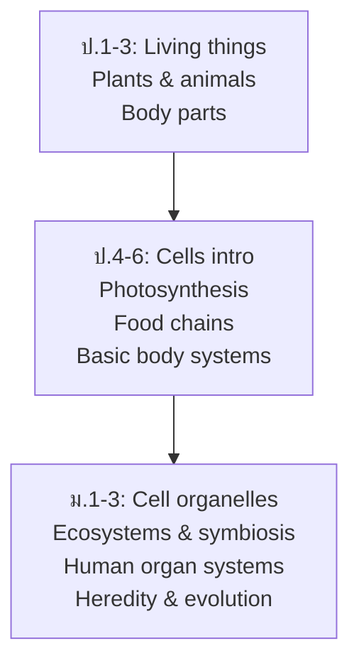

# Life Science — วิทยาศาสตร์ชีวภาพ

> **Category:** Fundamental Science (ป.1–ม.3)
> **Covering:** Living Things, Cells, Human Body, Plants, Animals, Ecosystems, Heredity & Evolution
> **Duration:** 9 years, spiral progression

## Overview

Life Science introduces students to the living world — from recognizing plants and animals in ป.1 to understanding cells, ecosystems, and heredity by ม.3. The progression mirrors the expanding awareness of a child: self → family → community → world → universe of life.

---

## Concept Areas

| # | Concept Area | Thai | ป.1–3 | ป.4–6 | ม.1–3 |
|---|---|---|---|---|---|
| 02 | [[Living Things]] | สิ่งมีชีวิต | Characteristics, basic classification | Five kingdoms, vertebrates | Taxonomy, binomial nomenclature |
| 03 | [[Cells]] | เซลล์ | — | Cell as unit, basic structure | Organelles, osmosis, cell division |
| 04 | [[Human Body Systems]] | ระบบร่างกาย | Body parts, five senses | Digestive, circulatory, respiratory | Excretory, endocrine, immune, reproduction |
| 05 | [[Plants]] | พืช | Parts, basic needs | Photosynthesis, reproduction | Hormones, tropisms |
| 06 | [[Animals]] | สัตว์ | Types, habitats, life cycles | Behavior, adaptation | Body systems, evolution intro |
| 07 | [[Ecosystems]] | ระบบนิเวศ | Habitats, food chains | Food webs, energy flow | Symbiosis, nutrient cycles |
| 08 | [[Heredity and Evolution]] | พันธุกรรมและวิวัฒนาการ | — | — | Traits, natural selection, fossils |

---

## Learning Progression

---

## Key Concepts

### Cells (ม.1-3)

| Organelle | Function |
|---|---|
| Nucleus | Contains DNA, controls cell |
| Mitochondria | Energy production (respiration) |
| Chloroplast | Photosynthesis (plant cells only) |
| Cell membrane | Controls what enters/leaves |
| Cell wall | Structural support (plant cells) |

### Human Body Systems

| System | Main Organs | Function |
|---|---|---|
| Digestive | Mouth, stomach, intestines | Break down food |
| Circulatory | Heart, blood vessels | Transport oxygen, nutrients |
| Respiratory | Lungs, trachea | Gas exchange |
| Nervous | Brain, spinal cord, nerves | Control and coordination |
| Excretory | Kidneys, bladder | Remove waste |
| Immune | White blood cells, lymph | Fight disease |

### Ecosystems

| Relationship | Example |
|---|---|
| Predation | Lion eats zebra |
| Competition | Trees compete for sunlight |
| Mutualism | Bee pollinates flower |
| Commensalism | Barnacle on whale |
| Parasitism | Tapeworm in intestine |

---

## Key Thai Terminology

| Thai | English |
|---|---|
| เซลล์ | Cell |
| การสังเคราะห์ด้วยแสง | Photosynthesis |
| ระบบนิเวศ | Ecosystem |
| ห่วงโซ่อาหาร | Food chain |
| การคัดเลือกโดยธรรมชาติ | Natural selection |
| ความหลากหลายทางชีวภาพ | Biodiversity |

---

## Cross-Links

- [[00_Fundamental Science - Overview|← Back to Fundamental Science]]
- [[12 Cell and Molecular Biology|Cell & Molecular Biology (ม.4-6)]]
- [[13 Genetics Evolution and Ecology|Genetics & Ecology (ม.4-6)]]
- [[14 Organismal Biology and Biotechnology|Organismal Biology (ม.4-6)]]
