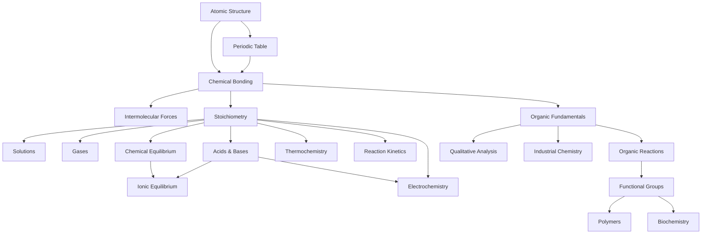

# Chemistry — เคมี

> **Subject Area:** Chemical Sciences for Science-Math High School (สายวิทย์-คณิต ม.4–ม.6)
> **Course Codes:** ว311 (ม.4), ว312 (ม.5), ว313 (ม.6) | 3 credits each
> **Total Topics:** ~20 | **Duration:** 3 years (6 semesters)
> **Source:** IPST (สสวท.) Basic Education Core Curriculum B.E. 2551 (2008), revised 2560 (2017)
> **Foundation for:** Medicine, Pharmacy, Chemical Engineering, Materials Science, Biochemistry

## What Is This?

Chemistry is the science of matter — its composition, structure, properties, and the transformations it undergoes. For วิทย์-คณิต students, chemistry bridges the gap between physics's fundamental forces and biology's complex living systems. The Thai high school chemistry curriculum (ว311–ว313) covers everything from atomic structure to organic reactions, building the foundation for university-level science and medical programs.

The curriculum follows สสวท./IPST standards with emphasis on both theoretical understanding and laboratory skills. Students learn to think at the molecular level while connecting to real-world applications. IPST textbooks are freely available at [ipst.ac.th](https://www.ipst.ac.th).

## The ~20 Topic Areas

### 🧱 ม.4 (ว311) — Foundations & Physical Chemistry
- [[01_Atomic_Structure]] — Subatomic particles, electron configuration, quantum numbers, periodic trends
- [[02_Periodic_Table]] — Groups, periods, properties, trends (electronegativity, ionization energy, atomic radius)
- [[03_Chemical_Bonding]] — Ionic, covalent, metallic bonds, Lewis structures, VSEPR, molecular geometry
- [[04_Intermolecular_Forces]] — Van der Waals, hydrogen bonding, dipole-dipole, effects on physical properties
- [[05_Stoichiometry]] — Mole concept, molar mass, balancing equations, limiting reagent, percent yield
- [[06_Solutions]] — Concentration units, solubility, colligative properties, dilution
- [[07_Gases]] — Gas laws (Boyle, Charles, Avogadro, ideal gas law), kinetic molecular theory

### ⚗️ ม.5 (ว312) — Reactions & Equilibrium
- [[08_Acids_and_Bases]] — Arrhenius, Brønsted-Lowry, Lewis theories, pH, buffers, titration
- [[09_Chemical_Equilibrium]] — Le Chatelier's principle, equilibrium constants (Kc, Kp), ICE tables
- [[10_Ionic_Equilibrium]] — Solubility product (Ksp), common ion effect, precipitation
- [[11_Thermochemistry]] — Enthalpy, Hess's law, bond energies, calorimetry, entropy & Gibbs free energy
- [[12_Reaction_Kinetics]] — Rate laws, order of reactions, activation energy, Arrhenius equation, catalysis
- [[13_Electrochemistry]] — Galvanic cells, electrolytic cells, standard electrode potentials, Nernst equation, electrolysis, corrosion

### 🧬 ม.6 (ว313) — Organic & Applied Chemistry
- [[14_Organic_Fundamentals]] — Hydrocarbons, functional groups, nomenclature (IUPAC), isomerism
- [[15_Organic_Reactions]] — Addition, substitution, elimination, oxidation-reduction of organic compounds
- [[16_Organic_Compounds_by_Functional_Group]] — Alcohols, aldehydes, ketones, carboxylic acids, esters, amines, amides
- [[17_Polymers]] — Types (addition, condensation), natural & synthetic polymers, plastics
- [[18_Biochemistry]] — Carbohydrates, lipids, proteins, nucleic acids, enzymes
- [[19_Qualitative_Analysis]] — Identifying ions, systematic analysis methods
- [[20_Industrial_and_Applied_Chemistry]] — Industrial processes, materials, environmental chemistry

## Topic Distribution

| Year | Code | Semester 1 | Semester 2 |
|---|---|---|---|
| **ม.4** | ว311 | Atomic Structure, Periodic Table, Bonding, IMFs | Stoichiometry, Solutions, Gases |
| **ม.5** | ว312 | Acids & Bases, Equilibrium, Ionic Equilibrium | Thermochemistry, Kinetics, Electrochemistry |
| **ม.6** | ว313 | Organic Fundamentals, Organic Reactions, Functional Groups | Polymers, Biochemistry, Qual Analysis, Industrial |

## Prerequisites

- **Before ม.4:** Basic algebra, proportional reasoning, matter classification
- **Before ม.5:** Atomic structure, bonding, stoichiometry (ว311 chemistry)
- **Before ม.6:** Equilibrium, acids/bases, electrochemistry (ว312 chemistry)

## How Topics Connect

## Key Connections to Other Subjects

- [[01_Advance Mathematics (Sci-Math) - Overview|Mathematics]] — Stoichiometry (algebra), rates (calculus), equilibrium (functions)
- [[01_Physics - Overview|Physics]] — Thermodynamics (shared), atomic structure, spectroscopy
- [[03_Biology - Overview|Biology]] — Biochemistry, enzymes, metabolism, DNA/RNA
- [[04_Earth Science - Overview|Earth Science]] — Geochemistry, atmospheric chemistry, ocean chemistry

## Reading Paths

- **Foundations first:** 01 → 02 → 03 → 04 → 05 → 06 → 07
- **Reactions track:** 08 → 09 → 10 → 11 → 12 → 13
- **Organic track:** 14 → 15 → 16 → 17 → 18 → 19 → 20
- **Medicine/Pharma prep:** 01 → 03 → 05 → 08 → 14 → 16 → 18
- **Full sequence (recommended):** 01 through 20 in order

## Related

- [[Body of Knowledge - Overview|← Back to Math-Sci Overview]]
- [[01_Physics - Overview|Physics]] — Thermodynamics, atomic physics, spectroscopy
- [[03_Biology - Overview|Biology]] — Biochemistry, metabolism, molecular biology
- [[01_Advance Mathematics (Sci-Math) - Overview|Mathematics]] — Algebra for stoichiometry, calculus for kinetics
- **IPST Textbooks:** [ipst.ac.th](https://www.ipst.ac.th) — Free PDF textbooks for all levels
