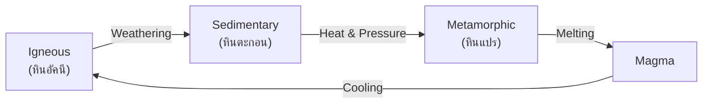

# Earth and Space Science — วิทยาศาสตร์โลกและอวกาศ

> **Category:** Fundamental Science (ป.1–ม.3)
> **Covering:** Rocks/Minerals/Soil, Weather/Climate, Solar System/Astronomy, Technology/Engineering
> **Duration:** 9 years

## Overview

Earth and Space Science connects students to their planet and its place in the cosmos. From observing weather and identifying rocks in primary school to understanding plate tectonics and star life cycles in lower secondary, this category builds environmental and cosmic awareness.

---

## Concept Areas

| # | Concept Area | Thai | ป.1–3 | ป.4–6 | ม.1–3 |
|---|---|---|---|---|---|
| 19 | [[Rocks, Minerals, and Soil]] | หิน แร่ และดิน | Rock types, soil | Rock cycle, minerals | Plate tectonics, earthquakes |
| 20 | [[Weather and Climate]] | ลมฟ้าอากาศ | Observation, seasons | Water cycle, instruments | Atmosphere, greenhouse effect |
| 21 | [[Solar System and Astronomy]] | ระบบสุริยะและดาราศาสตร์ | Sun, Moon, stars | Planets, rotation/revolution | Galaxies, star life cycle |
| 22 | [[Technology and Engineering]] | เทคโนโลยีและการออกแบบ | Tools, daily life | Simple machines, design process | STEM, materials |

---

## Key Concepts

### Rock Cycle

### Solar System

| Planet | Thai | Type | Key Fact |
|---|---|---|---|
| Mercury | ดาวพุธ | Rocky | Closest to Sun |
| Venus | ดาวศุกร์ | Rocky | Hottest planet |
| Earth | โลก | Rocky | Only known life |
| Mars | ดาวอังคาร | Rocky | Red planet |
| Jupiter | ดาวพฤหัสบดี | Gas giant | Largest |
| Saturn | ดาวเสาร์ | Gas giant | Rings |
| Uranus | ดาวมฤตยู | Ice giant | Tilted axis |
| Neptune | ดาวเนปจูน | Ice giant | Farthest |

---

## Key Thai Terminology

| Thai | English |
|---|---|
| วัฏจักรหิน | Rock cycle |
| หินอัคนี / หินตะกอน / หินแปร | Igneous / Sedimentary / Metamorphic |
| การผุพัง | Weathering |
| การกัดเซาะ | Erosion |
| ปรากฏการณ์เรือนกระจก | Greenhouse effect |
| ระบบสุริยะ | Solar system |
| ปีแสง | Light-year |

---

## Cross-Links

- [[00_Fundamental Science - Overview|← Back to Fundamental Science]]
- [[04_Earth Science - Overview|Earth Science (ม.4-6)]]
