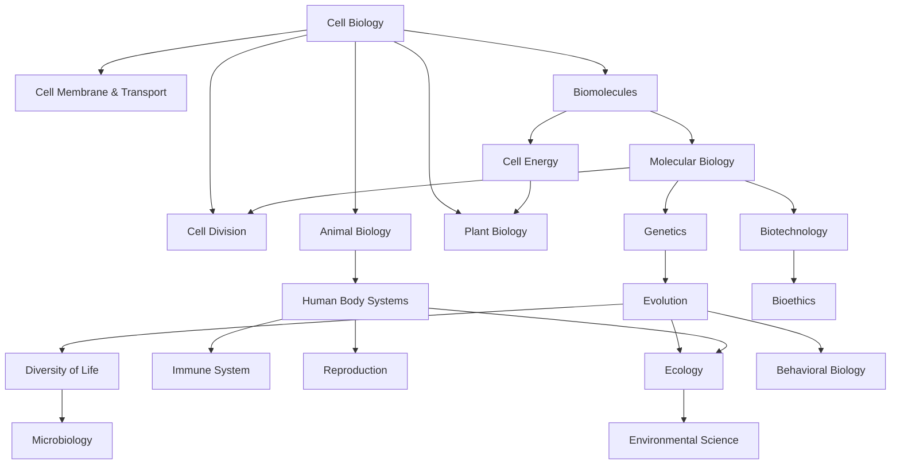

# Biology — ชีววิทยา

> **Subject Area:** Life Sciences for Science-Math High School (สายวิทย์-คณิต ม.4–ม.6)
> **Course Codes:** ว321 (ม.4), ว322 (ม.5), ว323 (ม.6) | 3 credits each
> **Total Topics:** ~20 | **Duration:** 3 years (6 semesters)
> **Source:** IPST (สสวท.) Basic Education Core Curriculum B.E. 2551 (2008), revised 2560 (2017)
> **Foundation for:** Medicine, Dentistry, Pharmacy, Veterinary Science, Biotechnology, Environmental Science

## What Is This?

Biology is the science of life — from the molecular machinery inside cells to the complex interactions of entire ecosystems. For วิทย์-คณิต students, biology provides the foundation for medical and health sciences, while also connecting deeply with chemistry (biochemistry) and physics (biophysics). The Thai high school biology curriculum (ว321–ว323) progresses from molecular-level understanding through organismal biology to ecology and biotechnology.

The curriculum follows สสวท./IPST standards and is particularly important for students preparing for medical school entrance exams (กสพท./TCAS). Laboratory skills, scientific reasoning, and data interpretation are emphasized throughout. IPST textbooks are freely available at [ipst.ac.th](https://www.ipst.ac.th).

## The ~20 Topic Areas

### 🧫 ม.4 (ว321) — Molecular & Cell Biology
- [[01_Cell_Biology]] — Cell structure (prokaryote, eukaryote), organelles, cell membrane, cell theory
- [[02_Cell_Membrane_and_Transport]] — Passive/active transport, osmosis, endocytosis, exocytosis
- [[03_Biomolecules]] — Carbohydrates, lipids, proteins, nucleic acids, enzymes
- [[04_Cell_Energy]] — Photosynthesis, cellular respiration, ATP, fermentation
- [[05_Cell_Division]] — Mitosis, meiosis, cell cycle, cancer biology
- [[06_Molecular_Biology]] — DNA structure, replication, transcription, translation, gene expression
- [[07_Genetics]] — Mendelian genetics, inheritance patterns, pedigree analysis, chromosomal abnormalities

### 🧬 ม.5 (ว322) — Evolution, Diversity & Organismal Biology
- [[08_Evolution]] — Evidence for evolution, natural selection, mechanisms, speciation, Hardy-Weinberg
- [[09_Diversity_of_Life]] — Classification/taxonomy, kingdoms, phylogenetics
- [[10_Microbiology]] — Bacteria, viruses, fungi, protists, archaea
- [[11_Plant_Biology]] — Plant structure, tissues, photosynthesis (detailed), transpiration, growth, reproduction (flowering plants)
- [[12_Animal_Biology]] — Animal tissues, organ systems overview, invertebrate & vertebrate diversity
- [[13_Human_Body_Systems]] — Digestive, circulatory, respiratory, excretory, nervous, endocrine systems

### 🌿 ม.6 (ว323) — Ecology, Immunity & Biotechnology
- [[14_Immune_System]] — Innate/adaptive immunity, antibodies, vaccines, autoimmune disorders, allergies
- [[15_Human_Reproduction_and_Development]] — Reproductive anatomy, fertilization, embryonic development, contraception
- [[16_Ecology]] — Ecosystems, energy flow, food webs, biogeochemical cycles, population ecology, community ecology
- [[17_Environmental_Science]] — Biodiversity, conservation, pollution, climate change, sustainability
- [[18_Biotechnology]] — Genetic engineering, recombinant DNA, PCR, gel electrophoresis, GMOs, cloning, gene therapy
- [[19_Behavioral_Biology]] — Animal behavior, innate vs learned, migration, communication
- [[20_Bioethics]] — Ethical issues in biotechnology, cloning, genetic modification

## Topic Distribution

| Year | Code | Semester 1 | Semester 2 |
|---|---|---|---|
| **ม.4** | ว321 | Cell Biology, Membrane Transport, Biomolecules | Cell Energy, Cell Division, Molecular Biology, Genetics |
| **ม.5** | ว322 | Evolution, Diversity, Microbiology | Plant Biology, Animal Biology, Human Body Systems |
| **ม.6** | ว323 | Immune System, Reproduction, Ecology | Environmental Science, Biotechnology, Behavior, Bioethics |

## Prerequisites

- **Before ม.4:** Basic chemistry (atoms, molecules, bonds), scientific method
- **Before ม.5:** Cell biology, molecular biology, genetics (ว321 biology) + chemistry basics
- **Before ม.6:** Evolution, organismal biology (ว322 biology)

## How Topics Connect

## Key Connections to Other Subjects

- [[02_Chemistry - Overview|Chemistry]] — Biochemistry, enzymes, organic molecules, pH (blood buffers)
- [[01_Physics - Overview|Physics]] — Biophysics (nerve impulses, optics of eye), thermodynamics of metabolism
- [[01_Advance Mathematics (Sci-Math) - Overview|Mathematics]] — Statistics for genetics, population models (calculus)
- [[04_Earth Science - Overview|Earth Science]] — Ecology, environmental science, evolution (fossils)

## Reading Paths

- **Medical prep (กสพท.):** 01 → 02 → 03 → 04 → 05 → 06 → 07 → 08 → 13 → 14 → 15
- **Genetics focus:** 06 → 07 → 08 → 09 → 18
- **Ecology focus:** 08 → 09 → 16 → 17
- **Full sequence (recommended):** 01 through 20 in order

## Related

- [[Body of Knowledge - Overview|← Back to Math-Sci Overview]]
- [[02_Chemistry - Overview|Chemistry]] — Biochemistry, organic chemistry, enzyme kinetics
- [[01_Physics - Overview|Physics]] — Biophysics, thermodynamics of living systems
- [[04_Earth Science - Overview|Earth Science]] — Ecology, environmental science, evolution
- **IPST Textbooks:** [ipst.ac.th](https://www.ipst.ac.th) — Free PDF textbooks for all levels
