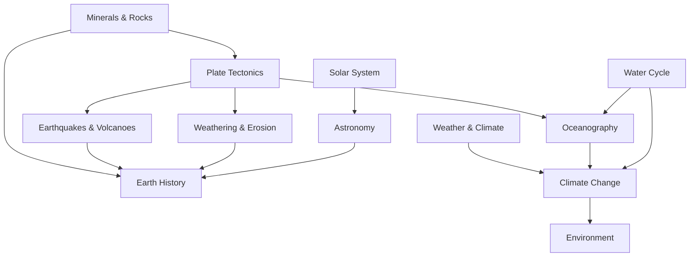

# Earth Science — วิทยาศาสตร์โลก

> **Subject Area:** Earth and Space Sciences for Science-Math High School (สายวิทย์-คณิต ม.4–ม.5)
> **Course Code:** ว341 (elective) | 1.5 credits
> **Total Topics:** ~10 | **Duration:** 1 year (elective in ม.4 or ม.5)
> **Source:** IPST (สสวท.) Basic Education Core Curriculum B.E. 2551 (2008), revised 2560 (2017)
> **Foundation for:** Environmental Science, Geology, Meteorology, Astronomy, Geography

## What Is This?

Earth Science (วิทยาศาสตร์โลก) is the study of our planet — its structure, processes, and place in the universe. For วิทย์-คณิต students, it applies principles from physics, chemistry, and biology to understand the Earth system. The curriculum covers geology, meteorology, oceanography, and astronomy, helping students understand natural phenomena from earthquakes to climate change.

While offered as an elective (ว341) in the Thai วิทย์-คณิต track, earth science concepts are also integrated into physics, chemistry, and biology curricula. The course is typically 1.5 credits and taken in ม.4 or ม.5. IPST textbooks are freely available at [ipst.ac.th](https://www.ipst.ac.th).

## The ~10 Topic Areas

### 🪨 Geosphere
- [[01_Minerals_and_Rocks]] — Mineral identification, rock types (igneous, sedimentary, metamorphic), rock cycle
- [[02_Plate_Tectonics]] — Continental drift, plate boundaries, tectonic forces, Pangaea
- [[03_Earthquakes_and_Volcanoes]] — Seismic waves, earthquake measurement (Richter/Mercalli), volcanic types, hazards
- [[04_Weathering_and_Erosion]] — Weathering types, mass wasting, erosion, soil formation
- [[05_Earth_History]] — Geological time scale, fossils, dating methods (radiometric, relative)

### 🌤️ Atmosphere & Hydrosphere
- [[06_Weather_and_Climate]] — Atmospheric layers, weather patterns, fronts, pressure systems, climate zones
- [[07_Oceanography]] — Ocean currents, tides, marine ecosystems, ocean chemistry
- [[08_Water_Cycle_and_Hydrology]] — Hydrological cycle, groundwater, watersheds, water resources

### 🌌 Astronomy & Environment
- [[09_Solar_System_and_Astronomy]] — Planets, moons, asteroids, comets, stars, galaxies, cosmology
- [[10_Climate_Change_and_Environment]] — Greenhouse effect, global warming, carbon cycle, natural resources, hazards, sustainability

## Topic Distribution

| Category | Topics |
|---|---|
| **Geosphere** | Minerals/Rocks, Plate Tectonics, Earthquakes/Volcanoes, Weathering/Erosion, Earth History |
| **Atmosphere & Hydrosphere** | Weather/Climate, Oceanography, Water Cycle |
| **Astronomy & Environment** | Solar System, Climate Change |

## Prerequisites

- **Basic level:** General science background, basic chemistry and physics concepts
- **For deep study:** Physics (mechanics, waves), Chemistry (atomic structure, reactions)

## How Topics Connect

## Key Connections to Other Subjects

- [[01_Physics - Overview|Physics]] — Seismic waves, thermodynamics (climate), orbital mechanics
- [[02_Chemistry - Overview|Chemistry]] — Geochemistry, atmospheric chemistry, ocean chemistry
- [[03_Biology - Overview|Biology]] — Ecology, evolution (fossils), environmental science
- [[01_Advance Mathematics (Sci-Math) - Overview|Mathematics]] — Statistical analysis, modeling (climate, population)

## Reading Paths

- **Geology track:** 01 → 02 → 03 → 04 → 05
- **Environmental track:** 06 → 07 → 08 → 10
- **Astronomy track:** 09
- **Full sequence (recommended):** 01 through 10 in order

## Related

- [[Body of Knowledge - Overview|← Back to Math-Sci Overview]]
- [[01_Physics - Overview|Physics]] — Waves, thermodynamics, orbital mechanics
- [[02_Chemistry - Overview|Chemistry]] — Geochemistry, atmospheric chemistry
- [[03_Biology - Overview|Biology]] — Ecology, evolution, environmental science
- **IPST Textbooks:** [ipst.ac.th](https://www.ipst.ac.th) — Free PDF textbooks for all levels
