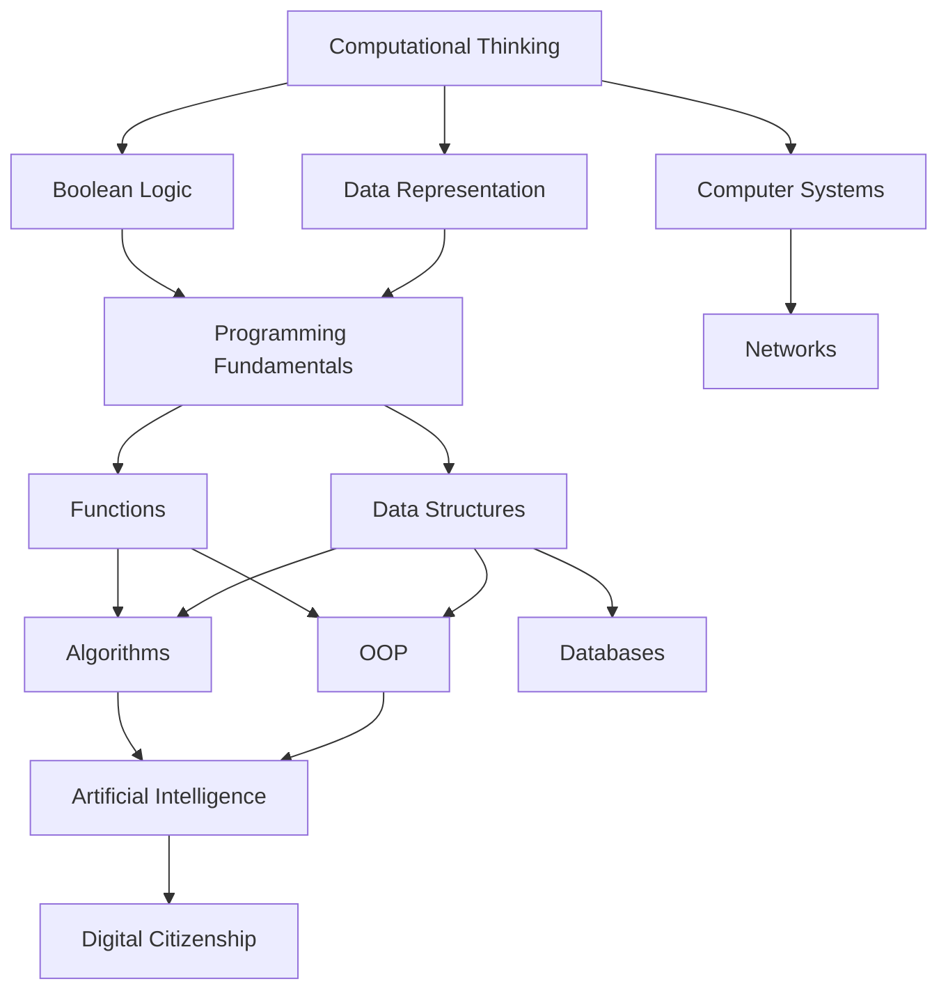

# Computer Science — วิทยาการคำนวณ

> **Subject Area:** Computational Science for Science-Math High School (สายวิทย์-คณิต ม.4–ม.6)
> **Course Codes:** ว331 (ม.4), ว332 (ม.5), ว333 (ม.6) | 1.5 credits each
> **Total Topics:** ~10 | **Duration:** 3 years (integrated into science-math curriculum)
> **Source:** IPST (สสวท.) Basic Education Core Curriculum B.E. 2551 (2008), revised 2560 (2017)
> **Foundation for:** Software Engineering, Data Science, AI/ML, Computer Engineering

## What Is This?

Computer Science (วิทยาการคำนวณ) is the study of computation — how to solve problems systematically using algorithms and data. For วิทย์-คณิต students, it provides computational thinking skills that complement mathematics and science. The Thai curriculum introduced วิทยาการคำนวณ as a formal subject in the 2017 revision (หลักสูตร 2560), covering everything from basic programming to introductory AI.

The curriculum emphasizes problem-solving methodology, algorithmic thinking, and practical programming skills. Students learn to analyze problems, design solutions, and implement them using code. Python is the most commonly used programming language. IPST textbooks are freely available at [ipst.ac.th](https://www.ipst.ac.th).

## The ~10 Topic Areas

### 💻 ม.4 (ว331) — Foundations & Programming
- [[01_Computational_Thinking]] — Decomposition, pattern recognition, abstraction, algorithm design
- [[02_Data_Representation]] — Binary, hexadecimal, ASCII/Unicode, images, sound representation
- [[03_Boolean_Logic]] — Logic gates, truth tables, Boolean algebra, Karnaugh maps
- [[04_Programming_Fundamentals]] — Variables, data types, input/output, expressions, control structures (if/else, loops)

### 🔧 ม.5 (ว332) — Data & Algorithms
- [[05_Functions_and_Modularity]] — Functions, parameters, return values, recursion, scope
- [[06_Algorithms]] — Sorting, searching, flowcharts, pseudocode, algorithmic complexity (Big-O)
- [[07_Data_Structures]] — Lists, stacks, queues, dictionaries, trees, graphs (introductory)
- [[08_Object_Oriented_Programming]] — Classes, objects, inheritance, encapsulation, polymorphism

### 🌐 ม.6 (ว333) — Systems & Modern Computing
- [[09_Computer_Systems_and_Networks]] — Hardware, software, OS, TCP/IP, protocols, web technologies, cybersecurity basics
- [[10_Databases]] — SQL basics, relational databases, data modeling
- [[11_Artificial_Intelligence]] — Machine learning concepts, AI applications, ethics of AI
- [[12_Digital_Citizenship]] — Digital literacy, online safety, intellectual property, ethics

## Topic Distribution

| Year | Code | Semester 1 | Semester 2 |
|---|---|---|---|
| **ม.4** | ว331 | Computational Thinking, Data Representation, Boolean Logic | Programming Fundamentals |
| **ม.5** | ว332 | Functions, Algorithms | Data Structures, OOP |
| **ม.6** | ว333 | Computer Systems, Networks, Databases | AI, Digital Citizenship |

## Prerequisites

- **Before ม.4:** Basic computer literacy, logical thinking
- **Before ม.5:** Programming fundamentals, control structures (ว331 CS)
- **Before ม.6:** Functions, data structures, OOP (ว332 CS)

## How Topics Connect

## Key Connections to Other Subjects

- [[01_Advance Mathematics (Sci-Math) - Overview|Mathematics]] — Discrete math, logic, algorithms, number systems
- [[01_Physics - Overview|Physics]] — Simulations, data analysis, computational modeling
- [[03_Biology - Overview|Biology]] — Bioinformatics, computational biology, genetic algorithms
- [[02_Chemistry - Overview|Chemistry]] — Molecular modeling, computational chemistry

## Reading Paths

- **Programming track:** 01 → 04 → 05 → 06 → 07 → 08
- **Theory track:** 01 → 02 → 03 → 06 → 07
- **Systems track:** 09 → 10 → 11 → 12
- **Full sequence (recommended):** 01 through 12 in order

## Related

- [[Body of Knowledge - Overview|← Back to Math-Sci Overview]]
- [[01_Advance Mathematics (Sci-Math) - Overview|Mathematics]] — Logic, discrete math, algorithms, number theory
- [[01_Physics - Overview|Physics]] — Computational modeling, data analysis
- **IPST Textbooks:** [ipst.ac.th](https://www.ipst.ac.th) — Free PDF textbooks for all levels
