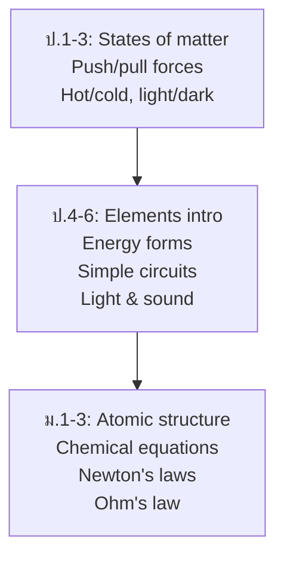

# Physical Science — วิทยาศาสตร์กายภาพ

> **Category:** Fundamental Science (ป.1–ม.3)
> **Covering:** Matter & Properties, Atoms/Elements/Compounds, Chemical Reactions, Acids/Bases, Forces & Motion, Energy, Heat, Light, Sound, Electricity & Magnetism
> **Duration:** 9 years, spiral progression

## Overview

Physical Science covers both chemistry and physics at the fundamental level — the non-living side of science. Students progress from observing properties of matter and forces in ป.1-3, through understanding atoms and energy in ป.4-6, to formal chemical equations and Newton's laws in ม.1-3.

---

## Concept Areas

### Chemistry Side

| # | Concept Area | Thai | ป.1–3 | ป.4–6 | ม.1–3 |
|---|---|---|---|---|---|
| 09 | [[09_Matter_and_Properties|Matter and Properties]] | สสารและสมบัติ | States, properties | Density, mixtures, solutions | Particle theory |
| 10 | [[10_Atoms_Elements_and_Compounds|Atoms, Elements, and Compounds]] | อะตอม ธาตุ สารประกอบ | — | Common elements | Atomic structure, periodic table |
| 11 | [[11_Chemical_Reactions|Chemical Reactions]] | ปฏิกิริยาเคมี | — | Observable signs | Equations, conservation of mass |
| 12 | [[12_Acids_Bases_and_Salts|Acids, Bases, and Salts]] | กรด เบส เกลือ | — | — | pH, indicators, neutralization |

### Physics Side

| # | Concept Area | Thai | ป.1–3 | ป.4–6 | ม.1–3 |
|---|---|---|---|---|---|
| 13 | [[13_Forces_and_Motion|Forces and Motion]] | แรงและการเคลื่อนที่ | Push/pull, simple machines | Gravity, friction, Newton (concept) | F=ma, velocity, acceleration |
| 14 | [[14_Energy|Energy]] | พลังงาน | Sources, hot/cold | Forms, conversion, conservation | Efficiency, sustainability |
| 15 | [[15_Heat_and_Temperature|Heat and Temperature]] | ความร้อนและอุณหภูมิ | Hot/cold, thermometer | Scales, heat transfer | Specific heat, latent heat |
| 16 | [[16_Light|Light]] | แสง | Sources, shadows | Reflection, refraction | Snell's law, the eye |
| 17 | [[17_Sound|Sound]] | เสียง | Loud/soft, high/low | Vibration, pitch | Sound waves, frequency |
| 18 | [[18_Electricity_and_Magnetism|Electricity and Magnetism]] | ไฟฟ้าและแม่เหล็ก | Magnets, static electricity | Circuits, conductors | Ohm's law, electromagnets |

---

## Learning Progression

---

## Key Formulas (ม.1-3)

| Formula             | What It Means                              |
| ------------------- | ------------------------------------------ |
| $$F = ma$$          | Force = mass × acceleration                |
| $$W = Fd$$          | Work = force × distance                    |
| $$P = \frac{W}{t}$$ | Power = work ÷ time                        |
| $$V = IR$$          | Voltage = current × resistance (Ohm's law) |
| $$ρ = \frac{m}{V}$$ | Density = mass ÷ volume                    |
| $$v = \frac{d}{t}$$ | Speed = distance ÷ time                    |

---

## Key Thai Terminology

| Thai | English |
|---|---|
| อะตอม | Atom |
| ธาตุ | Element |
| สารประกอบ | Compound |
| แรง | Force |
| พลังงาน | Energy |
| ไฟฟ้า | Electricity |
| แม่เหล็ก | Magnet |
| วงจรไฟฟ้า | Electric circuit |

---

## Cross-Links

- [[00_Fundamental Science - Overview|← Back to Fundamental Science]]
- [[01_Mechanics_-_Overview|05 Mechanics]] — Newton's laws deepen
- [[02_Thermodynamics_and_Waves_-_Overview|06 Thermodynamics and Waves]]
- [[03_Electricity_and_Magnetism_-_Overview|07 Electricity and Magnetism]]
- [[01_Chemical_Foundations_-_Overview|09 Chemical Foundations]]
- [[02_Reactions_and_Equilibrium_-_Overview|10 Reactions and Equilibrium]]
