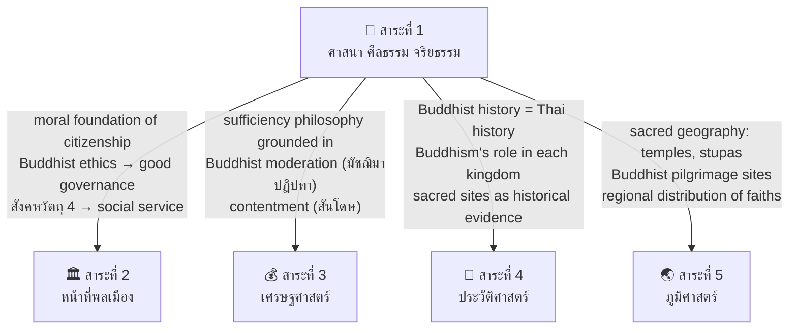

# สาระที่ 1 — ศาสนา ศีลธรรม จริยธรรม (Religion, Morality, Ethics)

> **Strand:** Religion, Morality, and Ethics | **Strand Number:** 1 of 5
> **Concept Areas:** ~18 | **Duration:** ป.1–ม.6 (12 years)
> **Source:** หลักสูตรแกนกลางการศึกษาขั้นพื้นฐาน พุทธศักราช 2551 (Basic Education Core Curriculum B.E. 2551, revised 2560)
> **Leads to:** University religious studies, philosophy, ethics; moral foundation for all citizenship strands

## What Is This?

This strand is the moral and spiritual heart of the Thai Social Studies curriculum. It encompasses three interconnected dimensions: the doctrinal study of religion (primarily Buddhism as Thailand's state religion, but also other faiths), the cultivation of moral reasoning and ethical behavior (ศีลธรรม จริยธรรม), and the practical application of religious principles in daily life.

The strand's architecture reflects Thailand's constitutional identity as a Buddhist-majority nation that guarantees religious freedom. Buddhism receives the most instructional time, but students learn about Islam, Christianity, Hinduism, and Sikhism — the other recognized religions in Thailand — building religious literacy and interfaith tolerance essential for a pluralistic society.

The strand progresses from simple moral stories and etiquette in primary grades through systematic Buddhist doctrine in lower secondary to comparative religion and applied ethics in upper secondary.

## The ~18 Concept Areas

### 🙏 Buddhist Foundation
- [[01_Buddhist_Principles|01_Buddha_Biography]] — Buddha's life: birth (ประสูติ), renunciation (ออกผนวช), enlightenment (ตรัสรู้), first sermon (ปฐมเทศนา), passing (ปรินิพพาน); important events and locations
- [[01_Buddhist_Principles|02_Buddhist_History]] — Buddhism's origins in India, spread to Sri Lanka and Southeast Asia, Buddhism in Thailand (Sukhothai through Rattanakosin), Buddhist councils (สังคายนา), Buddhist sects (นิกาย) in Thailand
- [[01_Buddhist_Principles|03_Jataka_Tales]] — Buddhist birth stories (ชาดก): ทศชาติชาดก (the last 10 lives), selected Jataka tales taught as moral exemplars, พระเวสสันดรชาดก as the most celebrated

### 📿 Buddhist Doctrine (พระธรรม)
- [[01_Buddhist_Principles|04_Four_Noble_Truths]] — อริยสัจ 4: ทุกข์ (suffering), สมุทัย (cause), นิโรธ (cessation), มรรค (the Eightfold Path)
- [[01_Buddhist_Principles|05_Eightfold_Path]] — มรรคมีองค์ 8: right view, right intention, right speech, right action, right livelihood, right effort, right mindfulness, right concentration — grouped into ศีล (morality), สมาธิ (concentration), ปัญญา (wisdom)
- [[01_Buddhist_Principles|06_Five_Aggregates]] — ขันธ์ 5: รูป (form), เวทนา (feeling), สัญญา (perception), สังขาร (mental formations), วิญญาณ (consciousness)
- [[01_Buddhist_Principles|07_Three_Marks_of_Existence]] — ไตรลักษณ์: อนิจจัง (impermanence), ทุกขัง (suffering), อนัตตา (non-self)
- [[01_Buddhist_Principles|08_Karma_and_Rebirth]] — กรรม: law of cause and effect, wholesome/unwholesome actions (กุศลกรรม/อกุศลกรรม), rebirth (การเวียนว่ายตายเกิด), realms of existence (ภูมิ)
- [[01_Buddhist_Principles|09_Dependent_Origination]] — ปฏิจจสมุปบาท: the 12 links of dependent origination, arising and ceasing, middle path between eternalism and nihilism

### 🌸 Buddhist Ethics for Daily Life
- [[01_Buddhist_Principles|10_Five_Precepts]] — เบญจศีล-เบญจธรรม: the five training rules (refrain from killing, stealing, sexual misconduct, false speech, intoxicants) and their positive counterparts (เมตตากรุณา, สัมมาอาชีวะ, กามสังวร, สัจจะ, สติสัมปชัญญะ)
- [[01_Buddhist_Principles|11_Thirty_Eight_Blessings]] — มงคล 38: comprehensive life guidance from "ไม่คบคนพาล" (not associating with fools) through "จิตไม่หวั่นไหวในโลกธรรม" (mind unshaken by worldly conditions)
- [[01_Buddhist_Principles|12_Dhamma_for_Social_Harmony]] — หลักธรรมเพื่อการอยู่ร่วมกัน: พรหมวิหาร 4 (เมตตา กรุณา มุทิตา อุเบกขา), สังคหวัตถุ 4 (ทาน ปิยวาจา อัตถจริยา สมานัตตตา), อิทธิบาท 4 (ฉันทะ วิริยะ จิตตะ วิมังสา), ฆราวาสธรรม 4 (สัจจะ ทมะ ขันติ จาคะ)
- [[01_Buddhist_Principles|13_Dhamma_for_Success]] — หลักธรรมเพื่อความสำเร็จ: อิทธิบาท 4, อริยทรัพย์ 7, โลกธรรม 8, อบายมุข 6 (causes of ruin: การดื่มสุรา, เที่ยวกลางคืน, เที่ยวดูการละเล่น, เล่นการพนัน, คบคนชั่ว, เกียจคร้านการทำงาน)
- [[01_Buddhist_Principles|14_Six_Directions]] — ทิศ 6: duties toward parents (ทิศเบื้องหน้า), teachers (ทิศเบื้องขวา), spouse (ทิศเบื้องหลัง), friends (ทิศเบื้องซ้าย), servants/employees (ทิศเบื้องล่าง), monks (ทิศเบื้องบน)

### 🧘 Meditation & Mental Development
- [[02_Buddhist_Ceremonies_and_Meditation|15_Meditation_Practice]] — การปฏิบัติสมาธิ: สมถกรรมฐาน (concentration meditation — 40 objects), วิปัสสนากรรมฐาน (insight meditation), อานาปานสติ (mindfulness of breathing), walking meditation (เดินจงกรม), benefits of meditation for physical and mental health

### 🕉️ Buddhist Scripture & Sacred Texts
- [[01_Buddhist_Principles|16_Tipitaka]] — พระไตรปิฎก: structure (พระวินัยปิฎก, พระสุตตันตปิฎก, พระอภิธรรมปิฎก), important suttas (ธัมมจักกัปปวัตนสูตร, มงคลสูตร, กรณียเมตตสูตร, มหาสติปัฏฐานสูตร), Buddhist proverbs (พุทธศาสนสุภาษิต)

### 🎑 Buddhist Ceremonies & Holy Days
- [[02_Buddhist_Ceremonies_and_Meditation|17_Buddhist_Ceremonies]] — วันสำคัญทางพระพุทธศาสนา: มาฆบูชา (Magha Puja), วิสาขบูชา (Vesak), อาสาฬหบูชา (Asalha Puja), เข้าพรรษา (Buddhist Lent), ออกพรรษา (End of Lent), การเวียนเทียน, การทำบุญตักบาตร, การถวายสังฆทาน, การถวายผ้าป่า-กฐิน, Buddhist weddings and funerals

### 🕌 Other Religions in Thailand
- [[03_Other_Religions|18_Other_Religions]] — ศาสนาอื่นในประเทศไทย:
  - **Islam:** Prophet Muhammad, Quran, 5 Pillars (การปฏิญาณตน, การละหมาด, การถือศีลอด, การบริจาคซะกาต, การประกอบพิธีฮัจญ์), 6 Articles of Faith (ศรัทธา 6), mosques and Islamic calendar
  - **Christianity:** Jesus Christ, Bible, Catholic vs Protestant denominations, major festivals (Christmas, Easter), churches in Thailand
  - **Hinduism:** Trimurti (Brahma, Vishnu, Shiva), key deities (พระพรหม, พระนารายณ์, พระอิศวร, พระคเณศ), influence on Thai culture
  - **Sikhism:** 10 Gurus, Guru Granth Sahib, 5 Ks, Golden Temple
  - **Interfaith:** Religious freedom in Thai constitution, interfaith dialogue, religious tolerance

---

## Grade Band Progression

### ป.1–3 (Early Primary: Ages 6–9) — Stories & Basic Practices

| Concept Area | What's Taught |
|---|---|
| **Buddha's Life** | Simple stories: Buddha as Prince Siddhartha, leaving the palace, enlightenment under the Bodhi tree; key locations (Lumbini, Bodh Gaya, Sarnath, Kushinagar) |
| **Jataka Tales** | Selected Jataka stories emphasizing moral lessons: sharing, kindness, honesty, patience (e.g., พระมหาชนก — perseverance, สุวัณณสาม — filial piety, เวสสันดร — generosity) |
| **Basic Precepts** | ศีล 5 in child-friendly language: don't hurt living things, don't take what isn't yours, be truthful, don't take intoxicants; understand these as "things good people do" |
| **Buddhist Etiquette** | How to กราบ (prostrate), ไหว้ (wai), ประนมมือ; proper behavior at temple (สำรวม, ถอดรองเท้า, ไม่ส่งเสียงดัง); how to offer food to monks (ใส่บาตร) |
| **Meditation Intro** | Sitting quietly, focusing on breath (simple อานาปานสติ), short periods (2–5 minutes), understanding meditation helps us be calm |
| **Holy Days** | Recognizing Buddhist holidays: มาฆบูชา, วิสาขบูชา, อาสาฬหบูชา; participating in เวียนเทียน at school; understanding these days commemorate important events |
| **Monastic Life** | Basic understanding of monks (พระสงฆ์), novices (สามเณร), robes (จีวร), alms bowl (บาตร); respect for monastic community |
| **Simple Prayers** | Morning/evening chanting (บทสวดมนต์ไหว้พระ): simple versions; บทแผ่เมตตา (sharing loving-kindness) |
| **Other Religions** | — (not formally introduced at this level) |

### ป.4–6 (Upper Primary: Ages 9–12) — Systematic Introduction

| Concept Area | What's Taught |
|---|---|
| **Buddha's Life** | Full biography in detail: birth prophecy, the Four Sights (เทวทูต 4), renunciation, six years of asceticism, enlightenment, 45 years of teaching, passing into Parinibbana; key disciples (พระสารีบุตร, พระโมคคัลลานะ, พระอานนท์) |
| **Buddhist History** | Spread of Buddhism: India → Sri Lanka → Southeast Asia; Buddhism arriving in Thailand (Sukhothai period); Buddhism in each Thai kingdom; พระพุทธศาสนา as state religion |
| **Four Noble Truths** | Introduction to อริยสัจ 4: understand each truth conceptually; relate to daily life (suffering exists, it has causes, it can end, there's a path) |
| **Karma** | กรรม: basic understanding of cause and effect; wholesome actions (กุศลกรรมบถ 10) and unwholesome actions (อกุศลกรรมบถ 10); karma affecting this life and future lives |
| **Mangala 38** | มงคล 38: memorize and understand selected blessings; start with first few (ไม่คบคนพาล, คบบัณฑิต, บูชาผู้ควรบูชา) through intermediate ones |
| **Piety (ความกตัญญู)** | กตัญญูกตเวที: gratitude to parents, teachers, and benefactors; stories of exemplary gratitude (e.g., ชาดกเรื่องพระเตมีย์) |
| **Five Precepts** | เบญจศีล in detail: each precept's meaning, scope, and modern application; relationship between ศีล and a peaceful society |
| **Tipitaka Intro** | Structure of Buddhist scripture: Vinaya (monastic rules), Sutta (discourses), Abhidhamma (higher teachings); understand scripture as source of Buddha's teachings |
| **Meditation** | Basic อานาปานสติ practice (5–10 minutes); understand differences between สมถะ (calm) and วิปัสสนา (insight); regular classroom meditation |
| **Holy Days** | Detailed understanding of each Buddhist holy day: what event it commemorates, how it's celebrated, appropriate practices; การเวียนเทียน meaning |
| **Ceremonies** | Religious ceremonies: ทอดกฐิน, ทอดผ้าป่า, ถวายสังฆทาน, ทำบุญบ้าน, งานศพ (funeral rites); understanding the purpose and proper conduct |
| **Other Religions Intro** | Basic knowledge of Islam, Christianity, Hinduism, Sikhism as religions practiced in Thailand; religious freedom in the constitution; respect for all faiths |
| **Buddhist Proverbs** | พุทธศาสนสุภาษิต: memorize and understand selected proverbs (e.g., อตฺตา หิ อตฺตโน นาโถ — "self is one's own refuge", สุโข ปุญฺญสฺส อุจฺจโย — "happiness is accumulation of merit") |

### ม.1–3 (Lower Secondary: Ages 12–15) — Doctrinal Depth

| Concept Area | What's Taught |
|---|---|
| **Buddhist Doctrine — Comprehensive** | Full systematic study of core doctrines: อริยสัจ 4 (with detailed analysis of each), ขันธ์ 5 (with classification), ไตรลักษณ์ (with reasoning and examples), ปฏิจจสมุปบาท (the 12-link chain), กรรม (detailed classification: กรรม 12 types by function, order of ripening, time of fruition) |
| **Mangala 38 — Complete** | All 38 blessings studied, memorized, and analyzed; categorized into groups (basic conduct, family/social, spiritual development, supreme attainments); application to teenager life |
| **Dhamma for Life** | Comprehensive study of practical dharma: พรหมวิหาร 4 (cultivating loving-kindness, compassion, sympathetic joy, equanimity in daily life), อิทธิบาท 4 (ingredients for success), สังคหวัตถุ 4 (principles of social harmony), ฆราวาสธรรม 4 (virtues for household life), ทิศ 6 (duties in all social relationships) |
| **Causes of Ruin** | อบายมุข 6: detailed analysis of each — substance abuse, nightlife, entertainment addiction, gambling, bad company, laziness — with contemporary examples and consequences |
| **Worldly Conditions** | โลกธรรม 8: gain and loss, fame and disrepute, praise and blame, happiness and suffering — understanding their inevitable fluctuation; maintaining equanimity |
| **Meditation — Practical** | Regular meditation practice (10–15 minutes); progression in อานาปนสติ; introduction to walking meditation; understanding meditation's effects on mind and brain; meditation retreat concepts |
| **Buddhist History** | Buddhist councils (สังคายนา 1–3 in India, later in Sri Lanka and Thailand), development of Buddhist schools (เถรวาท and มหายาน), Buddhism's role in Thai kingdoms, important Thai Buddhist figures (สมเด็จพระพุฒาจารย์, พระอาจารย์มั่น ภูริทัตโต) |
| **Tipitaka — Deeper** | Detailed structure: Vinaya (227 rules for monks), Sutta (5 Nikayas: ทีฆนิกาย, มัชฌิมนิกาย, สังยุตตนิกาย, อังคุตตรนิกาย, ขุททกนิกาย), Abhidhamma (paramattha dhamma: จิต, เจตสิก, รูป, นิพพาน) |
| **Buddhist Proverbs** | Expanded set of พุทธศาสนสุภาษิต with Pali text and Thai translation; analysis of meaning; applying proverbs to contemporary situations |
| **Religious Ceremonies — Mastery** | All major ceremonies understood in detail: meaning, procedure, appropriate conduct; ability to participate properly and explain to others |
| **Other Religions — Detailed** | Islam: 6 Articles of Faith + 5 Pillars in detail; major denominations (Sunni, Shia); Islamic calendar and festivals; Christianity: Old/New Testament overview, major denominations (Catholic, Protestant, Orthodox), sacraments, holidays; Hinduism: Trimurti, major scriptures (Vedas, Upanishads, Bhagavad Gita), caste system, influence on Thai culture; Sikhism: Guru lineage, 5 Ks, worship at Gurdwara |
| **Comparative Religion** | Beginning comparative study: similarities and differences between world religions; shared ethical principles (Golden Rule); religion's role in society |
| **Applying Dharma** | Applying Buddhist principles to contemporary issues: environmental ethics, social justice, consumerism, media consumption, peer pressure, mental health |

### ม.4–6 (Upper Secondary: Ages 15–18) — Critical & Applied

| Concept Area | What's Taught |
|---|---|
| **Advanced Buddhist Philosophy** | Deep analysis of ปฏิจจสมุปบาท (each link examined with Abhidhamma detail); อริยสัจ 4 as a scientific framework for understanding human problems; comparison of Buddhist epistemology with Western philosophy; กรรม as ethical causality (not fatalism) |
| **Buddhist Suttas — Analysis** | Close reading of key suttas: ธัมมจักกัปปวัตนสูตร (the first sermon), อนัตตลักขณสูตร (discourse on non-self), อาทิตตปริยายสูตร (the fire sermon), มหาสติปัฏฐานสูตร (greater discourse on foundations of mindfulness), มงคลสูตร, กรณียเมตตสูตร |
| **Buddhism & Modernity** | Buddhism's dialogue with modern science (quantum physics parallels, neuroscience and meditation); Buddhism and psychology (mindfulness-based therapies); Buddhism and social issues (economic ethics, environmental ethics, bioethics); Buddhist responses to materialism and consumerism |
| **Meditation — Mastery** | Regular practice (15–30 minutes); deeper understanding of both สมถะ and วิปัสสนา techniques; meditation and mental health; the role of meditation in Buddhist path to liberation; insight knowledge stages (วิปัสสนาญาณ) |
| **Comparative Religion — Critical** | Systematic comparison of world religions: soteriology (concepts of salvation/liberation), cosmology, ethics, scripture, ritual; interfaith dialogue as peace-building; religious pluralism in a democratic society |
| **Religion in Thai Society** | Buddhism's constitutional status; the Sangha (monastic order) and its administrative structure (พระราชบัญญัติคณะสงฆ์); relationship between state and religion in Thailand; debates on Buddhism as state religion |
| **Religious Ethics** | Applied ethics from Buddhist and comparative perspectives: abortion, euthanasia, capital punishment, war and peace, economic justice, environmental ethics, animal rights — do religious teachings offer guidance? |
| **Buddhist Art & Architecture** | Buddhist art history: stupa (เจดีย์) types, Buddha image styles through Thai periods, temple architecture (อุโบสถ, วิหาร, เจดีย์), mural paintings (จิตรกรรมฝาผนัง), Buddhist symbolism |
| **Buddhist Literature** | Major Buddhist literary works: ไตรภูมิพระร่วง (Three Worlds cosmology), มหาเวสสันดรชาดก, literary influence of Buddhism on Thai classics |
| **Independent Practice** | Regular meditation journal; participation in temple activities; organizing religious ceremonies at school; teaching meditation to younger students |
| **Critique & Evaluation** | Critical analysis of religious claims using reason (กาลามสูตร as rational framework); distinguishing cultural Buddhism from doctrinal Buddhism; evaluating religion's role in modern life |

---

## Key Buddhist Doctrines — Terminology Reference

### The Four Noble Truths (อริยสัจ 4)

| # | Pali | Thai | English | Description |
|---|---|---|---|---|
| 1 | Dukkha | ทุกข์ | Suffering | Birth, aging, sickness, death, separation from loved ones, not getting what one wants, the five aggregates |
| 2 | Samudaya | สมุทัย | Cause of Suffering | Craving (ตัณหา): sensual craving (กามตัณหา), craving for existence (ภวตัณหา), craving for non-existence (วิภวตัณหา) |
| 3 | Nirodha | นิโรธ | Cessation of Suffering | Nibbana (นิพพาน): the extinction of craving, ultimate peace |
| 4 | Magga | มรรค | Path to Cessation | The Noble Eightfold Path (มรรคมีองค์ 8) |

### The Noble Eightfold Path (มรรคมีองค์ 8)

| Group | # | Pali | Thai | English |
|---|---|---|---|---|
| **ปัญญา** (Wisdom) | 1 | Sammā-diṭṭhi | สัมมาทิฏฐิ | Right View |
| | 2 | Sammā-saṅkappa | สัมมาสังกัปปะ | Right Intention |
| **ศีล** (Morality) | 3 | Sammā-vācā | สัมมาวาจา | Right Speech |
| | 4 | Sammā-kammanta | สัมมากัมมันตะ | Right Action |
| | 5 | Sammā-ājīva | สัมมาอาชีวะ | Right Livelihood |
| **สมาธิ** (Concentration) | 6 | Sammā-vāyāma | สัมมาวายามะ | Right Effort |
| | 7 | Sammā-sati | สัมมาสติ | Right Mindfulness |
| | 8 | Sammā-samādhi | สัมมาสมาธิ | Right Concentration |

### Key Dhamma Collections

| Thai Term | Pali | Count | Description |
|---|---|---|---|
| เบญจศีล | Pañca-sīla | 5 | Five precepts — basic moral code for all Buddhists |
| เบญจธรรม | Pañca-dhamma | 5 | Five virtues — positive counterparts to the precepts |
| พรหมวิหาร 4 | Brahma-vihāra | 4 | Four sublime states: เมตตา, กรุณา, มุทิตา, อุเบกขา |
| สังคหวัตถุ 4 | Saṅgaha-vatthu | 4 | Four bases of social harmony: ทาน, ปิยวาจา, อัตถจริยา, สมานัตตตา |
| อิทธิบาท 4 | Iddhi-pāda | 4 | Four paths to success: ฉันทะ, วิริยะ, จิตตะ, วิมังสา |
| ฆราวาสธรรม 4 | Gharāvāsa-dhamma | 4 | Four virtues for lay life: สัจจะ, ทมะ, ขันติ, จาคะ |
| อบายมุข 6 | Apāya-mukha | 6 | Six causes of ruin: drinking, nightlife, entertainment, gambling, bad company, laziness |
| โลกธรรม 8 | Loka-dhamma | 8 | Eight worldly conditions: gain/loss, fame/disrepute, praise/blame, happiness/suffering |
| มงคล 38 | Maṅgala | 38 | Thirty-eight blessings — comprehensive ethical guide |
| ทิศ 6 | Disā | 6 | Six directions — duties in social relationships |
| บุญกิริยาวัตถุ 10 | Puñña-kiriyā-vatthu | 10 | Ten bases of meritorious action |

### The Five Aggregates (ขันธ์ 5)

| # | Pali | Thai | English | Description |
|---|---|---|---|---|
| 1 | Rūpa | รูป | Form | Physical body and material phenomena |
| 2 | Vedanā | เวทนา | Feeling | Pleasant, unpleasant, neutral sensations |
| 3 | Saññā | สัญญา | Perception | Recognition and labeling of sense objects |
| 4 | Saṅkhāra | สังขาร | Mental Formations | Thoughts, intentions, volitions, emotions |
| 5 | Viññāṇa | วิญญาณ | Consciousness | Awareness through the six sense doors |

### The Three Marks of Existence (ไตรลักษณ์)

| Pali | Thai | English | Meaning |
|---|---|---|---|
| Anicca | อนิจจัง | Impermanence | All conditioned phenomena are inconstant, changing |
| Dukkha | ทุกขัง | Suffering | All conditioned phenomena are unsatisfactory |
| Anattā | อนัตตา | Non-self | All phenomena are without permanent essence or soul |

---

## Buddhist Holy Days — Detailed

| Holy Day | Thai | Date | Commemorates | Practices |
|---|---|---|---|---|
| มาฆบูชา | Magha Puja | Full moon, 3rd lunar month | The spontaneous gathering of 1,250 arahants; Buddha gave the Ovada Patimokkha (core teaching summary) | เวียนเทียน, listening to sermons, making merit |
| วิสาขบูชา | Vesak | Full moon, 6th lunar month | Three events: Buddha's birth, enlightenment, and passing (parinibbana) — all on the same date | เวียนเทียน, meditation, making merit, releasing animals |
| อาสาฬหบูชา | Asalha Puja | Full moon, 8th lunar month | Buddha's first sermon (ธัมมจักกัปปวัตนสูตร) and the arising of the first disciple (พระอัญญาโกณฑัญญะ) — the birth of Buddhism | เวียนเทียน, studying the first sermon |
| เข้าพรรษา | Buddhist Lent | First waning moon, 8th lunar month | Three-month rains retreat for monks (established by Buddha) | Offering candles, robes, and necessities to monks; observing precepts |
| ออกพรรษา | End of Lent | Full moon, 11th lunar month | End of rains retreat; monks can travel again | ทอดกฐิน, making special merit |

---

## How This Strand Connects to Others

---

## Reading Paths

- **Doctrinal path:** 04 Four Noble Truths → 06 Five Aggregates → 07 Three Marks → 09 Dependent Origination → 08 Karma
- **Ethical practice path:** 10 Five Precepts → 12 Social Harmony → 14 Six Directions → 11 38 Blessings → 13 Success
- **Devotional path:** 03 Jataka Tales → 17 Ceremonies → 02 Buddhist History → 16 Tipitaka
- **Meditation path:** 15 Meditation → 04 Four Noble Truths → 07 Three Marks → 05 Eightfold Path
- **Interfaith path:** 01 Buddha Biography → 18 Other Religions → then return to comparative analysis across doctrines

---

## Related

- [[Social Studies - Overview|← Back to Social Studies Overview]]
- [[02 Civics - Overview|สาระที่ 2: หน้าที่พลเมือง]] — How Buddhist ethics translate to citizenship
- [[03 Economics - Overview|สาระที่ 3: เศรษฐศาสตร์]] — Sufficiency economy and Buddhist economics
- [[04 History - Overview|สาระที่ 4: ประวัติศาสตร์]] — Buddhist history as Thai national history
- [[05 Geography - Overview|สาระที่ 5: ภูมิศาสตร์]] — Sacred geography and religious distribution
