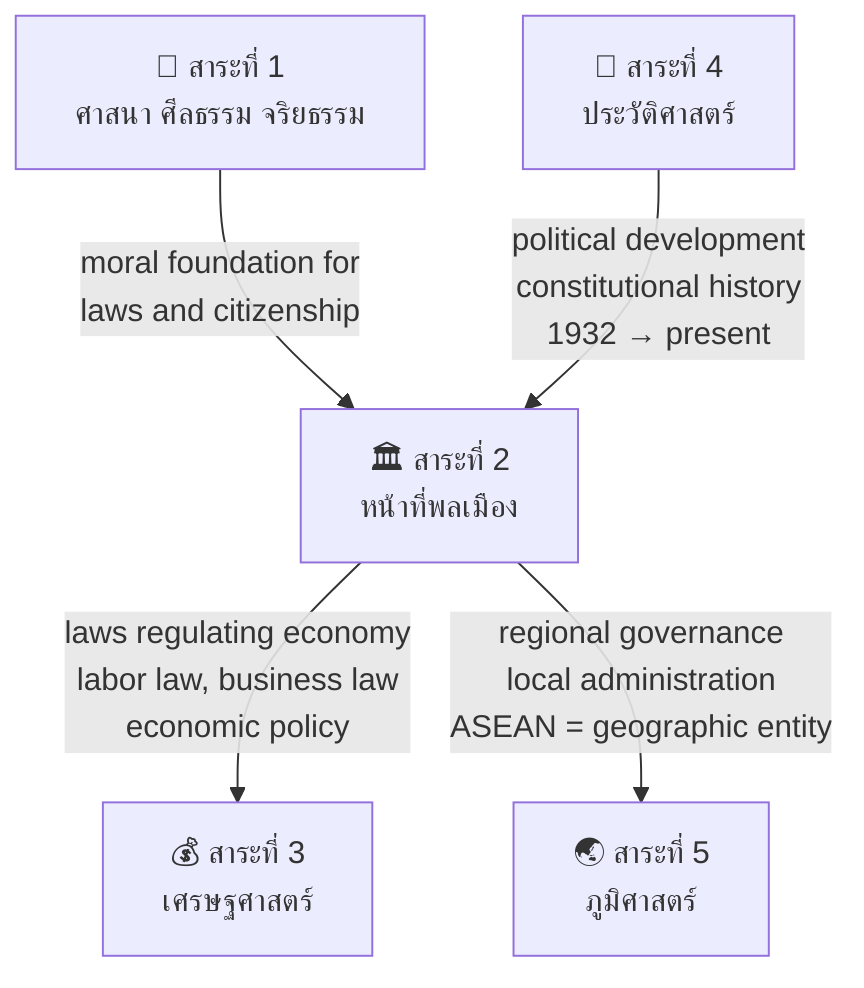

# สาระที่ 2 — หน้าที่พลเมือง วัฒนธรรม และการดำเนินชีวิตในสังคม (Civics, Culture, and Living in Society)

> **Strand:** Civics, Culture, and Living in Society | **Strand Number:** 2 of 5
> **Concept Areas:** ~22 | **Duration:** ป.1–ม.6 (12 years)
> **Source:** หลักสูตรแกนกลางการศึกษาขั้นพื้นฐาน พุทธศักราช 2551 (Basic Education Core Curriculum B.E. 2551, revised 2560)
> **Leads to:** Law, political science, public administration, sociology, anthropology, international relations

## What Is This?

This strand is the operational core of Thai citizenship education. It transforms students from passive recipients of knowledge into active, informed citizens who understand their rights, fulfill their duties, respect the law, appreciate their cultural heritage, and participate meaningfully in democratic society under constitutional monarchy.

The strand spans five major domains: **governance and democracy** (understanding how Thailand is governed), **law** (the legal framework that structures society), **rights and duties** (what citizens are entitled to and obligated to do), **culture** (Thai identity, traditions, and social norms), and **international awareness** (ASEAN and global citizenship).

The progression moves from concrete to abstract: ป.1–3 students learn about family roles and school rules; ม.4–6 students analyze constitutional law, political philosophy, and international relations.

## The ~22 Concept Areas

### 🗳️ Democracy & Governance
- [[01_Democracy_and_Government|01_Democratic_Governance]] — การปกครองระบอบประชาธิปไตย: principles (sovereignty of the people, liberty, equality, rule of law), democracy with the King as Head of State (ระบอบประชาธิปไตยอันมีพระมหากษัตริย์ทรงเป็นประมุข), Thai democracy's unique character, comparison with other systems (authoritarian, totalitarian)
- [[01_Democracy_and_Government|02_Constitutional_Monarchy]] — พระมหากษัตริย์ในระบอบประชาธิปไตย: the King's constitutional role, Royal prerogatives, the monarchy as unifying institution, royal projects and development initiatives
- [[06_Government_Structure|03_Separation_of_Powers]] — การแบ่งแยกอำนาจ: legislative branch (รัฐสภา: House of Representatives + Senate), executive branch (คณะรัฐมนตรี, Prime Minister), judicial branch (ศาล), checks and balances
- [[01_Democracy_and_Government|04_Elections_and_Participation]] — การเลือกตั้งและการมีส่วนร่วม: electoral systems, voting rights, political parties, civil society participation, local political participation, referendums

### ⚖️ Law
- [[05_Thai_Constitution|05_Constitutional_Law]] — กฎหมายรัฐธรรมนูญ: constitution as supreme law, Thai constitutions (overview from 1932 to present, focus on current พ.ศ. 2560), constitutional rights and liberties, constitutional court
- [[04_Rights_Duties_and_Laws|06_Criminal_Law]] — กฎหมายอาญา: definition of crime, types of offenses (ลหุโทษ, ความผิด misdemeanors, อาชญากรรม felonies), criminal procedure, arrests, juvenile justice, penalties, citizen's rights when interacting with police
- [[04_Rights_Duties_and_Laws|07_Civil_and_Commercial_Law]] — กฎหมายแพ่งและพาณิชย์: persons (natural and juristic), contracts, property, torts, family law (marriage, divorce, adoption, inheritance), consumer protection
- [[04_Rights_Duties_and_Laws|08_Legal_Hierarchy]] — ลำดับศักดิ์ของกฎหมาย: constitution → organic laws → acts of parliament → emergency decrees → royal decrees → ministerial regulations → local ordinances; understanding which law prevails

### 👤 Rights & Duties
- [[04_Rights_Duties_and_Laws|09_Citizen_Rights_and_Duties]] — สิทธิและหน้าที่พลเมือง: rights guaranteed by the constitution (personal, political, economic, social, cultural), duties of Thai citizens (preserve the nation, religion, monarchy; obey laws; pay taxes; education; military service; protect national heritage; etc.)
- [[04_Rights_Duties_and_Laws|10_Human_Rights]] — สิทธิมนุษยชน: UDHR overview, human rights categories (civil, political, economic, social, cultural), human rights in Thailand, children's rights, women's rights, minority rights, human rights mechanisms

### 🏛️ Government & Administration
- [[06_Government_Structure|11_Government_Structure]] — โครงสร้างการบริหารราชการ: central administration (กระทรวง ทบวง กรม), provincial administration (จังหวัด อำเภอ ตำบล หมู่บ้าน — officials appointed by central government), local government (องค์การบริหารส่วนจังหวัด/อบจ., เทศบาล, องค์การบริหารส่วนตำบล/อบต., กรุงเทพมหานคร, เมืองพัทยา)
- [[06_Government_Structure|12_Public_Policy]] — นโยบายสาธารณะ: policy-making process, public participation, policy analysis, budget allocation, major national policies (Thailand 4.0, national strategy 20 years)

### 👥 Social Institutions & Norms
- [[07_Social_Institutions|13_Social_Institutions]] — สถาบันทางสังคม: family (หน้าที่, ประเภท), education (formal/non-formal/informal), religion, government, economy, media — functions, interrelationships, changes in modern society
- [[08_Social_Norms_and_Status|14_Social_Norms_and_Status]] — บรรทัดฐานทางสังคมและสถานภาพ: types of social norms (วิถีประชา/folkways, จารีต/mores, กฎหมาย/laws), sanctions, social status (ascribed vs achieved), social roles, role conflict
- [[09_Socialization|15_Socialization]] — การขัดเกลาทางสังคม: agents of socialization (family, school, peers, media, religion), direct and indirect socialization, socialization across the life course, resocialization
- [[13_Conflict_Resolution|16_Social_Problems]] — ปัญหาสังคม: crime, drugs, poverty, inequality, corruption, human trafficking, domestic violence, cybercrime — analysis, causes, solutions, role of citizens and state

### 🎭 Thai Culture
- [[02_Thai_Culture_and_Traditions|17_Thai_Culture_and_Traditions]] — วัฒนธรรมและประเพณีไทย: meaning of "culture" (วัฒนธรรม), types (material/non-material), Thai national culture, regional cultures (4 ภาค: เหนือ, อีสาน, กลาง, ใต้), important national traditions (สงกรานต์, ลอยกระทง, วันสำคัญของชาติ), Thai etiquette (มารยาทไทย), cultural preservation
- [[10_Culture_and_Change|18_Cultural_Change]] — การเปลี่ยนแปลงทางวัฒนธรรม: cultural diffusion, acculturation, modernization and Westernization effects, globalization's impact on Thai culture, balancing tradition and change, cultural diversity within Thailand
- [[02_Thai_Culture_and_Traditions|19_National_Identity]] — เอกลักษณ์ของชาติ: nation, religion, monarchy (ชาติ ศาสนา พระมหากษัตริย์); national symbols (flag, anthem, emblem); Thai language and culture as identity markers; pride in being Thai

### 🌏 ASEAN & International
- [[03_ASEAN_Studies|20_ASEAN_Studies]] — อาเซียนศึกษา: ASEAN history (Bangkok Declaration 1967 → ASEAN Charter 2008), three pillars (ASEAN Political-Security Community, ASEAN Economic Community, ASEAN Socio-Cultural Community), member states, ASEAN symbols, benefits and challenges for Thailand, Thailand's role in ASEAN
- [[11_International_Relations|21_International_Relations]] — ความสัมพันธ์ระหว่างประเทศ: diplomacy types, international organizations (UN, WHO, WTO, IMF, World Bank), international law, Thailand's foreign policy, global issues (climate change, terrorism, pandemics, refugees)
- [[12_Media_Literacy|22_Media_Literacy]] — การรู้เท่าทันสื่อ: types of media, media influence, identifying bias and propaganda, fact-checking, responsible media consumption, digital citizenship, cyberbullying prevention, privacy in digital age

---

## Grade Band Progression

### ป.1–3 (Early Primary: Ages 6–9) — Self & Immediate Community

| Concept Area | What's Taught |
|---|---|
| **Family** | Family structure and roles; being a good son/daughter; helping with household chores; respecting parents and elders |
| **School Community** | School rules and why they exist; being a good student; roles of teachers, principal, staff; participating in school activities |
| **Basic Rights** | Basic understanding: every child has the right to education, to be safe, to play; the concept of "fairness" |
| **Simple Duties** | Duties as a student: study diligently, follow rules, help others; duties at home: help parents, keep belongings tidy |
| **National Symbols** | Thai flag (ธงไตรรงค์): colors meaning (nation, religion, monarchy); national anthem (เพลงชาติ): when to stand, basic meaning; royal anthem (เพลงสรรเสริญพระบารมี); important national days |
| **Polite Behavior** | มารยาทไทย basics: wai (การไหว้) — levels for different people, greeting, saying thank you (ขอบคุณ), sorry (ขอโทษ); polite speech (ครับ/ค่ะ); proper sitting and walking posture |
| **Simple Culture** | Basic Thai traditions: Songkran (สงกรานต์) as Thai New Year, Loy Krathong (ลอยกระทง); meaning and simple participation |
| **Local Community** | Who works in the community (doctors, police, teachers, monks, vendors); community helpers; taking care of public property |
| **ASEAN** | — (not formally introduced at this level) |
| **Laws** | Simple understanding: rules keep us safe; difference between right and wrong actions; consequences of breaking rules |

### ป.4–6 (Upper Primary: Ages 9–12) — Community & Nation

| Concept Area | What's Taught |
|---|---|
| **Democracy Basics** | Democracy meaning: "government of the people, by the people, for the people"; democracy with the King as Head of State; basic comparison: democracy vs. other systems; elections concept (student council elections as model) |
| **Constitutional Monarchy** | The King's role in democracy; the constitution as supreme law; basic understanding of 1932 revolution (เปลี่ยนแปลงการปกครอง); respect and loyalty to the monarchy |
| **Government Structure (Simple)** | Three branches of government: legislative (makes laws), executive (implements), judicial (judges) — simplified with examples; local government (เทศบาล, อบต.): what they do for the community |
| **Citizen Rights** | Rights according to the constitution: basic freedoms (speech, religion, assembly — simplified); children's rights (สิทธิเด็ก); right to education |
| **Citizen Duties** | Duties of Thai citizens: respect the flag and anthem, obey laws, pay taxes (simple concept), vote when eligible, protect national heritage, help the community |
| **Laws (Introduction)** | What is a law? Who makes laws? Types of laws (criminal law intro: theft, assault; civil law intro: contracts, property); why we need laws; juvenile law awareness |
| **Social Institutions** | Family (types, functions, changes), school (roles and importance), temple/religion (role in community), local government |
| **Thai Culture** | Thai culture and traditions in detail: regional cultures (4 ภาค — basic characteristics), important traditions (สงกรานต์, ลอยกระทง, บุญบั้งไฟ, แห่เทียนพรรษา, สารทไทย), Thai arts (นาฏศิลป์, ดนตรีไทย, จิตรกรรม), Thai food culture |
| **Etiquette** | มารยาทไทย in detail: proper wai (three levels), greeting monks, royal family, elders; table manners; temple behavior; public behavior |
| **National Days** | Important national days: วันพ่อแห่งชาติ (5 Dec), วันแม่แห่งชาติ (12 Aug), วันเด็กแห่งชาติ, วันครู, วันรัฐธรรมนูญ, วันปิยมหาราช — meaning and appropriate observance |
| **ASEAN Intro** | What is ASEAN? 10 member countries; basic overview of the ASEAN Community; benefits of being in ASEAN; ASEAN symbols |
| **Social Norms** | Social norms: what's considered "appropriate" in Thai society; understanding folkways (วิถีประชา) vs. mores (จารีต); consequences of violating norms |

### ม.1–3 (Lower Secondary: Ages 12–15) — National & Legal Understanding

| Concept Area | What's Taught |
|---|---|
| **Democracy — Comprehensive** | Democratic principles in detail: sovereignty belongs to the people, liberty (เสรีภาพ), equality (ความเสมอภาค), rule of law (หลักนิติธรรม); direct vs representative democracy; Thai democracy with the King as Head of State — unique characteristics; political participation channels |
| **Constitution — Detailed** | Constitutional law: constitution as supreme law; structure of Thai constitutions; fundamental rights and liberties chapters; the constitution's role in limiting government power; constitutional amendments |
| **Government Structure** | Three branches in detail: legislative (House of Representatives — 500 MPs, Senate — 250 Senators; law-making process), executive (Prime Minister, Cabinet, ministries — functions), judicial (Court of Justice, Administrative Court, Constitutional Court — jurisdictions) |
| **Criminal Law** | Criminal law in detail: definition of crime, elements of crime (actus reus + mens rea), types of criminal offenses, criminal procedure (arrest, investigation, trial, appeal), penalties (imprisonment, fines, capital punishment debate), juvenile justice system (ศาลเยาวชนและครอบครัว) |
| **Civil Law** | Civil law: persons (natural person vs juristic person), contracts (formation, breach, remedies), torts (ละเมิด), property rights, family law (marriage conditions, divorce, inheritance), consumer protection basics (สิทธิผู้บริโภค) |
| **Rights & Duties** | Detailed rights: personal, political, economic, social, cultural; duties of citizens (10 duties from constitution); relationship between rights and duties; limitations on rights |
| **Human Rights** | Human rights: UDHR origin (1948), categories of rights, human rights mechanisms (UN Human Rights Council, treaties), human rights in Thai constitution, child rights convention, women's rights, minority rights, human rights issues in Thailand |
| **Social Institutions** | Deep analysis: family (types: nuclear, extended, single-parent; functions and changes), education (formal, non-formal, informal; education as social mobility), religion (social functions of religion), economy (economic systems and their social effects), government (welfare state, public services), media (role in society, media bias) |
| **Social Norms & Status** | Detailed social norms: folkways (วิถีประชา), mores (จารีต), laws (กฎหมาย); sanctions (positive/negative, formal/informal); status (ascribed: gender, age, ethnicity vs achieved: education, career); social roles and role conflict |
| **Socialization** | Agents and processes: direct socialization (explicit teaching), indirect socialization (observation, imitation); primary vs secondary socialization; importance of socialization for society |
| **Thai Culture — Deep** | Comprehensive Thai culture study: cultural characteristics (ลักษณะของวัฒนธรรมไทย), cultural diversity by region (culture of North, Northeast, Central, South in detail), Thai art forms, Thai wisdom (ภูมิปัญญาไทย: traditional medicine, agriculture, crafts), cultural change and preservation |
| **ASEAN — Comprehensive** | ASEAN history (Bangkok Declaration → ASEAN Charter → ASEAN Community), three pillars in detail (APSC, AEC, ASCC — goals, progress, challenges), member states (individual profiles — capital, language, currency, flag), ASEAN's impact on Thailand (trade, labor migration, tourism, education), ASEAN identity |
| **Social Problems** | Analysis of social problems: types and causes, government and civil society responses, the role of citizens in addressing social problems, case studies |
| **Patriotism & Civic Duty** | ความรักชาติ: meaning of patriotism vs nationalism; concrete ways to serve the nation: obeying laws, paying taxes, voting, community service, preserving culture and environment |

### ม.4–6 (Upper Secondary: Ages 15–18) — Critical & Applied Citizenship

| Concept Area | What's Taught |
|---|---|
| **Political Philosophy** | Foundations of democracy: ancient Athens, Roman republic, Enlightenment philosophers (Locke: natural rights, Montesquieu: separation of powers, Rousseau: social contract); liberalism, conservatism, socialism — core ideas; political spectrum analysis |
| **Constitutional Law — Advanced** | Constitutional principles: supremacy of constitution, separation of powers, rule of law, judicial review; comparative constitutional analysis (Thai vs UK vs US vs German constitutions); constitutional rights in depth; amendment processes; constitutional crises and resolutions in Thai history |
| **Thai Political History** | Political development since 1932: 1932 revolution, constitutional periods, military coups and constitutions, 1973 and 1976 democracy movements, Black May 1992, 1997 Constitution ("People's Constitution"), 2006 and 2014 coups, current political dynamics |
| **Criminal Justice System** | The criminal justice process in full: police investigation → public prosecutor → court trial → appeal system → corrections/punishment; principles: presumption of innocence, burden of proof, right to counsel, habeas corpus; debates: death penalty, juvenile justice, prison reform |
| **Civil Law — Advanced** | Commercial law: company formation, partnerships, business contracts; labor law: employment contracts, worker rights, labor courts; intellectual property: copyright, patents, trademarks; IT law: computer crime act, data protection |
| **International Law** | Sources of international law (treaties, custom, general principles), subjects of international law (states, international organizations, individuals), law of the sea, international humanitarian law (Geneva Conventions), international criminal law, Thailand's treaty obligations |
| **Human Rights — Advanced** | Human rights theory: universality vs cultural relativism debate; international human rights mechanisms (treaty bodies, special procedures, Universal Periodic Review); human rights in ASEAN; human rights cases in Thailand; NGOs and human rights advocacy |
| **Social Theory** | Key sociological concepts: social structure and agency, functionalism (Durkheim), conflict theory (Marx), symbolic interactionism (Mead); social stratification (class, caste, estate systems), social mobility, inequality; applying theory to Thai society |
| **Cultural Studies** | Cultural theory: culture as meaning-making; Thai cultural debates (authenticity vs hybridity, "Thainess" discourse, cultural nationalism); globalization and Thai culture; cultural policy and cultural industries; intangible cultural heritage |
| **ASEAN — Advanced** | ASEAN integration analysis: achievements and limitations of the three pillars; ASEAN and major powers (China, US, Japan, India); ASEAN centrality in regional architecture; ASEAN's response to regional challenges (South China Sea, Rohingya, Myanmar); Thailand's ASEAN diplomacy; economic cooperation and competition within ASEAN |
| **International Relations** | IR theories: realism, liberalism, constructivism; international system structure (polarity, balance of power); foreign policy analysis (levels of analysis); international political economy; global governance; UN system; Thailand's foreign policy (bamboo diplomacy, major relationships) |
| **Media Literacy — Critical** | Advanced media analysis: media ownership and concentration in Thailand; political economy of media; propaganda and disinformation; digital surveillance; algorithmic bias; citizen journalism; media reform; producing critical media analysis |
| **Civic Action** | Practical citizenship: how to petition government, access public information (พ.ร.บ. ข้อมูลข่าวสาร), participate in public hearings, engage with civil society organizations, write to representatives, organize community projects |
| **Current Issues** | Analysis of contemporary Thai and global issues: constitutional reform debates, decentralization, corruption, inequality, aging society, digital economy, climate policy — applying democratic and legal principles to real-world problems |

---

## Key Legal Concepts — Terminology Reference

### Legal Hierarchy (ลำดับศักดิ์ของกฎหมาย)

| Rank | Type | Thai | Made By | Example |
|---|---|---|---|---|
| 1 | Constitution | รัฐธรรมนูญ | Constituent assembly/referendum | Constitution B.E. 2560 |
| 2 | Organic Law | พระราชบัญญัติประกอบรัฐธรรมนูญ | Parliament | Organic Act on Election Commission |
| 3 | Act of Parliament | พระราชบัญญัติ (พ.ร.บ.) | Parliament | Criminal Code, Civil and Commercial Code |
| 4 | Emergency Decree | พระราชกำหนด (พ.ร.ก.) | Cabinet (emergency) | Emergency Decree on Public Administration in Emergency Situations |
| 5 | Royal Decree | พระราชกฤษฎีกา | Cabinet/King | Royal Decree on Government Pension |
| 6 | Ministerial Regulation | กฎกระทรวง | Individual ministry | Ministerial Regulation on School Uniforms |
| 7 | Local Ordinance | ข้อบัญญัติท้องถิ่น | Local government | Municipal ordinance on waste management |

### Government Structure

| Level | Administrative Unit | Thai | Head | Appointed/Elected |
|---|---|---|---|---|
| **Central** | Ministry | กระทรวง | Minister (รัฐมนตรี) | Appointed by PM |
| | Department | กรม | Director-General (อธิบดี) | Appointed |
| **Provincial** | Province | จังหวัด | Governor (ผู้ว่าราชการจังหวัด) | Appointed by Ministry of Interior |
| | District | อำเภอ | District Chief (นายอำเภอ) | Appointed |
| | Sub-district | ตำบล | Sub-district Head (กำนัน) | Elected locally |
| | Village | หมู่บ้าน | Village Head (ผู้ใหญ่บ้าน) | Elected locally |
| **Local** | Provincial Administrative Organization | อบจ. | President (นายก อบจ.) + Council | Elected |
| | Municipality | เทศบาล | Mayor (นายกเทศมนตรี) + Council | Elected |
| | Sub-district Administrative Org | อบต. | President (นายก อบต.) + Council | Elected |
| | Bangkok Metropolitan Admin | กทม. | Governor | Elected |
| | Pattaya City | เมืองพัทยา | Mayor + Council | Elected |

### Criminal Law Reference

| Offense Type | Thai | Examples | Penalty Range |
|---|---|---|---|
| Petty Offense | ลหุโทษ | Minor traffic violations, littering, public nuisance | Fine up to 1,000 THB or detention up to 1 month |
| Misdemeanor | ความผิดลหุโทษ | Theft under 5,000 THB, minor assault, trespassing | Fine or imprisonment up to several years |
| Felony | อาชญากรรม | Murder, rape, armed robbery, major drug trafficking | Long-term imprisonment or death penalty |

### Types of Law

| Category | Thai | Scope |
|---|---|---|
| Public Law | กฎหมายมหาชน | Constitutional law, administrative law, criminal law — state vs individual |
| Private Law | กฎหมายเอกชน | Civil law, commercial law — individual vs individual |
| International Law | กฎหมายระหว่างประเทศ | Treaties, international custom, law of war — state vs state |

---

## Rights of Thai Citizens (Constitution B.E. 2560)

| Category | Rights |
|---|---|
| **Personal** | Right to life and bodily integrity; freedom from torture; presumption of innocence; privacy; family rights; freedom of residence and movement |
| **Judicial** | Right to fair trial; access to justice; right to legal counsel; right to bail (with conditions); right to compensation for wrongful conviction |
| **Political** | Right to vote and stand for election; freedom of expression; freedom of assembly; freedom of association; right to petition government; right to access public information |
| **Economic** | Right to property; freedom of occupation; consumer rights; right to fair working conditions; right to social security |
| **Social & Cultural** | Right to education (12 years free); right to public health; right to social welfare; right to participate in cultural life; rights of children, elderly, disabled |
| **Environmental** | Right to live in a good-quality environment; right to participate in environmental decision-making |

## Duties of Thai Citizens

| Duty | Thai |
|---|---|
| Protect and uphold the Nation, Religion, and Monarchy | พิทักษ์รักษาไว้ซึ่งชาติ ศาสนา พระมหากษัตริย์ |
| Obey the law | ปฏิบัติตามกฎหมาย |
| Exercise voting rights | ไปใช้สิทธิเลือกตั้ง |
| Defend the country | ป้องกันประเทศ |
| Pay taxes | เสียภาษีอากร |
| Serve in military as required by law | รับราชการทหาร |
| Preserve national arts, culture, and heritage | อนุรักษ์ศิลปวัฒนธรรมของชาติ |
| Conserve natural resources and environment | อนุรักษ์ทรัพยากรธรรมชาติและสิ่งแวดล้อม |
| Support education | สนับสนุนการศึกษา |
| Participate in public services | เข้ารับการบริการสาธารณะ |

---

## How This Strand Connects to Others

---

## Reading Paths

- **Law track:** 05 Constitutional Law → 06 Criminal Law → 07 Civil Law → 08 Legal Hierarchy → apply to rights and duties
- **Government track:** 01 Democracy → 02 Constitutional Monarchy → 03 Separation of Powers → 11 Government Structure → 12 Public Policy
- **Citizenship track:** 09 Rights/Duties → 10 Human Rights → 01 Democracy → 04 Elections → 22 Media Literacy
- **Culture track:** 17 Thai Culture → 18 Cultural Change → 19 National Identity → 14 Social Norms → 15 Socialization
- **International track:** 20 ASEAN → 21 International Relations → 10 Human Rights
- **Social analysis track:** 13 Social Institutions → 16 Social Problems → 15 Socialization → connect to all others

---

## Related

- [[Social Studies - Overview|← Back to Social Studies Overview]]
- [[01 Religion - Overview|สาระที่ 1: ศาสนา]] — Moral foundation for civic responsibility
- [[03 Economics - Overview|สาระที่ 3: เศรษฐศาสตร์]] — Economic policy and law
- [[04 History - Overview|สาระที่ 4: ประวัติศาสตร์]] — Historical development of Thai governance
- [[05 Geography - Overview|สาระที่ 5: ภูมิศาสตร์]] — Geographic basis for regional administration and ASEAN
