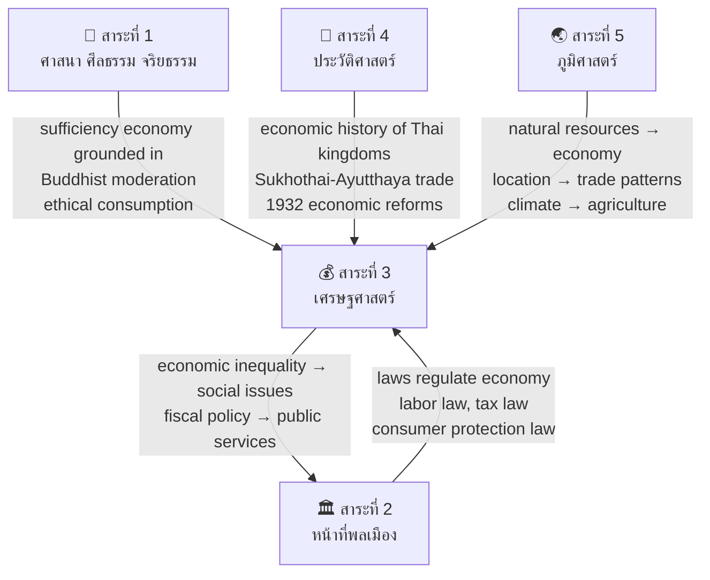

# สาระที่ 3 — เศรษฐศาสตร์ (Economics)

> **Strand:** Economics | **Strand Number:** 3 of 5
> **Concept Areas:** ~16 | **Duration:** ป.1–ม.6 (12 years)
> **Source:** หลักสูตรแกนกลางการศึกษาขั้นพื้นฐาน พุทธศักราช 2551 (Basic Education Core Curriculum B.E. 2551, revised 2560)
> **Leads to:** Economics, finance, business administration, accounting, public policy

## What Is This?

The economics strand develops economic literacy from basic concepts of needs, wants, and saving in primary grades through market mechanisms and macroeconomic theory to applied personal finance and Thailand's unique Sufficiency Economy Philosophy (ปรัชญาเศรษฐกิจพอเพียง).

A defining feature of Thai economics education is the integration of the Sufficiency Economy Philosophy — His Majesty King Bhumibol Adulyadej's framework emphasizing moderation, reasonableness, and self-immunity — as both a personal life philosophy and a national development model. This is not taught as a separate unit but woven through all economic topics.

The strand prepares students for both practical life (budgeting, saving, understanding taxes) and academic specialization (micro/macroeconomic theory for university preparation).

## The ~16 Concept Areas

### 🏗️ Foundational Economics
- [[01_Scarcity_and_Choice]] — ความขาดแคลนและการเลือก: unlimited wants vs limited resources, scarcity as the fundamental economic problem, opportunity cost, trade-offs, production possibility frontier (ม.4–6)
- [[02_Factors_of_Production]] — ปัจจัยการผลิต: land (ที่ดิน — natural resources), labor (แรงงาน), capital (ทุน — physical and financial), entrepreneurship (ผู้ประกอบการ); factor rewards (rent, wages, interest, profit)

### 📈 Market Mechanisms
- [[03_Demand]] — อุปสงค์: law of demand, demand schedule and curve, determinants of demand (price, income, tastes, related goods, expectations, number of buyers), shifts vs movements, elasticity of demand
- [[04_Supply]] — อุปทาน: law of supply, supply schedule and curve, determinants of supply (price, input costs, technology, taxes/subsidies, expectations, number of sellers), shifts vs movements, elasticity of supply
- [[05_Market_Equilibrium]] — ดุลยภาพของตลาด: equilibrium price and quantity, surplus and shortage, price mechanism, government intervention (price floors/ceilings), market efficiency
- [[06_Market_Structures]] — โครงสร้างตลาด: perfect competition, monopoly, monopolistic competition, oligopoly — characteristics, pricing, efficiency; Thai market examples (ม.4–6)
- [[07_Market_Failure]] — ความล้มเหลวของตลาด: externalities (positive/negative), public goods, information asymmetry, monopoly power, income inequality — and government responses (ม.4–6)

### 👑 Sufficiency Economy (Thai Emphasis)
- [[08_Sufficiency_Economy_Philosophy]] — ปรัชญาเศรษฐกิจพอเพียง: origins (King Bhumibol's speeches from 1974 onward), 3 core principles (พอประมาณ/moderation, มีเหตุผล/reasonableness, มีภูมิคุ้มกัน/self-immunity), 2 conditions (ความรู้/knowledge, คุณธรรม/ethics), New Theory agriculture, application at individual, community, and national levels, Sustainable Development Goals (SDGs) alignment

### 💵 Money, Banking & Finance
- [[09_Money_and_Banking]] — เงินและสถาบันการเงิน: functions of money (medium of exchange, unit of account, store of value), types of money (commodity, fiat, digital), central banking (Bank of Thailand: roles in monetary policy, financial stability, currency issuance), commercial banks, specialized financial institutions, fintech
- [[10_Personal_Finance]] — การเงินส่วนบุคคล: budgeting (รายรับ-รายจ่าย), saving vs investing, types of savings (savings accounts, fixed deposits, government savings bonds), debt management (good vs bad debt), credit (credit cards, loans), financial planning (short/medium/long term), taxation basics (personal income tax — ภ.ง.ด. 90/91, VAT), insurance, retirement planning
- [[11_Inflation_and_Deflation]] — เงินเฟ้อและเงินฝืด: definition, measurement (CPI), types (demand-pull, cost-push), effects on purchasing power, savers, borrowers; deflation risks; central bank responses

### 🏭 Production, Consumption & Distribution
- [[12_Production_and_Consumption]] — การผลิตและการบริโภค: production process (inputs → outputs), productivity, economies of scale, consumer behavior, consumer rights (5 consumer rights: right to information, right to choose, right to safety, right to be heard, right to compensation), advertising literacy, sustainable consumption
- [[13_Economic_Systems]] — ระบบเศรษฐกิจ: traditional economy, command economy (สังคมนิยม/คอมมิวนิสต์), market economy (ทุนนิยม), mixed economy; characteristics, advantages, disadvantages; Thailand's mixed economy; comparison of North Korea, China, US, Scandinavian models

### 📊 Macroeconomics
- [[14_National_Income]] — รายได้ประชาชาติ: GDP, GNP, NNP, national income calculation methods (expenditure, income, production approaches), nominal vs real GDP, GDP per capita, limitations of GDP as welfare measure, Thailand's GDP
- [[15_Government_and_Economy]] — บทบาทรัฐบาลในระบบเศรษฐกิจ: fiscal policy (government spending + taxation — expansionary vs contractionary), monetary policy (interest rates, reserve requirements, open market operations), public goods, government budget (พระราชบัญญัติงบประมาณรายจ่ายประจำปี), national debt, Thailand's fiscal position
- [[16_International_Economics]] — เศรษฐศาสตร์ระหว่างประเทศ: international trade theory (absolute advantage, comparative advantage), free trade vs protectionism (tariffs, quotas, subsidies), FTA (Free Trade Agreements), ASEAN Economic Community (AEC — in-depth from economics perspective), WTO, balance of payments, exchange rate systems, foreign direct investment (FDI), globalization debates

### 🔄 Additional Topics (woven across levels)
- [[17_Economic_Development]] — การพัฒนาเศรษฐกิจ: developed vs developing countries, economic growth vs development, Human Development Index (HDI), inequality (Gini coefficient, Palma ratio), poverty, Thailand's development trajectory (from agrarian to NIC to middle-income trap), Thailand 4.0, sustainable development
- [[18_Cooperatives_and_Community_Economy]] — สหกรณ์และเศรษฐกิจชุมชน: cooperative principles (ICA 7 principles), cooperative types in Thailand (agricultural, credit union, consumer, service, fishery), community enterprises (วิสาหกิจชุมชน), local economy strengthening

---

## Grade Band Progression

### ป.1–3 (Early Primary: Ages 6–9) — Basic Economic Awareness

| Concept Area | What's Taught |
|---|---|
| **Needs vs Wants** | Distinguishing between things we need (necessities: food, shelter, clothing, medicine) and things we want (toys, snacks, entertainment); making choices when we can't have everything |
| **Saving** | Simple saving concept: putting money aside for later; using piggy banks (ออมสิน); understanding "spend less than you earn" in simple terms |
| **Family Occupations** | Jobs family members do; why people work; different types of work (farmer, teacher, doctor, shopkeeper, civil servant); work provides income |
| **Goods and Services** | Basic distinction: goods are things you can touch (สินค้า — food, clothes, books), services are things people do for you (บริการ — haircut, teaching, medical care) |
| **Simple Spending Decisions** | Making choices with limited money; comparing prices (simple: this costs more, this costs less); being careful with spending |
| **Money Basics** | Recognizing Thai currency (coins and banknotes); simple transactions; understanding that money has value |
| **Sufficiency Intro** | Very simple: using things wisely, not being wasteful, sharing with others, being content with what you have |
| **Local Economy** | Simple awareness: where does food come from? (farm → market → home); local shops and markets |

### ป.4–6 (Upper Primary: Ages 9–12) — Practical Economic Literacy

| Concept Area | What's Taught |
|---|---|
| **Scarcity & Choice** | Formal introduction: scarcity as the basic economic problem; resources are limited but wants are unlimited; every choice involves giving something up (opportunity cost — simple) |
| **Factors of Production** | Four factors introduction: land (natural resources), labor (workers), capital (tools, machines, buildings), entrepreneurship (business owners who combine the other three) |
| **Supply & Demand (Intro)** | Simple supply and demand: price goes up when many people want something (demand high) or when there isn't enough (supply low); basic concept using everyday examples |
| **Production & Consumption** | Production: how goods are made (inputs → process → outputs); consumption: using goods and services; being a smart consumer (checking quality, comparing prices); basic consumer rights |
| **Money & Banking (Intro)** | Functions of money; types of money (coins, banknotes, digital); banks: what they do (savings, loans — simple); Bank of Thailand as central bank (simple concept) |
| **Saving & Spending** | Practical saving: setting savings goals, different ways to save (bank account, savings cooperative at school), simple budgeting (tracking income and expenses), avoiding unnecessary spending |
| **Taxation (Intro)** | Simple concept: taxes are money citizens pay to government; government uses tax money for public services (roads, schools, hospitals); VAT (ภาษีมูลค่าเพิ่ม) concept — it's included in prices |
| **Cooperatives** | Cooperatives concept: people working together for economic benefit; school cooperatives (สหกรณ์โรงเรียน) as practical experience; types of co-ops in Thailand |
| **Sufficiency Economy** | Introduction to Sufficiency Economy Philosophy: 3 principles (พอประมาณ, มีเหตุผล, มีภูมิคุ้มกัน), 2 conditions (ความรู้, คุณธรรม); New Theory agriculture (simple); applying sufficiency at home and school |
| **Economic Systems (Intro)** | Basic types: market economy (buyers and sellers decide), command economy (government decides); Thailand has a mixed economy with the King's sufficiency philosophy |
| **Local Economy** | Understanding local economic activities: what does our province produce? local products (OTOP), local markets, tourism economy |

### ม.1–3 (Lower Secondary: Ages 12–15) — Systematic Economics

| Concept Area | What's Taught |
|---|---|
| **Scarcity & Choice (Formal)** | Formal economic analysis: scarcity → choice → opportunity cost; production possibility frontier (PPF) concept; factors of production rewards (rent, wages, interest, profit) |
| **Supply & Demand (Systematic)** | Law of demand (graphical: demand curve), determinants of demand; law of supply (graphical: supply curve), determinants of supply; equilibrium price and quantity; surplus and shortage; price mechanism; simple elasticity concept |
| **Market Mechanisms** | How markets work: price as signal, incentives, competition; government price controls (price ceiling and floor — examples: minimum wage, rent control); market efficiency concept |
| **Production** | Production theory: short run vs long run, total/average/marginal product, law of diminishing returns, economies of scale (simple); production costs (fixed, variable, total, average, marginal) |
| **Consumption** | Consumer behavior: utility, marginal utility, law of diminishing marginal utility; consumer equilibrium; consumer protection (สิทธิผู้บริโภค 5 ประการ in detail), consumer protection agencies (สคบ.) |
| **Money & Banking (Detailed)** | Money: functions, properties, evolution (barter → commodity money → fiat money → digital); financial institutions: Bank of Thailand (roles: monetary policy, financial stability, note issuance), commercial banks, specialized financial institutions; credit and loans; interest rates |
| **Inflation** | Definition, measurement (CPI — how it's calculated), types (demand-pull, cost-push), effects (on purchasing power, savings, debt), deflation, Bank of Thailand's role in price stability |
| **Economic Systems (Comparative)** | Detailed comparison: traditional (subsistence), command/planned (socialism, communism — USSR, China, North Korea, Cuba), market/capitalism (USA), mixed (Thailand, European welfare states); advantages and disadvantages; economic freedom and growth |
| **Government & Economy** | Government's economic roles: providing public goods, regulation, redistribution, stabilization; government budget (sources of revenue: taxes, state enterprises, borrowing; expenditures); public debt |
| **Taxation** | Tax system: direct taxes (personal income tax, corporate income tax) vs indirect taxes (VAT, excise tax, customs duties); tax principles (equity, certainty, convenience, efficiency); taxation as fiscal policy tool |
| **Sufficiency Economy (Depth)** | Deep understanding of Sufficiency Economy Philosophy: origins in King Bhumibol's speeches, philosophical foundations (middle path/มัชฌิมาปฏิปทา in Buddhism), 3 principles + 2 conditions in detail, New Theory agriculture (3 stages), application at individual/family level (household accounting, debt reduction), community level (community enterprises, cooperatives), national level (development planning with sufficiency) |
| **Cooperatives** | Cooperative principles (ICA 7 principles), cooperative types in Thailand (agricultural, credit union/thrift, consumer, service), cooperative structure and governance, importance of cooperatives in Thai economy, comparison with private business |
| **Personal Finance (Practical)** | Practical personal finance: creating a personal budget, tracking expenses, setting savings goals, types of savings products, understanding interest (compound interest — "eighth wonder"), avoiding debt traps, introduction to investment (savings vs investment, basic investment types), tax filing basics |
| **ASEAN Economy** | ASEAN Economic Community: AEC Blueprint 2025, free flow of goods, services, investment, capital, skilled labor; benefits for Thailand; challenges (competition, standards, labor migration) |

### ม.4–6 (Upper Secondary: Ages 15–18) — Advanced & Applied Economics

| Concept Area | What's Taught |
|---|---|
| **Demand & Supply — Advanced** | Demand analysis: individual vs market demand, demand function, income and substitution effects, demand elasticity (price, cross, income — calculation and interpretation, relationship to total revenue); Supply analysis: supply function, supply elasticity (determinants), short-run vs long-run supply; Market equilibrium: comparative statics, consumer surplus, producer surplus, total welfare |
| **Market Structures — Full Analysis** | Perfect competition (characteristics, short-run and long-run equilibrium, efficiency), monopoly (sources, pricing, deadweight loss, natural monopoly regulation), monopolistic competition (product differentiation, excess capacity), oligopoly (interdependence, game theory basics, collusion, price leadership) |
| **Market Failure & Government** | Externalities (positive: education, vaccination; negative: pollution — Pigouvian tax, Coase theorem), public goods (non-rival, non-excludable — free rider problem), common resources (tragedy of the commons), asymmetric information (adverse selection, moral hazard), government solutions (regulation, taxes/subsidies, provision, tradable permits) |
| **Production & Cost Theory** | Production function (short-run: law of diminishing returns; long-run: returns to scale), cost curves (TC, FC, VC, ATC, AVC, AFC, MC), revenue curves (TR, AR, MR), profit maximization (MR=MC), break-even and shutdown points |
| **GDP & National Income** | GDP calculation (expenditure approach: C+I+G+(X-M); income approach; production/value-added approach), nominal vs real GDP, GDP deflator, GNP vs GDP, limitations of GDP (doesn't measure: inequality, informal economy, environmental degradation, happiness), alternative measures (GNH, HDI, GPI) |
| **Macroeconomic Goals** | Four macroeconomic goals: economic growth, full employment/low unemployment, price stability, balance of payments equilibrium; trade-offs (Phillips curve: inflation vs unemployment) |
| **Fiscal Policy** | Government budget analysis (sources of revenue, expenditure categories, deficit/surplus), types of fiscal policy (discretionary vs automatic stabilizers), expansionary vs contractionary policy, crowding-out effect, supply-side economics, public debt sustainability, Thailand's fiscal position |
| **Monetary Policy** | Money supply measures (M1, M2, M3), money creation by commercial banks (fractional reserve banking, money multiplier), monetary policy tools (policy interest rate, reserve requirement, open market operations), monetary transmission mechanism, inflation targeting (Thailand's framework), Monetary Policy Committee |
| **International Trade Theory** | Absolute advantage (Adam Smith), comparative advantage (David Ricardo), Heckscher-Ohlin model (factor endowments), trade and welfare, terms of trade |
| **Trade Policy** | Protectionism arguments (infant industry, national security, anti-dumping, jobs), trade barriers (tariffs: effects on consumers, producers, government, net welfare; non-tariff barriers: quotas, subsidies, standards), trade liberalization (GATT → WTO, multilateral vs bilateral/regional FTAs), Thailand's FTA network |
| **Balance of Payments & Exchange Rates** | BOP components (current account: trade balance, services, income, transfers; capital and financial account; official reserves), BOP equilibrium, exchange rate systems (fixed, floating, managed float), factors affecting exchange rates, exchange rate and trade, Thailand's exchange rate policy (managed float) |
| **Economic Development** | Development theories (Rostow's stages, dependency theory), development indicators (HDI, Gini coefficient, poverty headcount, multidimensional poverty), Thailand's development experience (from low-income to upper-middle-income, middle-income trap, inequality challenges), Thailand 4.0 and innovation-driven economy, SDGs in Thai context |
| **Sufficiency Economy — Advanced** | Sufficiency Economy as alternative development paradigm: critique of mainstream development models, sufficiency at national policy level (National Economic and Social Development Plans since Plan 9), international recognition (UN Human Development Lifetime Achievement Award to King Bhumibol), sufficiency and SDGs, case studies of sufficiency-based projects, critical perspectives and debates |
| **Personal Finance — Advanced** | Comprehensive financial planning: life-cycle financial planning, investment principles (risk-return trade-off, diversification, asset allocation), investment vehicles (stocks, bonds, mutual funds, real estate, gold), retirement planning (Social Security Fund, provident fund, RMF/LTF), insurance (life, health, property), tax planning, consumer credit and debt management, financial scams and consumer protection |

---

## Key Economic Terminology

### Thai-English Economics Glossary

| Thai | English | Definition |
|---|---|---|
| อุปสงค์ | Demand | Quantity of a good buyers are willing and able to purchase at various prices |
| อุปทาน | Supply | Quantity of a good sellers are willing and able to sell at various prices |
| ดุลยภาพ | Equilibrium | Point where quantity demanded equals quantity supplied |
| ต้นทุนค่าเสียโอกาส | Opportunity Cost | Value of the next best alternative foregone |
| ปัจจัยการผลิต | Factors of Production | Land, labor, capital, entrepreneurship |
| ความยืดหยุ่น | Elasticity | Responsiveness of quantity demanded/supplied to price/income changes |
| เงินเฟ้อ | Inflation | Sustained increase in the general price level |
| เงินฝืด | Deflation | Sustained decrease in the general price level |
| GDP | ผลิตภัณฑ์มวลรวมในประเทศ | Gross Domestic Product: total value of final goods/services produced within a country |
| GNP | ผลิตภัณฑ์มวลรวมประชาชาติ | Gross National Product: GDP + net income from abroad |
| นโยบายการคลัง | Fiscal Policy | Government spending and taxation to influence the economy |
| นโยบายการเงิน | Monetary Policy | Central bank actions to control money supply and interest rates |
| เศรษฐกิจพอเพียง | Sufficiency Economy | King Bhumibol's development philosophy emphasizing moderation, reasonableness, self-immunity |
| สหกรณ์ | Cooperative | Member-owned and democratically controlled business organization |

---

## Sufficiency Economy Philosophy — Detailed

The Sufficiency Economy Philosophy is unique to Thai economics education and permeates all levels:

### Three Core Principles (3 ห่วง)

| Principle | Thai | Description |
|---|---|---|
| **Moderation** | ความพอประมาณ | Living within one's means; producing and consuming at a moderate level; avoiding excess and greed |
| **Reasonableness** | ความมีเหตุผล | Making decisions based on reason, evidence, and careful consideration of causes and consequences |
| **Self-Immunity** | การมีภูมิคุ้มกันที่ดี | Building resilience against external shocks (economic, social, environmental, cultural); preparing for change and uncertainty |

### Two Conditions (2 เงื่อนไข)

| Condition | Thai | Description |
|---|---|---|
| **Knowledge** | ความรู้ | Thorough knowledge and careful planning based on academic and local wisdom |
| **Ethics** | คุณธรรม | Honesty, integrity, diligence, patience, perseverance, and sharing for the common good |

### New Theory Agriculture (ทฤษฎีใหม่)

A practical application of Sufficiency Economy for farmers, dividing land into 4 parts (30:30:30:10):
- **30%** — Pond for water storage and fish raising
- **30%** — Rice cultivation for household consumption
- **30%** — Mixed crops, fruit trees, vegetables, herbs
- **10%** — Housing, animal raising, other structures

Three stages: (1) self-sufficiency at household level, (2) community cooperation, (3) connecting to external markets/enterprises

---

## How This Strand Connects to Others

---

## Reading Paths

- **Microeconomics track:** 01 Scarcity → 02 Factors → 03 Demand → 04 Supply → 05 Equilibrium → 06 Market Structures → 07 Market Failure
- **Macroeconomics track:** 14 National Income → 15 Government & Economy → 11 Inflation → 09 Money → 16 International Economics
- **Personal finance track:** 01 Scarcity → 10 Personal Finance → 09 Money → 11 Inflation
- **Development track:** 08 Sufficiency Economy → 17 Development → 13 Economic Systems → 18 Cooperatives
- **International track:** 16 International Economics → 13 Economic Systems → 17 Development

---

## Related

- [[Social Studies - Overview|← Back to Social Studies Overview]]
- [[01 Religion - Overview|สาระที่ 1: ศาสนา]] — Buddhist ethical foundation of sufficiency economy
- [[02 Civics - Overview|สาระที่ 2: หน้าที่พลเมือง]] — Economic law, consumer rights, fiscal policy
- [[04 History - Overview|สาระที่ 4: ประวัติศาสตร์]] — Economic history of Thailand
- [[05 Geography - Overview|สาระที่ 5: ภูมิศาสตร์]] — Economic geography, resources, trade routes
