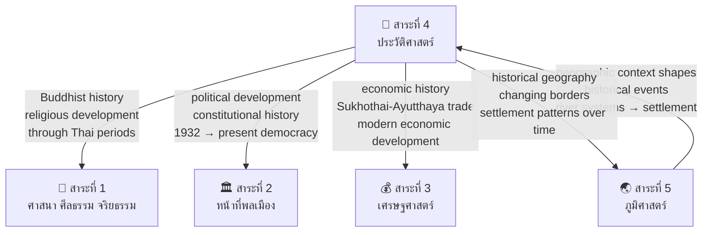

# สาระที่ 4 — ประวัติศาสตร์ (History)

> **Strand:** History | **Strand Number:** 4 of 5
> **Concept Areas:** ~20 | **Duration:** ป.1–ม.6 (12 years)
> **Source:** หลักสูตรแกนกลางการศึกษาขั้นพื้นฐาน พุทธศักราช 2551 (Basic Education Core Curriculum B.E. 2551, revised 2560)
> **Leads to:** History, archaeology, museum studies, cultural heritage management, political science, international relations

## What Is This?

The history strand develops historical consciousness from personal and family timelines through Thai national history (four great kingdoms: Sukhothai, Ayutthaya, Thonburi, Rattanakosin) to world civilizations and global events. Students don't just memorize dates and kings — they learn to **think like historians**: evaluating evidence, understanding causation, recognizing interpretation, and connecting past to present.

Thai history education serves multiple purposes: transmitting national identity and pride, understanding the origins of present institutions and challenges, cultivating critical thinking through historical method, and situating Thailand within world history. The strand balances national history (the majority of instructional time) with world history and local history.

The progression moves from personal/community history (ป.1–3) through national history (ป.4–ม.3) to analytical and comparative history (ม.4–6).

## The ~20 Concept Areas

### 🔍 Historical Method & Skills
- [[01_Historical_Method]] — วิธีการทางประวัติศาสตร์: defining history (ความหมายของประวัติศาสตร์), types of historical evidence (หลักฐานชั้นต้น/primary and หลักฐานชั้นรอง/secondary), source evaluation (การวิพากษ์หลักฐาน: external criticism — authenticity; internal criticism — credibility), historical thinking skills (chronological thinking, contextualization, causation, sourcing, interpretation)
- [[02_Time_and_Periodization]] — เวลาและการแบ่งยุคสมัย: decades, centuries, millennia; CE/BCE vs Buddhist Era (พ.ศ.); Thai historical periodization (ก่อนประวัติศาสตร์, สุโขทัย, อยุธยา, ธนบุรี, รัตนโกสินทร์); world historical periodization (Ancient, Medieval, Modern, Contemporary)

### 🦴 Prehistoric Thailand
- [[03_Prehistoric_Thailand]] — ยุคก่อนประวัติศาสตร์ในดินแดนไทย: Stone Age (ยุคหินเก่า, กลาง, ใหม่), Metal Age (ยุคสำริด, เหล็ก), Ban Chiang archaeological site (แหล่งโบราณคดีบ้านเชียง — UNESCO World Heritage), prehistoric communities and way of life, evidence: tools, pottery, cave paintings, skeletal remains

### 🏯 Thai Historical Periods
- [[04_Sukhothai_Period]] — อาณาจักรสุโขทัย (พ.ศ. 1792–1981 / c. 1249–1438 CE): founding by พ่อขุนศรีอินทราทิตย์, golden age under พ่อขุนรามคำแหงมหาราช (invention of Thai script — ลายสือไทย, ศิลาจารึกหลักที่ 1, expansion, trade), governance (พ่อปกครองลูก — paternalistic), religion (Theravada Buddhism from Sri Lanka via Nakhon Si Thammarat), economy and society, art and culture (Buddha images: Sukhothai style), decline and absorption into Ayutthaya
- [[05_Ayutthaya_Period]] — อาณาจักรอยุธยา (พ.ศ. 1893–2310 / c. 1350–1767 CE): founding by สมเด็จพระรามาธิบดีที่ 1 (พระเจ้าอู่ทอง), 417 years — longest-lasting Thai kingdom; governance system (จตุสดมภ์ — four ministries: เวียง วัง คลัง นา; ศักดินา — feudal ranking; มนเทียรบาล), notable kings (สมเด็จพระบรมไตรโลกนาถ — administrative reforms; สมเด็จพระนเรศวรมหาราช — declared independence from Burma, expanded territory; สมเด็จพระนารายณ์มหาราช — "Golden Age" of diplomacy with France, Persia; สมเด็จพระเจ้าอยู่หัวบรมโกศ — last golden age), foreign relations (China tributary, Portuguese, Dutch, French, Japanese, Persian), wars with Burma (เสียกรุงครั้งที่ 1 พ.ศ. 2112, เสียกรุงครั้งที่ 2 พ.ศ. 2310), economy (international trade hub, royal monopoly system — พระคลังสินค้า), society (ไพร่/nobility/monks/slaves), culture and arts, fall of Ayutthaya
- [[06_Thonburi_Period]] — สมัยธนบุรี (พ.ศ. 2310–2325 / 1767–1782 CE): King Taksin the Great (สมเด็จพระเจ้าตากสินมหาราช), reunification of Siam after Ayutthaya's fall, military campaigns, relocation of capital to Thonburi, economic recovery, governance, reasons for the end of his reign
- [[07_Rattanakosin_Period]] — สมัยรัตนโกสินทร์ (พ.ศ. 2325–ปัจจุบัน / 1782 CE–present):
  - **Early Rattanakosin (รัชกาลที่ 1–3):** Founding of Bangkok, rebuilding after Thonburi, wars with Burma, cultural revival (literature, temple construction), Chinese immigration, tributary system
  - **Reform Era (รัชกาลที่ 4–5):** King Mongkut (รัชกาลที่ 4) — opening to the West, Bowring Treaty 1855, modernization begins; King Chulalongkorn (รัชกาลที่ 5) — abolition of slavery (เลิกทาส 2448), administrative reforms (เทศาภิบาล system — centralized provincial administration), educational reform, infrastructure development, maintaining independence amid colonization
  - **Constitutional Transition (รัชกาลที่ 6–8):** King Vajiravudh (รัชกาลที่ 6) — nationalism, compulsory education, WWI participation; 1932 Revolution (เปลี่ยนแปลงการปกครอง); King Prajadhipok (รัชกาลที่ 7) — last absolute monarch, abdication; King Ananda Mahidol (รัชกาลที่ 8)
  - **Contemporary (รัชกาลที่ 9–10):** King Bhumibol (รัชกาลที่ 9) — longest-reigning monarch, rural development, Sufficiency Economy; Cold War Thailand (allied with US, Vietnam War, communist insurgency); democratic development (1973, 1976, 1992 movements); 1997 Asian Financial Crisis; political conflicts 2000s–present; King Vajiralongkorn (รัชกาลที่ 10)

### 👑 Important Monarchs & Figures
- [[08_Thai_Monarchs]] — พระมหากษัตริย์ไทย: key contributions of each major king across all periods; the institution of monarchy as continuity in Thai history
- [[09_Thai_Heroes_and_Figures]] — บุคคลสำคัญในประวัติศาสตร์ไทย: วีรชน (heroes: ท้าวสุรนารี, ชาวบ้านบางระจัน, พระยาพิชัยดาบหัก), notable women in Thai history, reformers and intellectuals, artists and writers

### 📜 Historical Evidence & Sources
- [[10_Historical_Sources]] — หลักฐานทางประวัติศาสตร์: types of evidence (written: stone inscriptions, chronicles/พงศาวดาร, foreign records, letters, laws; material: archaeological artifacts, architecture, art; oral: legends, folk songs, oral histories), evaluating sources, key Thai historical sources (ศิลาจารึก, จารึกต่างๆ, พงศาวดารฉบับต่างๆ, Dutch/French/Chinese records)

### 🌏 World History
- [[11_Ancient_Civilizations]] — อารยธรรมโบราณ: Mesopotamia (Tigris-Euphrates, cuneiform, Hammurabi's Code), Egypt (Nile, pyramids, hieroglyphics), Indus Valley (Harappa, Mohenjo-Daro), China (Yellow River, Shang/Zhou/Qin/Han dynasties, Great Wall, Silk Road), Greece (Athens democracy, philosophy, Alexander), Rome (Republic → Empire, law, engineering, Christianity) — key contributions to world civilization
- [[12_Major_World_Events]] — เหตุการณ์สำคัญของโลก: Age of Exploration/Discovery, Renaissance, Reformation, Scientific Revolution, Enlightenment, Industrial Revolution, Imperialism and colonization, WWI, WWII, Cold War, decolonization, globalization
- [[13_Southeast_Asian_History]] — ประวัติศาสตร์เอเชียตะวันออกเฉียงใต้: early kingdoms (Funan, Dvaravati, Srivijaya, Angkor/Khmer Empire, Pagan, Champa), Indian and Chinese cultural influences (Indianization), colonial period (British in Burma/Malaya/Singapore, French in Vietnam/Cambodia/Laos, Dutch in Indonesia, Spanish/American in Philippines, Portuguese in Timor), nationalism and independence movements, WWII and Japanese occupation, Cold War in SEA (Vietnam War, communist insurgencies), ASEAN formation (1967), contemporary SEA

### 🏘️ Local & Thematic History
- [[14_Local_History]] — ประวัติศาสตร์ท้องถิ่น: history of the student's own province and community; local historical sites, local heroes, local museum resources; methods for researching local history (interviewing elders, visiting sites, consulting local archives)

---

## Grade Band Progression

### ป.1–3 (Early Primary: Ages 6–9) — Personal & Family History

| Concept Area | What's Taught |
|---|---|
| **Time Concepts** | Days of the week, months, years; understanding "past," "present," "future"; simple timeline of own life (birth → now); daily routines as sequences in time |
| **Self & Family History** | Personal history: date of birth, where born, significant personal events; family history: parents, grandparents, where family comes from; family tree (simple) |
| **Important People** | Significant people in the student's life; important people in the community (village head, teacher, abbot, doctor); simple stories about the King and royal family |
| **Important Days** | National important days: Father's Day, Mother's Day, Children's Day, New Year, Songkran — meaning and how celebrated; Buddhist holy days — simple meaning |
| **Local History (Simple)** | History of the student's school and community; local landmarks and what they mean; simple stories about the province's name and origins |
| **Historical Method (Pre-Skills)** | Asking questions about the past; looking at old photographs as "evidence"; distinguishing old things from new things; listening to elders' stories as oral history |
| **National Symbols** | Thai flag history (simple: King Vajiravudh designed the current flag); national anthem history (simple) |
| **Simple Historical Stories** | Stories about important Thai kings in simple narrative form (e.g., King Naresuan's elephant duel, King Chulalongkorn abolishing slavery, King Ramkhamhaeng inventing Thai script) |

### ป.4–6 (Upper Primary: Ages 9–12) — Thai History Overview

| Concept Area | What's Taught |
|---|---|
| **Historical Method (Basic)** | What is history? Types of evidence (written, material, oral — with examples); simple source evaluation (is this source reliable?); using evidence to answer questions about the past |
| **Time & Periodization** | CE, BCE, Buddhist Era (พ.ศ.) conversion; decades, centuries, millennia; Thai historical periodization (overview of all four periods); world historical periods (Ancient, Middle, Modern — simple) |
| **Prehistory** | Prehistoric periods in Thailand: Stone Age, Metal Age; Ban Chiang and other archaeological sites; way of life in prehistoric times |
| **Sukhothai** | Founding, key kings (พ่อขุนศรีอินทราทิตย์, พ่อขุนรามคำแหง), ศิลาจารึกหลักที่ 1 (first Thai inscription), governance (พ่อปกครองลูก), Thai script invention, Buddhism, economy (trade, agriculture), art (Sukhothai Buddha images), decline |
| **Ayutthaya** | Founding by King U-Thong, governance (จตุสดมภ์ — simple), key kings (สมเด็จพระนเรศวร — independence from Burma; สมเด็จพระนารายณ์ — diplomacy with France), foreign relations (trade with China, Portugal, Holland), wars with Burma (เสียกรุงครั้งที่ 1 and 2 — overview), society and daily life, art and culture, fall of Ayutthaya |
| **Thonburi** | King Taksin the Great: reunification after Ayutthaya's fall, moving capital to Thonburi, military achievements, short reign significance (15 years) |
| **Rattanakosin (Overview)** | Founding by King Rama I, early Rattanakosin (building Bangkok, Wat Phra Kaew, literary revival), reform period (King Mongkut — opening to West, King Chulalongkorn — abolition of slavery, modernization), 1932 Revolution (simple: change from absolute to constitutional monarchy), key developments through present |
| **Important Kings** | Contributions of major kings: พ่อขุนรามคำแหง, สมเด็จพระนเรศวร, สมเด็จพระนารายณ์, สมเด็จพระเจ้าตากสิน, รัชกาลที่ 1–9 — with emphasis on what each contributed to the nation |
| **Local History** | History of own province: important events, local historical sites, local heroes, changes over time; simple research project: interview an elder about the past |
| **Historical Evidence** | Hands-on with historical evidence: looking at copies of old documents, photographs, artifacts; understanding that historians reconstruct the past from evidence; introduction to key Thai historical sources (ศิลาจารึก, พงศาวดาร) |
| **Ancient Civilizations (Intro)** | Brief overview of major ancient civilizations: Mesopotamia, Egypt, China, India, Greece, Rome — one key contribution each (writing, pyramids, Great Wall, Buddhism, democracy, law) |

### ม.1–3 (Lower Secondary: Ages 12–15) — Systematic History

| Concept Area | What's Taught |
|---|---|
| **Historical Method (Systematic)** | Full historical method: defining historical questions; locating and selecting evidence (primary vs secondary sources); source criticism (external: authenticity, dating, authorship; internal: credibility, bias, perspective); interpretation and synthesis; historical writing; recognizing that history involves interpretation |
| **Time & Periodization (Detailed)** | Thai historical periodization in depth; world periodization; understanding historical chronology; creating and reading timelines; cross-referencing events across regions (what was happening in Europe during Ayutthaya?) |
| **Sukhothai — Detailed** | Deep study: political development, economic system (agriculture, trade — ceramics/Sangkhalok), social structure, religion (Theravada Buddhism from Lanka), ศิลาจารึก as historical evidence (analysis of content), art and architecture, relations with neighboring states, factors in decline, Sukhothai's legacy and contribution to Thai identity |
| **Ayutthaya — Detailed** | Comprehensive study: political-administrative system (จตุสดมภ์, ศักดินา, มนเทียรบาล), social hierarchy, economy (international trade, royal monopolies, rice economy), foreign relations (Chinese tributary system, European powers, Asian neighbors), notable kings' reigns studied as case studies, wars with Burma, art and literature, daily life of different social classes, fall of Ayutthaya (internal and external factors) |
| **Thonburi — Detailed** | King Taksin's background, reunification campaigns, administrative and economic recovery, relations with China, internal challenges, end of reign and transition to Rattanakosin |
| **Rattanakosin — Detailed** | Period-by-period analysis: Early (รัชกาลที่ 1–3: reconstruction, culture, wars), Reform (รัชกาลที่ 4–5: Bowring Treaty, modernization, abolition of slavery, administrative reform — เทศาภิบาล, maintaining independence), Nationalist (รัชกาลที่ 6: nationalism, WWI, education), Constitutional transition (1932 revolution, causes and consequences), WWII period, Cold War era (US alliance, Vietnam War, internal communism), democratic development (1973 Oct 14, 1976 Oct 6, 1992 Black May), economic boom and 1997 crisis, contemporary political history |
| **World History — Systematic** | Ancient civilizations (Mesopotamia, Egypt, Indus, China, Greece, Rome — in detail: political systems, achievements, legacy); Middle Ages (feudalism, rise of Islam, Crusades); Renaissance and Reformation; Age of Exploration and colonization; Scientific Revolution and Enlightenment; Industrial Revolution (causes, effects, spread); Imperialism (Africa, Asia partition); WWI (causes, major events, Treaty of Versailles); interwar period (Great Depression, rise of fascism); WWII (causes, theaters of war, Holocaust, atomic bombs, UN founding); Cold War (ideological conflict, Korean War, Vietnam War, Cuban Missile Crisis, arms race, space race, fall of USSR) |
| **Southeast Asian History** | Early kingdoms (Funan, Dvaravati, Srivijaya, Angkor — the Khmer Empire's influence on Thailand), colonial period mapping (which European power controlled which territory, Thailand as buffer state), nationalism and independence, WWII in SEA, Cold War in SEA, ASEAN formation (1967 Bangkok Declaration) |
| **Using Historical Sources** | Practice with historical evidence: analyzing excerpts from Thai chronicles (พงศาวดาร), foreign accounts (La Loubère, Dutch records), stone inscriptions; comparing different sources on the same event; understanding bias and perspective in historical sources |
| **Historical Research** | Conducting a historical research project: formulating a question, gathering evidence, analyzing, writing a historical account |
| **Historical Connections** | Connecting Thai history to world history: Ayutthaya as part of global trade network; Siam's relations with Western imperialism; Thailand in WWII and Cold War; understanding how global events shaped Thailand |

### ม.4–6 (Upper Secondary: Ages 15–18) — Analytical & Comparative History

| Concept Area | What's Taught |
|---|---|
| **Historical Methodology (Advanced)** | Historiography: how the writing of history has changed over time; schools of historical thought (empiricist, Marxist, Annales school, post-modernist); historical interpretation debates; constructing and deconstructing historical narratives; history and national identity; using and misusing history |
| **Thai History — Critical Analysis** | Deep analytical study of Thai history: critical examination of traditional narratives (Sukhothai as "first Thai kingdom" — archaeological debate; ศิลาจารึก authenticity debate; Ayutthaya's foreign policy — "bamboo diplomacy" analysis; 1932 Revolution interpretations: royalist vs democratic; historiography of Thai nationalism); examining how Thai history has been written and rewritten |
| **Comparative History** | Comparing Thai history with regional neighbors: state formation (Sukhothai vs Angkor), responses to colonialism (Siam vs Vietnam, Burma), modernization paths (Thailand vs Japan vs China), democratic development (Thailand vs Philippines, Indonesia) |
| **World History — Advanced** | In-depth study of selected topics: rise of the West debate (why did Europe industrialize first?), imperialism and its legacies (post-colonial theory), 20th century ideological conflicts (fascism, communism, liberal democracy), decolonization and the Third World, Cold War in Asia and Latin America, Middle East conflict, globalization's historical roots |
| **Southeast Asia — Advanced** | Deep SEA history: pre-colonial state formation, colonial transformations (economic, social, political), nationalism and decolonization (comparing paths of different SEA countries), Cold War in SEA (Vietnam War impact on Thailand/Laos/Cambodia, communist parties in SEA), ASEAN's evolution (from anti-communist bloc to comprehensive community), contemporary SEA issues (Myanmar, South China Sea, regional integration) |
| **Historical Research Project** | Independent historical research using primary and secondary sources; proper citation and bibliography; presenting historical arguments with evidence; peer review of historical writing |
| **History & Contemporary Issues** | Using historical understanding to analyze current issues: Thai political conflicts in historical perspective, border issues (Preah Vihear case), ethnic and regional identities, Thailand's place in the world — how history shapes present choices |
| **Historical Sources — Critical** | Advanced source analysis: reading original texts (excerpts from chronicles, treaties, laws, letters), understanding the context of source creation, comparing conflicting accounts, recognizing gaps and silences in historical record |
| **History for Citizenship** | History's role in building informed citizens: understanding the origins of rights and institutions, learning from past mistakes, recognizing propaganda and misuse of history, civic pride balanced with critical thinking |

---

## Thai Historical Periods — Quick Reference

| Period | Thai Name | Dates (พ.ศ.) | Dates (CE) | Duration | Key Feature |
|---|---|---|---|---|---|
| Prehistoric | ก่อนประวัติศาสตร์ | Before พ.ศ. 1792 | Before ~1249 CE | ~tens of thousands of years | Ban Chiang, cave paintings |
| Sukhothai | สุโขทัย | 1792–1981 | ~1249–1438 | ~189 years | First Thai kingdom, Thai script, Theravada Buddhism |
| Ayutthaya | อยุธยา | 1893–2310 | 1350–1767 | 417 years | Longest kingdom, international trade hub, จตุสดมภ์ governance |
| Thonburi | ธนบุรี | 2310–2325 | 1767–1782 | 15 years | Reunification after Ayutthaya's fall |
| Rattanakosin | รัตนโกสินทร์ | 2325–present | 1782–present | 240+ years | Bangkok capital, modernization, constitutional monarchy |

## Key Thai Monarchs — Quick Reference

| Monarch | Thai Title | Period | Key Contributions |
|---|---|---|---|
| พ่อขุนรามคำแหงมหาราช | Ramkhamhaeng the Great | Sukhothai | Thai script (ลายสือไทย), ศิลาจารึกหลักที่ 1, expanded kingdom, paternal governance |
| สมเด็จพระนเรศวรมหาราช | Naresuan the Great | Ayutthaya | Declared independence from Burma, expanded territory, warrior king |
| สมเด็จพระนารายณ์มหาราช | Narai the Great | Ayutthaya | "Golden Age" diplomacy with France, Persia; trade and cultural flourishing |
| สมเด็จพระเจ้าตากสินมหาราช | Taksin the Great | Thonburi | Reunified Siam after Ayutthaya's fall, military genius |
| พระบาทสมเด็จพระพุทธยอดฟ้าจุฬาโลก (ร.1) | Rama I | Rattanakosin | Founded Bangkok, Chakri dynasty, cultural revival |
| พระบาทสมเด็จพระจอมเกล้าเจ้าอยู่หัว (ร.4) | Mongkut / Rama IV | Rattanakosin | Opening to the West, Bowring Treaty 1855, modernized Siam |
| พระบาทสมเด็จพระจุลจอมเกล้าเจ้าอยู่หัว (ร.5) | Chulalongkorn / Rama V | Rattanakosin | Abolished slavery, administrative reform (เทศาภิบาล), maintained independence |
| พระบาทสมเด็จพระมงกุฎเกล้าเจ้าอยู่หัว (ร.6) | Vajiravudh / Rama VI | Rattanakosin | Nationalism, compulsory education, WWI participation, founded Chulalongkorn University |
| พระบาทสมเด็จพระปกเกล้าเจ้าอยู่หัว (ร.7) | Prajadhipok / Rama VII | Rattanakosin | Last absolute monarch, 1932 Revolution, first constitution |
| พระบาทสมเด็จพระปรมินทรมหาภูมิพลอดุลยเดช (ร.9) | Bhumibol / Rama IX | Rattanakosin | Longest reign, rural development, Sufficiency Economy, national unity |

---

## Historical Method — Key Concepts

### Steps of Historical Inquiry

| Step | Thai | Description |
|---|---|---|
| 1. Define Question | กำหนดประเด็นปัญหา | What do we want to know about the past? |
| 2. Gather Evidence | รวบรวมหลักฐาน | Collect primary and secondary sources |
| 3. Evaluate Sources | วิพากษ์หลักฐาน | External criticism (authenticity) + internal criticism (credibility) |
| 4. Analyze & Interpret | วิเคราะห์และตีความ | Extract information, draw inferences, identify patterns |
| 5. Synthesize | สังเคราะห์ | Construct a historical account/explanation |
| 6. Present | นำเสนอ | Write or present historical findings |

### Types of Historical Evidence (หลักฐานทางประวัติศาสตร์)

| Type | Thai | Examples |
|---|---|---|
| **Written** | ลายลักษณ์อักษร | Stone inscriptions (ศิลาจารึก), chronicles (พงศาวดาร), laws, letters, foreign records, newspapers |
| **Material/Archaeological** | โบราณวัตถุ/วัตถุ | Artifacts, tools, pottery, buildings, temples, Buddha images, coins, weapons |
| **Oral** | มุขปาฐะ | Legends, folk tales, songs, interviews with elders, oral traditions |
| **Visual** | ทัศนศิลป์ | Paintings, murals, photographs, films, maps |

---

## How This Strand Connects to Others

---

## Reading Paths

- **Chronological path:** 03 Prehistory → 04 Sukhothai → 05 Ayutthaya → 06 Thonburi → 07 Rattanakosin
- **Skills path:** 01 Historical Method → 02 Time & Periodization → 10 Historical Sources → research project
- **Biographical path:** 08 Thai Monarchs → 09 Heroes & Figures → then into each period for context
- **World history path:** 11 Ancient Civilizations → 12 Major World Events → 13 Southeast Asian History
- **Local history path:** 01 Historical Method → 14 Local History → 10 Historical Sources

---

## Related

- [[Social Studies - Overview|← Back to Social Studies Overview]]
- [[01 Religion - Overview|สาระที่ 1: ศาสนา]] — Buddhist history through Thai periods
- [[02 Civics - Overview|สาระที่ 2: หน้าที่พลเมือง]] — Constitutional and political history
- [[03 Economics - Overview|สาระที่ 3: เศรษฐศาสตร์]] — Economic history of Thai kingdoms
- [[05 Geography - Overview|สาระที่ 5: ภูมิศาสตร์]] — Historical geography and settlement patterns
