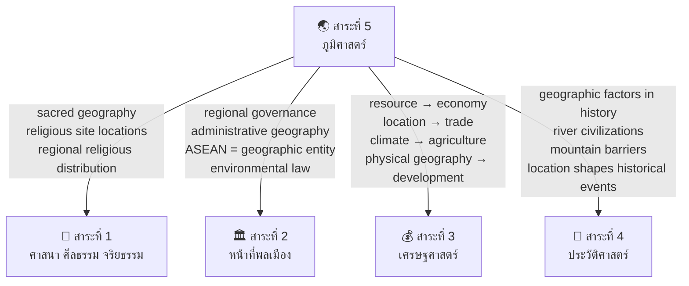

# สาระที่ 5 — ภูมิศาสตร์ (Geography)

> **Strand:** Geography | **Strand Number:** 5 of 5
> **Concept Areas:** ~18 | **Duration:** ป.1–ม.6 (12 years)
> **Source:** หลักสูตรแกนกลางการศึกษาขั้นพื้นฐาน พุทธศัตราช 2551 (Basic Education Core Curriculum B.E. 2551, revised 2560)
> **Leads to:** Geography, geology, environmental science, urban planning, GIS/remote sensing, tourism management

## What Is This?

The geography strand develops spatial literacy — the ability to understand, interpret, and analyze the world through geographic perspectives. Students learn where things are (location), why they are there (causation), and what it means (significance) — from the classroom neighborhood to the global system.

The strand bridges natural and social sciences: physical geography (landforms, climate, ecosystems), human geography (population, settlement, economic activities), and geographic skills (maps, GIS, field methods). A strong emphasis on environmental stewardship reflects Thailand's increasing environmental challenges.

Geography follows a spiral progression: simple maps and local observation in primary grades, systematic physical/human geography in lower secondary, and advanced analysis with GIS technology in upper secondary.

## The ~18 Concept Areas

### 🗺️ Geographic Tools & Skills
- [[01_Maps_and_Globes]] — แผนที่และลูกโลก: map elements (title, scale, direction/compass rose, legend/key, grid), map types (physical, political, thematic, topographic, road), globe properties, map projections (Mercator, Peters — distortions introduced), reading and interpreting maps
- [[02_Geographic_Coordinates]] — พิกัดภูมิศาสตร์: latitude (ละติจูด) and longitude (ลองจิจูด), Equator, Prime Meridian, hemispheres, grid reference systems, geographic positioning
- [[03_Time_Zones]] — เวลาโลก: Earth's rotation and time, time zones (24 zones, GMT/UTC), International Date Line, Thailand time (GMT+7), calculating time differences, impacts on travel and communication
- [[04_GIS_and_Remote_Sensing]] — ระบบสารสนเทศภูมิศาสตร์และการสำรวจระยะไกล: GIS components (hardware, software, data, people, methods), GIS data types (vector: points, lines, polygons; raster: grids, imagery), GPS (Global Positioning System), remote sensing (satellite imagery, aerial photography, drones), applications (urban planning, disaster management, environmental monitoring, business location analysis)

### ⛰️ Physical Geography
- [[05_Landforms]] — ลักษณะภูมิประเทศ: Earth's structure (crust, mantle, core), plate tectonics (plate boundaries: divergent, convergent, transform — and resulting landforms), major landforms (mountains, plateaus, plains, valleys, deserts, coasts), rivers and drainage basins, karst topography, glaciation, Thailand's physical geography (regions and landforms)
- [[06_Climate_and_Weather]] — ภูมิอากาศและลมฟ้าอากาศ: difference between weather and climate, climate factors (latitude, altitude, distance from sea, ocean currents, prevailing winds, topography), Koppen climate classification, major climate zones (tropical, dry, temperate, continental, polar), Thailand's climate (tropical monsoon — 3 seasons: summer/ร้อน, rainy/ฝน, cool/หนาว), monsoons (southwest and northeast), climate change basics
- [[07_Natural_Resources]] — ทรัพยากรธรรมชาติ: types (renewable: water, forests, soil, fisheries; non-renewable: minerals, fossil fuels; perpetual: solar, wind), resource distribution (global and within Thailand), resource management, resource depletion and conservation, energy resources (fossil fuels → renewable transition)
- [[08_Natural_Disasters]] — ภัยพิบัติทางธรรมชาติ: types (earthquakes, tsunamis, volcanic eruptions, floods, landslides, typhoons/cyclones, drought, wildfire), causes (geologic, hydrologic, meteorological), impacts on people and environment, disaster preparedness and response, Thailand's disaster risks (floods, drought, tsunami in Andaman coast), 2004 Indian Ocean tsunami case study, 2011 Thailand floods case study

### 👥 Human Geography
- [[09_Population_Geography]] — ภูมิศาสตร์ประชากร: population distribution and density, factors affecting population distribution (physical: climate, water, landforms; human: economic opportunities, history, policy), demographic transition model (stages 1–5), population pyramids and what they reveal, population growth and challenges, migration (push-pull factors, types: internal vs international, voluntary vs forced), Thailand's population (aging society, urbanization, regional differences)
- [[10_Settlement_Geography]] — ภูมิศาสตร์การตั้งถิ่นฐาน: site and situation factors for settlement location, rural vs urban settlement patterns, urbanization (causes, process, consequences), city structure models (concentric zone, sector, multiple nuclei), primate cities, megacities, urban problems (traffic, housing, pollution, inequality), Thailand's urbanization (Bangkok as primate city, regional cities expansion)
- [[11_Economic_Geography]] — ภูมิศาสตร์เศรษฐกิจ: economic sectors (primary: agriculture/mining/fishing; secondary: manufacturing/construction; tertiary: services; quaternary: information/knowledge), location factors for different economic activities, agricultural geography (subsistence vs commercial, types by climate region, Thailand's agricultural regions), industrial geography (industrial location theory, industrial regions, Thailand's Eastern Seaboard), service geography (tourism geography, retail location)
- [[12_Cultural_Geography]] — ภูมิศาสตร์วัฒนธรรม: culture regions, cultural diffusion, language geography, religion geography (world religion distribution), ethnic geography, cultural landscapes, Thailand's cultural regions (4 ภาค — geographic basis for cultural differences: Northern/Lanna culture, Northeastern/Isan-Lao culture, Central/Thai culture, Southern/Malay-influenced culture)

### 🌿 Environment & Sustainability
- [[13_Environmental_Issues]] — ปัญหาสิ่งแวดล้อม: types (deforestation, air pollution, water pollution, soil degradation, biodiversity loss, climate change, waste management), causes (population growth, industrialization, consumption patterns), local vs global issues, environmental problems in Thailand (PM2.5 air pollution, deforestation, water pollution from agriculture/industry, coastal erosion, urban waste)
- [[14_Conservation_and_Sustainability]] — การอนุรักษ์และความยั่งยืน: conservation methods (protected areas: national parks, wildlife sanctuaries; species conservation; habitat restoration), sustainable development concepts, environmental laws and policies in Thailand, community-based conservation, sustainable agriculture, renewable energy transition, environmental movements, SDGs (Sustainable Development Goals) from geographic perspective

### 🇹🇭 Regional Geography
- [[15_Thailand_Geographic_Regions]] — ภูมิภาคของประเทศไทย: 6 official regions (เหนือ/North, ตะวันออกเฉียงเหนือ/Northeast, กลาง/Central, ตะวันออก/East, ตะวันตก/West, ใต้/South) — each region's physical features (landforms, climate, rivers), natural resources, economic activities, cultural characteristics, major cities, development challenges
- [[16_World_Regions]] — ภูมิภาคของโลก: major world regions (East Asia, Southeast Asia, South Asia, Central Asia, Middle East/North Africa, Sub-Saharan Africa, Europe, Russia/Central Asia, North America, Latin America, Oceania/Australia) — physical and human characteristics of each region

### 🔬 Geographic Skills & Fieldwork
- [[17_Geographic_Fieldwork]] — การศึกษาภูมิศาสตร์ภาคสนาม: observation skills, data collection methods (surveys, measurements, interviews, photography/GPS), field sketching, data presentation (graphs, charts, maps), geographic report writing, field trip planning and execution
- [[18_Geographic_Data_Analysis]] — การวิเคราะห์ข้อมูลทางภูมิศาสตร์: interpreting graphs and charts (line, bar, pie, scatter, population pyramids, climate graphs/climographs), statistical analysis (mean, median, mode, range, percentages), spatial analysis (patterns, distributions, relationships), using geographic models, drawing conclusions from data

---

## Grade Band Progression

### ป.1–3 (Early Primary: Ages 6–9) — Local Environment & Simple Geography

| Concept Area | What's Taught |
|---|---|
| **Maps (Very Basic)** | Classroom and school maps; simple directions (left, right, forward, back); identifying basic map symbols; drawing simple maps of classroom, bedroom, route to school |
| **Directions** | Cardinal directions (ทิศเหนือ, ใต้, ตะวันออก, ตะวันตก); using the sun to find directions (sun rises in east, sets in west); simple compass use |
| **Weather** | Observing daily weather (sunny, cloudy, rainy, hot, cool); recording weather with simple symbols; seasons in Thailand (ร้อน, ฝน, หนาว) — what each feels like |
| **Local Environment** | Physical features in the local area (hills, rivers, ponds, fields, forests); human features (roads, buildings, bridges, temples, schools); how people use the environment |
| **Natural Resources (Simple)** | Things we get from nature: water, food, wood, soil; using resources wisely; not wasting water; keeping the environment clean |
| **Environmental Care** | Simple environmental responsibility: don't litter, conserve water, plant trees, care for school grounds — "เราช่วยกันดูแลสิ่งแวดล้อม" |
| **Thailand — Basic** | Thailand on a simple map; the shape of Thailand; what country we live in; simple awareness that Thailand has different regions |
| **Location (Very Simple)** | Where things are (near/far, next to, between, above/below); describing location of objects and places in the classroom and school |
| **Neighborhood Geography** | Places in the neighborhood: home, school, temple, market, hospital, police station; what each place is for; how to get from one place to another |

### ป.4–6 (Upper Primary: Ages 9–12) — Thailand & Basic Geographic Tools

| Concept Area | What's Taught |
|---|---|
| **Map Skills** | Map elements: title, scale (simple: 1 cm = 1 km), direction/compass rose, legend, grid (simple); reading and using maps; different map types (physical shows mountains/rivers, political shows borders/cities, tourist maps); using an atlas |
| **Globe** | Globe as model of Earth; continents and oceans; hemispheres; Equator; basic latitude concept (hot near Equator, cold near poles) |
| **Directions & Location** | Eight compass directions (น, ตอ, ต, ตก, ตอน, อต, ตต, พายัพ — in Thai terms); using compass rose on maps; locating places using simple grid |
| **Thailand's Physical Geography** | Thailand's physical features: mountain ranges (ทิวเขาถนนธงชัย, ดงพญาเย็น, สันกำแพง, เพชรบูรณ์, ภูพาน, ตะนาวศรี, หลวงพระบาง, etc.), major rivers (เจ้าพระยา, แม่กลอง, บางปะกง, มูล, ชี, ปิง, วัง, ยม, น่าน, ตาปี), plains (ที่ราบลุ่มแม่น้ำเจ้าพระยา), coasts (Gulf of Thailand, Andaman Sea), islands (ภูเก็ต, สมุย, ช้าง) |
| **Thailand's Regions** | 6 regions: physical characteristics (mountains in North, plateau in Northeast, plains in Central, coasts in East and South), economic activities, key cities, climate patterns across regions |
| **Climate & Weather** | Weather vs climate; Thailand's 3 seasons; monsoon winds (southwest monsoon brings rain, northeast monsoon brings cool/dry); factors affecting Thailand's climate |
| **Natural Resources** | Thailand's natural resources: tin (South), rubber (South, East), rice (Central plains), cassava/sugarcane (Northeast), forests (North, West), natural gas (Gulf of Thailand), gems (East — Chanthaburi) |
| **Population (Basic)** | Population of Thailand (~70 million); population distribution (densest in Central/Bangkok, sparse in mountains); rural vs urban living; reasons people move to cities |
| **Environment** | Environmental problems in Thailand: deforestation (ป่าไม้ลดลง), water pollution (แม่น้ำเน่าเสีย), air pollution (ควันพิษ), waste (ขยะล้นเมือง); conservation methods (reforestation, recycling, protected areas); national parks in Thailand (เขาใหญ่, ดอยอินทนนท์, etc.) |
| **Geographic Tools (Basic)** | Using simple instruments: thermometer (temperature), rain gauge (rainfall), compass, simple maps; recording observations in tables and simple graphs |
| **ASEAN Geography** | ASEAN countries on map; capital cities; basic physical features of Southeast Asia; neighboring countries of Thailand |
| **World Geography (Basic)** | Seven continents, five oceans; major countries (USA, China, India, Japan, UK, France); locating major world features on map |

### ม.1–3 (Lower Secondary: Ages 12–15) — Systematic Geography

| Concept Area | What's Taught |
|---|---|
| **Map Skills — Advanced** | Map scale (representative fraction, linear scale, statement scale — calculation and conversion); grid references (4-figure and 6-figure); contour lines (reading relief, calculating gradient); cross-sections; thematic maps (choropleth, dot distribution, proportional symbol); using topographic maps |
| **Geographic Coordinates** | Latitude and longitude in detail: degrees, minutes; locating places by coordinates; relationship between latitude and climate; longitude and time zones |
| **Time Zones** | Earth's rotation → 24 time zones; GMT/UTC; International Date Line (crossing east → lose a day, crossing west → gain a day); calculating time in different cities; impact on international business and travel |
| **Physical Geography — Global** | Earth's structure (layers: inner core, outer core, mantle, crust); plate tectonics (continental drift, plate boundaries: divergent/constructive, convergent/destructive, transform/conservative — landforms created: mid-ocean ridges, trenches, fold mountains, volcanoes, earthquakes); Ring of Fire; major world landforms (Himalayas, Andes, Rocky Mountains, Amazon basin, Sahara, Great Plains); world rivers (Amazon, Nile, Mississippi, Yangtze, Mekong) |
| **Climate — Global** | Climate factors detailed (latitude, altitude, distance from sea, ocean currents, prevailing winds, aspect, pressure systems); Koppen climate zones (tropical, dry, temperate, cold, polar — characteristics, distribution); world climate regions; climate graphs (climographs — reading and constructing) |
| **Natural Disasters** | Earthquake mechanics (focus, epicenter, seismic waves, Richter scale, Mercalli scale), tsunami causes and effects (2004 Indian Ocean tsunami detailed case study), volcanic eruptions (types: shield, composite/stratovolcano, cinder cone; effects: lava, ash, pyroclastic flow, lahars), floods (causes: heavy rain, dam failure, storm surge; effects; 2011 Thailand floods case study), landslides, tropical cyclones (formation, structure, Saffir-Simpson scale, naming), drought — for each: causes, effects on people and environment, preparedness and mitigation |
| **Population Geography** | Population distribution and density globally; factors affecting distribution (physical: relief, climate, water, soils; human: economic, political, social); demographic transition model (all 5 stages with examples); population structure (population pyramids: expansive, stationary, constrictive — interpretation); population growth issues (overpopulation, underpopulation); migration: push-pull factors, types (internal: rural-urban, regional; international: voluntary, forced/refugee); migration case studies (Thai rural-urban migration, migration from neighboring countries into Thailand) |
| **Settlement Geography** | Settlement hierarchy (hamlet → village → town → city → metropolis → megalopolis), functions of settlements, site and situation factors, rural settlement patterns (dispersed, nucleated, linear), urbanization process and causes, city structure models (Burgess concentric zone, Hoyt sector, Harris-Ullman multiple nuclei), urban problems (housing/slums, traffic, pollution, crime, urban sprawl), solutions (urban planning, public transport, green spaces), Bangkok as primate city (problems, development, expansion) |
| **Economic Geography** | Economic sectors (primary, secondary, tertiary, quaternary — characteristics, examples, employment patterns), location factors for agriculture (physical: climate, soil, relief; human: labor, market, transport, technology, government policy), agricultural systems (subsistence: shifting, intensive; commercial: extensive, intensive, plantation — examples of each), industrial location factors (raw materials, energy, labor, market, transport, government, agglomeration), industrial regions of the world, Thailand's industrial geography (Eastern Seaboard, Bangkok metropolitan), tourism geography (factors attracting tourists, impacts: economic, social, environmental, sustainable tourism) |
| **Environment** | Environmental problems: causes and effects of deforestation, desertification, air pollution (acid rain, ozone depletion, greenhouse effect/climate change), water pollution (eutrophication, marine pollution), soil degradation; climate change: greenhouse effect, evidence, impacts (sea level rise, extreme weather, biodiversity), mitigation vs adaptation; conservation: strategies at local, national, global levels; sustainable development: Brundtland definition (1987), pillars (economic, social, environmental), examples; Thailand's environmental challenges and responses |
| **GIS Introduction** | What is GIS? Components (hardware, software, data, people, methods); data types (spatial: points, lines, polygons; attribute: descriptive data); simple GIS applications (mapping, analysis, decision-making); GPS technology and uses; introduction to satellite imagery |
| **Geographic Skills** | Constructing and interpreting: line graphs, bar charts, pie charts, scatter graphs, population pyramids, climate graphs; calculating: mean, median, mode, range, percentages, density; describing patterns and distributions from maps; geographic inquiry process |

### ม.4–6 (Upper Secondary: Ages 15–18) — Advanced Analysis & Applied Geography

| Concept Area | What's Taught |
|---|---|
| **Geographic Coordinates & Map Projections — Advanced** | Precise coordinate systems (degrees-minutes-seconds, decimal degrees), map projections (Mercator, Peters, Robinson, Mollweide — properties preserved and distorted: area, shape, distance, direction), choosing appropriate projections, coordinate systems for Thailand (Indian 1975 datum, UTM zones) |
| **GIS — Applied** | GIS in depth: data models (vector: topology, attribute tables; raster: resolution, bands), spatial analysis (buffer, overlay, proximity, network analysis), GIS software skills, data sources (government agencies, satellite, field GPS), GIS applications (suitability analysis, disaster risk mapping, urban planning scenarios, environmental monitoring), critical GIS (data quality, representation issues, access to technology) |
| **Remote Sensing** | Principles of remote sensing (electromagnetic spectrum, spectral signatures), platforms (satellites: Landsat, Sentinel, THEOS/Thaichote; aerial; drones/UAV), image interpretation (visual: tone, texture, shape, pattern, size, shadow, association), digital image processing basics, applications (land use/land cover change, deforestation monitoring, urban growth, disaster assessment) |
| **Physical Geography — Advanced** | Plate tectonics: mechanisms (mantle convection, slab pull, ridge push), detailed plate boundary processes (subduction zones, collision zones, transform faults), geomorphology: weathering (physical, chemical, biological), erosion processes (fluvial, coastal, glacial, aeolian, karst), landform evolution, soil geography: soil formation factors, soil profiles, soil types and distribution, soil degradation; hydrology: the drainage basin as a system (inputs, stores, flows, outputs), hydrographs, river processes (erosion, transportation, deposition), river landforms (waterfalls, meanders, oxbow lakes, floodplains, deltas) |
| **Climatology — Advanced** | Atmospheric structure and composition, global energy budget (insolation, albedo, greenhouse effect), atmospheric circulation (Hadley, Ferrel, Polar cells, jet streams, ITCZ), pressure systems and winds, air masses and fronts, tropical cyclone formation and structure, climate classification (Koppen — detailed), climate change: paleoclimate evidence, anthropogenic forcing, IPCC scenarios, impacts (physical, ecological, social), mitigation and adaptation strategies, international climate agreements (UNFCCC, Kyoto, Paris), Thailand's climate change vulnerability and response |
| **Human Geography — Advanced** | Population theories (Malthus, Boserup, demographic transition critique), migration theories (Ravenstein's laws, Lee's push-pull model, Zelinsky's mobility transition), advanced urbanization (world cities, global cities, megacities — problems and governance), economic geography theories (Weber's industrial location, Christaller's central place theory, Friedman's core-periphery model, globalization and spatial division of labor); cultural geography (cultural diffusion, cultural landscapes, place and identity, geopolitics) |
| **Development Geography** | Measuring development: economic (GDP/GNI per capita) vs social (HDI: life expectancy, education, income; GII: Gender Inequality Index; MPI: Multidimensional Poverty Index), development theories (modernization theory, dependency theory, world-systems theory), development strategies (top-down vs bottom-up, aid, trade, FDI, microfinance), sustainable development (SDGs: 17 goals, targets, progress), Thailand's development: from low-income to upper-middle-income, inequality, regional disparities, Thailand 4.0, sufficiency economy as development model |
| **Environmental Geography — Advanced** | Ecosystems: structure, function, biomes (tropical rainforest, savanna, desert, Mediterranean, temperate, boreal, tundra — distribution, characteristics, threats), biodiversity (importance, threats: HIPPO — Habitat loss, Invasive species, Pollution, Population, Overharvesting, Climate change), environmental management: frameworks (carrying capacity, ecological footprint, planetary boundaries), resource management (forests, fisheries, water — sustainable yield, common pool resource problems), waste management (linear vs circular economy), environmental policy (EIA, protected areas, international conventions: CITES, Ramsar, CBD, UNFCCC), environmental movements and conflicts |
| **Geographic Fieldwork — Advanced** | Designing geographic investigations: formulating hypotheses/research questions, sampling strategies (random, systematic, stratified, pragmatic), data collection (primary: questionnaires, interviews, observations, measurements; secondary: census, satellite imagery, maps), risk assessment for fieldwork, data presentation techniques, statistical analysis (Spearman's rank correlation, chi-square test, Mann-Whitney U test), writing geographic reports, evaluating methodology and limitations |
| **Geography of Thailand — Advanced** | Comprehensive analysis: physical systems (geology, landforms, climate, rivers, coastlines, ecosystems), population dynamics (distribution, structure, migration, aging), economic geography (agricultural regions and change, industrialization, services and tourism, informal economy), urban geography (Bangkok metropolitan region, secondary cities, urban-rural linkages), regional development, environmental challenges, Thailand in regional and global context (ASEAN, GMS — Greater Mekong Subregion) |
| **Contemporary Geographic Issues** | Applying geographic knowledge to current issues: climate change impacts on Thailand (sea level rise in Bangkok, agricultural shifts, extreme weather), transboundary issues (Mekong River dams, haze pollution from Indonesia, South China Sea), urbanization and sustainability, food security, water security, energy transition, geospatial technology and society (privacy, surveillance, digital divide) |

---

## Thailand's 6 Geographic Regions — Quick Reference

| Region | Thai | Provinces | Physical Features | Economy | Key Cities |
|---|---|---|---|---|---|
| **North** | ภาคเหนือ | 9 (เชียงใหม่, เชียงราย, ลำปาง, ลำพูน, แม่ฮ่องสอน, พะเยา, แพร่, น่าน, อุตรดิตถ์) | Mountains and valleys; Ping, Wang, Yom, Nan rivers; Doi Inthanon (highest peak) | Agriculture (rice, fruit, vegetables), tourism, handicrafts | Chiang Mai, Chiang Rai |
| **Northeast** | ภาคตะวันออกเฉียงเหนือ (อีสาน) | 20 | Khorat Plateau; Mun and Chi rivers; poor soils (sandy, saline) | Agriculture (rice, cassava, sugarcane), labor migration | Nakhon Ratchasima (Korat), Khon Kaen, Ubon Ratchathani |
| **Central** | ภาคกลาง | 22 (including Bangkok) | Chao Phraya River basin; fertile alluvial plains | Rice bowl, manufacturing, services, government | Bangkok, Nonthaburi, Ayutthaya |
| **East** | ภาคตะวันออก | 7 (ชลบุรี, ระยอง, จันทบุรี, ตราด, ฉะเชิงเทรา, ปราจีนบุรี, สระแก้ว) | Coastal plains; mountains near Cambodia border | Industry (Eastern Seaboard), tourism (Pattaya), fruit, fishing | Pattaya, Rayong |
| **West** | ภาคตะวันตก | 5 (กาญจนบุรี, ราชบุรี, เพชรบุรี, ประจวบคีรีขันธ์, สุพรรณบุรี) | Mountains (Tenasserim range), rivers, coast | Agriculture, tourism, mining | Hua Hin, Kanchanaburi |
| **South** | ภาคใต้ | 14 | Peninsula; mountains along spine; Andaman and Gulf coasts | Rubber, palm oil, tourism, fishing, tin (historical) | Hat Yai, Phuket, Surat Thani, Nakhon Si Thammarat |

---

## Key Geographic Terminology

### Thai-English Geography Glossary

| Thai | English | Definition |
|---|---|---|
| ละติจูด | Latitude | Angular distance north or south of the Equator |
| ลองจิจูด | Longitude | Angular distance east or west of the Prime Meridian |
| เส้นศูนย์สูตร | Equator | 0° latitude — divides Earth into Northern and Southern hemispheres |
| เส้นเมริเดียนแรก | Prime Meridian | 0° longitude — passes through Greenwich, UK |
| มาตราส่วน | Scale | Relationship between distance on map and actual distance on ground |
| ภูมิประเทศ | Topography / Relief | Physical features of the land surface |
| ภูมิอากาศ | Climate | Long-term average weather patterns of an area |
| ลมฟ้าอากาศ | Weather | Short-term atmospheric conditions |
| แผ่นเปลือกโลก | Tectonic Plate | Rigid section of Earth's lithosphere that moves |
| ภัยธรรมชาติ | Natural Disaster | Catastrophic natural event causing damage and loss of life |
| ประชากร | Population | All inhabitants of a particular area |
| ความหนาแน่นประชากร | Population Density | Number of people per unit area (usually per km²) |
| การย้ายถิ่น | Migration | Movement of people from one place to another |
| ความเป็นเมือง / การกลายเป็นเมือง | Urbanization | Process of population concentration in urban areas |
| ทรัพยากรธรรมชาติ | Natural Resource | Materials from nature used by humans |
| สิ่งแวดล้อม | Environment | The natural world surrounding us |
| การอนุรักษ์ | Conservation | Wise use and protection of natural resources |
| GIS | ระบบสารสนเทศภูมิศาสตร์ | Geographic Information System — computer system for capturing, storing, analyzing geographic data |
| GPS | ระบบกำหนดตำแหน่งบนโลก | Global Positioning System — satellite-based navigation |
| การรับรู้จากระยะไกล | Remote Sensing | Acquiring information about Earth's surface from a distance (satellites, aircraft) |

---

## How This Strand Connects to Others

---

## Reading Paths

- **Physical geography path:** 05 Landforms → 06 Climate → 07 Natural Resources → 08 Natural Disasters
- **Human geography path:** 09 Population → 10 Settlement → 11 Economic Geography → 12 Cultural Geography
- **Tools & skills path:** 01 Maps → 02 Coordinates → 03 Time Zones → 04 GIS → 17 Fieldwork → 18 Data Analysis
- **Environment path:** 07 Natural Resources → 13 Environmental Issues → 14 Conservation → then back to human/physical
- **Thailand focus path:** 15 Thailand Regions → then connect to every other topic through Thai examples
- **World geography path:** 16 World Regions → then dive into any physical/human topic at global scale
- **Advanced (ม.4–6):** Any topic at advanced level → connect with 04 GIS and apply to a geographic issue

---

## Related

- [[Social Studies - Overview|← Back to Social Studies Overview]]
- [[01 Religion - Overview|สาระที่ 1: ศาสนา]] — Sacred geography and religious distribution
- [[02 Civics - Overview|สาระที่ 2: หน้าที่พลเมือง]] — Administrative geography, ASEAN as geographic region
- [[03 Economics - Overview|สาระที่ 3: เศรษฐศาสตร์]] — Economic geography, resources and trade
- [[04 History - Overview|สาระที่ 4: ประวัติศาสตร์]] — Historical geography, settlement over time
- [[00_Fundamental Science - Overview|Fundamental Science]] — Scientific foundations of physical geography, ecosystems
