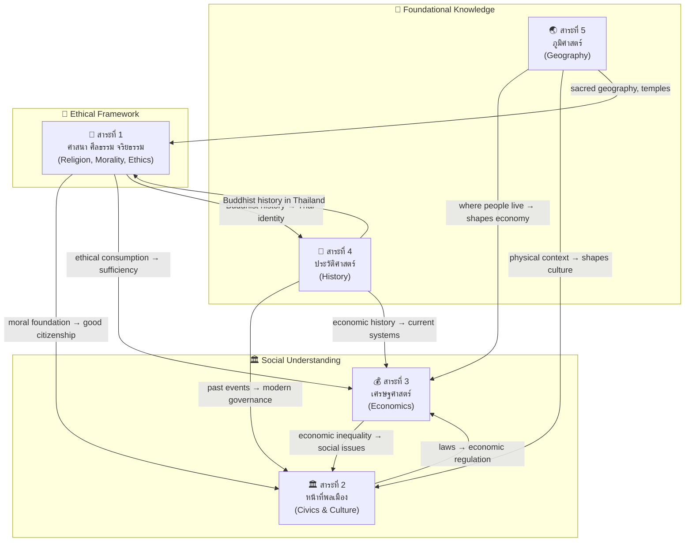

# Social Studies, Religion, and Culture — สังคมศึกษา ศาสนา และวัฒนธรรม

> **Subject Area:** Social Studies for Basic Education (ป.1–ม.6)
> **Course Codes:** ส11101–ส16101 (ป.1–6), ส21101–ส23102 (ม.1–3), ส31101–ส33102 (ม.4–6)
> **Total Strands:** 5 สาระ | **Duration:** 12 years
> **Source:** หลักสูตรแกนกลางการศึกษาขั้นพื้นฐาน พุทธศักราช 2551 (Basic Education Core Curriculum B.E. 2551, revised 2560), สำนักงานคณะกรรมการการศึกษาขั้นพื้นฐาน (สพฐ.)
> **Governing Body:** OBEC (สพฐ.) / Ministry of Education
> **Leads to:** University social science programs (law, political science, economics, history, geography, sociology), civil service exams, teaching careers

## What Is This?

Social Studies, Religion, and Culture (สังคมศึกษา ศาสนา และวัฒนธรรม) is a compulsory subject for all Thai students from ป.1 through ม.6 — twelve years of building civic literacy, moral reasoning, economic understanding, historical consciousness, and geographic awareness. Unlike science which splits into specialized tracks at ม.4, Social Studies remains **one integrated subject** for all students, organized into 5 interconnected strands (สาระ).

The curriculum serves a dual purpose unique to Thai education: it transmits academic knowledge while simultaneously cultivating moral character and responsible citizenship. The inclusion of "Religion" and "Culture" in the subject's name is deliberate — Thai education views social knowledge as inseparable from ethical development and cultural identity.

Social Studies follows a **spiral progression** model across four grade bands: core concepts are introduced simply in ป.1–3, deepened in ป.4–6, applied analytically in ม.1–3, and mastered with critical sophistication in ม.4–6.

## The 5 Strands (สาระ)

| # | Strand (สาระ) | English | Concept Areas | Core Focus |
|---|---|---|---|---|
| 🛐 **สาระที่ 1** | ศาสนา ศีลธรรม จริยธรรม | Religion, Morality, Ethics | ~18 | Buddhism, other religions, moral reasoning, meditation, ceremonies |
| 🏛️ **สาระที่ 2** | หน้าที่พลเมือง วัฒนธรรม และการดำเนินชีวิตในสังคม | Civics, Culture, and Living in Society | ~22 | Democracy, laws, rights/duties, Thai culture, ASEAN, social institutions |
| 💰 **สาระที่ 3** | เศรษฐศาสตร์ | Economics | ~16 | Scarcity/choice, sufficiency economy, production/consumption, personal finance, economic systems |
| 📜 **สาระที่ 4** | ประวัติศาสตร์ | History | ~20 | Thai history periods, world history, historical method, important figures, local history |
| 🌏 **สาระที่ 5** | ภูมิศาสตร์ | Geography | ~18 | Physical geography, human geography, maps/GIS, environment, natural disasters |

**Total: ~94 concept areas across 5 strands**

---

## 🛐 สาระที่ 1: ศาสนา ศีลธรรม จริยธรรม (Religion, Morality, Ethics)

[[01 Religion - Overview|→ Full Overview]]

The religion strand develops from simple moral lessons through systematic Buddhist doctrine to comparative religious study. Buddhism receives primary emphasis as Thailand's state religion, but students also learn about other faiths practiced in Thailand (Islam, Christianity, Hinduism, Sikhism) and globally.

### Major Concept Areas

| # | Concept Area | Thai Term | Focus |
|---|---|---|---|
| 1 | History & Importance of Buddhism | ประวัติและความสำคัญของพระพุทธศาสนา | Buddha's life, spread of Buddhism, Buddhist councils, Buddhism in Thailand |
| 2 | Buddhist Principles (ธรรมะ) | หลักธรรมทางพระพุทธศาสนา | Core doctrines: อริยสัจ 4, ขันธ์ 5, ไตรลักษณ์, กรรม, ปฏิจจสมุปบาท, มงคล 38, พรหมวิหาร 4, อิทธิบาท 4, สังคหวัตถุ 4, อบายมุข 6, โลกธรรม 8, เบญจศีล-เบญจธรรม, ฆราวาสธรรม 4, ทิศ 6, บุญกิริยาวัตถุ 10 |
| 3 | Buddhist Scripture (พระไตรปิฎก) | พระไตรปิฎกและพุทธศาสนสุภาษิต | Structure of the Tipitaka, important suttas, Buddhist proverbs (พุทธศาสนสุภาษิต) |
| 4 | Meditation & Mental Development | การฝึกสมาธิและเจริญปัญญา | สมถกรรมฐาน, วิปัสสนากรรมฐาน, อานาปานสติ, walking meditation, benefits of meditation |
| 5 | Buddhist Ceremonies & Holy Days | วันสำคัญทางพระพุทธศาสนาและศาสนพิธี | มาฆบูชา, วิสาขบูชา, อาสาฬหบูชา, เข้าพรรษา, ออกพรรษา, การเวียนเทียน, การทำบุญตักบาตร, การถวายสังฆทาน |
| 6 | Buddhist Etiquette (มารยาทชาวพุทธ) | มารยาทชาวพุทธ | Temple behavior, showing respect to monks, proper worship (การกราบ การไหว้ การประนมมือ) |
| 7 | Other Religions in Thailand | ศาสนาอื่นในประเทศไทย | Islam (หลักศรัทธา 6, หลักปฏิบัติ 5), Christianity (นิกายโรมันคาทอลิก, โปรเตสแตนต์), Hinduism (ตรีมูรติ, วรรณะ), Sikhism (ศาสดา 10 องค์, หลัก 5K) |
| 8 | Religious Ceremonies (other faiths) | ศาสนพิธีของศาสนาอื่น | Islamic prayer (ละหมาด), Eid celebrations, Christmas, Easter, Hindu festivals |
| 9 | Applying Dharma in Daily Life | การปฏิบัติตนตามหลักธรรม | Family life, school life, community, environmental ethics, social harmony |
| 10 | Religious Tolerance & Interfaith | การอยู่ร่วมกันอย่างสันติ | Respecting diversity, interfaith dialogue, constitutional religious freedom |

---

## 🏛️ สาระที่ 2: หน้าที่พลเมือง วัฒนธรรม และการดำเนินชีวิตในสังคม (Civics, Culture, and Living in Society)

[[02 Civics - Overview|→ Full Overview]]

The civics strand builds active, informed citizenship. Students learn about democratic governance under constitutional monarchy, rights and responsibilities, laws, Thai cultural heritage, social institutions, and regional cooperation through ASEAN.

### Major Concept Areas

| # | Concept Area | Thai Term | Focus |
|---|---|---|---|
| 1 | Rights & Duties of Citizens | สิทธิและหน้าที่พลเมือง | Constitutional rights, fundamental freedoms, duties of Thai citizens, children's rights, human rights |
| 2 | Democracy & Governance | การปกครองระบอบประชาธิปไตย | Democratic principles, monarchy under constitution, separation of powers (นิติบัญญัติ บริหาร ตุลาการ), elections, political participation |
| 3 | Thai Constitution & Laws | รัฐธรรมนูญและกฎหมาย | Constitutional monarchy, legal hierarchy (รัฐธรรมนูญ → พ.ร.บ. → กฎกระทรวง), types of law: criminal, civil, administrative, constitutional |
| 4 | Criminal Law | กฎหมายอาญา | Offenses, penalties, juvenile justice, legal procedures, citizen's rights when arrested |
| 5 | Civil & Family Law | กฎหมายแพ่งและครอบครัว | Contracts, property, marriage, divorce, inheritance, consumer protection |
| 6 | Government Structure | โครงสร้างการบริหารราชการ | Central administration (กระทรวง ทบวง กรม), provincial administration (จังหวัด อำเภอ), local government (อบต. เทศบาล อบจ.) |
| 7 | Social Institutions | สถาบันทางสังคม | Family, education, religion, government, economy, media — functions and interrelationships |
| 8 | Thai Culture & Traditions | วัฒนธรรมและประเพณีไทย | ศิลปวัฒนธรรม, ประเพณีไทย 4 ภาค, มารยาทไทย, การแต่งกาย, ภาษาและวรรณกรรม, วันสำคัญของชาติ |
| 9 | ASEAN Studies | การศึกษาเกี่ยวกับอาเซียน | ASEAN history, 3 pillars (ASEAN Political-Security, Economic, Socio-Cultural Community), member states, ASEAN Charter, benefits and challenges |
| 10 | Social Norms & Status | บรรทัดฐานทางสังคมและสถานภาพ | Social norms (วิถีประชา จารีต กฎหมาย), ascribed vs achieved status, social roles, social stratification |
| 11 | Socialization | การขัดเกลาทางสังคม | Agents of socialization (family, school, peers, media), direct vs indirect socialization |
| 12 | Culture & Change | วัฒนธรรมและการเปลี่ยนแปลง | Cultural diffusion, acculturation, globalization effects, preserving Thai culture, cultural diversity |
| 13 | International Relations | ความสัมพันธ์ระหว่างประเทศ | Diplomacy, international organizations (UN, WHO, WTO), global issues, Thailand's role in world affairs |

---

## 💰 สาระที่ 3: เศรษฐศาสตร์ (Economics)

[[03 Economics - Overview|→ Full Overview]]

The economics strand equips students with practical financial literacy and theoretical economic understanding. A uniquely Thai emphasis is the Sufficiency Economy Philosophy (ปรัชญาเศรษฐกิจพอเพียง) of His Majesty King Bhumibol Adulyadej, which permeates all levels.

### Major Concept Areas

| # | Concept Area | Thai Term | Focus |
|---|---|---|---|
| 1 | Scarcity & Choice | ความขาดแคลนและการเลือก | Unlimited wants vs limited resources, opportunity cost, trade-offs |
| 2 | Factors of Production | ปัจจัยการผลิต | Land, labor, capital, entrepreneurship |
| 3 | Supply & Demand | อุปสงค์และอุปทาน | Law of demand, law of supply, equilibrium price, elasticity |
| 4 | Economic Systems | ระบบเศรษฐกิจ | Traditional, command (สังคมนิยม/คอมมิวนิสต์), market (ทุนนิยม), mixed — with Thai emphasis |
| 5 | Sufficiency Economy | เศรษฐกิจพอเพียง | 3 principles (พอประมาณ มีเหตุผล มีภูมิคุ้มกัน), 2 conditions (ความรู้ คู่คุณธรรม), New Theory agriculture, application in daily life |
| 6 | Production & Consumption | การผลิตและการบริโภค | Production process, consumer behavior, consumer rights (สิทธิผู้บริโภค 5 ประการ), advertising literacy |
| 7 | Money & Banking | เงินและสถาบันการเงิน | Functions of money, types of money, banking system, Bank of Thailand, saving vs investing |
| 8 | Personal Finance | การเงินส่วนบุคคล | Budgeting, saving, debt management, financial planning, credit, taxation basics |
| 9 | Economic Indicators | ดัชนีชี้วัดเศรษฐกิจ | GDP, GNP, inflation, unemployment, balance of trade, economic cycles |
| 10 | Government & Economy | บทบาทรัฐบาลในระบบเศรษฐกิจ | Fiscal policy, monetary policy, public goods, taxation, government budget |
| 11 | International Trade | การค้าระหว่างประเทศ | Exports/imports, comparative advantage, trade barriers, FTA, globalization |
| 12 | ASEAN Economic Community | ประชาคมเศรษฐกิจอาเซียน | AEC Blueprint, free flow of goods/services/labor/capital, opportunities for Thailand |
| 13 | Economic Development | การพัฒนาเศรษฐกิจ | Developed vs developing countries, sustainable development, SDGs, Thailand 4.0 |
| 14 | Cooperatives & Community Economy | สหกรณ์และเศรษฐกิจชุมชน | Cooperative principles, types of co-ops in Thailand, community enterprises |

---

## 📜 สาระที่ 4: ประวัติศาสตร์ (History)

[[04 History - Overview|→ Full Overview]]

The history strand builds chronological understanding from personal and local history through Thai national history to world civilizations. Students learn to think like historians: evaluating sources, understanding causation, recognizing interpretation, and connecting past to present.

### Major Concept Areas

| # | Concept Area | Thai Term | Focus |
|---|---|---|---|
| 1 | Historical Method | วิธีการทางประวัติศาสตร์ | Defining history (ความหมายของประวัติศาสตร์), types of evidence (primary/secondary), source evaluation, historical thinking skills, periodization |
| 2 | Time & Chronology | เวลาและการแบ่งยุคสมัยทางประวัติศาสตร์ | Decades/centuries/eras, CE/BCE, Buddhist Era (พ.ศ.) conversion, Thai historical periodization |
| 3 | Prehistoric Thailand | ยุคก่อนประวัติศาสตร์ในดินแดนไทย | Stone Age, Metal Age, Ban Chiang, archaeological evidence |
| 4 | Sukhothai Period | อาณาจักรสุโขทัย (พ.ศ. 1792–1981) | Founding, King Ramkhamhaeng, The First Stone Inscription (ศิลาจารึกหลักที่ 1), governance (พ่อปกครองลูก), economy, culture, decline |
| 5 | Ayutthaya Period | อาณาจักรอยุธยา (พ.ศ. 1893–2310) | Founding (King U-Thong), governance (จตุสดมภ์, ศักดินา), notable kings (สมเด็จพระนเรศวรมหาราช, สมเด็จพระนารายณ์มหาราช, สมเด็จพระเจ้าตากสินมหาราช), foreign relations, arts/culture, fall of Ayutthaya |
| 6 | Thonburi Period | สมัยธนบุรี (พ.ศ. 2310–2325) | King Taksin's reunification, restoration after Ayutthaya's fall, short reign significance |
| 7 | Rattanakosin Period | สมัยรัตนโกสินทร์ (พ.ศ. 2325–ปัจจุบัน) | Founding (รัชกาลที่ 1), modernization (รัชกาลที่ 4–5), key reforms (เลิกทาส, การปฏิรูปการปกครอง), WWI/WWII period, Cold War, 1973/1976/1992 democracy movements, contemporary Thailand |
| 8 | Important Thai Monarchs | พระมหากษัตริย์ไทยที่สำคัญ | Contributions of key kings: พ่อขุนรามคำแหง, สมเด็จพระนเรศวร, สมเด็จพระนารายณ์, สมเด็จพระเจ้าตากสิน, รัชกาลที่ 1–10 |
| 9 | Thai Historical Development | พัฒนาการของชาติไทย | Political, economic, social, cultural development across periods |
| 10 | Local History | ประวัติศาสตร์ท้องถิ่น | History of student's own locality, community, province |
| 11 | Important Historical Figures | บุคคลสำคัญในประวัติศาสตร์ | Thai heroes (วีรชนไทย), notable figures in various fields |
| 12 | Ancient Civilizations | อารยธรรมโบราณ | Mesopotamia, Egypt, Indus Valley, China, Greece, Rome — key contributions |
| 13 | World History — Major Events | เหตุการณ์สำคัญของโลก | Age of Exploration, Renaissance, Reformation, Industrial Revolution, World Wars, Cold War, decolonization |
| 14 | Southeast Asian History | ประวัติศาสตร์เอเชียตะวันออกเฉียงใต้ | Early kingdoms (Funan, Srivijaya, Angkor), colonial period, independence, ASEAN formation |
| 15 | Historical Sources for Thai History | หลักฐานทางประวัติศาสตร์ไทย | Stone inscriptions, chronicles (พงศาวดาร), foreign records (Chinese, European), archaeological evidence, oral traditions |

---

## 🌏 สาระที่ 5: ภูมิศาสตร์ (Geography)

[[05 Geography - Overview|→ Full Overview]]

The geography strand develops spatial literacy from simple map reading through advanced geographic analysis using GIS and remote sensing. Students learn physical geography processes, human-environment interactions, and environmental stewardship.

### Major Concept Areas

| # | Concept Area | Thai Term | Focus |
|---|---|---|---|
| 1 | Maps & Geographic Tools | แผนที่และเครื่องมือทางภูมิศาสตร์ | Map elements, scale, direction, grid references, types of maps (physical, political, thematic), globe |
| 2 | Geographic Coordinates & Time | พิกัดภูมิศาสตร์และเวลาโลก | Latitude/longitude, time zones, International Date Line, seasons and Earth's tilt |
| 3 | GIS & Remote Sensing | ระบบสารสนเทศภูมิศาสตร์และการรับรู้จากระยะไกล | GIS components and applications, GPS, satellite imagery, aerial photography (ม.4–6) |
| 4 | Physical Geography — Landforms | ภูมิศาสตร์กายภาพ: ลักษณะภูมิประเทศ | Continents, mountains, plateaus, plains, rivers, coasts, karst topography; Thailand's physical regions |
| 5 | Physical Geography — Climate | ภูมิศาสตร์กายภาพ: ภูมิอากาศ | Climate factors, Koppen classification, climate zones, Thailand's climate (3 seasons), monsoons |
| 6 | Physical Geography — Natural Resources | ภูมิศาสตร์กายภาพ: ทรัพยากรธรรมชาติ | Soil, water, forests, minerals, energy resources; Thailand's natural resources |
| 7 | Natural Disasters | ภัยธรรมชาติ | Earthquakes, tsunamis, floods, landslides, typhoons; disaster preparedness |
| 8 | Human Geography — Population | ภูมิศาสตร์มนุษย์: ประชากร | Population distribution, density, demographic transition, population pyramids, migration |
| 9 | Human Geography — Settlement | ภูมิศาสตร์มนุษย์: การตั้งถิ่นฐาน | Rural vs urban, urbanization, city structure, primate cities (Bangkok), urban problems |
| 10 | Human Geography — Economic Activities | ภูมิศาสตร์มนุษย์: กิจกรรมทางเศรษฐกิจ | Primary/secondary/tertiary/quaternary sectors, agriculture, industry, services |
| 11 | Environment & Conservation | สิ่งแวดล้อมและการอนุรักษ์ | Environmental problems (deforestation, pollution, climate change), conservation methods, sustainable development, environmental laws |
| 12 | Thailand's Geographic Regions | ภูมิภาคของประเทศไทย | 6 regions (เหนือ, ตะวันออกเฉียงเหนือ, กลาง, ตะวันออก, ตะวันตก, ใต้) — physical features, economy, culture |
| 13 | World Geographic Regions | ภูมิภาคของโลก | Major world regions — physical and human characteristics |
| 14 | Geographic Skills | ทักษะทางภูมิศาสตร์ | Observation, data collection, analysis, interpretation, presentation (graphs, charts, maps) |

---

## Grade Band Progression — Spiral Model

Social Studies follows a spiral progression: the same 5 strands are taught at every grade band, with increasing depth, complexity, and analytical demand.

### ป.1–3 (Early Primary: Ages 6–9) — Foundation

| Strand | Focus at ป.1–3 |
|---|---|
| 🛐 Religion | Simple Buddhist stories (ชาดก), basic Buddhist etiquette (กราบ ไหว้), simple precepts (ศีล 5 in simple terms), Buddhist holy days awareness, meditation as "sitting quietly" |
| 🏛️ Civics | Family roles, school rules, simple rights/duties, national symbols (flag, anthem), polite behavior (มารยาท), Thai greetings, basic cultural practices |
| 💰 Economics | Needs vs wants, saving money (ออมสิน), simple spending decisions, family occupations, basic goods and services |
| 📜 History | Self and family timeline, significant people in own life, important days (วันสำคัญ), simple stories about local history, introduction to important Thai kings |
| 🌏 Geography | Classroom/school maps, simple directions, weather observation, local environment, seasons, natural resources in daily life, caring for the environment |

### ป.4–6 (Upper Primary: Ages 9–12) — Building

| Strand | Focus at ป.4–6 |
|---|---|
| 🛐 Religion | Buddha's biography (ประวัติพุทธสาวก พุทธสาวิกา), core doctrines (อริยสัจ 4, กรรม, อบายมุข 6, มงคล 38 intro), Buddhist scripture structure (พระไตรปิฎก overview), meditation practice (อานาปานสติ basic), Buddhist holy days in detail, other religions in Thailand (basic introduction), religious ceremonies |
| 🏛️ Civics | Rights and duties under constitution, democracy basics (ระบอบประชาธิปไตยอันมีพระมหากษัตริย์ทรงเป็นประมุข), separation of powers (simple), basic laws (criminal law intro), local government (อบต./เทศบาล), Thai culture and traditions (4 regions intro), ASEAN member states |
| 💰 Economics | Supply/demand (basic), factors of production, sufficiency economy (intro), production and consumption, money and saving, cooperatives (basic), economic principles in daily life |
| 📜 History | Thai history periods overview (Sukhothai, Ayutthaya, Thonburi, Rattanakosin), key monarchs, historical method (basic: evidence types), timeline skills (decades/centuries/eras), local history research, ancient civilizations intro |
| 🌏 Geography | Map skills (scale, direction, symbols), Thailand's physical features, climate zones, population distribution, natural resources, environmental conservation (local), basic geographic tools |

### ม.1–3 (Lower Secondary: Ages 12–15) — Analytical

| Strand | Focus at ม.1–3 |
|---|---|
| 🛐 Religion | Comprehensive Buddhist doctrine (ขันธ์ 5, ไตรลักษณ์, ปฏิจจสมุปบาท, พรหมวิหาร 4, อิทธิบาท 4, สังคหวัตถุ 4, เบญจศีล-เบญจธรรม, ฆราวาสธรรม 4, ทิศ 6), meditation practice (สมถะ-วิปัสสนา), Buddhist history and councils, other religions in detail (Islam: หลักศรัทธา 6, หลักปฏิบัติ 5; Christianity; Hinduism; Sikhism), interfaith tolerance, applying dharma to social issues |
| 🏛️ Civics | Constitutional law in detail, criminal law (types of offenses, penalties), civil law (contracts, family), government structure (administration and local government), social institutions, social norms and status, culture and social change, ASEAN in depth (3 pillars, AEC), human rights |
| 💰 Economics | Market mechanisms (supply/demand/equilibrium), economic systems comparison, sufficiency economy philosophy depth, production and consumption theory, money/banking/financial institutions, personal finance (budgeting, taxation intro), economic indicators (GDP, inflation), cooperatives and community economy |
| 📜 History | Historical method in depth (source evaluation, interpretation), detailed Thai history (each kingdom: political, economic, social, cultural development), Rattanakosin modernization, important monarchs' reigns, world history (Age of Exploration, Industrial Revolution, WWI/WWII, Cold War), Southeast Asian history, using historical evidence |
| 🌏 Geography | Physical geography of continents, climate systems, natural disasters (causes, effects, preparedness), population geography (demographic transition, migration), settlement and urbanization, economic geography, environmental issues (global), GIS introduction, reading and creating geographic data |

### ม.4–6 (Upper Secondary: Ages 15–18) — Critical

| Strand | Focus at ม.4–6 |
|---|---|
| 🛐 Religion | Advanced Buddhist philosophy (ปฏิจจสมุปบาท depth, อริยสัจ 4 with detail, กรรม and rebirth), comparative religion (theological comparison, historical development), religion and modern society (science, social problems, ethics), meditation as practice (regular practice, retreat understanding), Buddhist role in Thai society and global Buddhism, critical analysis of religious issues |
| 🏛️ Civics | Constitutional law and political philosophy, international law and human rights, Thai legal system in depth (court system, legal procedures), political ideologies, international relations, globalization and Thai society, ASEAN community analysis, social problems analysis, civil society and participation, media literacy and digital citizenship |
| 💰 Economics | Microeconomics (elasticity, market structures, market failure), macroeconomics (fiscal/monetary policy depth, economic development), international economics (trade theory, FDI, exchange rates), sufficiency economy as development model, sustainable development and SDGs, Thai economy analysis, personal financial planning |
| 📜 History | Historical methodology (historiography, schools of thought), Thai history analysis (critical interpretation of sources, historical debate), world civilizations comparison, 20th–21st century world history, Cold War in Southeast Asia, Thailand's role in world history, research project using historical method, analyzing historical evidence critically |
| 🌏 Geography | Advanced physical geography (plate tectonics, geomorphology), climatology and climate change science, advanced human geography (urban systems, globalization geography), GIS and remote sensing applications, environmental management and policy, sustainable development geography, geographic research methods, Thailand's geographic challenges |

---

## How the 5 Strands Interconnect



**Key interconnections:**

| Connection | Description |
|---|---|
| **Religion → Civics** | Buddhist moral principles (ศีลธรรม) form the ethical basis for Thai citizenship. Concepts like สังคหวัตถุ 4 (principles of social service) and ทิศ 6 (six directions of social responsibility) directly shape civic behavior. The ideal Thai citizen is both law-abiding AND morally upright. |
| **Religion → Economics** | Sufficiency Economy (เศรษฐกิจพอเพียง) is explicitly grounded in Buddhist principles of moderation (มัชฌิมาปฏิปทา) and contentment (สันโดษ). Buddhist economics rejects unbounded materialism, promoting balanced consumption. |
| **Religion → History** | Thailand's religious history IS its cultural history. Buddhism arrived via Indian missionaries in the 3rd century BCE, shaped Sukhothai's golden age (via Lankan Theravada), and has been a legitimizing force for every Thai kingdom. Major monuments (temples, stupas) are primary historical evidence. |
| **History → Civics** | Modern Thai governance (constitutional monarchy, democracy) evolved through historical processes: absolute monarchy → 1932 revolution → constitutional monarchy → democratic development. Understanding Thai laws requires understanding their historical origins. |
| **History → Economics** | Thailand's economic trajectory (agrarian → industrializing → middle-income) is a historical narrative. Trade patterns established during Ayutthaya (with China, Japan, Europe) set foundations for modern international trade. |
| **Geography → Economics** | Geographic features determine economic activities: the Central Plains = rice bowl, the South = rubber and tin, the Northeast = plateau agriculture, the North = forest products and tourism. Geographic constraints shape economic policy. |
| **Geography → Civics** | Regional geography shapes regional cultures and identities (วัฒนธรรม 4 ภาค). Geographic isolation or connectivity influences cultural diffusion. ASEAN is fundamentally a geographic entity before it is political. |
| **Geography → Religion** | Sacred geography: major Buddhist sites (พุทธมณฑล, Doi Suthep, Wat Phra That Phanom) define religious regions. Muslim concentration in the South reflects historical geography of the Malay Peninsula. |

---

## Course Code System for Social Studies

Social Studies uses the prefix **ส** (from สังคมศึกษา):

| Level | Code Range | Grade | Example |
|---|---|---|---|
| ป.1 | ส11101 | Primary 1 | ส11101 สังคมศึกษา 1 |
| ป.2 | ส12101 | Primary 2 | ส12101 สังคมศึกษา 2 |
| ป.3 | ส13101 | Primary 3 | ส13101 สังคมศึกษา 3 |
| ป.4 | ส14101 | Primary 4 | ส14101 สังคมศึกษา 4 |
| ป.5 | ส15101 | Primary 5 | ส15101 สังคมศึกษา 5 |
| ป.6 | ส16101 | Primary 6 | ส16101 สังคมศึกษา 6 |
| ม.1 | ส21101–ส21105 | Lower Sec 1 | ส21101 สังคมศึกษา 1 (เทอม 1), ส21102 (เทอม 2) |
| ม.2 | ส22101–ส22105 | Lower Sec 2 | ส22101 สังคมศึกษา 3, ส22102 สังคมศึกษา 4 |
| ม.3 | ส23101–ส23105 | Lower Sec 3 | ส23101 สังคมศึกษา 5, ส23102 สังคมศึกษา 6 |
| ม.4 | ส31101–ส31105 | Upper Sec 1 | ส31101 สังคมศึกษา 1, ส31102 สังคมศึกษา 2 |
| ม.5 | ส32101–ส32105 | Upper Sec 2 | ส32101 สังคมศึกษา 3, ส32102 สังคมศึกษา 4 |
| ม.6 | ส33101–ส33105 | Upper Sec 3 | ส33101 สังคมศึกษา 5, ส33102 สังคมศึกษา 6 |

**Code breakdown:** ส = Social Studies, first digit = level (1=primary, 2=lower secondary, 3=upper secondary), second digit = grade within level, third digit = stream (1=main stream), last two digits = course sequence (01–05 per year, reflecting the 5 strands each getting course time).

**Note on course code variants:** At ม.1–ม.6 level, some schools split the subject into separate courses per strand (e.g., ส21101 = Religion, ส21102 = Civics, ส21103 = Economics, ส21104 = History, ส21105 = Geography). The standard practice is to integrate all 5 strands within each course.

---

## Reading Paths

### By Strand Focus

- **Religion & Ethics path:** 01 Religion → connect to Civics (citizenship application) and History (historical context)
- **Law & Government path:** 02 Civics → connect to History (constitutional history) and Economics (public finance)
- **Economics & Business path:** 03 Economics → connect to Geography (resource economics) and Civics (economic law)
- **History path:** 04 History → connect to Civics (political development) and Religion (Buddhist history)
- **Geography & Environment path:** 05 Geography → connect to Economics (development geography) and Civics (environmental law)

### By Grade Level

- **Full sequence (ป.1→ม.6):** All 5 strands in spiral progression — each strand deepens every grade band
- **Primary focus (ป.1–6):** Strands 1 and 2 (character building + cultural identity) → 5 (local geography) → 3 (basic economics) → 4 (Thai history overview)
- **Secondary focus (ม.1–6):** Strands 1 and 2 (advanced doctrine + active citizenship) → 4 (analytical history) → 3 (economic theory) → 5 (advanced geography)

### By Career Interest

- **Law/Political Science:** 02 Civics → 04 History → 01 Religion (moral foundations of law)
- **Economics/Business/Finance:** 03 Economics → 05 Geography (economic geography) → 02 Civics (business law)
- **History/Archaeology/Museum Studies:** 04 History → 01 Religion (Buddhist art and archaeology) → 05 Geography (historical geography)
- **Geography/Environmental Science/Urban Planning:** 05 Geography → 03 Economics (development) → 02 Civics (policy)
- **Teaching/Civil Service:** All 5 strands equally — balanced knowledge required for government exams

---

## Key Standardized Tests

| Test | Thai Name | When | Content |
|---|---|---|---|
| **NT** (National Test) | การทดสอบระดับชาติ | ป.3 | Basic social understanding |
| **O-NET** (Ordinary National Educational Test) | การทดสอบทางการศึกษาระดับชาติขั้นพื้นฐาน | ป.6, ม.3, ม.6 | All 5 strands: religion, civics, economics, history, geography |
| **A-Level สังคมศึกษา** | วิชาสามัญ สังคมศึกษา (TGAT/TPAT era) | ม.6 (university entrance) | Advanced: Buddhist doctrine, law, economics, Thai/world history, geography |
| **การสอบ ก.พ.** | Civil service exam | Post-graduation | All 5 strands + current events |
| **การสอบครูผู้ช่วย** | Teacher licensing exam | Post-graduation | Social studies pedagogy and content knowledge across all 5 strands |

---

## Vault Structure

```
Social Studies/
├── Social Studies - Overview.md        ← This file
├── 01 Religion/
│   └── 01 Religion - Overview.md
├── 02 Civics/
│   └── 02 Civics - Overview.md
├── 03 Economics/
│   └── 03 Economics - Overview.md
├── 04 History/
│   └── 04 History - Overview.md
└── 05 Geography/
    └── 05 Geography - Overview.md
```

---

## Related

- [[Body of Knowledge - Overview|← Back to Body of Knowledge]]
- [[Thai Language - Overview|Thai Language]] — Thai language study supports all social studies reading and writing
- [[English - Overview|English]] — English enables access to international social science sources
- [[00_Fundamental Mathematics - Overview|Mathematics]] — Statistical literacy supports economics and geography
- [[00_Fundamental Science - Overview|Science]] — Scientific method parallels historical method; environmental science connects to geography
- **OBEC Textbooks:** Published by various Thai publishers (อักษรเจริญทัศน์, พ.ศ.พัฒนา, สกสค., etc.) per OBEC curriculum standards
