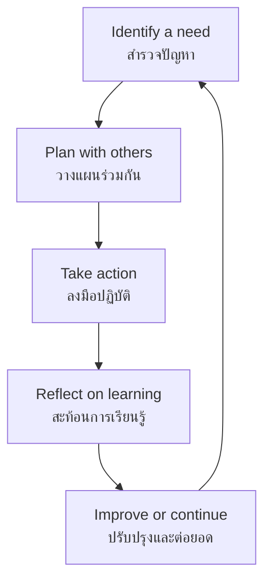

# Social and Public Benefit Activities — กิจกรรมเพื่อสังคมและสาธารณประโยชน์

> **Component:** กิจกรรมพัฒนาผู้เรียน → กิจกรรมเพื่อสังคมและสาธารณประโยชน์
> **Scope:** ป.1–ม.6
> **Purpose:** Service, responsibility, participation, and connection with the community

## Overview

Social and Public Benefit Activities give students opportunities to contribute to their school, community, and society. They turn values such as responsibility, compassion, cooperation, and environmental care into action. The activity may be organized as a separate project or integrated into student activities, depending on the school's curriculum.

This component is **service learning**, not simply unpaid work. A meaningful activity connects a real community need with student planning, action, reflection, and learning.

---

## Activity Areas

| # | Activity area | Thai | Typical development |
|---|---|---|---|
| 01 | Self and school responsibility | ความรับผิดชอบต่อตนเองและโรงเรียน | Care, reliability, shared spaces |
| 02 | Community service | การบำเพ็ญประโยชน์ต่อชุมชน | Helping local people and organizations |
| 03 | Environmental service | การอนุรักษ์สิ่งแวดล้อม | Waste reduction, water, trees, biodiversity |
| 04 | Public-interest projects | โครงการเพื่อสาธารณประโยชน์ | Responding to broader social needs |
| 05 | Reflection and citizenship | การสะท้อนการเรียนรู้และความเป็นพลเมือง | Connecting action to values and society |

---

## Service-Learning Cycle

---

## Grade-Band Progression

| Grade band | Main emphasis | Possible activities |
|---|---|---|
| **ป.1–3** | Helping, care, simple responsibility, learning to contribute | Classroom care, school garden, keeping shared spaces clean |
| **ป.4–6** | Team service, local environment, responsibility for a task | Recycling, tree planting, helping school events, local clean-up |
| **ม.1–3** | Planned projects, community needs, evidence and reflection | Community survey, environmental project, service campaign |
| **ม.4–6** | Leadership, sustained projects, civic participation, evaluation | Partnership with community organizations, public-interest research, mentoring |

---

## Project Design Elements

| Element | Thai | Guiding question |
|---|---|---|
| Need | ความต้องการของชุมชน | What real issue needs attention? |
| Stakeholders | ผู้มีส่วนเกี่ยวข้อง | Who is affected or can help? |
| Goal | เป้าหมาย | What change do we hope to make? |
| Action | การปฏิบัติ | What will students actually do? |
| Safety | ความปลอดภัย | What risks must be managed? |
| Evidence | หลักฐาน | How will we know what happened? |
| Reflection | การสะท้อนคิด | What did we learn and how did we change? |
| Continuity | ความต่อเนื่อง | How can the work continue? |

---

## Possible Project Themes

| Theme | Thai | Examples |
|---|---|---|
| Environment | สิ่งแวดล้อม | Waste separation, water conservation, tree care |
| School community | โรงเรียน | Library support, welcoming younger students |
| Elderly support | ผู้สูงอายุ | Visits, digital help, oral-history projects |
| Disaster preparedness | การเตรียมพร้อมภัยพิบัติ | Safety information, emergency kits, drills |
| Public health | สุขภาพชุมชน | Hygiene communication, active-living campaign |
| Local culture | วัฒนธรรมท้องถิ่น | Documenting traditions, supporting local events |

---

## Progress Tracker

| # | Topic | Status | File | Notes |
|---|---|---|---|---|
| 01 | Self and School Responsibility | ✅ Done | `01_Self_and_School_Responsibility.md` | |
| 02 | Community Service | ✅ Done | `02_Community_Service.md` | |
| 03 | Environmental Service | ✅ Done | `03_Environmental_Service.md` | |
| 04 | Public-Interest Projects | ✅ Done | `04_Public_Interest_Projects.md` | |
| 05 | Reflection and Citizenship | ✅ Done | `05_Reflection_and_Citizenship.md` | |

**Completion: 5/5 (100%) ✅**

---

## Implementation Note

The national framework identifies this as one of the three forms of Learner Development Activities. The school may schedule it independently or integrate it into student activities such as Scouts/Girl Guides. Therefore, the exact hours, projects, and documentation vary by school.

## Sources

- [OBEC Basic Education Core Curriculum training document](https://academic.obec.go.th/download/obec_book_teacher/basic_education_core_curriculum/051-022_Chut%20Fuek%20oprom%20Laksut.pdf): identifies กิจกรรมเพื่อสังคมและสาธารณประโยชน์ as a form of Learner Development Activities
- [OBEC lower-secondary curriculum structure](https://academic.obec.go.th/images/document/1512621740.pdf): illustrates that public-benefit activities may be integrated into student activities
- [OBEC curriculum document hub](https://academic.obec.go.th/web/news/view/75): official curriculum and related documents

## Related

- [[Student Development Activities - Overview|← Student Development Activities]]
- [[01 Guidance/00_overview|Guidance and Counseling]]
- [[02 Student Activities/00_overview|Student Activities]]
- [[../../Social Studies/Social Studies - Overview|Social Studies]] — citizenship, society, and environment
- [[../../Science/00_Fundamental Science - Overview|Fundamental Science]] — environmental and community projects
- [[../../Health and PE/Health and PE - Overview|Health and Physical Education]] — public health and safety

> **Parent-child conversation:** Ask what community need the student noticed, what they contributed, what they learned from other people, and what should happen next.