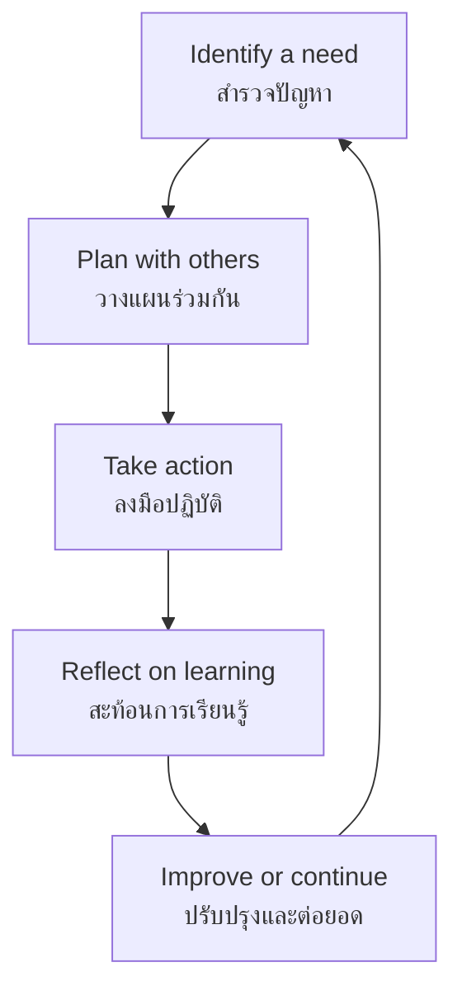

# Public-Interest Projects — โครงการเพื่อสาธารณประโยชน์

> *"A public-interest project turns a good intention into a planned, sustained, and reflected-upon action."*

Public-Interest Projects are structured, student-led initiatives that respond to broader social needs. They go beyond simple service by incorporating planning, stakeholder engagement, evidence, reflection, and continuity. These projects are most common at ม.1–ม.6.

---

## 1 | Grade Band Breakdown

| Grade | Key Content |
|---|---|
| **ป.1–3** | Participating in teacher-led service activities |
| **ป.4–6** | Small group service projects with teacher guidance |
| **ม.1–3** | Student-planned projects: needs survey, planning, implementation, reflection |
| **ม.4–6** | Sustained community partnerships, project evaluation, evidence-based improvement, mentoring |

---

## 2 | Project Design Elements

| Element | Thai | Guiding question |
|---|---|---|
| Need | ความต้องการของชุมชน | What real issue needs attention? |
| Stakeholders | ผู้มีส่วนเกี่ยวข้อง | Who is affected or can help? |
| Goal | เป้าหมาย | What change do we hope to make? |
| Action | การปฏิบัติ | What will students actually do? |
| Safety | ความปลอดภัย | What risks must be managed? |
| Evidence | หลักฐาน | How will we know what happened? |
| Reflection | การสะท้อนคิด | What did we learn and how did we change? |
| Continuity | ความต่อเนื่อง | How can the work continue? |

---

## 3 | Service-Learning Cycle

---

## 4 | Possible Project Themes

| Theme | Thai | Examples |
|---|---|---|
| Environment | สิ่งแวดล้อม | Waste separation, water conservation, tree care |
| School community | โรงเรียน | Library support, welcoming younger students |
| Elderly support | ผู้สูงอายุ | Visits, digital help, oral-history projects |
| Disaster preparedness | การเตรียมพร้อมภัยพิบัติ | Safety information, emergency kits, drills |
| Public health | สุขภาพชุมชน | Hygiene communication, active-living campaign |
| Local culture | วัฒนธรรมท้องถิ่น | Documenting traditions, supporting local events |

---

## 5 | Thai Terminology

| Thai | English |
|---|---|
| โครงการเพื่อสาธารณประโยชน์ | Public-interest project |
| ความต้องการของชุมชน | Community need |
| ผู้มีส่วนเกี่ยวข้อง | Stakeholders |
| เป้าหมาย | Goal |
| การปฏิบัติ | Action |
| การสะท้อนคิด | Reflection |
| ความต่อเนื่อง | Continuity |

---

## 6 | Real-World Examples

- **Dengue prevention campaign** — Students survey mosquito breeding sites and educate community
- **Oral history project** — ม.4–6 students interview elderly community members
- **Disaster preparedness kit** — Students assemble emergency kits for vulnerable households
- **School composting system** — Designing and maintaining a food-waste composting system

---

## 7 | Cross-Links

- [[00_overview|← Social and Public Benefit Overview]]
- [[03_Environmental_Service|Environmental Service]] — Conservation projects
- [[05_Reflection_and_Citizenship|Reflection and Citizenship]] — Project reflection
