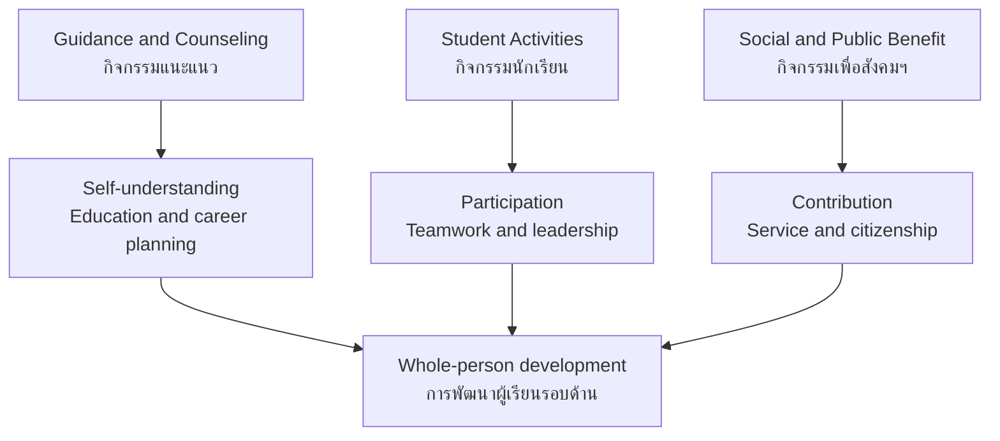

# Student Development Activities — กิจกรรมพัฒนาผู้เรียน

> **Curriculum component:** กิจกรรมพัฒนาผู้เรียน
> **Scope:** ป.1–ม.6
> **Position:** Separate from the 8 academic learning areas
> **Purpose:** Develop the learner as a whole person through guidance, participation, leadership, service, and life experience

## What Is This?

The Thai Basic Education Core Curriculum contains **8 academic learning areas** and a separate required component called **Learner Development Activities** (กิจกรรมพัฒนาผู้เรียน). It is not a ninth academic subject and is not limited to examination knowledge.

These activities give students opportunities to understand themselves, plan their education and careers, cooperate with others, develop leadership, practice life skills, and contribute to their school and community. The national framework defines the three forms, while each school develops its own detailed schedule and implementation.

---

## The Three Forms

| # | Form | Thai | Main purpose | Overview |
|---|---|---|---|---|
| 01 | Guidance and Counseling | กิจกรรมแนะแนว | Educational, career, personal, and social development | [[01 Guidance/00_overview|→ Overview]] |
| 02 | Student Activities | กิจกรรมนักเรียน | Teamwork, discipline, interests, leadership, participation | [[02 Student Activities/00_overview|→ Overview]] |
| 03 | Social and Public Benefit | กิจกรรมเพื่อสังคมและสาธารณประโยชน์ | Service, responsibility, community participation | [[03 Social and Public Benefit/00_overview|→ Overview]] |

---

## Grade-Band Progression

| Grade band | Guidance | Student activities | Public benefit |
|---|---|---|---|
| **ป.1–3** | Self-awareness, school adjustment, social skills, career awareness | Cooperation, rules, simple group activities | Helping, school care, simple environmental care |
| **ป.4–6** | Study habits, interests, basic career awareness | Scout skills, teamwork, responsibility, outdoor awareness | Local service and environmental projects |
| **ม.1–3** | Self-exploration, interests/aptitudes, upper-secondary or vocational pathways | Leadership, clubs, Scouts or alternative groups | Planned service projects and reflection |
| **ม.4–6** | Higher-education planning, career preparation, personal/social well-being | Clubs, leadership, school projects; Scout continuation is school-dependent | Community engagement and service learning |

---

## How the Three Forms Connect

---

## What Parents May Notice at School

| School experience | Likely curriculum form |
|---|---|
| A guidance period with a guidance teacher | กิจกรรมแนะแนว |
| Scouts, Girl Guides, camping, knots, outdoor activities | กิจกรรมนักเรียน |
| Clubs and student-interest groups | กิจกรรมนักเรียน |
| Student council or student leadership | กิจกรรมนักเรียน |
| School clean-up, tree planting, community work | กิจกรรมเพื่อสังคมและสาธารณประโยชน์ |
| Career-interest activity or education-pathway discussion | กิจกรรมแนะแนว |

---

## National Framework vs School Implementation

| National framework | School-level variation |
|---|---|
| Defines the three forms of Learner Development Activities | Chooses detailed activities and timetable |
| Sets the developmental purpose | Assigns guidance teachers, homeroom teachers, or support teams |
| Recognizes Scouts/Girl Guides and other student activities | Decides whether students continue Scouts at upper-secondary level |
| Requires participation and evaluation according to the curriculum | Designs local projects, clubs, and service activities |

**Important:** The number of guidance teachers, exact hours, club list, Scout continuation, and project format are school-level matters. They should not be treated as identical nationwide requirements.

---

## Progress Tracker

| Component | Overview | Topic notes | Status |
|---|---|---|---|
| Guidance and Counseling | ✅ Created | Not yet created | Overview complete |
| Student Activities | ✅ Created | Not yet created | Overview complete |
| Social and Public Benefit | ✅ Created | Not yet created | Overview complete |

**Overview completion: 3/3 components (100%)**

---

## Sources

1. [OBEC curriculum document hub](https://academic.obec.go.th/web/news/view/75): official Basic Education Core Curriculum and related documents, including the Learner Development Activities guideline.
2. [OBEC Basic Education Core Curriculum training document](https://academic.obec.go.th/download/obec_book_teacher/basic_education_core_curriculum/051-022_Chut%20Fuek%20oprom%20Laksut.pdf): identifies the three forms: Guidance, Student Activities, and Social/Public Benefit Activities.
3. [OBEC lower-secondary curriculum structure](https://academic.obec.go.th/images/document/1512621740.pdf): example of school-level scheduling for guidance, Scouts/Girl Guides, clubs, and public-benefit work.
4. [OBEC Guidance Development Group](http://www.guidestudent.obec.go.th/): official guidance vision and grade-level educational/career/personal/social development emphasis.
5. [OBEC Guidance Development Plan and Guidelines](http://www.guidestudent.obec.go.th/?p=1071): guidance planning resource for basic education.

## Related

- [[Body of Knowledge - Overview|← Body of Knowledge]]
- [[01 Guidance/00_overview|Guidance and Counseling Activities]]
- [[02 Student Activities/00_overview|Student Activities]]
- [[03 Social and Public Benefit/00_overview|Social and Public Benefit Activities]]
- [[../../Arts/Arts - Overview|Arts]] — creativity and clubs
- [[../../Health and PE/Health and PE - Overview|Health and Physical Education]] — well-being, safety, life skills
- [[../../Career and Technology/Career and Technology - Overview|Career and Technology]] — practical and career development
- [[../../Social Studies/Social Studies - Overview|Social Studies]] — citizenship, society, and culture

> **Parent-child communication:** This area is especially useful for asking what a child is discovering, practicing, leading, and contributing. It is part of education even when it does not appear as a conventional academic subject.