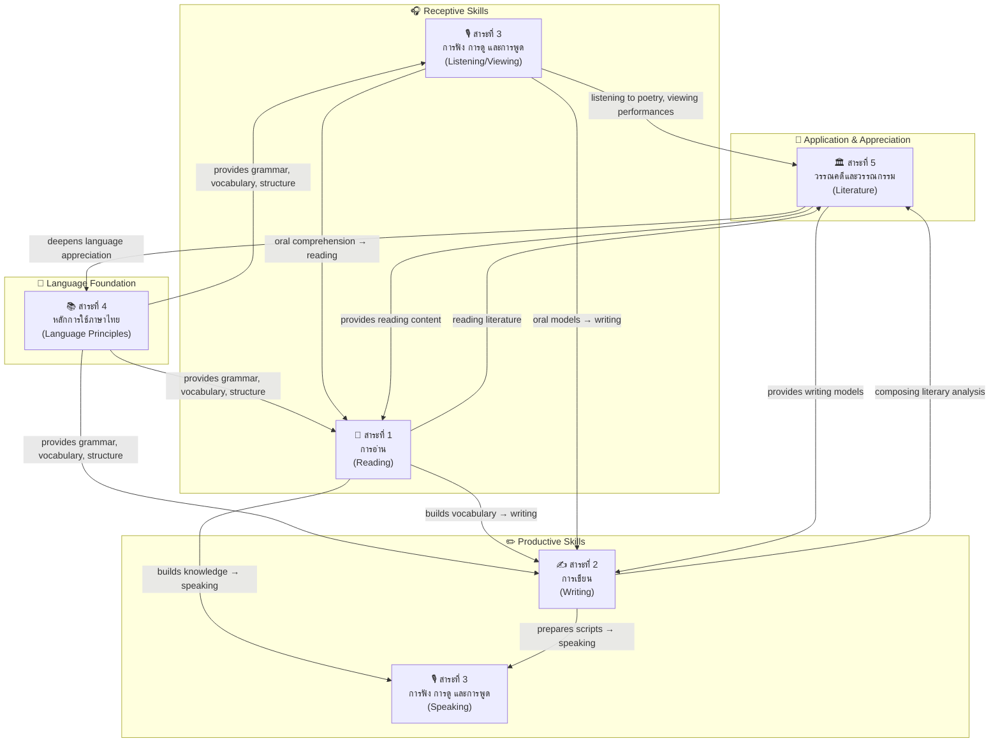

# Thai Language — ภาษาไทย

> **Subject Area:** Thai Language for Basic Education (ป.1–ม.6)
> **Course Codes:** ท11101–ท16101 (ป.1–6), ท21101–ท23102 (ม.1–3), ท31101–ท33102 (ม.4–6)
> **Total Concept Areas:** ~25 | **Duration:** 12 years
> **Source:** หลักสูตรแกนกลางการศึกษาขั้นพื้นฐาน พุทธศักราช 2551 (Basic Education Core Curriculum B.E. 2551, revised 2560), สำนักงานคณะกรรมการการศึกษาขั้นพื้นฐาน (สพฐ.)
> **Governing Body:** OBEC (สพฐ.) / Ministry of Education
> **Leads to:** University Thai language courses, Thai for careers (teaching, journalism, translation)

## What Is This?

Thai Language (ภาษาไทย) is the compulsory mother-tongue subject for all Thai students from ป.1 through ม.6 — twelve years of building literacy, communication skills, language mastery, and literary appreciation. Unlike math-science subjects which split into specialized tracks at ม.4, Thai remains **one integrated subject** for all students across all grade levels, organized into 5 interconnected strands (สาระ).

The curriculum follows a **spiral progression** model: the same core skills (reading, writing, listening/speaking, language principles, literature) are revisited at each grade band with increasing depth and complexity. A ป.1 student learns to read simple words; by ม.6, that same student analyzes classical literature and writes formal academic essays.

## The 5 Strands (สาระ)

| # | Strand (สาระ) | English | Concept Areas | Core Skill |
|---|---|---|---|---|
| 📖 **สาระที่ 1** | การอ่าน | Reading | ~6 | Decoding → comprehension → analysis → critique |
| ✍️ **สาระที่ 2** | การเขียน | Writing | ~8 | Penmanship → composition → formal/academic writing |
| 🎙️ **สาระที่ 3** | การฟัง การดู และการพูด | Listening, Viewing, and Speaking | ~6 | Reception → interpretation → expression → presentation |
| 📚 **สาระที่ 4** | หลักการใช้ภาษาไทย | Principles of Thai Language Usage | ~8 | Sound system → word classes → syntax → registers |
| 🏛️ **สาระที่ 5** | วรรณคดีและวรรณกรรม | Literature | ~7 | Folk tales → heritage literature → literary criticism |

**Total: ~35 sub-concept areas across 5 strands**

---

## 📖 สาระที่ 1: การอ่าน (Reading)

The reading strand develops from basic decoding through analytical and critical reading. Students progress from reading aloud simple words to interpreting complex literary works and digital media.

### Concept Areas

| # | Concept Area | Thai Term | Focus |
|---|---|---|---|
| 1 | Reading Aloud | การอ่านออกเสียง | Phonics, intonation, oral fluency, reading poetry with rhythm (ทำนองเสนาะ) |
| 2 | Reading for Main Ideas | การอ่านจับใจความ | Identifying main ideas, supporting details, summarizing |
| 3 | Analytical Reading | การอ่านวิเคราะห์ | Distinguishing fact from opinion, analyzing text structure, identifying author's purpose |
| 4 | Interpretive Reading | การอ่านตีความ | Inferring meaning, interpreting figurative language, understanding subtext |
| 5 | Critical Reading | การอ่านเชิงวิจารณ์ | Evaluating arguments, detecting bias, assessing credibility, forming judgments |
| 6 | Reading for Research | การอ่านเพื่อศึกษาค้นคว้า | Using reference materials, skimming/scanning, synthesizing multiple sources |
| 7 | Reading Signs & Symbols | การอ่านเครื่องหมายและสัญลักษณ์ | Traffic signs, maps, charts, graphs, infographics, icons |
| 8 | Reading Etiquette | มารยาทในการอ่าน | Reading habits, caring for books, respecting intellectual property |

### Grade Band Progression

| Concept Area | ป.1–3 (Early Primary) | ป.4–6 (Upper Primary) | ม.1–3 (Lower Secondary) | ม.4–6 (Upper Secondary) |
|---|---|---|---|---|
| **Reading Aloud** | Read aloud simple words, phrases, short sentences with correct pronunciation | Read aloud prose and poetry (ร้อยแก้ว, ร้อยกรอง) with proper rhythm; observe punctuation | Read aloud with ทำนองเสนาะ (poetic recitation); read drama scripts with expression | Read aloud complex poetry in all forms (กลอน, โคลง, ฉันท์, กาพย์, ร่าย) with mastery of rhythm |
| **Reading for Main Ideas** | Identify main idea from short stories (20-50 words); answer simple questions | Summarize longer passages (100-300 words); identify topic sentences; answer inferential questions | Summarize articles, news, and informational texts; distinguish main ideas from supporting details | Summarize academic and literary texts; synthesize key ideas from multiple sources |
| **Analytical Reading** | Distinguish characters and events in stories | Separate fact from opinion; identify cause and effect; recognize author's point of view | Analyze text structure (problem-solution, chronological, compare-contrast); identify persuasive techniques | Analyze argumentation, rhetorical devices, and literary techniques; evaluate logical consistency |
| **Interpretive Reading** | Understand simple implied meanings (from pictures and context) | Interpret figurative language (similes, metaphors); understand idioms (สำนวนไทย) | Interpret symbolism, themes, and author's message in literary works | Interpret complex literary works; analyze subtext, allegory, and multiple layers of meaning |
| **Critical Reading** | — | Make simple judgments about characters' actions | Evaluate arguments; identify propaganda and persuasive techniques in media | Full critical analysis: evaluate credibility of sources, detect logical fallacies, assess bias, form evidence-based judgments |
| **Reading for Research** | — | Use table of contents, index, glossary; find information in reference books | Use libraries, databases, search engines; take notes from multiple sources; evaluate source reliability | Advanced research skills: literature review, academic referencing, synthesizing diverse sources, evaluating primary vs. secondary sources |
| **Reading Signs & Symbols** | Read simple signs (stop, exit, restroom); basic pictograms | Read maps, bus/train schedules, simple charts and graphs | Read complex graphs, statistical charts, infographics; interpret technical diagrams | Read and interpret complex data visualizations, scientific graphs, technical schematics |
| **Reading Etiquette** | Hold books correctly; turn pages carefully; return books | Develop regular reading habits; visit libraries; care for books | Respect copyright; cite sources properly; avoid plagiarism | Intellectual property ethics; critical media literacy; digital citizenship in reading |

---

## ✍️ สาระที่ 2: การเขียน (Writing)

The writing strand develops from basic handwriting and spelling through creative, expository, and academic writing. Students learn to write for different purposes, audiences, and contexts.

### Concept Areas

| # | Concept Area | Thai Term | Focus |
|---|---|---|---|
| 1 | Handwriting / Penmanship | การคัดลายมือ | Correct letter formation; writing legibly in Thai script |
| 2 | Spelling | การเขียนสะกดคำ | Correct spelling of Thai words; understanding spelling rules |
| 3 | Creative Writing | การเขียนเรื่องตามจินตนาการ | Writing stories, poems, creative pieces from imagination |
| 4 | Essay Writing | การเขียนเรียงความ | Structured composition: introduction, body, conclusion |
| 5 | Summary Writing | การเขียนย่อความ / การสรุปความ | Condensing longer texts while preserving key ideas |
| 6 | Letter Writing | การเขียนจดหมาย | Personal letters (จดหมายส่วนตัว), business letters (จดหมายกิจธุระ), formal letters |
| 7 | Report Writing | การเขียนรายงาน | Research-based writing with citations and structure |
| 8 | Explanatory / Expository Writing | การเขียนอธิบาย / ชี้แจง | Explaining processes, giving instructions, clarifying information |
| 9 | Argumentative / Persuasive Writing | การเขียนโต้แย้ง / แสดงความคิดเห็น | Stating opinions, providing evidence, constructing arguments |
| 10 | Writing Etiquette & Digital Writing | มารยาทในการเขียน / การเขียนในสื่อดิจิทัล | Appropriate tone; writing for social media, blogs, digital platforms |

### Grade Band Progression

| Concept Area | ป.1–3 (Early Primary) | ป.4–6 (Upper Primary) | ม.1–3 (Lower Secondary) | ม.4–6 (Upper Secondary) |
|---|---|---|---|---|
| **Handwriting** | Form all 44 consonants, 32 vowels, tone marks correctly; practice daily คัดลายมือ | Write fluently and legibly; develop personal handwriting style; write at reasonable speed | — (handwriting assumed mastered) | — |
| **Spelling** | Spell common words using basic spelling rules; recognize and write คำที่มีตัวการันต์ (silent marker words) | Master spelling rules for words with tricky consonants (e.g., ฑ, ฒ, ณ); spell คำควบกล้ำ (consonant clusters); use dictionary | Advanced spelling: คำสมาส, คำสนธิ, words from Pali/Sanskrit; correct spelling in formal writing | Mastery of all spelling conventions; editing and proofreading skills |
| **Creative Writing** | Write short stories from pictures (3-5 sentences); create simple captions | Write short imaginative stories (50-100 words); create comic strips with dialogue | Write creative stories (200-300 words); write poetry (กลอนสี่, กลอนสุภาพ, กาพย์ยานี 11) | Write full short stories; compose poetry in multiple forms (กลอน, โคลง, ฉันท์, กาพย์, ร่าย); create scripts |
| **Essay Writing** | — | Write short compositions (50-100 words) with beginning, middle, end | Write structured essays (200-300 words) with introduction, body paragraphs, conclusion; use โวหาร (writing styles) | Write formal academic essays (500+ words); master all 5 โวหาร: บรรยายโวหาร, พรรณนาโวหาร, เทศนาโวหาร, สาธกโวหาร, อุปมาโวหาร |
| **Summary Writing** | — | Summarize short passages (50 words → 15-20 words) | Summarize articles, excerpts from literature; capture main ideas accurately | Summarize academic articles, research, speeches; produce executive summaries |
| **Letter Writing** | Write simple greeting cards and short notes to family | Write personal letters (จดหมายส่วนตัว); address envelopes correctly | Write business letters (จดหมายกิจธุระ); formal invitations; letters of request/complaint | Write formal letters, application letters (จดหมายสมัครงาน), letters to officials, professional correspondence |
| **Report Writing** | — | Write simple one-page reports from observation (e.g., field trip report) | Write structured reports (2-3 pages) with references; use library and internet sources | Write academic research reports with proper citation format; include bibliography; produce term papers |
| **Explanatory Writing** | — | Write simple instructions (e.g., how to make something); explain a process in steps | Write explanations of concepts; describe processes with diagrams; write procedural texts | Write technical explanations, manuals, user guides; explain abstract concepts clearly |
| **Argumentative Writing** | — | Express simple opinions in writing with one reason | Write persuasive paragraphs; state position with 2-3 supporting reasons with evidence | Write formal argumentative essays; use rhetorical strategies; address counterarguments; cite evidence |
| **Writing Etiquette & Digital** | Write politely; use appropriate greetings (ครับ/ค่ะ) | Write appropriately for different audiences; learn basic email etiquette | Write appropriate social media posts; understand digital footprint; avoid cyberbullying in writing | Professional digital communication; writing for blogs, online publications; ethical considerations in digital writing |

---

## 🎙️ สาระที่ 3: การฟัง การดู และการพูด (Listening, Viewing, and Speaking)

This strand develops receptive skills (listening and viewing/visual literacy) and productive skills (speaking). Students learn to comprehend, analyze, and produce oral communication for various purposes and audiences.

### Concept Areas

| # | Concept Area | Thai Term | Focus |
|---|---|---|---|
| 1 | Listening for Main Ideas | การฟังจับใจความ | Understanding spoken messages, identifying key points |
| 2 | Analytical Listening | การฟังวิเคราะห์ | Analyzing spoken content, distinguishing fact from opinion in speech |
| 3 | Critical Listening | การฟังอย่างมีวิจารณญาณ | Evaluating credibility, detecting bias in spoken messages |
| 4 | Viewing & Media Literacy | การดูวิเคราะห์สื่อ | Analyzing visual media: films, ads, news, social media |
| 5 | Speaking to Express Opinions | การพูดแสดงความคิดเห็น | Stating views, participating in discussions |
| 6 | Speech for Various Occasions | การพูดในโอกาสต่างๆ | Formal speeches, presentations, ceremonial speaking |
| 7 | Conversation & Discussion | การสนทนาและอภิปราย | Dialogue skills, group discussion, debate |
| 8 | Listening/Viewing/Speaking Etiquette | มารยาทในการฟัง การดู และการพูด | Politeness, turn-taking, appropriate register in oral communication |

### Grade Band Progression

| Concept Area | ป.1–3 (Early Primary) | ป.4–6 (Upper Primary) | ม.1–3 (Lower Secondary) | ม.4–6 (Upper Secondary) |
|---|---|---|---|---|
| **Listening for Main Ideas** | Listen to short stories (1-2 minutes); answer who/what/where questions | Listen to longer narratives (3-5 minutes); summarize orally; identify sequence of events | Listen to news broadcasts, announcements, talks (5-10 minutes); take notes; identify main ideas | Listen to lectures, academic talks, documentaries; synthesize information; take structured notes |
| **Analytical Listening** | — | Distinguish fact from opinion in spoken messages; identify speaker's emotion/intent | Analyze persuasive speeches; identify techniques used (appeal to emotion, authority, logic) | Analyze complex arguments; identify rhetorical strategies and logical fallacies in speech |
| **Critical Listening** | — | — | Evaluate credibility of speakers; detect bias in news and advertising | Full critical listening: evaluate evidence, detect manipulation, assess speaker's agenda |
| **Viewing & Media Literacy** | Watch and retell simple cartoons/stories | View and analyze advertisements; distinguish fantasy from reality in media | Analyze films, TV programs, news; identify camera techniques, editing, visual persuasion | Advanced media literacy: analyze film language, propaganda techniques, social media influence, digital manipulation |
| **Speaking to Express Opinions** | Answer simple questions about likes/dislikes | Express opinions on familiar topics with simple reasons | Participate in group discussions; express and defend opinions with reasons and evidence | Deliver persuasive arguments; participate in formal debates; handle Q&A effectively |
| **Speech for Various Occasions** | Introduce oneself; greet appropriately; say thank you/apologize | Give short oral reports (2-3 minutes); tell stories expressively | Deliver prepared speeches (3-5 minutes); give formal presentations with visual aids; MC (พิธีกร) basic events | Deliver formal speeches: welcome speeches, farewell speeches, ceremonial speeches; present academic/research findings; professional presentations |
| **Conversation & Discussion** | Greet and respond; ask and answer simple questions; take turns speaking | Conduct telephone conversations; participate in class discussions; ask follow-up questions | Participate in group discussions; lead small group conversations; practice informal debate | Lead panel discussions; moderate group conversations; participate in formal debates; negotiate and build consensus |
| **Etiquette** | Wait for turn to speak; use ครับ/ค่ะ; polite listening posture | Active listening signals (nodding, eye contact); appropriate volume and tone | Professional telephone etiquette; public speaking etiquette; respectful disagreement | Formal meeting etiquette; intercultural communication awareness; professional presentation demeanor |

---

## 📚 สาระที่ 4: หลักการใช้ภาษาไทย (Principles of Thai Language Usage)

This strand is the backbone of Thai language study — understanding how the language works at the levels of sound, word, sentence, and discourse. It covers phonology, morphology (word classes and word formation), syntax, semantics, and pragmatics (registers).

### Concept Areas

| # | Concept Area | Thai Term | Focus |
|---|---|---|---|
| 1 | Nature of Language | ธรรมชาติของภาษา | Language as a system; power of language; language change |
| 2 | Thai Sound System | ระบบเสียงในภาษาไทย | Consonants (อักษรสูง กลาง ต่ำ), vowels, tones, syllables |
| 3 | Parts of Speech (Word Classes) | ชนิดของคำ | Seven word classes: noun, pronoun, verb, modifier, preposition, conjunction, interjection |
| 4 | Word Formation | การสร้างคำ | Compound words (ประสม), elaborated words (ซ้อน), reduplicated words (ซ้ำ), Pali/Sanskrit compounds (สมาส), euphonic combinations (สนธิ) |
| 5 | Phrases and Sentences | วลีและประโยค | Phrases, simple sentences, compound sentences, complex sentences |
| 6 | Language Registers | ระดับภาษา | Formal, semi-formal, colloquial, slang; official language |
| 7 | Royal Vocabulary | ราชาศัพท์ | Words and grammar for speaking about/to the royal family |
| 8 | Writing Styles (โวหาร) | โวหารการเขียน | Five modes of discourse: narrative, descriptive, exhortative, illustrative, comparative |
| 9 | Dialects | ภาษาถิ่น | Regional dialects of Thailand (เหนือ, อีสาน, ใต้); language diversity |
| 10 | Dictionary & Reference Usage | การใช้พจนานุกรมและหนังสืออ้างอิง | Using Thai dictionaries, encyclopedias, and language references |

### Grade Band Progression

| Concept Area | ป.1–3 (Early Primary) | ป.4–6 (Upper Primary) | ม.1–3 (Lower Secondary) | ม.4–6 (Upper Secondary) |
|---|---|---|---|---|
| **Nature of Language** | — | — | Basic understanding: language as a communication system; language change over time | Deep understanding: power of language; language and identity; language and culture; language policy |
| **Sound System** | Learn all 44 consonants, 32 vowels, 4 tone marks; basic spelling-sound correspondence | Master consonant classes (อักษรสูง-กลาง-ต่ำ) and tone rules; understand live/dead syllables (คำเป็น-คำตาย) | — (sound system mastered; applied in reading and spelling) | Apply phonological knowledge to poetry composition and literary analysis |
| **Parts of Speech** | Basic nouns (คำนาม: people, things, places) and verbs (คำกริยา: actions) | All 7 word classes: คำนาม, คำสรรพนาม, คำกริยา, คำวิเศษณ์, คำบุพบท, คำสันธาน, คำอุทาน; identify function in sentences | Deepen: classify sub-types of each word class (e.g., คำกริยาสกรรม/อกรรม — transitive/intransitive verbs; คำวิเศษณ์บอกเวลา/สถานที่/ลักษณะ — adverbs of time/place/manner) | Advanced: function words, grammatical analysis, understanding how word classes operate in different registers |
| **Word Formation** | — | คำประสม (compound words), คำซ้อน (elaborated/paired words for emphasis), คำซ้ำ (reduplicated words for plurality or softening) | คำสมาส (Pali-Sanskrit compound words following Pali/Sanskrit sandhi rules), คำสนธิ (euphonic combination of words) | Mastery of all word formation types; analysis of etymology; understanding of borrowing from Pali, Sanskrit, Khmer, English |
| **Phrases & Sentences** | Simple sentences (ประโยคความเดียว): subject + verb (+ object) | Compound sentences (ประโยคความรวม) using conjunctions; expand simple sentences with modifiers | Complex sentences (ประโยคความซ้อน) with dependent clauses (นามานุประโยค, คุณานุประโยค, วิเศษณานุประโยค); sentence analysis (การวิเคราะห์ประโยค) | Advanced syntax: embedding, nominalization, sentence variety for stylistic effect; analyzing sentence structure in literature |
| **Language Registers** | — | Basic awareness: polite vs. casual speech (ครับ/ค่ะ); appropriate language for school, home, temple | Five registers: ภาษาทางการ (formal), ภาษากึ่งทางการ (semi-formal), ภาษาพูด (colloquial), ภาษาปาก (slang), ภาษาระดับพิธีการ (ceremonial); choosing appropriate register | Mastery of registers; code-switching; analyzing register in literature and media; understanding social dimensions of language |
| **Royal Vocabulary** | — | Basic royal vocabulary: common royal nouns and verbs (e.g., เสวย, บรรทม, พระราชทาน) | Systematic royal vocabulary: nouns, verbs, pronouns for royalty; royal grammar patterns; use in formal writing about royalty | Advanced royal vocabulary and ceremonial language; analyzing royal language in classical literature (e.g., ลิลิตพระลอ, มัทนะพาธา) |
| **Writing Styles (โวหาร)** | — | Recognize and produce basic narrative (บรรยายโวหาร) and descriptive writing (พรรณนาโวหาร) | All 5 โวหาร: บรรยายโวหาร (narrative), พรรณนาโวหาร (descriptive), เทศนาโวหาร (exhortative/persuasive), สาธกโวหาร (illustrative/exemplification), อุปมาโวหาร (comparative/analogy) | Mastery of all 5 โวหาร; blending styles in complex writing; analyzing โวหาร in literary works |
| **Dialects** | — | Awareness that different regions speak differently; recognize common words from local dialect | Study of major dialects: ภาษาเหนือ (คำเมือง), ภาษาอีสาน (ลาว), ภาษาใต้ (ปักษ์ใต้); phonological and lexical differences | Deeper study of dialectology; language variation; relationship between standard Thai and regional dialects; language preservation |
| **Dictionary Usage** | — | Use a simple Thai dictionary (พจนานุกรมฉบับราชบัณฑิตยสถาน); find word meanings and spellings | Efficient dictionary use; understand dictionary conventions (etymology, word class labels, usage notes); use online dictionaries | Use advanced references: etymological dictionaries, specialized dictionaries (royal vocabulary, dialect dictionaries), corpus linguistics resources |

---

## 🏛️ สาระที่ 5: วรรณคดีและวรรณกรรม (Literature)

The literature strand exposes students to Thailand's rich literary heritage — from folk tales and classical masterpieces to contemporary award-winning works. Students learn to appreciate, analyze, and critically engage with literary texts, and to understand the cultural and historical contexts that shaped them.

### Concept Areas

| # | Concept Area | Thai Term | Focus |
|---|---|---|---|
| 1 | Folk Tales & Oral Literature | นิทานและวรรณกรรมมุขปาฐะ | Folk tales, legends, Aesop's fables, Jataka tales |
| 2 | Heritage Literature | วรรณคดีมรดก | Classical Thai literary masterpieces (canonical works) |
| 3 | Contemporary Literature | วรรณกรรมปัจจุบัน | Modern novels, short stories, poetry (including S.E.A. Write / ซีไรต์ winners) |
| 4 | Recitation (อาขยาน) | บทอาขยาน | Memorized recitation pieces from classical literature |
| 5 | Folk Songs & Oral Traditions | เพลงพื้นบ้านและวรรณกรรมท้องถิ่น | Regional folk songs (เพลงพื้นบ้าน), lullabies, local literary traditions |
| 6 | Literary Analysis | การวิเคราะห์วรรณคดี | Analyzing themes, characters, plot, setting, literary devices |
| 7 | Literary Criticism | วรรณกรรมวิจารณ์ | Critical evaluation of literary works; understanding literary theory (ม.4–6) |
| 8 | Prosody (ฉันทลักษณ์) | ฉันทลักษณ์ | The rules and patterns of Thai poetry: กลอน, โคลง, ฉันท์, กาพย์, ร่าย |

### Canonical Literary Works by Grade Band

| Grade Band | Works Studied | Type | Key Details |
|---|---|---|---|
| **ป.1–3** | นิทานอีสป (Aesop's Fables) | Folk tale | Selected tales: The Tortoise and the Hare, The Ant and the Grasshopper, etc. — teaches morals |
| | นิทานพื้นบ้าน (Thai Folk Tales) | Oral literature | Stories like: ศรีธนญชัย (trickster tales), หัวล้านนอกครู, ตำนานพื้นบ้านต่างๆ |
| | เพลงกล่อมเด็ก (Lullabies) | Folk song | Traditional lullabies: เจ้าเนื้อละมุน, วัดเอ๋ยวัดโบสถ์ |
| | บทร้อยกรองง่ายๆ (Simple poetry) | Poetry | Short rhyming verses, counting rhymes, children's poems |
| **ป.4–6** | สังข์ทอง | Classical literature | Selected episodes: ตอนกำเนิดพระสังข์, ตอนตีคลี, ตอนจับนางรจนา — from ปัญญาสชาดก |
| | พระอภัยมณี | Classical literature | Selected episodes: ตอนหนีนางผีเสื้อสมุทร, ตอนพบนางเงือก — by สุนทรภู่ |
| | ราชาธิราช | Historical literature | Selected episodes: ตอนสมิงพระรามอาสา — translated from Mon chronicle |
| | บทอาขยาน from various works | Recitation | Selected passages from classical works for memorization |
| | เพลงพื้นบ้าน (Folk Songs) | Folk tradition | เพลงฉ่อย, เพลงอีแซว, เพลงเรือ, เพลงเกี่ยวข้าว |
| **ม.1–3** | รามเกียรติ์ | Classical epic | Selected episodes: ตอนศึกกุมภกรรณ, ตอนนารายณ์ปราบนนทก — Thai version of Ramayana by พระบาทสมเด็จพระพุทธยอดฟ้าจุฬาโลก (รัชกาลที่ 1) |
| | อิเหนา | Classical drama | Selected episodes: ตอนศึกกะหมังกุหนิง — Javanese-derived tale by พระบาทสมเด็จพระพุทธเลิศหล้านภาลัย (รัชกาลที่ 2) |
| | ขุนช้างขุนแผน | Epic poem (เสภา) | Selected episodes: ตอนขุนช้างถวายฎีกา, ตอนกำเนิดพลายงาม — the great Thai epic of love and war |
| | สามก๊ก | Historical novel | Selected episodes: ตอนกวนอูไปรับราชการกับโจโฉ — Chinese classic, translated by เจ้าพระยาพระคลัง (หน) |
| | นิราศภูเขาทอง | นิราศ poetry | Full work — by สุนทรภู่, the great poet |
| | กลอนดอกสร้อยรำพึงในป่าช้า | Poetry | Selected stanzas — translated from Elegy Written in a Country Churchyard by Thomas Gray |
| | บทเสภาสามัคคีเสวก | เสภา poetry | By ชิต บุรทัต — teaches values of unity and service |
| | ศิลาจารึกพ่อขุนรามคำแหง | Historical inscription | Excerpts — the first known Thai writing (Sukhothai period) |
| | วรรณกรรมร่วมสมัย (Contemporary) | Modern literature | Selected short stories and novels by Thai authors |
| **ม.4–6** | มหาเวสสันดรชาดก | Buddhist literature | กัณฑ์มัทรี, กัณฑ์มหาพน — the last Jataka tale, most celebrated Thai religious literary work |
| | ลิลิตพระลอ | ลิลิต poetry | Full work — a tragic love story, masterpiece of ลิลิต form (alternating ร่าย and โคลง) |
| | นิราศนรินทร์ | นิราศ poetry | Full work — by นายนรินทรธิเบศร์ (อิน), celebrated for its poetic craft |
| | มัทนะพาธา | Verse drama | Full work — by พระบาทสมเด็จพระมงกุฎเกล้าเจ้าอยู่หัว (รัชกาลที่ 6), influenced by Sanskrit drama |
| | กาพย์เห่เรือ | กาพย์ poetry | By เจ้าฟ้าธรรมาธิเบศร (เจ้าฟ้ากุ้ง) — exquisite craft in กาพย์ form |
| | โคลงโลกนิติ | โคลง poetry | Didactic poetry containing worldly wisdom, derived from Sanskrit nīti literature |
| | สามัคคีเภทคำฉันท์ | ฉันท์ poetry | By ชิต บุรทัต — based on Buddhist story teaching the dangers of disunity |
| | เสภาสามัคคีเสวก (full work) | เสภา poetry | Complete work with deeper analysis |
| | วรรณกรรมร่วมสมัย (Contemporary) | Modern literature | Novels and short stories, including S.E.A. Write Award (ซีไรต์) winners; works by national artists (ศิลปินแห่งชาติ) |
| | วรรณกรรมวิจารณ์ (Literary Criticism) | Criticism | Understanding literary criticism as a genre; reading critical essays |
| | บทละครพูด / บทละครรำ | Drama | Modern Thai drama; traditional dance-drama scripts |

### Grade Band Progression

| Concept Area | ป.1–3 (Early Primary) | ป.4–6 (Upper Primary) | ม.1–3 (Lower Secondary) | ม.4–6 (Upper Secondary) |
|---|---|---|---|---|
| **Folk Tales & Oral Literature** | Listen to and retell folk tales; identify characters and moral lessons | Read folk tales independently; compare similar tales from different regions; write simple responses | Study folk literature as cultural heritage; analyze narrative structure, motifs, and cultural values | Analyze folk literature through literary/cultural theory; compare Thai folk tales with international folk tale traditions |
| **Heritage Literature** | — | Read adapted/simplified excerpts from classical works; understand basic plot and characters | Read original text excerpts (some adapted); analyze themes, historical context, literary value | Read original texts in full; deep literary analysis; understand historical, social, and political contexts; compare works across periods |
| **Contemporary Literature** | — | Read age-appropriate contemporary stories; discuss themes | Read selected contemporary novels and short stories; analyze themes, characters, social commentary | Read and critically analyze major contemporary works; understand literary movements; read S.E.A. Write winners and works by national artists |
| **Recitation (อาขยาน)** | Memorize and recite short poems (4-8 lines); perform with simple gestures | Memorize and recite longer passages (8-16 lines); perform with appropriate emotion and rhythm | Recite passages from classical literature with ทำนองเสนาะ mastery; understand the meaning behind memorized text | Recite extended passages from major works; perform dramatic readings; appreciate the oral tradition of Thai literature |
| **Folk Songs & Oral Traditions** | Sing simple folk songs; participate in call-and-response songs | Learn regional folk songs; understand their cultural context and occasions of performance | Study folk song forms: เพลงฉ่อย, เพลงอีแซว, เพลงเรือ, ลำตัด, หมอลำ; understand improvisation tradition | Analyze folk songs as living literature; understand oral composition; study relationship between folk songs and classical literature |
| **Literary Analysis** | Identify characters, setting, and plot sequence | Analyze character traits, identify themes; distinguish narrator from author | Analyze plot structure, character development, literary devices (symbolism, irony, metaphor); identify author's purpose and worldview | Full literary analysis: structural analysis, thematic analysis, intertextuality, historical/biographical criticism, basic literary theory |
| **Literary Criticism** | — | — | Basic evaluation: express and support judgments about literary quality | Full literary criticism: write critical essays; apply critical frameworks; understand schools of criticism; evaluate literary merit with evidence |
| **Prosody (ฉันทลักษณ์)** | Recite simple rhyming verses; feel the rhythm of poetry | Understand basic rhyme schemes (กลอนสี่, กลอนหก); compose simple poems | Study major forms: กลอนสุภาพ (8-syllable), โคลงสี่สุภาพ, กาพย์ยานี 11, กาพย์ฉบัง 16, กาพย์สุรางคนางค์ 28; compose in each form | Master all Thai poetic forms: กลอน (all types), โคลง (2, 3, 4), ฉันท์ (all varieties — อินทรวิเชียรฉันท์, วสันตดิลกฉันท์, ฯลฯ), กาพย์ (all types), ร่าย (ร่ายยาว, ร่ายสุภาพ, ร่ายดั้น, ร่ายโบราณ); analyze how form serves meaning |

---

## Key Terminology — คำศัพท์สำคัญทางภาษาไทย

### Parts of Speech (ชนิดของคำ)

| Thai | English | Definition |
|---|---|---|
| คำนาม | Noun | Names a person, place, thing, or idea |
| คำสรรพนาม | Pronoun | Replaces a noun (I, you, he, she, it, we, they) |
| คำกริยา | Verb | Expresses action or state of being |
| คำวิเศษณ์ | Modifier (Adjective/Adverb) | Describes or modifies nouns, verbs, or other modifiers |
| คำบุพบท | Preposition | Shows relationship between words (in, on, at, from, for) |
| คำสันธาน | Conjunction | Connects words, phrases, or clauses |
| คำอุทาน | Interjection | Expresses emotion (oh!, ah!, alas!) |

### Word Formation (การสร้างคำ)

| Thai | English | Definition | Example |
|---|---|---|---|
| คำประสม | Compound word | Two or more words combined to create new meaning | พ่อ+แม่ → พ่อแม่ (parents) |
| คำซ้อน | Elaborated/pair word | Two words of similar meaning paired for emphasis or breadth | บ้านช่อง (home), ทรัพย์สิน (assets) |
| คำซ้ำ | Reduplicated word | Word repeated for plurality, softening, or emphasis | เด็กๆ (children), ดีๆ (really good) |
| คำสมาส | Pali/Sanskrit compound | Words borrowed from Pali/Sanskrit, following Pali-Sanskrit sandhi (linking) rules | ราช+บัณฑิต → ราชบัณฑิต |
| คำสนธิ | Euphonic combination | Words combined with vowel changes for smooth pronunciation | กิริย+อาการ → กิริยาการ |

### Language Registers (ระดับภาษา)

| Thai | English | Context |
|---|---|---|
| ภาษาระดับพิธีการ | Ceremonial/Ritual language | Royal ceremonies, religious rituals, formal state occasions |
| ภาษาทางการ | Formal language | Official documents, academic writing, news reports |
| ภาษากึ่งทางการ | Semi-formal language | Business meetings, formal presentations, professional settings |
| ภาษาพูด / ภาษาสนทนา | Colloquial/Conversational language | Everyday conversation, casual settings |
| ภาษาปาก | Slang/Vernacular | Informal, intimate settings; constantly evolving |
| ราชาศัพท์ | Royal vocabulary | Words specifically used for or about the monarchy |

### Prosody (ฉันทักษณ์)

| Thai Form | English Description | Key Features |
|---|---|---|
| กลอน | Verse (rhymed) | The most common poetic form; based on rhyme and syllable count; includes กลอนสุภาพ (8-syllable), กลอนสี่ (4-syllable), กลอนหก (6-syllable), กลอนดอกสร้อย, กลอนสักวา |
| โคลง | Poetic form (tone-based) | Unique to Thai; combines syllable count, tone marks (เอก-โท), and rhyme; most famous: โคลงสี่สุภาพ, also โคลงสอง, โคลงสาม |
| ฉันท์ | Metered poetry (Pali/Sanskrit-derived) | Based on heavy/light syllable patterns (ครุ-ลหุ); many subtypes: อินทรวิเชียรฉันท์, วสันตดิลกฉันท์, มาลินีฉันท์, ฯลฯ |
| กาพย์ | Poetic form | Based on syllable count per line; includes: กาพย์ยานี 11, กาพย์ฉบัง 16, กาพย์สุรางคนางค์ 28 |
| ร่าย | Poetic form (recitative) | Continuous flowing form with rhyme at the end of each segment; types: ร่ายยาว, ร่ายสุภาพ, ร่ายดั้น, ร่ายโบราณ |

### Reading Skills

| Thai | English |
|---|---|
| การอ่านออกเสียง | Reading aloud |
| การอ่านจับใจความ | Reading for main ideas |
| การอ่านวิเคราะห์ | Analytical reading |
| การอ่านตีความ | Interpretive reading |
| การอ่านเชิงวิจารณ์ | Critical reading |
| การอ่านเพื่อศึกษาค้นคว้า | Reading for research |

### Writing Types (การเขียนประเภทต่างๆ)

| Thai | English |
|---|---|
| การเขียนเรียงความ | Essay writing |
| การเขียนย่อความ | Summary writing |
| การเขียนจดหมายส่วนตัว | Personal letter writing |
| การเขียนจดหมายกิจธุระ | Business letter writing |
| การเขียนรายงาน | Report writing |
| การเขียนบันทึก | Note/journal writing |
| การเขียนอธิบาย | Explanatory writing |
| การเขียนโต้แย้ง | Argumentative writing |
| การเขียนเชิงสร้างสรรค์ | Creative writing |

### Writing Styles (โวหาร)

| Thai | English | Purpose |
|---|---|---|
| บรรยายโวหาร | Narrative discourse | To tell a story or relate events |
| พรรณนาโวหาร | Descriptive discourse | To describe sensory details |
| เทศนาโวหาร | Exhortative/Persuasive discourse | To persuade, advise, or exhort |
| สาธกโวหาร | Illustrative discourse | To illustrate with examples |
| อุปมาโวหาร | Comparative discourse | To compare or use analogy |

### Types of Sentences (ชนิดของประโยค)

| Thai | English | Structure |
|---|---|---|
| ประโยคความเดียว | Simple sentence | One independent clause |
| ประโยคความรวม | Compound sentence | Two or more independent clauses joined by conjunctions |
| ประโยคความซ้อน | Complex sentence | One independent clause + one or more dependent clauses |

### Dependent Clause Types

| Thai | English | Function |
|---|---|---|
| นามานุประโยค | Noun clause | Functions as a noun in the sentence |
| คุณานุประโยค | Adjective clause | Modifies a noun |
| วิเศษณานุประโยค | Adverb clause | Modifies a verb, adjective, or adverb |

---

## How the 5 Strands Interconnect

**Key relationships:**

- **สาระที่ 4 (Language Principles)** is the **foundation** — without understanding how Thai works (sounds, words, sentences, registers), none of the other strands are possible
- **สาระที่ 1 and 3 (Reading + Listening/Viewing)** are **receptive skills** — they develop in parallel, each reinforcing the other
- **สาระที่ 2 and 3 (Writing + Speaking)** are **productive skills** — built upon receptive skills and language principles
- **สาระที่ 5 (Literature)** is the **capstone** — where all four other strands come together: students read literature (สาระ 1), analyze it using language knowledge (สาระ 4), write about it (สาระ 2), and discuss it (สาระ 3)

---

## Thai Language Components — Detailed Structure

### 1. Thai Sound System (ระบบเสียงในภาษาไทย)

#### Consonants (พยัญชนะ) — 44 letters, 21 distinct sounds

| Class | Letters | Count |
|---|---|---|
| อักษรสูง (High class) | ข, ฃ, ฉ, ฐ, ถ, ผ, ฝ, ศ, ษ, ส, ห | 11 |
| อักษรกลาง (Middle class) | ก, จ, ฎ, ฏ, ด, ต, บ, ป, อ | 9 |
| อักษรต่ำ (Low class) | ค, ฅ, ฆ, ง, ช, ซ, ฌ, ญ, ฑ, ฒ, ณ, ท, ธ, น, พ, ฟ, ภ, ม, ย, ร, ล, ว, ฬ, ฮ | 24 |

#### Vowels (สระ) — 32 forms, 21 distinct sounds

- Short vowels (สระเสียงสั้น): อะ, อิ, อึ, อุ, เอะ, แอะ, โอะ, เอาะ, เออะ, เอียะ, เอือะ, อัวะ, ฤ, ฦ
- Long vowels (สระเสียงยาว): อา, อี, อือ, อู, เอ, แอ, โอ, ออ, เออ, เอีย, เอือ, อัว, ฤๅ, ฦๅ
- Diphthongs: เอีย, เอือ, อัว

#### Tones (วรรณยุกต์) — 5 tones

| Tone | Thai Name | Example (กา) | English Description |
|---|---|---|---|
| สามัญ | Mid tone | กา (kaa) | Mid level |
| เอก | Low tone | ก่า (kàa) | Low level |
| โท | Falling tone | ก้า (kâa) | High to low falling |
| ตรี | High tone | ก๊า (káa) | High level |
| จัตวา | Rising tone | ก๋า (kǎa) | Low to high rising |

#### Tone Rules (การผันวรรณยุกต์)
Tone is determined by three factors:
1. **Consonant class** (สูง/กลาง/ต่ำ)
2. **Syllable type** (คำเป็น — live syllable ending in sonorant/long vowel; คำตาย — dead syllable ending in stop/short vowel)
3. **Tone mark** (ไม้เอก ่, ไม้โท ้, ไม้ตรี ๊, ไม้จัตวา ๋)

### 2. Word Classes (ชนิดของคำ) — Detailed

| # | Class | Thai | Function | Sub-types |
|---|---|---|---|---|
| 1 | Noun | คำนาม | Names things | สามานยนาม (common), วิสามานยนาม (proper), ลักษณนาม (classifier), สมุหนาม (collective), อาการนาม (abstract/gerund) |
| 2 | Pronoun | คำสรรพนาม | Replaces nouns | บุรุษสรรพนาม (personal), ประพันธสรรพนาม (relative), วิภาคสรรพนาม (distributive), นิยมสรรพนาม (demonstrative), อนิยมสรรพนาม (indefinite), ปฤจฉาสรรพนาม (interrogative) |
| 3 | Verb | คำกริยา | Expresses action/state | สกรรมกริยา (transitive), อกรรมกริยา (intransitive), วิกตรรถกริยา (verb requiring complement), กริยานุเคราะห์ (auxiliary) |
| 4 | Modifier | คำวิเศษณ์ | Describes/modifies | วิเศษณ์บอกลักษณะ (manner), บอกเวลา (time), บอกสถานที่ (place), บอกจำนวน (quantity), บอกคำถาม (interrogative), บอกความชี้เฉพาะ (demonstrative) |
| 5 | Preposition | คำบุพบท | Shows relationship | บอกสถานที่ (place), บอกเวลา (time), บอกความเป็นเจ้าของ (possession) |
| 6 | Conjunction | คำสันธาน | Connects | เชื่อมความคล้อยตาม (additive), เชื่อมความขัดแย้ง (adversative), เชื่อมความเป็นเหตุเป็นผล (causal), เชื่อมความเลือก (alternative) |
| 7 | Interjection | คำอุทาน | Expresses emotion | อุทานแสดงอารมณ์ (emotional), อุทานเสริมบท (emphatic), อุทานประกอบกิริยาท่าทาง (gestural) |

### 3. Word Formation (การสร้างคำ) — Detailed

| Type | Thai | Description | Pattern | Example |
|---|---|---|---|---|
| คำประสม | Compound | 2+ Thai words combined, meaning derives from parts | Word + Word | พ่อตา (father-in-law: father + maternal grandfather), เครื่องบิน (airplane: machine + fly) |
| คำซ้อน | Elaborated pair | 2 words with similar meaning paired | Synonym + Synonym | บ้านเรือน (house + house = home), ทรัพย์สิน (property + assets = assets) |
| คำซ้ำ | Reduplication | Same word repeated, changes meaning | Word × 2 | เด็กๆ (children = plural), ดีๆ (very good = emphasis), ไปๆ มาๆ (eventually) |
| คำสมาส | Pali/Sanskrit compound | Words from Pali/Sanskrit, following sandhi rules; no tone mark on first element; reads as single word | P/S word + P/S word | ราชการ (royal + work = government service), วัฒนธรรม (existence + prosperity = culture) |
| คำสนธิ | Euphonic combination | Words combined with vowel change for smooth sound | Word + vowel change + word | กิริยา + อาการ → กิริยาการ, มหา + อรรณพ → มหรรณพ |

### 4. Language Registers (ระดับภาษา) — Detailed

| Level | Thai | Usage Context | Features |
|---|---|---|---|
| พิธีการ | Ceremonial/Ritual | Royal ceremonies, religious rites, state functions | Highly formal, formulaic, includes ราชาศัพท์ and religious vocabulary |
| ทางการ | Formal | Official documents, academic papers, news, textbooks | Standard grammar, no colloquialisms, precise vocabulary |
| กึ่งทางการ | Semi-formal | Business meetings, professional presentations, formal interviews | Mostly standard with some colloquial elements; polite but not rigid |
| สนทนา / พูด | Conversational | Daily life, family, friends, informal settings | Colloquial vocabulary, sentence particles (ครับ/ค่ะ/จ๊ะ/นะ), contractions |
| ปาก | Slang / Vernacular | Very informal, peer groups, youth culture | Slang, shortened words, code-mixing with English, constantly evolving |

### 5. Royal Vocabulary (ราชาศัพท์)

A complete system of vocabulary for referring to the monarch and royal family, including:
- **Nouns** for body parts: พระเนตร (eyes), พระกรรณ (ears), พระโอษฐ์ (mouth)
- **Verbs** for actions: เสวย (eat), บรรทม (sleep), พระราชดำเนิน (walk/go)
- **Pronouns**: พระองค์, ใต้ฝ่าละอองธุลีพระบาท, ฝ่าพระบาท
- **Everyday objects**: ฉลองพระองค์ (clothes), พระแท่น (bed), พระเก้าอี้ (chair)

---

## Course Code System for Thai Language

Thai Language uses the prefix **ท** (from ภาษาไทย):

| Level | Code Range | Grade | Example |
|---|---|---|---|
| ป.1 | ท11101 | Primary 1 | ท11101 ภาษาไทย 1 |
| ป.2 | ท12101 | Primary 2 | ท12101 ภาษาไทย 2 |
| ป.3 | ท13101 | Primary 3 | ท13101 ภาษาไทย 3 |
| ป.4 | ท14101 | Primary 4 | ท14101 ภาษาไทย 4 |
| ป.5 | ท15101 | Primary 5 | ท15101 ภาษาไทย 5 |
| ป.6 | ท16101 | Primary 6 | ท16101 ภาษาไทย 6 |
| ม.1 | ท21101–ท21102 | Lower Sec 1 | ท21101 ภาษาไทย 1 (เทอม 1), ท21102 (เทอม 2) |
| ม.2 | ท22101–ท22102 | Lower Sec 2 | ท22101 ภาษาไทย 3, ท22102 ภาษาไทย 4 |
| ม.3 | ท23101–ท23102 | Lower Sec 3 | ท23101 ภาษาไทย 5, ท23102 ภาษาไทย 6 |
| ม.4 | ท31101–ท31102 | Upper Sec 1 | ท31101 ภาษาไทย 1, ท31102 ภาษาไทย 2 |
| ม.5 | ท32101–ท32102 | Upper Sec 2 | ท32101 ภาษาไทย 3, ท32102 ภาษาไทย 4 |
| ม.6 | ท33101–ท33102 | Upper Sec 3 | ท33101 ภาษาไทย 5, ท33102 ภาษาไทย 6 |

**Code breakdown:** ท = Thai language, first digit = level (1=primary, 2=lower secondary, 3=upper secondary), second digit = grade within level, third digit = stream (1=main stream), last two digits = course sequence.

---

## Reading Paths

- **Full sequence (ป.1→ม.6):** Start from any entry point; the curriculum is designed as a continuous spiral
- **Primary focus (ป.1–6):** สาระ 4 (พื้นฐานภาษา) → สาระ 1 (การอ่าน) → สาระ 2 (การเขียน) → สาระ 3 (การฟัง/พูด) → สาระ 5 (วรรณคดีพื้นฐาน)
- **Secondary focus (ม.1–6):** สาระ 4 (หลักภาษา) → สาระ 5 (วรรณคดี) → สาระ 1 (การอ่านวิเคราะห์) → สาระ 2 (การเขียนเชิงวิชาการ) → สาระ 3 (การพูดและการอภิปราย)
- **Language analysis track (for future Thai language majors):** สาระ 4 → สาระ 1 (วิเคราะห์/วิจารณ์) → สาระ 5 (วรรณกรรมวิจารณ์)
- **Creative writing track:** สาระ 5 (literary models) → สาระ 2 (creative writing) → สาระ 4 (poetic forms/ฉันทลักษณ์)

---

## Key Standardized Tests

| Test | Thai Name | When | Content |
|---|---|---|---|
| **NT** (National Test) | การทดสอบระดับชาติ | ป.3 | Reading, writing, reasoning |
| **O-NET** (Ordinary National Educational Test) | การทดสอบทางการศึกษาระดับชาติขั้นพื้นฐาน | ป.6, ม.3, ม.6 | All 5 strands: reading comprehension, writing, language principles, literature |
| **A-Level ภาษาไทย** | วิชาสามัญ ภาษาไทย (TGAT/TPAT era) | ม.6 (university entrance) | Advanced reading analysis, writing, language principles, literature analysis |
| **การสอบครูผู้ช่วย** | Teacher licensing exam | Post-graduation | Thai language pedagogy and content knowledge |

---

## Key Textbooks & Learning Resources

| Resource | Publisher | Level | Notes |
|---|---|---|---|
| **แบบเรียนภาษาไทย ชุด ภาษาเพื่อชีวิต** | สพฐ. / กระทรวงศึกษาธิการ | ป.1–ม.6 | Official OBEC textbooks used nationwide |
| **หนังสือเรียนรายวิชาพื้นฐาน ภาษาไทย** | อักษรเจริญทัศน์ (อจท.) | ป.1–ม.6 | Widely used private publisher textbooks |
| **แบบเรียนภาษาไทย** | สถาบันภาษาไทย (Thai Language Institute) | ม.1–ม.6 | Supplementary in-depth language study |
| **พจนานุกรมฉบับราชบัณฑิตยสถาน** | ราชบัณฑิตยสภา | All levels | The authoritative Thai dictionary (latest: 2554 edition) |
| **วรรณคดีวิจักษณ์** | Various publishers | ม.4–ม.6 | Collections of classical literature with analysis |
| **หนังสืออ่านนอกเวลา** | Various | All levels | Supplementary reading recommended by OBEC |

---

## Related

- [[Body of Knowledge - Overview|← Back to BOK Overview]]
- [[00_Fundamental Mathematics - Overview|Fundamental Mathematics]] — Foundation math (ป.1–ม.3)
- [[00_Fundamental Science - Overview|Fundamental Science]] — Foundation science (ป.1–ม.3)
