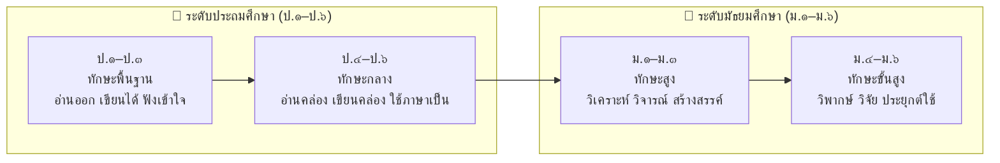
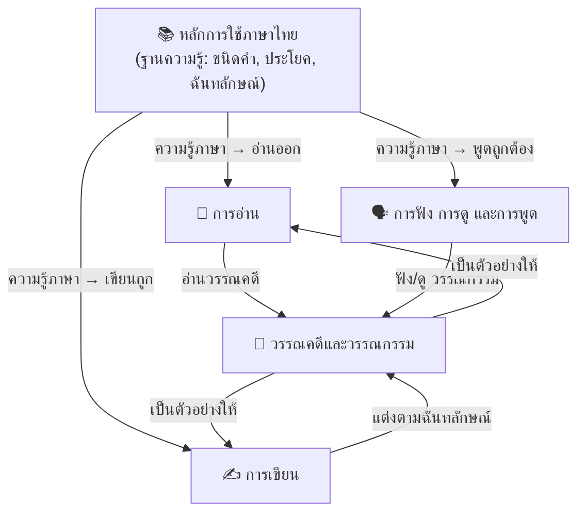

# ภาษาไทย — องค์ความรู้

> **จุดประสงค์:** รวบรวมองค์ความรู้วิชาภาษาไทย ตามหลักสูตรแกนกลางการศึกษาขั้นพื้นฐาน พุทธศักราช ๒๕๕๑ (ฉบับปรับปรุง ๒๕๖๐) ครอบคลุมตั้งแต่ระดับชั้นประถมศึกษาปีที่ ๑ ถึงมัธยมศึกษาปีที่ ๖ แบ่งตามสาระการเรียนรู้ ๕ สาระหลัก
>
> **แหล่งอ้างอิง:** กระทรวงศึกษาธิการ, หลักสูตรแกนกลางการศึกษาขั้นพื้นฐาน พ.ศ. ๒๕๕๑

## ภาพรวม ๕ สาระการเรียนรู้

วิชาภาษาไทยในหลักสูตรแกนกลาง ประกอบด้วย **๕ สาระการเรียนรู้** ที่ครอบคลุมทักษะการใช้ภาษาอย่างครบถ้วน:

| สาระที่ | ชื่อสาระ | จำนวนหัวข้อ | จุดเน้น |
|---|---|---|---|
| ๑ | 📖 **การอ่าน** | ~๑๕ | การอ่านออกเสียง อ่านจับใจความ อ่านวิเคราะห์ อ่านตีความ |
| ๒ | ✍️ **การเขียน** | ~๑๕ | คัดลายมือ เขียนสื่อสาร เขียนเรียงความ เขียนรายงาน |
| ๓ | 🗣️ **การฟัง การดู และการพูด** | ~๑๐ | การฟังอย่างมีวิจารณญาณ การพูดในโอกาสต่างๆ มารยาทการพูด |
| ๔ | 📚 **หลักการใช้ภาษาไทย** | ~๒๐ | ชนิดของคำ การสร้างคำ ระดับภาษา ฉันทลักษณ์ |
| ๕ | 📜 **วรรณคดีและวรรณกรรม** | ~๑๕ | วรรณคดีไทยสมัยต่างๆ การวิเคราะห์วรรณกรรม วรรณกรรมท้องถิ่น |

**รวมทั้งสิ้น: ~๗๕ หัวข้อ ตลอด ๑๒ ปีการศึกษา (ป.๑–ม.๖)**

---

## ระดับชั้นและการแบ่งช่วงชั้น

---

## สาระที่ ๑: การอ่าน 📖

[[การอ่าน - ภาพรวม|→ ดูรายละเอียดทั้งหมด]]

ทักษะการอ่านตั้งแต่การอ่านออกเสียงขั้นพื้นฐานไปจนถึงการอ่านวิเคราะห์ขั้นสูง:

### ระดับประถมศึกษา
| ระดับ | เนื้อหาหลัก |
|---|---|
| **ป.๑–๓** | การอ่านออกเสียงสะกดคำ อ่านคำพื้นฐาน อ่านประโยคง่ายๆ อ่านนิทาน อ่านบทร้อยกรองง่ายๆ การอ่านในใจ |
| **ป.๔–๖** | การอ่านออกเสียงร้อยแก้วร้อยกรอง อ่านจับใจความ อ่านสรุปความ อ่านวิเคราะห์ อ่านแผนที่ แผนภูมิ |

### ระดับมัธยมศึกษา
| ระดับ | เนื้อหาหลัก |
|---|---|
| **ม.๑–๓** | การอ่านวิเคราะห์ วิจารณ์ อ่านตีความ อ่านข่าว บทความ สารคดี อ่านวรรณคดี อ่านออกเสียงทำนองเสนาะ |
| **ม.๔–๖** | การอ่านเชิงวิพากษ์ การอ่านเพื่อการวิจัย การอ่านสื่อออนไลน์อย่างมีวิจารณญาณ |

**คลัง:** `การอ่าน\` — ~๑๕ ไฟล์หัวข้อ

---

## สาระที่ ๒: การเขียน ✍️

[[การเขียน - ภาพรวม|→ ดูรายละเอียดทั้งหมด]]

ทักษะการเขียนตั้งแต่การคัดลายมือจนถึงการเขียนเชิงวิชาการ:

### ระดับประถมศึกษา
| ระดับ | เนื้อหาหลัก |
|---|---|
| **ป.๑–๓** | การคัดลายมือตัวบรรจงเต็มบรรทัด เขียนคำพื้นฐาน เขียนประโยค เขียนเรื่องสั้นๆ จากภาพ |
| **ป.๔–๖** | การคัดลายมือตัวบรรจงครึ่งบรรทัด เขียนสื่อสาร เขียนจดหมาย เขียนเรียงความ เขียนย่อความ |

### ระดับมัธยมศึกษา
| ระดับ | เนื้อหาหลัก |
|---|---|
| **ม.๑–๓** | การเขียนเรียงความเชิงพรรณนา โวหาร เขียนรายงาน เขียนจดหมายกิจธุระ เขียนแสดงความคิดเห็น |
| **ม.๔–๖** | การเขียนเชิงวิชาการ เขียนโครงการ เขียนวิจัย เขียนบทความ เขียนสร้างสรรค์ |

**คลัง:** `การเขียน\` — ~๑๕ ไฟล์หัวข้อ

---

## สาระที่ ๓: การฟัง การดู และการพูด 🗣️

[[การฟัง การดู และการพูด - ภาพรวม|→ ดูรายละเอียดทั้งหมด]]

ทักษะการรับสารและการส่งสารด้วยวาจา:

### ระดับประถมศึกษา
| ระดับ | เนื้อหาหลัก |
|---|---|
| **ป.๑–๓** | การฟังนิทาน เรื่องเล่า การพูดแนะนำตัว การพูดเล่าเรื่อง การฟังคำสั่ง |
| **ป.๔–๖** | การฟังอย่างตั้งใจ จับใจความจากการฟังและดู การพูดแสดงความคิดเห็น การพูดรายงาน มารยาทการพูด |

### ระดับมัธยมศึกษา
| ระดับ | เนื้อหาหลัก |
|---|---|
| **ม.๑–๓** | การฟังอย่างมีวิจารณญาณ การดูสื่ออย่างวิเคราะห์ การพูดโน้มน้าว การอภิปราย การพูดในโอกาสต่างๆ |
| **ม.๔–๖** | การพูดในที่ประชุมชน การโต้วาที การพูดนำเสนอเชิงวิชาการ การวิเคราะห์สื่อ |

**คลัง:** `การฟัง การดู และการพูด\` — ~๑๐ ไฟล์หัวข้อ

---

## สาระที่ ๔: หลักการใช้ภาษาไทย 📚

[[หลักการใช้ภาษาไทย - ภาพรวม|→ ดูรายละเอียดทั้งหมด]]

หัวใจของภาษาไทย: ชนิดของคำ การสร้างคำ ประโยค ระดับภาษา และฉันทลักษณ์:

### หมวดหมู่หัวข้อ

| หมวด | หัวข้อ |
|---|---|
| **ชนิดของคำ** | คำนาม คำสรรพนาม คำกริยา คำวิเศษณ์ คำบุพบท คำสันธาน คำอุทาน |
| **การสร้างคำ** | คำประสม คำซ้อน คำซ้ำ คำสมาส คำสนธิ คำยืมภาษาต่างประเทศ |
| **ประโยค** | ประโยคความเดียว ความรวม ความซ้อน การวิเคราะห์ประโยค การใช้คำเชื่อม |
| **ระดับภาษา** | ภาษาพูด ภาษาเขียน ภาษาทางการ ราชาศัพท์ ภาษาถิ่น |
| **ฉันทลักษณ์** | กลอน (สุภาพ ดอกสร้อย สักวา) โคลง (สี่สุภาพ สองสุภาพ) ฉันท์ (มาตราพฤติ) กาพย์ (ยานี ฉบัง สุรางคนางค์) ร่าย (โบราณ สุภาพ) |
| **การเปลี่ยนแปลงของภาษา** | วิวัฒนาการของภาษาไทย ภาษาไทยในยุคดิจิทัล |

**คลัง:** `หลักการใช้ภาษาไทย\` — ~๒๐ ไฟล์หัวข้อ

---

## สาระที่ ๕: วรรณคดีและวรรณกรรม 📜

[[วรรณคดีและวรรณกรรม - ภาพรวม|→ ดูรายละเอียดทั้งหมด]]

การศึกษาวรรณคดีไทยตั้งแต่นิทานพื้นบ้านไปจนถึงวรรณคดีเอกของชาติ:

### ระดับประถมศึกษา
| ระดับ | เนื้อหาหลัก |
|---|---|
| **ป.๑–๓** | นิทานพื้นบ้าน เพลงกล่อมเด็ก บทร้อยกรองง่ายๆ วรรณกรรมสำหรับเด็ก |
| **ป.๔–๖** | นิทานคติธรรม วรรณคดีลำนำ บทร้อยกรองที่ยาวขึ้น นิทานชาดก วรรณกรรมเยาวชน |

### ระดับมัธยมศึกษา
| ระดับ | เนื้อหาหลัก |
|---|---|
| **ม.๑–๓** | วรรณคดีสมัยอยุธยา-ธนบุรี (ลิลิตพระลอ รามเกียรติ์ อิเหนา) วรรณคดีสมัยรัตนโกสินทร์ตอนต้น (พระอภัยมณี ขุนช้างขุนแผน) |
| **ม.๔–๖** | วรรณคดีสมัยรัตนโกสินทร์ (นิราศ มัทนะพาธา สี่แผ่นดิน) การวิเคราะห์วรรณกรรมเชิงลึก วรรณกรรมปัจจุบัน วรรณกรรมท้องถิ่น |

### วรรณคดีสำคัญตามหลักสูตร

| ระดับชั้น | วรรณคดีที่ศึกษา |
|---|---|
| **ป.๑–๓** | นิทานอีสป นิทานพื้นบ้าน เพลงกล่อมเด็ก บทร้อยกรองง่ายๆ |
| **ป.๔–๖** | นิทานชาดก สุภาษิตสอนหญิง (บางตอน) กาพย์พระไชยสุริยา |
| **ม.๑** | ราชาธิราช (ตอน สมิงพระรามอาสา) นิทานพื้นบ้านภาคต่างๆ กาพย์เห่เรือ (บางตอน) |
| **ม.๒** | รามเกียรติ์ (ตอน นารายณ์ปราบนนทก) โคลงโลกนิติ บทเสภาสามัคคีเสวก |
| **ม.๓** | อิเหนา (ตอน ศึกกะหมังกุหนิง) ลิลิตตะเลงพ่าย บทละครพูดเรื่องเห็นแก่ลูก |
| **ม.๔** | นิราศนรินทร์คำโคลง (บางตอน) ขุนช้างขุนแผน (ตอน ขุนช้างถวายฎีกา) หัวใจชายหนุ่ม |
| **ม.๕** | ลิลิตพระลอ (บางตอน) มหาเวสสันดรชาดก (มัทรี) โคลงภาพพระราชพงศาวดาร |
| **ม.๖** | สามก๊ก (ตอน กวนอูไปรับราชการกับโจโฉ) มัทนะพาธา สี่แผ่นดิน (บางตอน) |

**คลัง:** `วรรณคดีและวรรณกรรม\` — ~๑๕ ไฟล์หัวข้อ

---

## ความเชื่อมโยงของ ๕ สาระ

- **สาระที่ ๔ (หลักการใช้ภาษาไทย)** เป็นฐานของทุกทักษะ — หากไม่รู้หลักภาษา ก็ไม่สามารถอ่าน เขียน ฟัง พูด ได้อย่างถูกต้อง
- **สาระที่ ๑-๓** เป็นทักษะที่ฝึกฝนผ่านการปฏิบัติ
- **สาระที่ ๕ (วรรณคดี)** เป็นทั้งเป้าหมายและเครื่องมือ — เรียนหลักภาษาเพื่อเข้าถึงวรรณคดี และใช้วรรณคดีเป็นตัวอย่างของการใช้ภาษา

---

## เส้นทางการเรียนรู้

- **เส้นทางพื้นฐาน (ป.๑–ป.๓):** หลักการใช้ภาษาไทยขั้นต้น → การอ่าน การเขียนพื้นฐาน → การฟังและพูด → นิทานและเพลง
- **เส้นทางกลาง (ป.๔–ป.๖):** หลักภาษาเข้มข้น → อ่านจับใจความ → เขียนสื่อสาร → วรรณคดีลำนำ
- **เส้นทางสูง (ม.๑–ม.๓):** หลักภาษาขั้นสูง → อ่านวิเคราะห์ → เขียนเรียงความ → วรรณคดีเอกของชาติ
- **เส้นทางขั้นสูง (ม.๔–ม.๖):** หลักภาษาเชิงลึก → อ่านวิพากษ์ → เขียนวิชาการ → วรรณกรรมวิจักษณ์

---

## หมายเหตุ

- **ชื่อสาระ:** ใช้ตามหลักสูตรแกนกลางการศึกษาขั้นพื้นฐาน พ.ศ. ๒๕๕๑ (ปรับปรุง ๒๕๖๐)
- **หลักสูตรแกนกลาง:** กระทรวงศึกษาธิการกำหนดกรอบมาตรฐานการเรียนรู้เท่านั้น — สถานศึกษาแต่ละแห่งเป็นผู้กำหนดรายละเอียดการสอนและเลือกวรรณคดีเพิ่มเติมได้
- **การสอบ:** O-NET ภาษาไทยครอบคลุมทั้ง ๕ สาระตั้งแต่ระดับประถมถึงมัธยม

## หัวข้อที่เกี่ยวข้อง

- [[Body of Knowledge - Overview|← กลับไปภาพรวม Math-Sci]]
