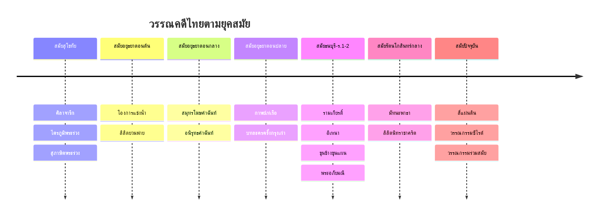

# วรรณคดีและวรรณกรรม — สาระที่ ๕

> **สาระการเรียนรู้:** วรรณคดีและวรรณกรรม (Literature) — หลักสูตรแกนกลางการศึกษาขั้นพื้นฐาน พ.ศ. ๒๕๕๑
> **จำนวนหัวข้อ:** ~๑๕ | **ระยะเวลา:** ๑๒ ปี (ป.๑–ม.๖)
> **ความสำคัญ:** วรรณคดีเป็นทั้งคลังปัญญาของชาติและแบบอย่างของการใช้ภาษาไทยที่งดงาม

## ภาพรวม

**วรรณคดีและวรรณกรรม** เป็นสาระที่เปิดโลกทัศน์ของผู้เรียนผ่านมรดกทางวรรณศิลป์ของไทย ตั้งแต่เรื่องเล่าพื้นบ้านไปจนถึงวรรณกรรมเอกของชาติ การศึกษาวรรณคดีไม่เพียงแต่ให้ความรู้ทางภาษา แต่ยังปลูกฝังคุณธรรม จริยธรรม และความเข้าใจในสังคมวัฒนธรรมไทย

---

## ~๑๕ หัวข้อหลัก

### 📜 วรรณคดีสมัยสุโขทัย
- [[01_วรรณคดีสมัยสุโขทัย]] — ศิลาจารึกพ่อขุนรามคำแหง ไตรภูมิพระร่วง สุภาษิตพระร่วง

### 🏛️ วรรณคดีสมัยอยุธยา
- [[02_วรรณคดีสมัยอยุธยาตอนต้น]] — โองการแช่งน้ำ ลิลิตโองการแช่งน้ำ ลิลิตยวนพ่าย
- [[03_วรรณคดีสมัยอยุธยาตอนกลาง]] — สมุทรโฆษคำฉันท์ อนิรุทธคำฉันท์
- [[04_วรรณคดีสมัยอยุธยาตอนปลาย]] — กาพย์เห่เรือ (เจ้าฟ้าธรรมธิเบศร) บทละครครั้งกรุงเก่า

### 🏯 วรรณคดีสมัยธนบุรี–รัตนโกสินทร์ตอนต้น
- [[05_วรรณคดีสมัยรัตนโกสินทร์ตอนต้น]] — รามเกียรติ์ (รัชกาลที่ ๑) อิเหนา (รัชกาลที่ ๒) ขุนช้างขุนแผน พระอภัยมณี (สุนทรภู่)
- [[06_สุนทรภู่และผลงาน]] — พระอภัยมณี นิราศเมืองแกลง นิราศภูเขาทอง นิราศพระบาท สุภาษิตสอนหญิง

### 🖋️ วรรณคดีสมัยรัตนโกสินทร์ยุคกลาง-ปัจจุบัน
- [[07_วรรณคดีสมัยรัชกาลที่ ๕-๖]] — ลิลิตนิทราชาคริต เงาะป่า มัทนะพาธา (รัชกาลที่ ๖) เวนิสวาณิช (พระราชนิพนธ์แปล)
- [[08_วรรณกรรมสมัยใหม่]] — สี่แผ่นดิน (หม่อมราชวงศ์คึกฤทธิ์ ปราโมช) อยู่กับก๋ง (หยก บูรพา) คำพิพากษา (ชาติ กอบจิตติ)
- [[09_วรรณกรรมร่วมสมัย]] — วรรณกรรมสร้างสรรค์ยอดเยี่ยมอาเซียน (ซีไรต์) วรรณกรรมเยาวชน

### 🌏 วรรณกรรมประเภทต่างๆ
- [[10_นิทานและตำนาน]] — นิทานพื้นบ้าน นิทานชาดก นิทานอีสป นิทานคติธรรม ตำนานท้องถิ่น
- [[11_บทร้อยกรอง]] — เพลงกล่อมเด็ก เพลงพื้นบ้าน บทดอกสร้อย บทเห่กล่อม
- [[12_วรรณกรรมแปล]] — วรรณกรรมแปลจากภาษาต่างประเทศที่มีอิทธิพลในสังคมไทย
- [[13_วรรณกรรมท้องถิ่น]] — วรรณกรรมอีสาน (ผาแดงนางไอ่) วรรณกรรมล้านนา (คร่าวซอ) วรรณกรรมใต้ (หนังตะลุง) วรรณกรรมภาคกลาง (เพลงฉ่อย เพลงเรือ)

### 🔍 การวิเคราะห์วรรณคดี
- [[14_การวิเคราะห์วรรณคดี]] — การวิเคราะห์องค์ประกอบ (โครงเรื่อง ตัวละคร ฉาก แก่นเรื่อง) การวิเคราะห์คุณค่าทางวรรณศิลป์ การวิเคราะห์คุณค่าทางสังคม
- [[15_วรรณคดีวิจักษณ์]] — การวิจารณ์วรรณคดี แนวทางการวิจารณ์ การเขียนบทวิจารณ์

---

## วรรณคดีสำคัญตามระดับชั้น

| ระดับชั้น | วรรณคดีหลัก | วรรณคดีเสริม |
|---|---|---|
| **ป.๑–๓** | นิทานอีสป เพลงกล่อมเด็ก | นิทานพื้นบ้าน นิทานชาดก |
| **ป.๔–๖** | กาพย์พระไชยสุริยา สุภาษิตสอนหญิง (บางตอน) | นิทานชาดก วรรณกรรมเยาวชน |
| **ม.๑** | ราชาธิราช (ตอนสมิงพระรามอาสา) กาพย์เห่เรือ (บางตอน) | นิทานพื้นบ้านภาคต่างๆ |
| **ม.๒** | รามเกียรติ์ (ตอนนารายณ์ปราบนนทก) โคลงโลกนิติ | บทเสภาสามัคคีเสวก |
| **ม.๓** | อิเหนา (ตอนศึกกะหมังกุหนิง) ลิลิตตะเลงพ่าย | บทละครพูดเรื่องเห็นแก่ลูก |
| **ม.๔** | นิราศนรินทร์คำโคลง ขุนช้างขุนแผน (ตอนขุนช้างถวายฎีกา) | หัวใจชายหนุ่ม |
| **ม.๕** | ลิลิตพระลอ มหาเวสสันดรชาดก (มัทรี) | โคลงภาพพระราชพงศาวดาร |
| **ม.๖** | สามก๊ก (ตอนกวนอูไปรับราชการกับโจโฉ) มัทนะพาธา | สี่แผ่นดิน (บางตอน) |

---

## ลำดับเวลาของวรรณคดีไทย

---

## ดูเพิ่มเติม

- [[Thai Language - Overview|← กลับไปภาพรวมภาษาไทย]]
- [[การอ่าน - ภาพรวม|สาระที่ ๑: การอ่าน]]
- [[การเขียน - ภาพรวม|สาระที่ ๒: การเขียน]]
- [[การฟัง การดู และการพูด - ภาพรวม|สาระที่ ๓: การฟัง การดู และการพูด]]
- [[หลักการใช้ภาษาไทย - ภาพรวม|สาระที่ ๔: หลักการใช้ภาษาไทย]]
