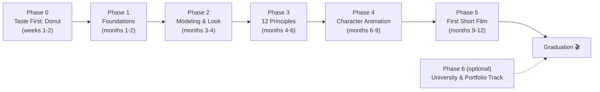

# 3D Animation with Blender: Course Map

> **Mission:** from zero 3D knowledge to a released 30-second short film, with a portfolio of finished renders that becomes a university application by ม.6.
> **Model:** the whole path is mapped now. Full lesson files are released just-in-time as each lesson is reached.

## At a Glance

| | |
|---|---|
| **Learner** | Brother — ม.4 (Grade 10), complete beginner |
| **Goal** | 30-second animated short film + portfolio of finished renders |
| **Budget** | ~5-8 h/week; ~220 h of content; realistic 12-15 months with school |
| **Spine** | Blender Guru Donut (2026), Grant Abbitt beginners series, Alan Becker 12 Principles, vault lessons |
| **Portfolio layer** | Every phase ends with finished renders saved to the portfolio folder |
| **Capstone** | One short film, storyboard → final render (Phase 5) |
| **Environment** | Windows PC + Blender 5.x (free). Drawing tablet NOT required |

## Course Flow

## Capstone Ladder (the Phase 5 short film)

| Tier | What it means | Where it lands |
|---|---|---|
| 1 | Idea + storyboard on paper | Lesson 28 |
| 2 | Blocked animation (all key poses, rough timing) | Lesson 29 |
| 3 | Spline + polish (in-between, arcs, overlap) | Lesson 30 |
| 4 | Lighting, final render, edited with sound | Lesson 31 |
| 5 | Released on YouTube + portfolio page | Lesson 32 |

## How This Course Works

### Lesson protocol (just-in-time)

- [[01_Syllabus]] maps all 35 lessons now: focus, resources, estimates.
- Full lesson files are written when the learner reaches them: finish lesson N, report back, receive lesson N+1.
- Every lesson follows the same shape: Learning Objectives, Concept, Visual Reference, Hands-On, Show & Tell, Done When, Key Takeaways.

### Reporting a finished lesson

Send me:

1. `done NN`
2. one line: what clicked, what felt shaky
3. the render(s) saved to the portfolio folder (path or screenshot)
4. anything worth discussing that you detoured into

I verify, adjust the next lesson if something was shaky, and release it.

### Stuck rule

- Stuck on one thing for more than 30 minutes: skip it, write it down, keep going. The donut must not become a week of fighting one button.
- YouTube is Blender's documentation: search `<Blender version> <tool name> tutorial`.
- Version differences: this course targets Blender 5.x. If a tutorial's button is missing, press `F3` and search the tool by name.

### Pace honesty

- Lesson estimates sum to ~220 hours of content ≈ 9-10 months at 6 h/week.
- Realistic: 12-15 months once school terms and exams are factored in. Pause around exams without guilt; never stop mid-project.
- Faster: skip the "Going Deeper" blocks. Slower: spend extra weeks in Phase 3 — it is the heart of the craft.

### Portfolio rule

- One render per lesson minimum, saved to a portfolio folder of your choice (suggestion: `F:\3d_portfolio\` — tell me if a different one is chosen and I'll update the references).
- Naming: `00_donut.png`, `03_coffee_cup.png`, and so on — matching the lesson number.
