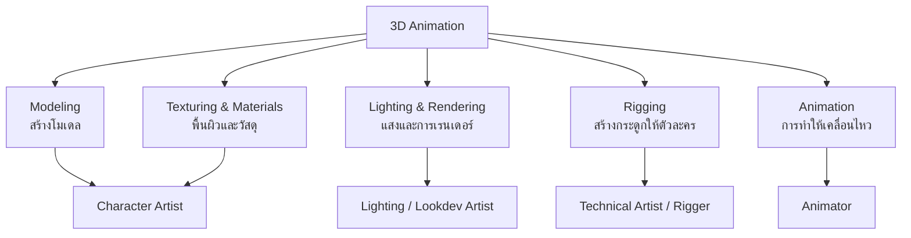
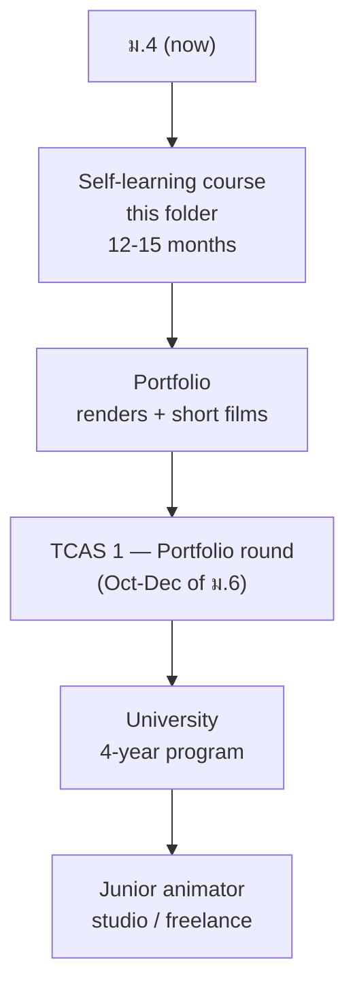

---
tags:
  - overview
  - 3d-animation
  - career
  - blender
  - thai-education
source: "blender.org; The Animator's Survival Kit (R. Williams); TCAS; university websites"
created: 2026-09-22
profession: "3D Animator — นักแอนิเมชันสามมิติ"
degree: "B.F.A. / B.Sc. — ศิลปกรรมศาสตรบัณฑิต หรือ วิทยาศาสตรบัณฑิต"
duration: "4 ปี (4 years)"
---

# 3D Animation — อาชีพนักแอนิเมชัน 3 มิติ

> *"Animation can explain whatever the mind of man can conceive."* — Walt Disney

## What Is This?

This is a **career guidance knowledge base** for Thai students interested in 3D animation, with an embedded **self-learning course** (start at [[00_Course_Map]]).

Unlike engineering or medicine, animation in Thailand is **not a licensed profession** — there is no license exam, no สภาวิชาชีพ. **Your portfolio is your license.** Studios hire what they can see. This changes everything about how to study:

- Every exercise ends as a finished render saved to a portfolio folder.
- The course in this folder is built so each phase produces portfolio pieces.
- By ม.6, the portfolio itself becomes the TCAS 1 (Portfolio round) application.

## The 5 Skill Domains

"3D animation" is really five connected skills. Professionals specialize; a beginner should try all five, then deepen the one they love.

## Why Blender?

| Question | Answer |
|---|---|
| **Cost** | 100% free, forever. Maya (the industry alternative) costs ~$2,000/year even for students |
| **Industry use** | Used by real studios and open-movie productions (Blender Studio); skills transfer to Maya later |
| **Tutorials** | The largest beginner-tutorial ecosystem on YouTube |
| **Hardware** | Runs on a mid-range PC: minimum 8 GB RAM + GPU with 2 GB VRAM; recommended 16 GB RAM + 6 GB VRAM |

## Education Pathway

## University Programs in Thailand

Animation admissions are **portfolio-heavy** — the TCAS 1 Portfolio round is the main route. Both สายวิทย์-คณิต and สายศิลป์-คำนวณ can apply; a strong portfolio matters more than exam scores for these programs.

| University | Faculty / Program | Site |
|---|---|---|
| มหาวิทยาลัยศิลปากร (Silpakorn) | คณะมัณฑนศิลป์ (Decorative Arts) — design & animation-related programs | [su.ac.th](https://www.su.ac.th) |
| มหาวิทยาลัยรังสิต (Rangsit) | วิทยาลัยการออกแบบ (College of Design) — Digital Art | [rsu.ac.th](https://www.rsu.ac.th) |
| มหาวิทยาลัยกรุงเทพ (Bangkok University) | School of Digital Media and Cinematic Arts | [bu.ac.th](https://www.bu.ac.th) |
| สจล. (KMITL) | Faculty of Architecture, Art and Design | [kmitl.ac.th](https://www.kmitl.ac.th) |

> **Why the course matters for admission:** the 12-15 months of renders and the Phase 5 short film *are* the TCAS 1 portfolio. No extra admission-prep project is needed.

## Where Thai 3D Artists Work

| Studio | Location | Known for |
|---|---|---|
| The Monk Studios | Bangkok | 3D feature films — *9 Satra: The Legend of Muay Thai*, *Krut: The Himmaphan Warriors* |
| Yggdrazil Group | Bangkok | VFX + game art (*Home Sweet Home*) |
| RiFF Studio | Bangkok | TV commercials, VFX post-production |
| M2 Animation | Bangkok | International 3D TV series |
| Igloo Studio | Bangkok | 2D/3D animation studio |

Freelance and remote work are also real paths: game studios worldwide hire 3D artists through ArtStation portfolios.

## What To Do Right Now

1. Start [[00_Donut_Quest]] today — the famous first project of every 3D artist.
2. Sketchbook (optional but powerful): 15 min/day of gesture drawing. Animators who draw are visibly better at 3D.
3. Watch animation with the sound off and study how the characters move.
