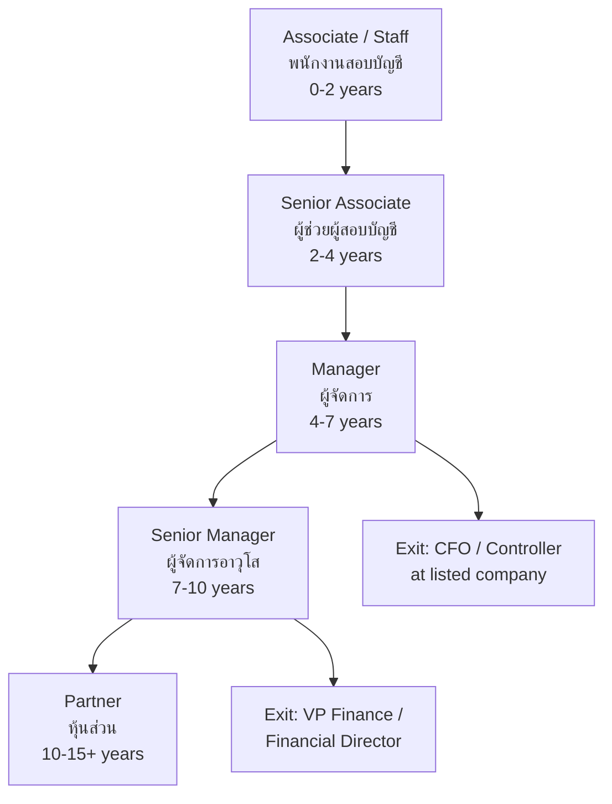
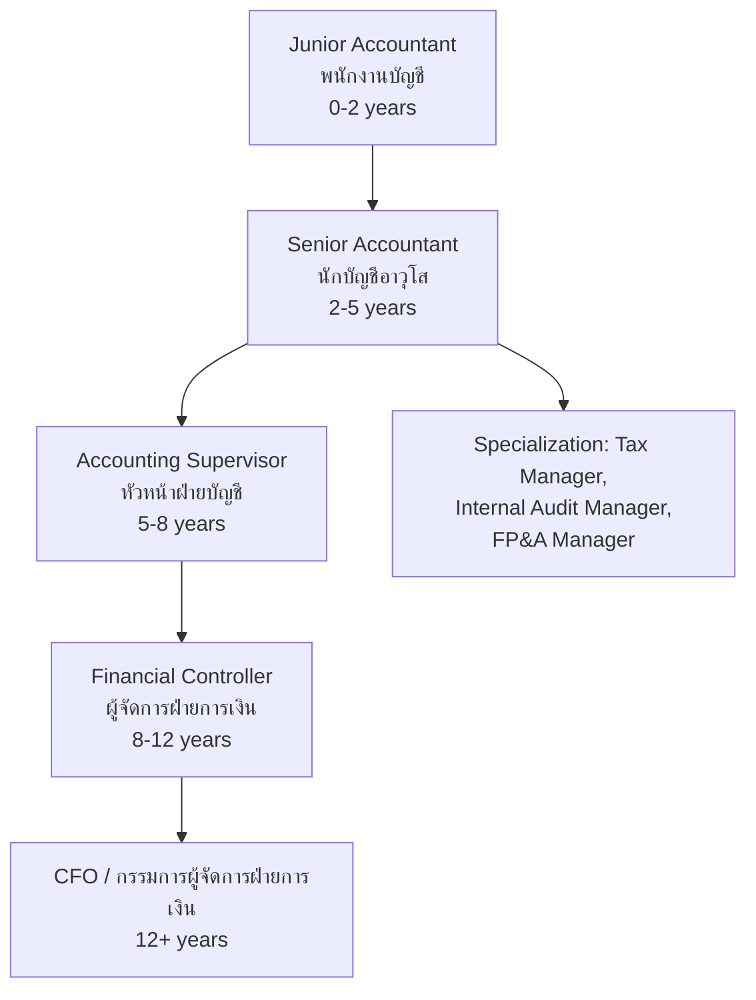

---
tags:
  - accounting
  - university-guide
  - career-paths
  - TCAS
  - salary
  - CPA
source: "Federation of Accounting Professions; TCAS; University websites; Big 4"
created: 2026-07-27
domain: "University Guide & Career Paths"
prerequisites: ["[[Accountant - Overview]]"]
---

# 06 — University Guide & Career Paths

> *"Accounting graduates have one of the highest employment rates of any degree. Every company needs one."*

This is the practical guide: where to study, how to get licensed, which firms to target, and how far accounting can take you — from junior accountant to Big 4 partner to CFO of a listed company.

---

## Part A: University Guide

### 1 | Admission Requirements

| Requirement | Details |
|---|---|
| **Education** | ม.6 graduate — **ALL tracks accepted** (Science, Arts, Vocational) |
| **GPA** | Minimum GPAX typically 2.50–3.00 |
| **Key aptitude** | Math skills essential; logical thinking; attention to detail |
| **Language** | English increasingly important (TFRS = IFRS; Big 4 = international) |

> ✅ Accounting is accessible — no science requirement. But math proficiency is essential.

### 2 | TCAS Rounds & Exams

| Exam | Subject | Typical Weight |
|---|---|---|
| **TGAT** | Thai General Aptitude Test | 20–30% |
| **A-Level Math 1** | คณิตศาสตร์ 1 | 20–30% |
| **A-Level English** | ภาษาอังกฤษ | 15–20% |
| **A-Level Thai** | ภาษาไทย | 10–15% |
| **TPAT 1 or 3** | Aptitude (some universities) | 10–20% |

### Accounting Programs in Thailand

| University | Faculty | Location | Notable Features |
|---|---|---|---|
| **Thammasat University** | คณะพาณิชยศาสตร์และการบัญชี | Bangkok (Tha Phra Chan) | 🔑 **#1 accounting faculty historically** — "ธรรมศาสตร์ = บัญชี"; strong CPA pass rate; Big 4 pipeline; international programs (BBA) |
| **Chulalongkorn University** | คณะพาณิชยศาสตร์และการบัญชี | Bangkok | Elite prestige; strong in finance + accounting; BBA international |
| **Kasetsart University** | คณะบริหารธุรกิจ (สาขาบัญชี) | Bangkok (Bang Khen) | Growing prestige; good industry connections |
| **Chiang Mai University** | คณะบริหารธุรกิจ (สาขาบัญชี) | Chiang Mai | Northern hub; CPA preparation |
| **Khon Kaen University** | คณะบริหารธุรกิจ (สาขาบัญชี) | Khon Kaen | Isan hub; government accounting strength |
| **Ramkhamhaeng University** | คณะบัญชี | Bangkok | Open admission; produced countless CPAs; affordable |
| **Sukhothai Thammathirat Open University** | สาขาวิชาการบัญชี | Distance learning | Study while working |
| **National Institute of Development Administration (NIDA)** | คณะบริหารธุรกิจ | Bangkok | Graduate programs; research |
| **Burapha University** | คณะบริหารธุรกิจ (สาขาบัญชี) | Chonburi | - |
| **Ubon Ratchathani University** | คณะบริหารธุรกิจ (สาขาบัญชี) | Ubon Ratchathani | - |
| **Naresuan University** | คณะบริหารธุรกิจ (สาขาบัญชี) | Phitsanulok | - |
| **Prince of Songkla University** | คณะพาณิชยศาสตร์และการจัดการ | Hat Yai | - |
| **Sripatum University** | คณะบัญชี | Bangkok (private) | - |
| **Bangkok University** | คณะบัญชี | Bangkok (private) | - |
| **Rangsit University** | คณะบริหารธุรกิจ (สาขาบัญชี) | Pathum Thani (private) | - |
| **Mahasarakham University** | คณะบัญชีและการจัดการ | Maha Sarakham | - |

### 4 | Tuition

| Type | Tuition per Year (Approx.) |
|---|---|
| **Public University** | ฿15,000–฿30,000 |
| **Ramkhamhaeng (open)** | ฿3,000–฿8,000 |
| **NIDA (graduate)** | ฿40,000–฿80,000 |
| **Private University** | ฿80,000–฿200,000 |
| **International Program (BBA)** | ฿150,000–฿350,000 |

---

## Part B: Licensing

### 5 | CPA Path

| Step | Details |
|---|---|
| **1. B.Acc. degree** | From FAP-recognized program |
| **2. Register with FAP** | สภาวิชาชีพบัญชี |
| **3. Pass CPA exam** | 5 papers (financial accounting, tax, law, audit, management) |
| **4. 3 years audit experience** | Under a licensed CPA |
| **5. CPA License** | ผู้สอบบัญชีรับอนุญาต — can sign audit opinions |
| **6. CPD** | 120 hours per 3-year cycle to maintain license |

### 6 | Other Credentials

| Credential | Issuing Body | Focus |
|---|---|---|
| **Registered Accountant** | FAP | Bookkeeping (lower barrier than CPA) |
| **Tax Auditor** | Revenue Department | Tax audit and compliance |
| **CIA** (Certified Internal Auditor) | IIA (international) | Internal audit |
| **CMA** (Certified Management Accountant) | IMA (international) | Management accounting |
| **CFA** (Chartered Financial Analyst) | CFA Institute (international) | Investment analysis |
| **CFE** (Certified Fraud Examiner) | ACFE (international) | Fraud investigation |

---

## Part C: Career Paths & Salaries

### 7 | The Big 4 Firms (สำนักงานสอบบัญชี บิ๊กโฟร์)

| Firm | Thai Name | Global Revenue | Thai Strength |
|---|---|---|---|
| **PwC (PricewaterhouseCoopers)** | พีดับบลิวซี | ~$53B | Strong in tax + consulting |
| **Deloitte** | ดีลอยท์ | ~$65B | Largest by revenue; audit + advisory |
| **EY (Ernst & Young)** | เอินส์ท แอนด์ ยัง | ~$49B | Strong in transaction advisory |
| **KPMG** | เคพีเอ็มจี | ~$36B | Strong in audit + tax |

**Working at Big 4:**
- Starting salary: ฿22K–฿35K
- Hours: 50–70 hrs/week during busy season (Jan–Mar)
- Career: Associate → Senior → Manager → Senior Manager → Partner
- Partner income: ฿5M–฿20M+/year
- Exit opportunities: CFO, Financial Controller, VP Finance at top companies

### 8 | Career Tracks & Salaries

| Track | Starting | Mid-Career (5-10 yr) | Senior (15+ yr) |
|---|---|---|---|
| **Big 4 Audit** | ฿22K–฿35K | ฿50K–฿100K | ฿150K–฿500K+ (partner) |
| **Regional / Local Firm** | ฿18K–฿28K | ฿35K–฿70K | ฿70K–฿200K |
| **Corporate Accountant** | ฿20K–฿35K | ฿45K–฿90K | ฿100K–฿250K+ (CFO) |
| **Tax Consultant** | ฿22K–฿35K | ฿50K–฿100K | ฿100K–฿300K |
| **Financial Analyst** | ฿25K–฿40K | ฿60K–฿120K | ฿120K–฿300K+ |
| **Internal Auditor** | ฿20K–฿30K | ฿40K–฿80K | ฿80K–฿200K |
| **Forensic Accountant** | ฿25K–฿40K | ฿50K–฿100K | ฿100K–฿250K |
| **Government Accountant** | ฿15K–฿25K | ฿30K–฿55K | ฿55K–฿120K |
| **Academic / Professor** | ฿25K–฿35K | ฿35K–฿60K | ฿60K–฿120K |

### 9 | Career Progression — Big 4 Track

### 10 | Career Progression — Corporate Track

### 11 | Major Employers

| Employer | Type |
|---|---|
| **Big 4** | PwC, Deloitte, EY, KPMG |
| **Regional firms** | BDO, Grant Thornton, Mazars, PKF |
| **Banks** | SCB, KBank, BBL, KTB, TMB |
| **SET-listed companies** | CP Group, PTT, SCG, ThaiBev |
| **Government** | Revenue Department, Comptroller General, State Audit |
| **Multinationals** | Unilever, P&G, Nestle, 3M |

### 12 | Scholarships

| Scholarship | Details |
|---|---|
| **ทุนคณะพาณิชย์ มธ.** | Thammasat — merit + need based |
| **ทุนบริษัทสอบบัญชี** | Big 4 often sponsor CPA exam fees for employees |
| **ทุน ก.พ.** | Government — for government accountants |
| **ทุน กยศ.** | Student loan fund |

### 13 | Summary: Is Accounting Right for You?

| ✅ You'll thrive if you... | ⚠️ Consider carefully if you... |
|---|---|
| Are detail-oriented and precise | Make careless mistakes |
| Enjoy working with numbers | Dislike math |
| Are organized and systematic | Prefer unstructured, creative work |
| Can handle repetitive tasks with accuracy | Get bored by routine |
| Want job security and clear career path | Want something unpredictable |
| Are comfortable with rules and regulations | Dislike following strict guidelines |
| Can work under pressure (tax season, audit deadlines) | Crumble under deadline pressure |
| Want to understand how businesses work | Only want to do one narrow task |
| Are honest and ethical (accounting = trust) | Would cut ethical corners |

> **Final thought:** Accounting may not sound glamorous. But it's the profession that makes every other profession possible. Every business, every charity, every government agency needs someone who can count the money, track the money, and make sure the money is right. If you're precise, patient, and principled — accounting will give you a career that's stable, respected, and surprisingly versatile.

---

## Related Notes

- [[Accountant - Overview]] — Start here for the big picture
- [[01_Financial_Accounting]] — The core foundation
- [[03_Auditing_and_Assurance]] — CPA pathway details
- [[04_Taxation]] — Tax specialization
- [[Lawyer - Overview|Law]] — Tax law overlaps
