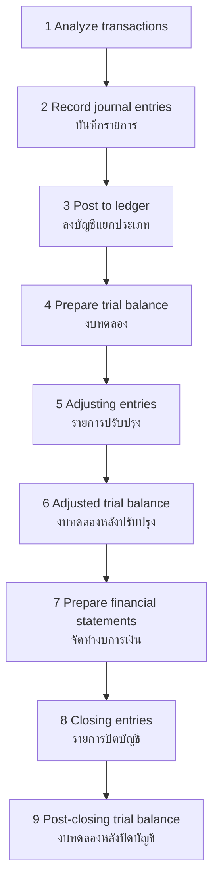

---
tags:
  - accounting
  - financial-accounting
  - TFRS
  - IFRS
  - financial-statements
source: "Federation of Accounting Professions; TFRS; Thai Accounting Standards"
created: 2026-07-27
domain: "Financial Accounting"
prerequisites: []
---

# 01 — Financial Accounting

> *"Financial accounting is how businesses tell their story — in numbers."*

Financial accounting is the foundation of the profession. It's the system of recording, classifying, summarizing, and reporting financial transactions to external stakeholders. Every accountant must master this before specializing. Taught in **Year 1–2**.

---

## 1 | The Accounting Equation

$$\text{Assets} = \text{Liabilities} + \text{Equity}$$

This is the bedrock. Every transaction affects at least two accounts (double-entry). The equation MUST always balance.

### 1.1 The Expanded Equation

$$\text{Assets} = \text{Liabilities} + \text{Capital} + \text{Revenue} - \text{Expenses}$$

| Component | Thai | Definition |
|---|---|---|
| **Assets** | สินทรัพย์ | Resources owned by the entity |
| **Liabilities** | หนี้สิน | Obligations owed to others |
| **Equity** | ส่วนของเจ้าของ / ทุน | Owner's residual interest |
| **Revenue** | รายได้ | Inflows from operations |
| **Expenses** | ค่าใช้จ่าย | Outflows from operations |

---

## 2 | The Accounting Cycle

---

## 3 | Financial Statements (งบการเงิน)

### 3.1 The Four Core Statements

| Statement | Thai | Purpose | Key Line Items |
|---|---|---|---|
| **Statement of Financial Position (Balance Sheet)** | งบแสดงฐานะการเงิน | What the entity owns and owes at a point in time | Assets (current + non-current), Liabilities, Equity |
| **Statement of Comprehensive Income (Income Statement)** | งบกำไรขาดทุนเบ็ดเสร็จ | Performance over a period | Revenue, COGS, Gross Profit, Operating Income, Net Income |
| **Statement of Cash Flows** | งบกระแสเงินสด | Cash movement over a period | Operating, Investing, Financing activities |
| **Statement of Changes in Equity** | งบแสดงการเปลี่ยนแปลงส่วนของเจ้าของ | How equity changed | Capital, Retained Earnings, OCI |

### 3.2 Balance Sheet Categories

| Assets | | Liabilities & Equity | |
|---|---|---|---|
| **Current Assets** | | **Current Liabilities** | |
| Cash | เงินสด | Accounts Payable | เจ้าหนี้การค้า |
| Accounts Receivable | ลูกหนี้การค้า | Short-term loans | เงินกู้ยืมระยะสั้น |
| Inventory | สินค้าคงเหลือ | Accrued expenses | ค่าใช้จ่ายค้างจ่าย |
| Prepaid expenses | ค่าใช้จ่ายจ่ายล่วงหน้า | Current portion of long-term debt | หนี้สินระยะยาวส่วนถึงกำหนดชำระ | |
| **Non-current Assets** | | **Non-current Liabilities** | |
| Property, Plant, Equipment | ที่ดิน อาคาร อุปกรณ์ | Long-term loans | เงินกู้ยืมระยะยาว |
| Intangible assets | สินทรัพย์ไม่มีตัวตน | Bonds payable | หุ้นกู้ |
| Investments | เงินลงทุน | | |
| | | **Equity** | |
| | | Share capital | ทุน |
| | | Retained earnings | กำไรสะสม |

---

## 4 | Key Accounting Concepts

| Concept | Thai | Meaning |
|---|---|---|
| **Accrual basis** | เกณฑ์คงค้าง | Record when earned/incurred, NOT when cash moves |
| **Going concern** | กิจการจะดำเนินต่อไป | Assume business will continue indefinitely |
| **Consistency** | ความสม่ำเสมอ | Use same methods period to period |
| **Materiality** | สาระสำคัญ | Only report items significant enough to affect decisions |
| **Prudence / Conservatism** | ความระมัดระวัง | Recognize losses early, gains only when realized |
| **Matching principle** | หลักการจับคู่ | Match expenses with related revenue in same period |
| **Historical cost** | ราคาทุนเดิม | Record at purchase price (modified by some TFRS) |
| **Fair value** | มูลค่ายุติธรรม | Market-based measurement (increasingly used in TFRS) |

---

## 5 | Thai Financial Reporting Standards (TFRS)

Thailand has aligned its accounting standards with **International Financial Reporting Standards (IFRS)** since 2011.

| Standard | Thai | Topic |
|---|---|---|
| **TFRS 1** | TFRS 1 | First-time Adoption of TFRS |
| **TAS 1** | TAS 1 | Presentation of Financial Statements |
| **TAS 2** | TAS 2 | Inventories |
| **TAS 7** | TAS 7 | Statement of Cash Flows |
| **TAS 16** | TAS 16 | Property, Plant and Equipment |
| **TAS 36** | TAS 36 | Impairment of Assets |
| **TFRS 9** | TFRS 9 | Financial Instruments |
| **TFRS 15** | TFRS 15 | Revenue from Contracts with Customers |
| **TFRS 16** | TFRS 16 | Leases |
| **TFRS 17** | TFRS 17 | Insurance Contracts |

---

## 6 | Key Terminology

| Thai | English | Notes |
|---|---|---|
| บัญชีคู่ | Double-Entry System | Every transaction = debit + credit |
| เดบิต / เครดิต | Debit / Credit | Left side / Right side |
| งบการเงิน | Financial Statements | BS, IS, CF, Equity |
| งบทดลอง | Trial Balance | List of all account balances |
| รายการปรับปรุง | Adjusting Entries | End-of-period adjustments |
| TFRS / TAS | Thai Financial Reporting Standards | IFRS-aligned |
| ราคาทุน / มูลค่ายุติธรรม | Historical Cost / Fair Value | Measurement bases |
| เกณฑ์คงค้าง | Accrual Basis | Recognize when earned/incurred |
| กำไรสะสม | Retained Earnings | Cumulative net income not distributed |
| ค่าเสื่อมราคา | Depreciation | Systematic allocation of asset cost |

---

## Related Notes

- [[02_Managerial_Accounting]] — Internal accounting for decision-making
- [[03_Auditing_and_Assurance]] — Verifying financial statements
- [[04_Taxation]] — Tax reporting based on financial accounting
- [[Accountant - Overview]] — Return to accounting overview
