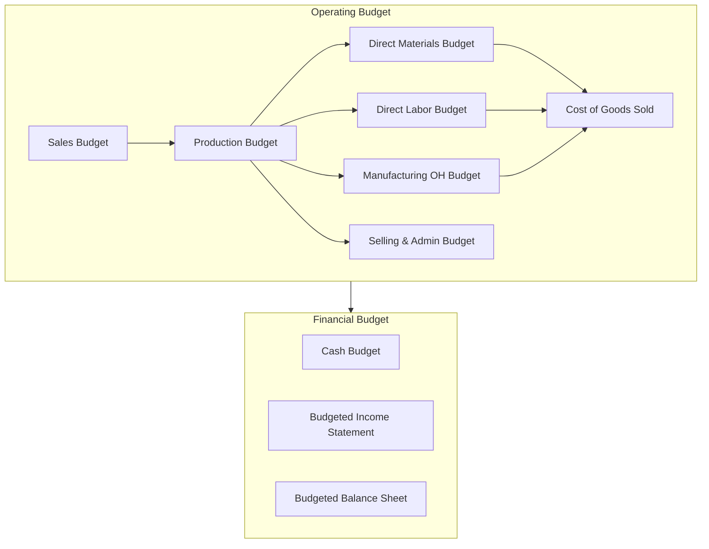

---
tags:
  - accounting
  - managerial-accounting
  - cost-accounting
  - budgeting
  - CVP
source: "Federation of Accounting Professions; IMA"
created: 2026-07-27
domain: "Managerial Accounting"
prerequisites: ["[[01_Financial_Accounting]]"]
---

# 02 — Managerial Accounting

> *"Financial accounting looks backward. Managerial accounting looks forward."*

Managerial (management) accounting provides information to **internal users** — managers, executives, department heads — for planning, control, and decision-making. While financial accounting follows strict rules (TFRS), managerial accounting is flexible: whatever helps the manager decide.

---

## 1 | Cost Accounting (การบัญชีต้นทุน)

### 1.1 Cost Classification

| By Nature | Thai | Examples |
|---|---|---|
| **Direct Materials** | วัตถุดิบทางตรง | Raw materials traceable to product |
| **Direct Labor** | ค่าแรงทางตรง | Wages traceable to product |
| **Manufacturing Overhead** | ค่าใช้จ่ายในการผลิต | Factory rent, utilities, indirect labor |

| By Behavior | Thai | Definition |
|---|---|---|
| **Fixed Costs** | ต้นทุนคงที่ | Don't change with volume (rent, salary) |
| **Variable Costs** | ต้นทุนผันแปร | Change proportionally with volume (materials, direct labor) |
| **Mixed Costs** | ต้นทุนผสม | Both fixed and variable components (electricity) |

### 1.2 Cost-Volume-Profit (CVP) Analysis

$$\text{Profit} = \text{Revenue} - \text{Total Costs}$$
$$\text{Profit} = (P \times Q) - (V \times Q) - F$$

Where: P = Price, Q = Quantity, V = Variable cost per unit, F = Fixed costs

**Break-even point (จุดคุ้มทุน):**

$$Q_{BE} = \frac{F}{P - V}$$

> **Example:** Fixed costs = ฿100,000/month; Price = ฿50/unit; Variable cost = ฿30/unit
> Break-even = 100,000 / (50 - 30) = 5,000 units

### 1.3 Contribution Margin

| Metric | Formula | Meaning |
|---|---|---|
| **Contribution Margin (CM)** | Revenue - Variable Costs | Amount available to cover fixed costs + profit |
| **CM Ratio** | CM / Revenue | % of each sales baht available for fixed costs + profit |
| **CM per Unit** | Price - Variable Cost per unit | Per-unit contribution |

---

## 2 | Budgeting (การจัดทำงบประมาณ)

### 2.1 The Master Budget

### 2.2 Budgeting Methods

| Method | Description | Pros / Cons |
|---|---|---|
| **Incremental** | Last year + X% | Simple but perpetuates inefficiency |
| **Zero-Based** | Start from zero; justify every expense | Thorough but time-consuming |
| **Activity-Based** | Budget by activities/drivers | Accurate but complex |
| **Rolling / Continuous** | Always 12 months ahead | Forward-looking but labor-intensive |
| **Flexible** | Adjusts for actual volume | Better performance evaluation |

---

## 3 | Variance Analysis (การวิเคราะห์ความแปรปรวน)

| Variance | Formula | Favorable When... |
|---|---|---|
| **Material Price** | (AP - SP) x AQ | Actual price < Standard price |
| **Material Usage** | (AQ - SQ) x SP | Actual quantity < Standard quantity |
| **Labor Rate** | (AR - SR) x AH | Actual rate < Standard rate |
| **Labor Efficiency** | (AH - SH) x SR | Actual hours < Standard hours |
| **Variable OH Spending** | (AP - SP) x AQ | Actual < Standard |
| **Variable OH Efficiency** | (AQ - SQ) x SP | Actual quantity < Standard |

> **"Favorable" = actual cost < budgeted cost** (savings). But sometimes unfavorable variances indicate quality problems (e.g., buying cheaper materials = unfavorable quality).

---

## 4 | Activity-Based Costing (ABC)

| Step | Description |
|---|---|
| **1. Identify activities** | Receiving, machining, quality inspection, packaging |
| **2. Assign costs to activity pools** | Pool all costs for each activity |
| **3. Identify cost drivers** | # of setups, machine hours, inspections, orders |
| **4. Calculate activity rate** | Pool cost / Total driver units |
| **5. Assign to products** | Rate x Driver usage per product |

**Why ABC matters:** Traditional costing (overhead allocated by one driver, e.g., direct labor hours) can distort product costs. ABC gives more accurate costs, especially when products differ in complexity.

---

## 5 | Relevant Costing for Decisions

| Decision | Relevant Costs | Irrelevant Costs |
|---|---|---|
| **Make or buy** | Incremental production cost vs. purchase price | Sunk costs, unavoidable fixed costs |
| **Special order** | Variable cost of the order | Fixed costs that won't change |
| **Keep or drop product** | Contribution margin lost vs. fixed costs saved | Allocated common costs |
| **Sell or process further** | Incremental revenue vs. incremental processing cost | Joint costs already incurred |

---

## 6 | Key Terminology

| Thai | English | Notes |
|---|---|---|
| บัญชีบริหาร | Management Accounting | Internal decision support |
| บัญชีต้นทุน | Cost Accounting | Tracking and analyzing costs |
| จุดคุ้มทุน | Break-Even Point | Revenue = Total costs |
| อัตรากำไรส่วนเพิ่ม | Contribution Margin | Revenue - Variable costs |
| งบประมาณ | Budget | Financial plan |
| ความแปรปรวน | Variance | Actual vs. Standard/Budget |
| ต้นทุนฐานกิจกรรม (ABC) | Activity-Based Costing | More accurate overhead allocation |
| ต้นทุนคงที่ / ผันแปร | Fixed / Variable Costs | Cost behavior classification |
| ต้นทุนที่เกี่ยวข้อง | Relevant Cost | Future, different between alternatives |
| ต้นทุนจม | Sunk Cost | Past cost, irrelevant to decisions |

---

## Related Notes

- [[01_Financial_Accounting]] — External reporting foundation
- [[03_Auditing_and_Assurance]] — Control and verification
- [[05_Finance_and_Forensic_Accounting]] — Financial analysis and corporate finance
- [[Accountant - Overview]] — Return to accounting overview
