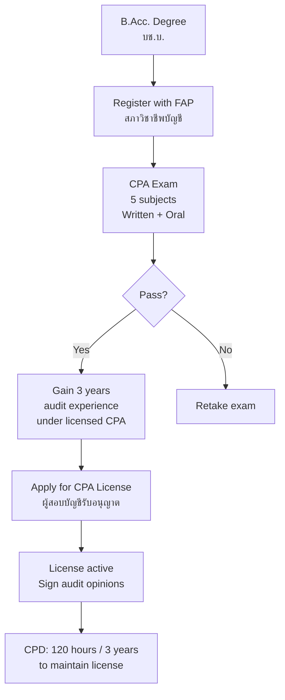
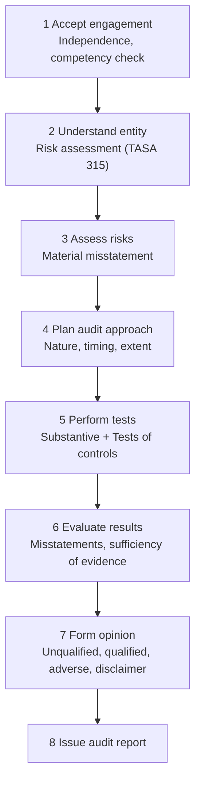

---
tags:
  - accounting
  - auditing
  - CPA
  - internal-control
  - assurance
source: "Federation of Accounting Professions; TASA; ISA"
created: 2026-07-27
domain: "Auditing & Assurance"
prerequisites: ["[[01_Financial_Accounting]]"]
---

# 03 — Auditing & Assurance

> *"An auditor's opinion is worthless without independence. Independence is worthless without competence."*

Auditing is the independent examination of financial statements to determine whether they present fairly the financial position and results of operations. This is the path to becoming a **CPA (ผู้สอบบัญชีรับอนุญาต)** — one of the most respected credentials in business.

---

## 1 | Types of Audits

| Type | Auditor | Purpose |
|---|---|---|
| **External Audit** | Independent CPA / Audit firm | Express opinion on financial statements |
| **Internal Audit** | Organization's own audit department | Evaluate internal controls, risk management, governance |
| **Government Audit** | State Audit Commission (สตง.) | Audit government agencies |
| **Tax Audit** | Revenue Department auditors | Verify tax compliance |
| **Forensic Audit** | Forensic accountant | Investigate fraud, litigation support |
| **Special Audit** | Varies | Specific investigations (e.g., IPO, M&A due diligence) |

---

## 2 | CPA Licensing Path (Thailand)

### 2.1 CPA Exam Subjects (5 Papers)

| Paper | Thai | Content |
|---|---|---|
| **1** | ความรู้ทั่วไปด้านบัญชี | Financial accounting, TFRS/TAS |
| **2** | กฎหมายภาษีอากร | Revenue Code, tax planning |
| **3** | กฎหมายที่เกี่ยวข้อง | Civil & Commercial Code, bankruptcy, labor law |
| **4** | การสอบบัญชี | Audit standards (TASA/ISA), procedures, ethics |
| **5** | บัญชีการจัดการและวิเคราะห์ | Management accounting, financial analysis |

**Pass rate:** ~30–50% per sitting — preparation is essential.

---

## 3 | Audit Standards

### 3.1 Thai Standards on Auditing (TASA)

Thailand has aligned its audit standards with **International Standards on Auditing (ISA)** issued by the IAASB.

| Standard | Topic |
|---|---|
| **TASA 200** | Overall Objectives and Conduct of an Audit |
| **TASA 230** | Audit Documentation (Working Papers) |
| **TASA 240** | The Auditor's Responsibilities Relating to Fraud |
| **TASA 300** | Planning an Audit of Financial Statements |
| **TASA 315** | Understanding the Entity and Its Environment |
| **TASA 330** | The Auditor's Responses to Assessed Risks |
| **TASA 500** | Audit Evidence |
| **TASA 520** | Analytical Procedures |
| **TASA 530** | Sampling |
| **TASA 570** | Going Concern |
| **TASA 700** | Forming an Opinion and Reporting |

### 3.2 The Audit Process

---

## 4 | Key Audit Concepts

### 4.1 Materiality

| Type | Definition |
|---|---|
| **Overall materiality** | Maximum acceptable misstatement in financial statements as a whole |
| **Performance materiality** | Lower threshold for individual accounts (reduces aggregation risk) |
| **Trivial threshold** | Below this, misstatements don't need to be accumulated |

**Rule of thumb:** Overall materiality often 1–5% of profit before tax, 0.5–1% of total revenue, or 1–2% of total assets — depends on entity.

### 4.2 Audit Risk Model

$$\text{Audit Risk} = \text{Inherent Risk} \times \text{Control Risk} \times \text{Detection Risk}$$

| Risk | Meaning | Auditor Response |
|---|---|---|
| **Inherent Risk** | Risk of misstatement before considering controls | Higher risk = more substantive testing |
| **Control Risk** | Risk that controls fail to prevent/detect | Test controls |
| **Detection Risk** | Risk that auditor fails to detect misstatement | Adjust nature, timing, extent of procedures |

### 4.3 Audit Evidence

| Type | Reliability |
|---|---|
| **External confirmation** (bank, supplier, customer) | Highest |
| **Auditor's direct observation** | High |
| **Documents created by third parties** | High |
| **Internal documents** | Moderate |
| **Verbal representations** | Lowest |

### 4.4 Audit Opinions

| Opinion | When Issued | Report Type |
|---|---|---|
| **Unqualified (ไม่มีเงื่อนไข)** | FS present fairly in all material respects | Clean — standard report |
| **Qualified (มีข้อสงวน)** | Material misstatement OR scope limitation (but not pervasive) | "Except for..." paragraph |
| **Adverse (ไม่แสดงความเห็น)** | Misstatement is material AND pervasive | FS do NOT present fairly |
| **Disclaimer (ไม่แสดงความเห็น)** | Unable to obtain sufficient evidence; scope limitation is material AND pervasive | Cannot form an opinion |

---

## 5 | Internal Controls

### 5.1 COSO Framework

| Component | Description |
|---|---|
| **Control Environment** | Tone at the top; integrity, ethics, governance |
| **Risk Assessment** | Identify and analyze risks to achieving objectives |
| **Control Activities** | Policies and procedures: approvals, authorizations, verifications, segregation of duties |
| **Information & Communication** | Relevant, quality information flows to the right people |
| **Monitoring Activities** | Ongoing evaluations and separate evaluations |

### 5.2 Key Controls

| Control | Purpose |
|---|---|
| **Segregation of duties** | No one person handles authorization, custody, AND recording |
| **Authorization / Approval** | Transactions require management sign-off |
| **Physical controls** | Safes, locks, restricted access to inventory |
| **Reconciliation** | Bank rec, AR/AP aging, inventory counts |
| **Independent review** | Supervisor reviews subordinates' work |

---

## 6 | Key Terminology

| Thai | English | Notes |
|---|---|---|
| การสอบบัญชี | Audit | Independent examination |
| ผู้สอบบัญชีรับอนุญาต (CPA) | Certified Public Accountant | Licensed auditor |
| TASA / ISA | Thai/International Standards on Auditing | Audit standards |
| ความเป็นอิสระ | Independence | Cornerstone of auditing |
| สาระสำคัญ | Materiality | Significance threshold |
| ความเสี่ยงในการสอบบัญชี | Audit Risk | Risk of wrong opinion |
| หลักฐานการสอบบัญชี | Audit Evidence | Basis for opinion |
| รายงานการสอบบัญชี | Audit Report | Final deliverable |
| การควบคุมภายใน | Internal Controls | Safeguarding assets, reliable reporting |
| COSO | Committee of Sponsoring Organizations | Internal control framework |

---

## Related Notes

- [[01_Financial_Accounting]] — What auditors examine
- [[04_Taxation]] — Tax audits are a separate discipline
- [[05_Finance_and_Forensic_Accounting]] — Forensic investigations
- [[Accountant - Overview]] — Return to accounting overview
