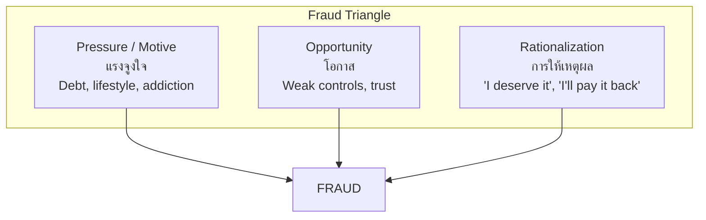

---
tags:
  - accounting
  - finance
  - forensic-accounting
  - financial-analysis
  - corporate-finance
source: "SET; SEC; CFA Institute; ACFE"
created: 2026-07-27
domain: "Finance & Forensic Accounting"
prerequisites: ["[[01_Financial_Accounting]]", "[[02_Managerial_Accounting]]"]
---

# 05 — Finance & Forensic Accounting

> *"Finance is the art of passing money from hand to hand until it finally disappears."* — Robert W. Sarnoff

This domain covers two growth areas: **corporate finance** (analyzing, valuing, and financing businesses) and **forensic accounting** (investigating financial fraud and crime). Both require strong accounting foundations plus specialized skills.

---

## Part A: Corporate Finance & Analysis

### 1 | Financial Statement Analysis

#### 1.1 Ratio Analysis

| Category | Ratio | Formula | Interpretation |
|---|---|---|---|
| **Liquidity** | Current Ratio | Current Assets / Current Liabilities | > 1.5 is healthy |
| | Quick Ratio | (CA - Inventory) / CL | > 1.0 is strong |
| **Profitability** | Gross Profit Margin | Gross Profit / Revenue | Higher = better pricing power |
| | Net Profit Margin | Net Income / Revenue | Bottom line efficiency |
| | ROA | Net Income / Total Assets | Asset utilization |
| | ROE | Net Income / Equity | Return to shareholders |
| **Efficiency** | Inventory Turnover | COGS / Average Inventory | Higher = faster selling |
| | AR Turnover | Revenue / Average AR | Collecting receivables |
| | Asset Turnover | Revenue / Total Assets | Revenue per baht of assets |
| **Leverage** | Debt-to-Equity | Total Debt / Total Equity | Higher = more risk |
| | Interest Coverage | EBIT / Interest Expense | Can service debt? |

#### 1.2 DuPont Analysis

$$\text{ROE} = \text{Net Margin} \times \text{Asset Turnover} \times \text{Equity Multiplier}$$

This decomposes ROE into profitability, efficiency, and leverage — showing WHERE returns come from.

---

### 2 | Valuation

| Method | Approach | When to Use |
|---|---|---|
| **Discounted Cash Flow (DCF)** | Present value of future cash flows | Companies with predictable cash flows |
| **Comparable Company Analysis** | Valuation multiples (P/E, EV/EBITDA) of similar companies | Quick relative valuation |
| **Precedent Transactions** | Multiples from recent M&A deals | M&A pricing |
| **Asset-Based** | Net asset value (NAV) | Asset-heavy businesses, holding companies |

**Common multiples:**
- P/E = Price / Earnings per share
- EV/EBITDA = Enterprise Value / EBITDA
- P/BV = Price / Book Value

---

### 3 | Corporate Finance Topics

| Topic | Key Concepts |
|---|---|
| **Capital structure** | Debt vs. equity mix; WACC (Weighted Average Cost of Capital) |
| **Working capital management** | Cash conversion cycle, AR/AP/inventory management |
| **Capital budgeting** | NPV, IRR, Payback Period — evaluating investment projects |
| **Mergers & Acquisitions** | Due diligence, synergy analysis, deal structuring |
| **Dividend policy** | Payout ratio, dividend yield, share buybacks |
| **Corporate governance** | Board composition, shareholder rights, SET regulations |

---

### 4 | Investment & Securities

| Topic | Relevance to Accountants |
|---|---|
| **SET (Stock Exchange of Thailand)** | Listed companies — accounting disclosure requirements |
| **SEC (ก.ล.ต.)** | Securities regulation — financial reporting oversight |
| **CFA (Chartered Financial Analyst)** | Investment analysis credential — complementary to CPA |
| **Fund accounting** | NAV calculation for mutual funds, private equity |

---

## Part B: Forensic Accounting (นิติบัญชี)

### 5 | What Is Forensic Accounting?

Forensic accounting uses accounting, auditing, and investigative skills to examine financial fraud, litigation, and disputes. It's where accounting meets the courtroom.

### 6 | Fraud Triangle

### 7 | Types of Occupational Fraud

| Category | Examples |
|---|---|
| **Asset Misappropriation** | Theft of cash (lapping, skimming), fraudulent disbursements, inventory theft |
| **Financial Statement Fraud** | Revenue overstatement, expense understatement, improper disclosures |
| **Corruption** | Bribery, kickbacks, conflicts of interest, bid rigging |

### 8 | Forensic Investigation Process

| Phase | Activities |
|---|---|
| **1. Planning** | Understand allegations, scope, legal requirements, team |
| **2. Data Collection** | Gather financial records, emails, bank statements, contracts |
| **3. Analysis** | Benford's Law, trend analysis, ratio analysis, document examination |
| **4. Interviews** | Interview suspects and witnesses (document carefully) |
| **5. Reporting** | Written report with findings, evidence, and conclusions |
| **6. Testimony** | Expert witness in court (if needed) |

### 9 | Red Flags of Fraud

| Red Flag | What to Look For |
|---|---|
| **Lifestyle inconsistency** | Employee living beyond apparent means |
| **Reluctance to take leave** | Doesn't want others examining their work |
| **Missing documents** | "Lost" invoices, receipts, contracts |
| **Round-number transactions** | Unusual concentration of exact amounts |
| **Late journal entries** | Adjustments made after period close |
| **Vendor anomalies** | PO Box addresses, no phone number, similar name to employee |
| **Ratio deviations** | Unusual changes in AR, inventory, revenue patterns |

### 10 | Forensic Tools & Techniques

| Tool/Technique | Application |
|---|---|
| **Benford's Law** | First-digit distribution analysis — detects fabricated numbers |
| **Data analytics** | Large dataset analysis (ACL, IDEA, Excel Power Query) |
| **Digital forensics** | Email analysis, metadata examination, deleted file recovery |
| **Lifestyle analysis** | Compare known income to visible spending |
| **Net worth analysis** | Track changes in assets, liabilities, and living expenses |
| **Bank deposit method** | Reconstruct income from bank deposits |

---

## 11 | Key Terminology

| Thai | English | Notes |
|---|---|---|
| การวิเคราะห์งบการเงิน | Financial Statement Analysis | Ratio, trend, DuPont |
| มูลค่ากิจการ | Business Valuation | DCF, multiples, NAV |
| ต้นทุนถัวเฉลี่ยถ่วงน้ำหนัก (WACC) | Weighted Average Cost of Capital | Discount rate |
| นิติบัญชี | Forensic Accounting | Fraud investigation |
| สามเหลี่ยมแห่งการทุจริต | Fraud Triangle | Pressure + Opportunity + Rationalization |
| การยักยอกทรัพย์ | Asset Misappropriation | Theft of company assets |
| กฎหมายเบนฟอร์ด | Benford's Law | Statistical fraud detection |
| การตรวจสอบย้อนกลับ | Tracing / Tracing | Following money trail |
| พยานผู้เชี่ยวชาญ | Expert Witness | Testimony in court |
| ตลาดหลักทรัพย์ (SET) | Stock Exchange of Thailand | Listed company requirements |

---

## Related Notes

- [[01_Financial_Accounting]] — Foundation for all finance and forensic work
- [[02_Managerial_Accounting]] — Internal decision support
- [[03_Auditing_and_Assurance]] — Forensic audit = specialized external audit
- [[04_Taxation]] — Tax fraud investigation
- [[Accountant - Overview]] — Return to accounting overview
