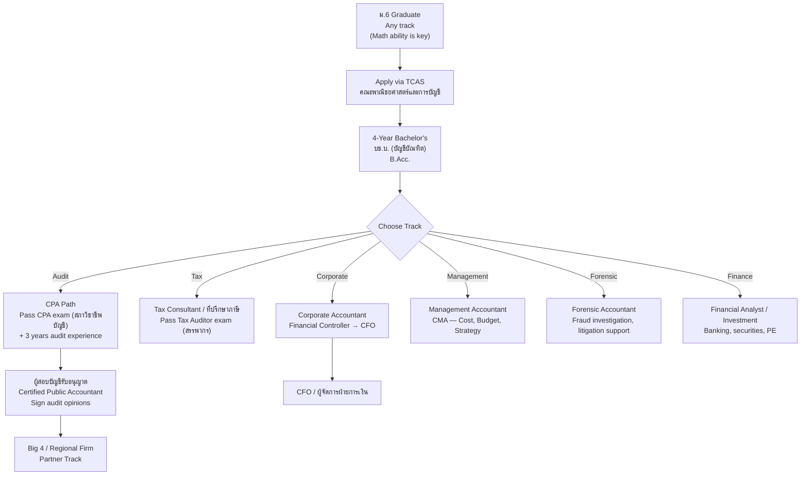

---
tags:
  - overview
  - accounting
  - auditing
  - tax
  - finance
  - career
  - thai-education
source: "Accounting Professions Act B.E. 2547 (2004); Federation of Accounting Professions (สภาวิชาชีพบัญชี)"
created: 2026-07-27
profession: "นักบัญชี / ผู้สอบบัญชี (Accountant / CPA)"
degree: "บช.บ. (บัญชีบัณฑิต) — Bachelor of Accountancy"
duration: "4 ปี (4 years)"
---

# Accounting — วิชาชีพบัญชี

> *"Accounting is the language of business."* — Warren Buffett

> *"ผู้ประกอบวิชาชีพบัญชี คือ ผู้ซึ่งได้รับใบอนุญาตเป็นผู้ทำบัญชี หรือผู้สอบบัญชีรับอนุญาต จากสภาวิชาชีพบัญชี"* — พ.ร.บ. วิชาชีพบัญชี พ.ศ. 2547

## What Is This?

This is a **career guidance knowledge base** for Thai students considering accounting as a profession. It covers what accounting is, the major specializations, how to get licensed, where you can study, and what career paths exist — from bookkeeping to Big 4 auditing to CFO.

Accounting in Thailand is regulated by the **Accounting Professions Act B.E. 2547 (2004)** — พระราชบัญญัติวิชาชีพบัญชี พ.ศ. 2547, administered by the **Federation of Accounting Professions (สภาวิชาชีพบัญชี — FAP)**.

> **Every business needs an accountant.** From a street noodle stall to PTT, accounting is the backbone of financial decision-making, tax compliance, and business strategy.

## Education & Career Pathways

## The 5 Knowledge Domains

### 📊 Core
- [[01_Financial_Accounting|01 Financial Accounting]] — Double-entry, Thai Accounting Standards (TFRS), financial statements, IFRS alignment

### 📋 Management
- [[02_Managerial_Accounting|02 Managerial Accounting]] — Cost accounting, budgeting, variance analysis, break-even, CVP analysis

### 🔍 Audit
- [[03_Auditing_and_Assurance|03 Auditing & Assurance]] — CPA licensing, audit procedures, internal control, fraud detection, TASA standards

### 💰 Tax
- [[04_Taxation|04 Taxation]] — Revenue Code, VAT, corporate/personal income tax, withholding tax, tax planning, tax audit

### 🔬 Specialized
- [[05_Finance_and_Forensic_Accounting|05 Finance & Forensic Accounting]] — Financial analysis, corporate finance, investment, forensic investigation, accounting information systems

### 🎓 Career Pathways
- [[00_University_Guide_and_Career_Paths|University Guide & Career Paths]] — Top accounting faculties, CPA path, Big 4, salaries, career ladder

## The Accounting Profession in Thailand

### Regulatory Bodies

| Organization | Thai Name | Role |
|---|---|---|
| **Federation of Accounting Professions (FAP)** | สภาวิชาชีพบัญชี | Licensing, standards (TFRS/TAS), ethics, continuing education |
| **Revenue Department** | กรมสรรพากร | Tax law, tax auditor licensing |
| **Securities and Exchange Commission (SEC)** | สำนักงาน ก.ล.ต. | Financial reporting for listed companies |
| **Stock Exchange of Thailand (SET)** | ตลาดหลักทรัพย์แห่งประเทศไทย | Listing requirements, corporate governance |
| **Comptroller General's Department** | กรมบัญชีกลาง | Government accounting standards |

### Types of Accounting Licenses

| License | Thai | Issued By | Requirements |
|---|---|---|---|
| **Certified Public Accountant (CPA)** | ผู้สอบบัญชีรับอนุญาต | สภาวิชาชีพบัญชี | B.Acc + CPA exam + 3 years audit experience |
| **Registered Accountant** | ผู้ทำบัญชี | สภาวิชาชีพบัญชี | B.Acc + training |
| **Tax Auditor** | ผู้สอบบัญชีภาษีอากร | กรมสรรพากร | CPA + Tax exam |
| **Certified Internal Auditor (CIA)** | ผู้สอบบัญชีภายใน | IIA (international) | Exam + experience |
| **Certified Management Accountant (CMA)** | นักบัญชีการจัดการ | IMA (international) | Exam + experience |

---

## Key Terminology

| Thai | English | Notes |
|---|---|---|
| บัญชี | Accounting | The profession and the practice |
| ผู้สอบบัญชีรับอนุญาต (CPA) | Certified Public Accountant | Can sign audit opinions |
| ผู้ทำบัญชี | Registered Accountant | Can do bookkeeping |
| งบการเงิน | Financial Statements | BS, IS, CF, Equity |
| บันทึกบัญชี | Journal Entry | Record transactions |
| TFRS | Thai Financial Reporting Standards | IFRS-aligned |
| TAS | Thai Accounting Standards | Thai-specific standards |
| สภาวิชาชีพบัญชี (FAP) | Federation of Accounting Professions | Regulatory body |
| Big 4 | Big 4 Firms | PwC, Deloitte, EY, KPMG |
| สรรพากร | Revenue Department | Tax authority |

---

## Reading Paths

- **High school student exploring:** Start → [[00_University_Guide_and_Career_Paths|University Guide]] → CPA path
- **Accounting student:** [[01_Financial_Accounting|Core]] → [[03_Auditing_and_Assurance|Audit]] → CPA exam
- **Tax specialist:** [[04_Taxation|Tax]] → Tax Auditor exam
- **Corporate track:** [[02_Managerial_Accounting|Management]] → [[05_Finance_and_Forensic_Accounting|Finance]]
- **Parent/guidance counselor:** [[00_University_Guide_and_Career_Paths|University Guide]]

---

> **Related Careers:** [[Lawyer - Overview|Law]] (tax law, corporate law), [[../engineer/Engineer - Overview|Engineering]] (cost engineering), [[../psychologist/Psychologist - Overview|Psychology]] (forensic accounting)
