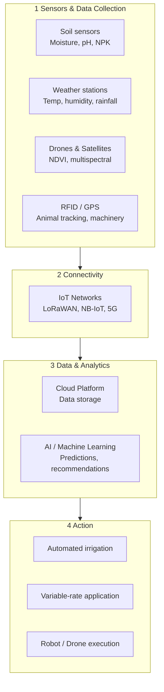

---
tags:
  - agriculture
  - smart-farming
  - precision-agriculture
  - IoT
  - agritech
source: "Ministry of Agriculture; Depa (Digital Economy Promotion Agency); AgriTech reports"
created: 2026-07-27
domain: "Smart Farming Technology"
prerequisites: ["[[01_Agricultural_Science]]"]
---

# 02 — Smart Farming Technology

> *"Farming of the future will be done by technicians in lab coats, not peasants in straw hats."*

Smart farming — also called **Agriculture 4.0** or **Precision Agriculture** — uses technology to increase yields, reduce costs, and minimize environmental impact. This is where agriculture meets engineering, data science, and AI. It's the fastest-growing part of the sector.

---

## 1 | The Technology Stack

---

## 2 | Key Technologies

### 2.1 IoT Sensors & Monitoring

| Sensor Type | What It Measures | Application |
|---|---|---|
| **Soil moisture** | Volumetric water content | Smart irrigation — water only when needed |
| **Soil NPK** | Nitrogen, Phosphorus, Potassium | Precision fertilization |
| **Weather station** | Temperature, humidity, rainfall, wind, solar radiation | Planting/harvesting decisions, disease forecasting |
| **Leaf wetness** | Surface moisture on leaves | Disease prediction (fungal pathogens) |
| **Water quality** | DO, pH, EC, ammonia | Aquaculture — auto aerator control |
| **Collar sensors** | Cow activity, rumination, temperature | Heat detection, health monitoring |

### 2.2 Drones & Remote Sensing

| Technology | What It Does | Agricultural Use |
|---|---|---|
| **RGB Camera** | Standard aerial photos | Crop scouting, damage assessment |
| **Multispectral** | Vegetation indices (NDVI, NDRE) | Crop health, nutrient status, biomass |
| **Thermal** | Temperature mapping | Water stress detection, irrigation leaks |
| **LiDAR** | 3D point cloud | Terrain mapping, orchard canopy analysis |
| **Spray drone** | Precision spraying | Spot-treatment of weeds/pests — reduces chemical use 30–90% |

**Thai context:** Drone use is EXPLODING in Thai agriculture — especially for sugar cane (fertilizer), rice (pesticide), and durian orchards (spraying). DJI Agras is common. Regulations by CAAT.

### 2.3 Precision Agriculture

| Technique | Description | Benefit |
|---|---|---|
| **Variable Rate Technology (VRT)** | Apply fertilizer/pesticide at different rates across a field based on soil maps | Save 20–40% on inputs |
| **Auto-steering / GPS Guidance** | Tractors drive themselves with centimeter accuracy | Reduce overlap, operator fatigue |
| **Yield mapping** | Combine harvesters record yield by GPS position | Identify high/low-performing zones |
| **Grid soil sampling** | Soil tested in grid pattern | Create prescription maps for VRT |

### 2.4 Controlled Environment Agriculture (CEA)

| System | Description | Crops |
|---|---|---|
| **Smart Greenhouse** | Climate-controlled with sensors, automated vents/fans/shade | High-value vegetables, orchids |
| **Hydroponics** | Plants grown in nutrient solution, no soil | Lettuce, herbs, strawberries |
| **Aquaponics** | Fish + plants in closed loop (fish waste feeds plants) | Tilapia + vegetables |
| **Vertical Farming** | Stacked layers, LED lighting, climate control | Leafy greens, microgreens |
| **Plant Factory (โรงงานผลิตพืช)** | Fully enclosed, artificial light, CO₂ enrichment | Premium Japanese melons, lettuce |

**Thai startups in CEA:** Wangree Fresh, Green2Get, Bangkok Rooftop Farming, Plant Factory by มก.

### 2.5 AI & Data Analytics

| Application | How AI Helps |
|---|---|
| **Pest/disease detection** | Camera + deep learning → identify pests with 95%+ accuracy (e.g., Plantix app) |
| **Yield prediction** | Weather + soil + historical data → forecast yield months ahead |
| **Price forecasting** | Market data + seasonality → predict commodity prices |
| **Feed optimization** | AI feed formulation for livestock/aquaculture |
| **Chatbot advisors** | Farmers ask questions via LINE → AI answers (e.g., FarmDee, Ricult) |
| **Carbon accounting** | Measure farm carbon footprint for carbon credit sales |

### 2.6 AgriTech Startups in Thailand

| Startup | Focus |
|---|---|
| **Ricult** | AI credit scoring + farm advisory for smallholders |
| **FarmDee** | Smart farm management platform (IoT + data) |
| **ListenField** | AI crop modeling and yield prediction |
| **Freshket** | Farm-to-restaurant supply chain platform |
| **Coral** | Sustainable shrimp farming with probiotics |
| **Easy Rice** | Digital rice trading platform |
| **Eden Agritech** | Food shelf-life extension technology |

---

## 3 | Agri 4.0 Policy Landscape (Thailand)

| Policy / Initiative | Description |
|---|---|
| **Thailand 4.0** | National strategy — agriculture as one of 5 target industries |
| **BCG Model (Bio-Circular-Green)** | National agenda — sustainable agriculture is a core pillar |
| **EEC** | Eastern Economic Corridor — agri-food innovation hub |
| **Smart Farmer Project** | MOAC training program — train 5,000+ smart farmers |
| **Digital Agriculture** | Depa (Digital Economy Promotion Agency) — grants for AgriTech |
| **Young Smart Farmer** | Ministry of Agriculture program for next-gen farmers |

---

## 4 | Key Terminology

| Thai | English | Notes |
|---|---|---|
| เกษตรแม่นยำ | Precision Agriculture | Data-driven input optimization |
| เกษตรอัจฉริยะ | Smart Farming | IoT + AI in agriculture |
| โดรนการเกษตร | Agricultural Drone | Spraying, mapping, monitoring |
| เซนเซอร์ IoT | IoT Sensor | Real-time monitoring |
| ไฮโดรโปนิกส์ | Hydroponics | Soilless cultivation |
| อะควาโปนิกส์ | Aquaponics | Fish + plant integrated system |
| การให้ปุ๋ยแบบแปรผัน (VRT) | Variable Rate Technology | Precision fertilizer application |
| NDVI | Normalized Difference Vegetation Index | Satellite/drone plant health measure |
| โรงงานผลิตพืช | Plant Factory | Fully controlled indoor farming |
| เกษตรอัจฉริยะรุ่นใหม่ (YSF) | Young Smart Farmer | Government program |

---

## Related Notes

- [[01_Agricultural_Science]] — The science that technology enhances
- [[03_Agribusiness_Management]] — Business side of AgriTech
- [[04_Sustainable_Agriculture]] — Tech for sustainability
- [[Agriculture - Overview]] — Return to agriculture overview
