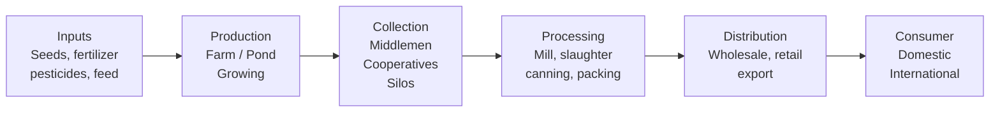

---
tags:
  - agriculture
  - agribusiness
  - supply-chain
  - export
  - commodity-trading
source: "Ministry of Commerce; BAAC; Thai Chamber of Commerce"
created: 2026-07-27
domain: "Agribusiness Management"
prerequisites: ["[[01_Agricultural_Science]]"]
---

# 03 — Agribusiness Management

> *"You can grow the best rice in the world. If you can't sell it, you don't have a business — you have a hobby."*

Agribusiness is the business of agriculture — from seed to shelf. It covers supply chain management, commodity trading, export logistics, contract farming, and agricultural finance. Many of Thailand's wealthiest families (CP, ThaiBev, Mitr Phol) built their fortunes here.

---

## 1 | The Agricultural Supply Chain

### 1.1 Value at Each Stage

| Stage | Rice Value Example (per kg) | Who Captures It |
|---|---|---|
| **Farm gate (ข้าวเปลือก)** | ฿8–฿12 | Farmer |
| **Milling (ข้าวสาร)** | ฿20–฿30 | Miller |
| **Branded retail** | ฿40–฿80 | Brand/retailer |
| **Premium export (e.g., organic jasmine)** | ฿60–฿120 | Exporter + brand |

> **Key insight:** The biggest money is in PROCESSING and BRANDING, not raw production. This is where agribusiness professionals work.

---

## 2 | Key Agribusiness Functions

### 2.1 Commodity Trading

| Concept | Description |
|---|---|
| **Spot market** | Buy/sell physical commodity immediately at current price |
| **Forward contract** | Agree on price today for delivery in the future — hedges risk |
| **Futures market** | Standardized contracts traded on exchanges (AFET — Agricultural Futures Exchange of Thailand) |
| **Basis** | Difference between local cash price and futures price |
| **Hedging** | Reduce price risk — farmer sells forward, processor buys forward |

**Thai context:** AFET trades rubber, rice, tapioca. But most trading is OTC (over-the-counter) through brokers and commodity houses.

### 2.2 Export Logistics

| Step | Key Considerations |
|---|---|
| **Quality standards** | GAP, GMP, HACCP, organic certification, buyer specifications |
| **Phytosanitary** | Plant health certificate; fumigation (e.g., rice for China) |
| **Shipping** | Container (20'/40'), bulk vessel (grain, sugar), reefer (chilled/frozen) |
| **Incoterms** | FOB (free on board), CIF (cost, insurance, freight) |
| **Documentation** | Bill of lading, certificate of origin, invoice, packing list, health certificate |
| **Trade barriers** | Tariffs, quotas (e.g., EU rice tariffs), non-tariff barriers (SPS, MRLs) |

### 2.3 Contract Farming (เกษตรพันธสัญญา)

| Model | How It Works | Examples |
|---|---|---|
| **Full integration** | Company owns everything; farmer is essentially a contractor | CP broiler farms |
| **Market specification** | Company specifies quality/quantity; farmer owns production | Rice, sugar cane |
| **Resource providing** | Company provides inputs on credit; farmer repays from harvest | Cassava, corn |

**Pros for farmer:** Guaranteed market, technical support, input credit.
**Cons for farmer:** Loss of autonomy, price lock-in, power imbalance.

> This is a HOT TOPIC in Thai agriculture — contract farming has both lifted farmers out of poverty AND created dependency.

### 2.4 Agricultural Cooperatives (สหกรณ์การเกษตร)

| Type | Role |
|---|---|
| **Marketing cooperative** | Pool members' produce for better bargaining power |
| **Credit cooperative** | Provide loans at lower interest than banks |
| **Service cooperative** | Shared machinery, irrigation, processing |
| **Multi-purpose cooperative** | All of the above |

**Thailand has ~3,500 agricultural cooperatives** with ~6 million members. The cooperative movement is strong but uneven in quality.

### 2.5 Agricultural Finance

| Source | Details |
|---|---|
| **BAAC (ธ.ก.ส.)** | Bank for Agriculture and Agricultural Cooperatives — government bank; largest agri lender |
| **Commercial banks** | Some have agri loan portfolios (KBank, SCB) |
| **Contract farming credit** | Company provides inputs on credit |
| **Crop insurance** | Government-subsidized (rice, corn, cassava) |
| **FinTech lending** | Ricult, other platforms using alternative credit scoring |
| **Carbon credits** | Emerging — farmers paid for carbon sequestration |

---

## 3 | Major Thai Agribusiness Companies

| Company | Sector | Revenue | Notable |
|---|---|---|---|
| **CP Group (Charoen Pokphand)** | Integrated — feed, livestock, food, retail | ฿1.8 trillion (Fortune Global 500) | Thailand's largest private company; global reach |
| **Thai Union** | Seafood | ฿140 billion | World's largest canned tuna producer; Chicken of the Sea brand |
| **Mitr Phol** | Sugar | ~฿100 billion | ASEAN's largest sugar producer |
| **ThaiBev** | Beverage, food | ~฿280 billion | Chang beer, Oishi, Sermsuk; agricultural supply chain |
| **Betagro** | Livestock, food | ~฿90 billion | Chicken, pork, processed food |
| **GFPT** | Chicken export | ~฿20 billion | Major poultry exporter |
| **Sri Trang Agro-Industry** | Rubber | ~฿80 billion | World's largest natural rubber processor |
| **Khon Kaen Sugar (KSL)** | Sugar | ~฿20 billion | Major sugar miller/exporter |

---

## 4 | Key Terminology

| Thai | English | Notes |
|---|---|---|
| ธุรกิจเกษตร | Agribusiness | Business side of farming |
| ห่วงโซ่อุปทาน | Supply Chain | Farm → consumer |
| เกษตรพันธสัญญา | Contract Farming | Pre-agreed production contract |
| สหกรณ์การเกษตร | Agricultural Cooperative | Farmer-owned organization |
| การส่งออก | Export | International trade |
| ตลาดสินค้าเกษตรล่วงหน้า (AFET) | Agricultural Futures Exchange | Commodity futures trading |
| FOB / CIF | Free on Board / Cost Insurance Freight | Shipping terms |
| GAP (การปฏิบัติทางการเกษตรที่ดี) | Good Agricultural Practice | Quality standard |
| การบริหารความเสี่ยง | Risk Management | Price, weather, disease risks |
| ธ.ก.ส. (BAAC) | Bank for Agriculture | Agri development bank |

---

## Related Notes

- [[01_Agricultural_Science]] — What's being produced
- [[04_Sustainable_Agriculture]] — Sustainability as business advantage
- [[05_Food_Processing_and_Safety]] — Value-added processing
- [[Agriculture - Overview]] — Return to agriculture overview
