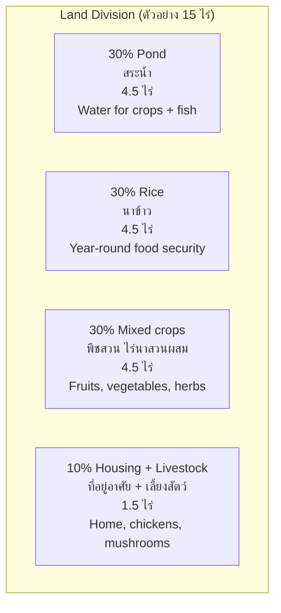

---
tags:
  - agriculture
  - sustainability
  - organic-farming
  - sufficiency-economy
  - BCG
source: "Ministry of Agriculture; King Rama IX's New Theory; BCG Model"
created: 2026-07-27
domain: "Sustainable Agriculture"
prerequisites: ["[[01_Agricultural_Science]]"]
---

# 04 — Sustainable Agriculture

> *"We must use natural resources wisely, live with moderation, and build resilience — so that we may pass on a fertile land to our children."* — King Rama IX

Sustainable agriculture is not a niche — it's the future of farming. Thailand has a unique advantage: **King Rama IX's Sufficiency Economy Philosophy** and **New Theory Agriculture** provide a homegrown framework that aligns with global trends in organic, regenerative, and climate-smart agriculture.

---

## 1 | King Rama IX's New Theory Agriculture (เกษตรทฤษฎีใหม่)

### 1.1 The 30-30-30-10 Land Division

### 1.2 The Three Stages

| Stage | Focus | Goal |
|---|---|---|
| **Stage 1: Self-sufficiency** | Grow enough to feed the family | Food security, reduce dependency |
| **Stage 2: Group/Cooperative** | Farmers cooperate — shared machinery, marketing | Economies of scale |
| **Stage 3: External engagement** | Connect to markets, credit, processing | Sustainable prosperity |

### 1.3 Core Principles (3 ห่วง 2 เงื่อนไข)

| Principle | Meaning |
|---|---|
| **Moderation** (พอประมาณ) | Not too much, not too little — appropriate scale |
| **Reasonableness** (มีเหตุผล) | Decisions based on evidence and analysis |
| **Self-immunity** (มีภูมิคุ้มกัน) | Build resilience against shocks (price, weather, disease) |
| **Knowledge** (ความรู้) | Continuous learning, research, technology |
| **Integrity** (คุณธรรม) | Honesty, hard work, sharing, environmental care |

---

## 2 | Organic Agriculture (เกษตรอินทรีย์)

### 2.1 Organic Standards in Thailand

| Standard | Certifying Body | Market |
|---|---|---|
| **Organic Thailand** (เกษตรอินทรีย์ มกอช.) | Ministry of Agriculture (มกอช.) | National standard |
| **IFOAM / EU Organic** | International certifiers | Export to EU |
| **USDA Organic** | US certifiers | Export to USA |
| **JAS (Japanese Agricultural Standard)** | Japanese certifiers | Export to Japan |
| **PGS (Participatory Guarantee System)** | Local groups | Local markets — lower cost |
| **Fair Trade** | Fair Trade International | Ethical premium |

### 2.2 Organic Production Principles

| Principle | Practice |
|---|---|
| **No synthetic pesticides** | Biopesticides (neem, BT, fungi), beneficial insects, physical barriers |
| **No synthetic fertilizers** | Compost, green manure, animal manure, bio-fermented products |
| **No GMOs** | Traditional and improved varieties only |
| **Soil health** | Cover crops, crop rotation, reduced tillage, mulching |
| **Biodiversity** | Mixed farming, hedgerows, pollinator habitats |

### 2.3 Thailand's Organic Market

| Fact | Detail |
|---|---|
| **Organic farmland** | ~200,000 rai (~32,000 ha) — growing rapidly |
| **Organic rice** | Major export — especially jasmine rice to EU/USA |
| **Domestic market** | Growing middle class demand; premium pricing (2–3× conventional) |
| **Challenges** | Certification cost, labor intensity, yield gap (first 2–3 years), weed management |

---

## 3 | BCG Model (Bio-Circular-Green Economy)

> **BCG is Thailand's national development model** — agriculture is one of four core sectors.

### 3.1 Three Pillars

| Pillar | What It Means in Agriculture |
|---|---|
| **Bioeconomy** | Use biological resources sustainably — bio-based products, bioplastics from cassava, bioethanol from sugar cane |
| **Circular Economy** | Zero waste — rice husk → biochar → soil amendment; shrimp shells → chitosan; food waste → compost |
| **Green Economy** | Low carbon — carbon credits from reforestation and soil carbon; renewable energy on farms (solar, biogas) |

### 3.2 BCG Agriculture in Practice

| Application | Example |
|---|---|
| **Cassava → Bioplastics** | Thailand aims to be a global bioplastics hub |
| **Rice straw → Mushrooms → Compost** | Circular farm model |
| **Sugarcane → Sugar + Ethanol + Bagasse (power)** | Zero-waste biorefinery |
| **Oil palm → CPO + Biodiesel + Biomass** | Integrated palm complex |
| **Carbon farming** | Farmers paid for carbon sequestration in soil and trees |

---

## 4 | Regenerative Agriculture

| Practice | How It Works |
|---|---|
| **No-till / Minimum tillage** | Preserve soil structure, increase organic matter |
| **Cover cropping** | Keep soil covered year-round; fix nitrogen; suppress weeds |
| **Rotational grazing** | Move livestock frequently — mimics natural grazing patterns |
| **Agroforestry** | Trees + crops together — shade, biodiversity, additional income |
| **Biochar** | Charred organic matter — locks carbon in soil for centuries |
| **Compost tea / microbial inoculants** | Boost soil biology |

---

## 5 | Climate-Smart Agriculture

| Strategy | Purpose |
|---|---|
| **Drought-resistant varieties** | Rice (e.g., กข varieties), cassava — cope with changing rainfall |
| **Water-efficient irrigation** | Drip, sprinkler, alternate wetting and drying (AWD) for rice |
| **Weather index insurance** | Payouts triggered by weather data, not individual loss assessment |
| **Carbon credits** | Thailand Voluntary Emission Reduction (T-VER) — farmers earn from carbon projects |
| **Early warning systems** | SMS alerts for floods, drought, pest outbreaks |

---

## 6 | Key Terminology

| Thai | English | Notes |
|---|---|---|
| เกษตรทฤษฎีใหม่ | New Theory Agriculture | King Rama IX's model |
| หลักปรัชญาเศรษฐกิจพอเพียง | Sufficiency Economy Philosophy | 3 ห่วง 2 เงื่อนไข |
| เกษตรอินทรีย์ | Organic Agriculture | No synthetic inputs |
| BCG Economy | Bio-Circular-Green Economy | National development model |
| เกษตรฟื้นฟู | Regenerative Agriculture | Restore soil and ecosystem health |
| เกษตรคาร์บอนต่ำ | Low-Carbon Agriculture | Reduce GHG emissions |
| คาร์บอนเครดิต | Carbon Credits | Farmers paid for sequestration |
| ไร่นาสวนผสม | Mixed / Integrated Farming | Multiple crops + livestock together |
| มกอช. (ACFS) | National Bureau of Agricultural Commodity and Food Standards | Organic Thailand certification |
| T-VER | Thailand Voluntary Emission Reduction | Carbon credit program |

---

## Related Notes

- [[01_Agricultural_Science]] — Biological foundation
- [[02_Smart_Farming_Technology]] — Tech for sustainability
- [[03_Agribusiness_Management]] — Organic market opportunities
- [[Agriculture - Overview]] — Return to agriculture overview
