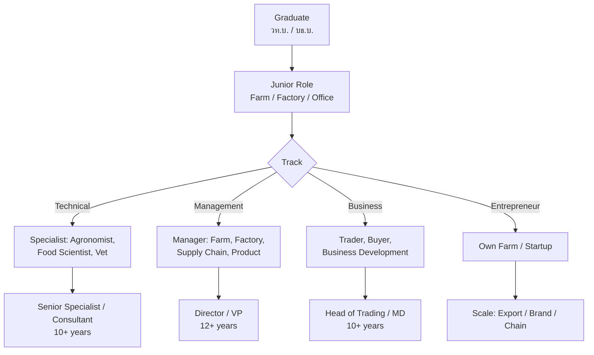

---
tags:
  - agriculture
  - university-guide
  - career-paths
  - TCAS
  - salary
  - agritech
source: "TCAS; University websites; Ministry of Agriculture; BCG Model"
created: 2026-07-27
domain: "University Guide & Career Paths"
prerequisites: ["[[Agriculture - Overview]]"]
---

# 06 — University Guide & Career Paths

> *"Agriculture isn't a fallback — it's a frontier. And it's waiting for people who can see the future in a rice field."*

This is the practical guide: where to study, how to get in, what you'll earn, and where agriculture can take you — from family farms to Fortune Global 500 boardrooms.

---

## Part A: University Guide

### 1 | Admission Requirements

| Requirement | Details |
|---|---|
| **Education** | ม.6 graduate — Science track preferred but arts accepted for some programs |
| **GPA** | Minimum GPAX typically 2.50–2.75 |
| **Required background** | Science (Biology, Chemistry) preferred for B.Sc. programs |

### 2 | TCAS Rounds

| Round | Period | Best For |
|---|---|---|
| **TCAS 1 — Portfolio** | Oct–Dec | Agri competitions, Young Smart Farmer, science projects |
| **TCAS 2 — Quota** | Jan–Mar | Regional quotas — often for local agricultural students |
| **TCAS 3 — Admission 1** | Mar–May | Central exam route |
| **TCAS 4 / 5** | May–Jul | Direct admission, remaining seats |

### 3 | Top Agricultural Universities

#### 🥇 Tier 1 — Premier Agricultural University

| University | Faculty | Location | Notable Features |
|---|---|---|---|
| **Kasetsart University** | คณะเกษตร / คณะอุตสาหกรรมเกษตร / คณะประมง / คณะวนศาสตร์ | Bangkok (Bang Khen) & Kamphaeng Saen | 🔑 **Thailand's #1 agricultural university** — the most comprehensive; 4 agriculture-related faculties; strong research; deep industry connections (CP, Thai Union, Mitr Phol); Kamphaeng Saen campus has massive research farms |

#### 🥈 Tier 2 — Strong Specialized Programs

| University | Faculty / Department | Location | Notable Features |
|---|---|---|---|
| **Maejo University** | คณะผลิตกรรมการเกษตร / คณะวิทยาศาสตร์การเกษตร | Chiang Mai | #2 agri university; strong organic/sustainable; Northern focus; large campus with working farms |
| **Chiang Mai University** | คณะเกษตรศาสตร์ | Chiang Mai | Northern hub; highland agriculture; coffee, tea, temperate crops; Royal Project connections |
| **Khon Kaen University** | คณะเกษตรศาสตร์ | Khon Kaen | Isan (Northeast) hub; rice, cassava, sugar cane; Mekong region collaborations |
| **Prince of Songkla University** | คณะทรัพยากรธรรมชาติ / คณะอุตสาหกรรมเกษตร | Hat Yai | Southern hub; rubber, oil palm, tropical fruits, aquaculture |
| **Thammasat University** | คณะวิทยาศาสตร์และเทคโนโลยี (สาขาเกษตรศาสตร์) | Pathum Thani | Newer program; science-oriented; close to Bangkok |

#### 🥉 Tier 3 — Regional & Specialized

| University | Location | Specialty |
|---|---|---|
| **Burapha University** | Chonburi | Eastern agriculture — durian, mangosteen; EEC proximity |
| **Naresuan University** | Phitsanulok | Lower Northern agriculture |
| **Ubon Ratchathani University** | Ubon Ratchathani | Rice, organic farming; Mekong region |
| **Walailak University** | Nakhon Si Thammarat | Southern agriculture |
| **Rajamangala Universities of Technology (RMUT)** | Multiple campuses | Practical/vocational agricultural technology |
| **Institute of Agricultural Technology, Suranaree UT** | Nakhon Ratchasima | Technology-focused agriculture |

#### 🏫 Specialized Colleges

| College | Location | Focus |
|---|---|---|
| **วิทยาลัยเกษตรและเทคโนโลยี (College of Agriculture and Technology)** | ~47 campuses nationwide | ปวช./ปวส. (vocational) and bachelor's; hands-on training |
| **Maejo College of Agriculture (original campus)** | Chiang Mai | Historic agricultural college |
| **สถาบันเทคโนโลยีพระจอมเกล้าเจ้าคุณทหารลาดกระบัง (KMITL)** | Bangkok | Food engineering, food science |

### 4 | Programs by Specialization

| Field | Best Programs |
|---|---|
| **Agronomy (พืชไร่)** | Kasetsart, Maejo, KKU |
| **Horticulture (พืชสวน)** | Kasetsart, Maejo, CMU |
| **Animal Science** | Kasetsart, KKU, Maejo |
| **Aquaculture / Fisheries** | Kasetsart (Faculty of Fisheries), PSU, Burapha |
| **Food Science & Technology** | Kasetsart (Agro-Industry), CMU, PSU, KMITL |
| **Agribusiness** | Kasetsart, Thammasat, Maejo |
| **Agricultural Engineering** | Kasetsart, KMITL, Maejo |
| **Soil Science** | Kasetsart, KKU |
| **Plant Protection (Pest Management)** | Kasetsart, Maejo |
| **Organic / Sustainable Agriculture** | Maejo (strongest), KKU |
| **Smart Farming / AgriTech** | Kasetsart, KMITL, CMU (emerging) |

### 5 | Tuition

| Type | Tuition per Year (Approx.) |
|---|---|
| **Public University** | ฿12,000–฿30,000 |
| **Private University** | ฿60,000–฿150,000 |
| **Vocational College (ปวช./ปวส.)** | ฿3,000–฿10,000 |

---

## Part B: Career Paths & Salaries

### 6 | Work Settings

| Path | Role | Starting Salary |
|---|---|---|
| **Agribusiness (Corporate)** | Procurement, QA, supply chain, sales, marketing | ฿20K–฿35K |
| **Food Processing** | Food technologist, product developer, QC/QA | ฿20K–฿35K |
| **Farm Management** | Farm manager, plantation manager, livestock supervisor | ฿18K–฿30K |
| **Smart Farming / AgriTech** | AgriTech specialist, IoT technician, data analyst | ฿25K–฿45K |
| **Government** | Agricultural extension officer, researcher, policy | ฿15K–฿25K (civil service) |
| **NGO / Development** | Sustainable agriculture, rural development, fair trade | ฿20K–฿40K |
| **Own Business** | Smart farmer entrepreneur, organic farm owner | Highly variable |
| **International** | Trading, procurement, development (UN agencies, CGIAR) | ฿40K–฿150K+ |

### 7 | Career Progression

### 8 | Major Employers

| Employer | Sector |
|---|---|
| **CP Group** | Integrated agri-food (largest employer) |
| **Thai Union** | Seafood |
| **Betagro** | Livestock, food |
| **Mitr Phol** | Sugar, bio-based |
| **ThaiBev** | Beverages, agri supply chain |
| **GFPT / Cargill / JBS** | Poultry, feed |
| **Syngenta / Bayer / Corteva** | Crop science, seeds, chemicals |
| **Ministry of Agriculture** | Government — extension, research, policy |
| **World Food Programme / FAO** | International development |
| **AgriTech Startups** | Ricult, FarmDee, Freshket |

### 9 | The Next Generation Opportunity

> Thailand's average farmer age is **58 years old**. The sector desperately needs young, educated, tech-savvy professionals. The BCG Model, carbon credits, organic market growth, and AgriTech revolution are creating opportunities that didn't exist 5 years ago.

| Trend | Opportunity |
|---|---|
| **Aging farmers** | Young professionals managing farms for aging owners |
| **Carbon credits** | Carbon project developers, verifiers, traders |
| **Organic premium** | 2–3× farm-gate prices for certified organic |
| **AgriTech** | Startup founder, software developer, IoT integrator |
| **EEC Food Innopolis** | Food innovation hub — R&D, startups |
| **E-commerce** | Direct-to-consumer farm sales via Shopee/Lazada/social media |
| **Farm tourism** | Agritourism growing — farm stays, orchard tours, workshops |

### 10 | Scholarships

| Scholarship | Details |
|---|---|
| **ทุน ธ.ก.ส.** | BAAC scholarships for agricultural students |
| **ทุนกระทรวงเกษตร** | Ministry of Agriculture — return to work in extension |
| **ทุนบริษัทเอกชน** | CP, Thai Union, Mitr Phol — bonded scholarships |
| **ทุน Fulbright / DAAD** | International graduate study |
| **ทุน กยศ.** | Student loan fund |

### 11 | Summary: Is Modern Agriculture Right for You?

| ✅ You'll thrive if you... | ⚠️ Consider carefully if you... |
|---|---|
| Love science AND business | Only want a desk job |
| Want to solve real-world problems (food, climate) | Are disconnected from where food comes from |
| Enjoy working with technology and data | Dislike hands-on, outdoor work |
| See opportunity where others see "old-fashioned" | Think agriculture = poverty |
| Want a career with global demand | Want to stay in one city your whole career |
| Care about environment and sustainability | Don't care about impact of food systems |
| Are entrepreneurial | Need a rigid, predictable career path |

> **Final thought:** Agriculture is no longer what your grandparents did. It's drones, data, international trade, climate science, and cutting-edge biology. Thailand is an agricultural superpower. The sector needs a new generation to lead it into the Bio-Circular-Green century. That could be you.

---

## Related Notes

- [[Agriculture - Overview]] — Start here for the big picture
- [[01_Agricultural_Science]] through [[05_Food_Processing_and_Safety]] — Domain knowledge
- [[../engineer/Engineer - Overview|Engineering]] — Agri/Food engineering path
- [[../teacher/Teacher - Overview|Teaching]] — Agricultural education
