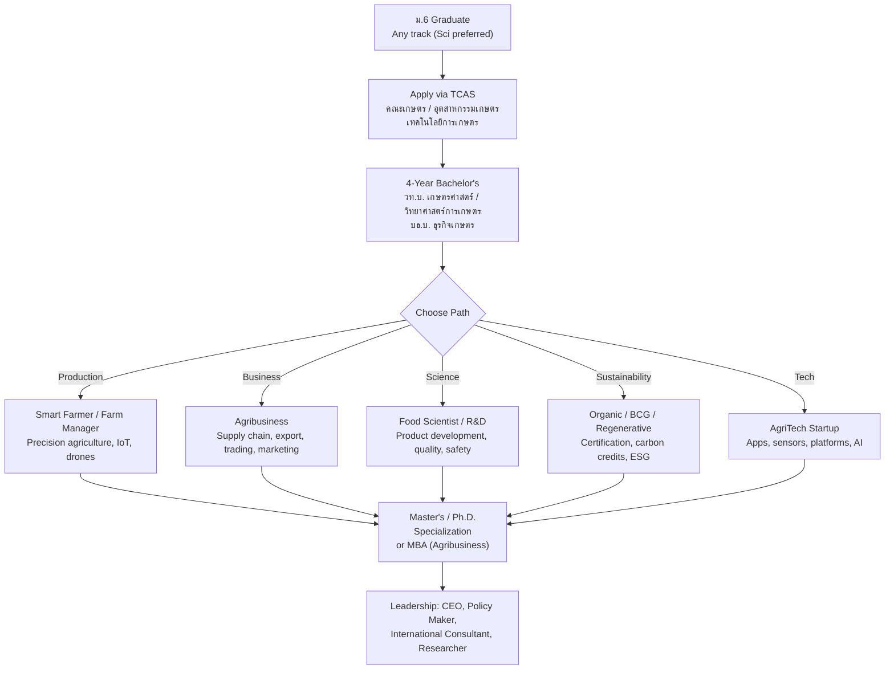

---
tags:
  - overview
  - agriculture
  - smart-farming
  - agribusiness
  - career
  - thai-education
source: "Ministry of Agriculture and Cooperatives; BCG Model; Thailand 4.0"
created: 2026-07-27
profession: "นักเกษตรสมัยใหม่ (Modern Agricultural Professional)"
degree: "วท.บ. เกษตรศาสตร์ (B.Sc. Agriculture) / บธ.บ. ธุรกิจเกษตร (B.B.A. Agribusiness)"
duration: "4 ปี (4 years)"
---

# Agriculture — เกษตรกรรมสมัยใหม่

> *"Agriculture is the most healthful, most useful, and most noble employment of man."* — George Washington

> *"เกษตรกรรม คือ กระดูกสันหลังของชาติไทย — แต่เกษตรกรรมสมัยใหม่ ไม่ใช่แค่การทำนา แต่คือวิทยาศาสตร์ เทคโนโลยี ธุรกิจ และความยั่งยืน"*

## What Is This?

This is a **career guidance knowledge base** for Thai students interested in modern agriculture. Not your grandfather's farming — this is **Agri 4.0**: smart farming, agritech startups, food science, export business, and sustainable systems.

Thailand is one of the world's **top agricultural exporters**:
- 🇹🇭 #1 in natural rubber, canned tuna, canned pineapple, cassava
- 🇹🇭 #2 in rice, sugar
- 🇹🇭 Top 10 in chicken, shrimp, palm oil

The agricultural sector employs **~30% of Thailand's workforce** and contributes ~8% of GDP — but it's transforming fast. The **BCG Model (Bio-Circular-Green Economy)** and **EEC** are creating a new generation of agricultural professionals.

## Education & Career Pathways

## The 5 Knowledge Domains

### 🌱 Foundation
- [[01_Agricultural_Science|01 Agricultural Science]] — Soil science, plant science, animal husbandry, aquaculture, pest management, genetics

### 🤖 Technology
- [[02_Smart_Farming_Technology|02 Smart Farming Technology]] — IoT, drones, GPS, precision agriculture, hydroponics, vertical farming, AI/ML

### 💼 Business
- [[03_Agribusiness_Management|03 Agribusiness Management]] — Supply chain, farm-to-table, export logistics, commodity trading, contract farming, cooperatives

### ♻️ Sustainability
- [[04_Sustainable_Agriculture|04 Sustainable Agriculture]] — Organic farming, sufficiency economy, New Theory Agriculture, BCG Model, carbon credits, regenerative agriculture

### 🏭 Processing
- [[05_Food_Processing_and_Safety|05 Food Processing & Safety]] — Value-added products, GMP, HACCP, cold chain, food innovation, packaging

### 🎓 Career Pathways
- [[00_University_Guide_and_Career_Paths|University Guide & Career Paths]] — Top agri universities, TCAS, career tracks, salaries, AgriTech startups, BCG opportunities

## Thailand's Agricultural Landscape

### Key Organizations

| Organization | Thai Name | Role |
|---|---|---|
| **Ministry of Agriculture & Cooperatives** | กระทรวงเกษตรและสหกรณ์ | Policy, extension, research |
| **BAAC (Bank for Agriculture)** | ธ.ก.ส. | Agricultural finance and credit |
| **National Bureau of Agricultural Commodity and Food Standards** | มกอช. | Standards, GAP, organic certification |
| ** Thailand Research Fund (TRF)** | สกว. | Agricultural research funding |
| **Board of Trade** | สภาหอการค้า | Agribusiness advocacy |
| **CP Group, Thai Union, Mitr Phol, Betagro** | เอกชน | Major agribusiness employers |

### Thailand's Top Agricultural Exports

| Product | Global Rank | Annual Export Value (Approx.) |
|---|---|---|
| **Natural Rubber** | #1 | ~฿400 billion |
| **Rice** | #2 (after India) | ~฿200 billion |
| **Canned Tuna** | #1 | ~฿100 billion |
| **Sugar** | #4 | ~฿100 billion |
| **Cassava (มันสำปะหลัง)** | #1 | ~฿100 billion |
| **Canned Pineapple** | #1 | ~฿30 billion |
| **Frozen Chicken** | Top 5 | ~฿100 billion |
| **Frozen Shrimp** | Top 5 | ~฿50 billion |

---

## Key Terminology

| Thai | English | Notes |
|---|---|---|
| เกษตรกรรม | Agriculture | Broad term — crops, livestock, fisheries |
| เกษตรแม่นยำ | Precision Agriculture | Data-driven farming |
| เกษตรอัจฉริยะ | Smart Farming | IoT + AI in agriculture |
| ธุรกิจเกษตร | Agribusiness | Business side of agriculture |
| เกษตรอินทรีย์ | Organic Agriculture | No synthetic chemicals |
| เกษตรทฤษฎีใหม่ | New Theory Agriculture | King Rama IX's model |
| BCG Economy | Bio-Circular-Green Economy | National development model |
| อุตสาหกรรมเกษตร | Agro-Industry | Food processing |
| GAP (Good Agricultural Practice) | การปฏิบัติทางการเกษตรที่ดี | Quality and safety standards |
| Smart Greenhouse | โรงเรือนอัจฉริยะ | Controlled environment agriculture |

---

## Reading Paths

- **High school student exploring:** Start → [[00_University_Guide_and_Career_Paths|University Guide]] → pick a domain
- **Future smart farmer:** [[02_Smart_Farming_Technology|Technology]] + [[01_Agricultural_Science|Science]]
- **Future agribusiness leader:** [[03_Agribusiness_Management|Business]] + [[04_Sustainable_Agriculture|Sustainability]]
- **Future food scientist:** [[05_Food_Processing_and_Safety|Processing]] + [[01_Agricultural_Science|Science]]
- **Parent/guidance counselor:** [[00_University_Guide_and_Career_Paths|University Guide]]

---

> **Related Careers:** [[../engineer/Engineer - Overview|Engineer]] (Agri/Food Engineering), [[../teacher/Teacher - Overview|Teaching]] (Agricultural Education), [[Biotechnology|Biotechnology]]
