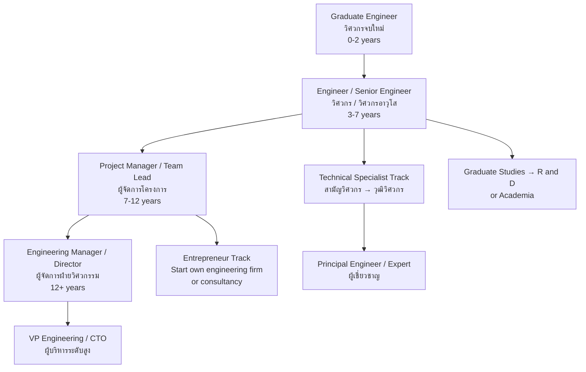

---
tags:
  - engineering
  - university-guide
  - career-paths
  - TCAS
  - salary
  - engineer-license
source: "Council of Engineers (สภาวิศวกร); TCAS; University websites; EEC"
created: 2026-07-27
domain: "University Guide & Career Paths"
prerequisites: ["[[Engineer - Overview]]"]
---

# 07 — University Guide & Career Paths

> *"Engineering is one of the most career-proof degrees. The world will always need bridges, power, machines, and code."*

This is the practical guide: where to study, how to get in, how to get licensed, what you'll earn, and where engineering can take you — from factory floors to Silicon Valley.

---

## Part A: University Guide

### 1 | Admission Requirements

| Requirement | Details |
|---|---|
| **Education** | ม.6 graduate, **Science-Math track (สายวิทย์-คณิต)** — mandatory |
| **GPA** | Minimum GPAX typically 2.50–3.00 (higher for top programs) |
| **GPA Science/Math** | Some require GPA ≥ 2.75 in Math, Physics, Chemistry |
| **Key aptitude** | Strong math + physics; logical thinking; problem-solving |

### 2 | TCAS Admission Rounds

| Round | Period | Best For |
|---|---|---|
| **TCAS 1 — Portfolio** | Oct–Dec | Engineering competition winners, science projects, robotics/tech portfolios |
| **TCAS 2 — Quota** | Jan–Mar | Regional quotas, Olympiad medalists |
| **TCAS 3 — Admission 1** | Mar–May | Central admission via TGAT/TPAT + A-Level |
| **TCAS 4 — Admission 2** | May–Jun | Direct admission by university |
| **TCAS 5 — Direct** | Jun–Jul | Remaining seats |

### 3 | Exams Required for Engineering (TCAS 3)

| Exam | Subject | Typical Weight |
|---|---|---|
| **TGAT** | Thai General Aptitude Test | 15–25% |
| **TPAT 3** (ความถนัดวิศวะ) | Engineering Aptitude — physics, math reasoning, spatial reasoning | 20–30% |
| **A-Level Math 1** | คณิตศาสตร์ 1 (พื้นฐาน+เพิ่มเติม) | 20–30% |
| **A-Level Physics** | ฟิสิกส์ | 15–25% |
| **A-Level Chemistry** | เคมี | 10–15% |
| **A-Level English** | ภาษาอังกฤษ | 10–15% |

> **Math 1 + Physics + TPAT 3 = The Big Three for engineering admission.**

### Engineering Programs in Thailand

| University                                        | Faculty                                          | Location                                                                                     | Notable Features                                                                                         |
| ------------------------------------------------- | ------------------------------------------------ | -------------------------------------------------------------------------------------------- | -------------------------------------------------------------------------------------------------------- |
| **Chulalongkorn University**                      | คณะวิศวกรรมศาสตร์                                | Bangkok                                                                                      | #1 prestige; 12 departments; strong industry connections; ISE (International) program                    |
| **KMITL (พระจอมเกล้าลาดกระบัง)**                  | คณะวิศวกรรมศาสตร์                                | Bangkok (Lat Krabang)                                                                        | 🔑 **Engineering powerhouse** — largest engineering faculty; strong in EE, ME, CE; international program |
| **KMUTT (พระจอมเกล้าธนบุรี)**                     | คณะวิศวกรรมศาสตร์                                | Bangkok (Bang Mod)                                                                           | Top research output; strong in Chemical, Environmental, Computer; international                          |
| **KMUTNB (พระจอมเกล้าพระนครเหนือ)**               | คณะวิศวกรรมศาสตร์                                | Bangkok (Bang Sue)                                                                           | Strong in ME, Industrial, Production; close to industry                                                  |
| **Mahidol University**                            | คณะวิศวกรรมศาสตร์                                | Nakhon Pathom (Salaya)                                                                       | Newer but rapidly rising; strong in Biomedical, Computer, international focus                            |
| **Kasetsart University**                          | คณะวิศวกรรมศาสตร์                                | Bangkok (Bang Khen) & Kamphaeng Saen                                                         | Thailand's largest engineering faculty by student count; strong in agricultural, water, environmental    |
| **Chiang Mai University**                         | คณะวิศวกรรมศาสตร์                                | Chiang Mai                                                                                   | Northern hub; strong in Computer, Mechanical, Environmental                                              |
| **Thammasat University (SIIT)**                   | Sirindhorn International Institute of Technology | Pathum Thani (Rangsit)                                                                       | All-English instruction; strong international focus; 3+1 programs abroad                                 |
| **Khon Kaen University**                          | คณะวิศวกรรมศาสตร์                                | Khon Kaen                                                                                    | Northeast hub; strong in Civil, Mechanical                                                               |
| **Prince of Songkla University**                  | คณะวิศวกรรมศาสตร์                                | Hat Yai                                                                                      | Southern hub; strong in Chemical (oil & gas), Computer                                                   |
| **Suranaree University of Technology**            | สำนักวิชาวิศวกรรมศาสตร์                          | Nakhon Ratchasima                                                                            | Strong in manufacturing, production; cooperative education                                               |
| **Burapha University**                            | คณะวิศวกรรมศาสตร์                                | Chonburi                                                                                     | EEC proximity — close to Map Ta Phut, Laem Chabang                                                       |
| **Naresuan University** | คณะวิศวกรรมศาสตร์ | Phitsanulok                                                                                  | -                                                                                                        |
| **Mahasarakham University** | คณะวิศวกรรมศาสตร์ | Maha Sarakham                                                                                | -                                                                                                        |
| **Ubon Ratchathani University** | คณะวิศวกรรมศาสตร์ | Ubon Ratchathani                                                                             | -                                                                                                        |
| **Walailak University** | สำนักวิชาวิศวกรรมศาสตร์ | Nakhon Si Thammarat                                                                          | -                                                                                                        |
| **Silpakorn University** | คณะวิศวกรรมศาสตร์และเทคโนโลยีอุตสาหกรรม | Nakhon Pathom                                                                                | -                                                                                                        |
| **Rajamangala Universities of Technology (RMUT)** | คณะวิศวกรรมศาสตร์ | 9 campuses nationwide — strong in vocational/technical engineering                           | -                                                                                                        |
| **Sripatum University** | คณะวิศวกรรมศาสตร์ | Bangkok (private)                                                                            | -                                                                                                        |
| **Assumption University (ABAC)** | Faculty of Engineering | Bangkok (private) — international programs                                                   | -                                                                                                        |

### 6 | Tuition & Costs

| Type | Tuition per Year (Approx.) | Notes |
|---|---|---|
| **Public University** | ฿20,000–฿40,000 | Government subsidized |
| **Public — International Program** | ฿80,000–฿180,000 | English instruction |
| **Private University** | ฿80,000–฿200,000 | ABAC, Sripatum, etc. |
| **Additional costs** | Equipment (laptop, calculator), lab fees, textbooks: ~฿15,000–฿30,000/year |

---

## Part B: Licensing & Professional Development

### 7 | Engineering License Levels (สภาวิศวกร)

| Level | Thai | Requirements | Key Privilege |
|---|---|---|---|
| **Associate Engineer** | ภาคีวิศวกร | B.Eng. (accredited) — automatic upon graduation | Work as engineer |
| **Professional Engineer** | สามัญวิศวกร | Associate + pass exam + ≥ 3 years experience | **Sign engineering designs independently** |
| **Senior Engineer** | วุฒิวิศวกร | Professional + ≥ 5 years + advanced exam/portfolio | Lead major projects; expert witness |

### 8 | Controlled Engineering Fields (Must Be Licensed)

| Field | When License Required |
|---|---|
| **Civil** | Structural design of buildings, bridges; ALL civil works |
| **Electrical (Power)** | Building electrical systems; power distribution; substations |
| **Mechanical** | HVAC systems; elevators; fire protection |
| **Industrial** | Factory systems; production line safety |
| **Mining** | Mining operations |
| **Environmental** | EIA/EHIA reports; waste treatment design |

### 9 | Licensure Exam (การสอบเพื่อรับใบอนุญาตประกอบวิชาชีพ)

| Exam Components | Details |
|---|---|
| **Fundamental Engineering** | Math, physics, engineering sciences |
| **Discipline-Specific** | Your field — civil, electrical, mechanical, etc. |
| **Law & Ethics** | Engineer Act, professional ethics, contracts |

**Pass rate:** ~40–60% on first attempt — preparation matters.

---

## Part C: Career Paths & Salaries

### 10 | Work Settings & Salaries by Field

| Discipline | Entry (Monthly) | Mid-Career (5-10 yr) | Senior (15+ yr) |
|---|---|---|---|
| **Civil** | ฿20K–฿35K | ฿40K–฿80K | ฿80K–฿200K+ |
| **Mechanical** | ฿22K–฿40K | ฿45K–฿85K | ฿85K–฿200K+ |
| **Electrical (Power)** | ฿22K–฿35K | ฿40K–฿75K | ฿75K–฿180K+ |
| **Electrical (Electronics)** | ฿22K–฿40K | ฿45K–฿90K | ฿80K–฿200K+ |
| **Computer / Software** | ฿25K–฿50K | ฿60K–฿150K | ฿120K–฿300K+ |
| **Industrial** | ฿22K–฿40K | ฿45K–฿90K | ฿80K–฿200K+ |
| **Chemical** | ฿25K–฿45K | ฿50K–฿100K | ฿100K–฿250K+ |
| **Environmental** | ฿20K–฿30K | ฿35K–฿65K | ฿60K–฿150K |

> **Oil & gas premium:** +30–50% above base. **Software/tech premium:** +20–40% above base during boom cycles.

### 11 | Top Paying Industries for Engineers (Thailand)

| Industry | Why High Pay |
|---|---|
| **Oil & Gas** | Hazard pay, offshore rotation, specialized skills |
| **Software / Tech** | Global market rates; remote work options |
| **Semiconductor** | High-value manufacturing; precision engineering |
| **Petrochemical (EEC)** | Industrial core; continuous operations |
| **Multinational Manufacturing** | Foreign-owned; expat salary structures |
| **Consulting (MBB)** | Management/strategy consulting for engineers |

### 12 | Career Progression

### 13 | EEC (Eastern Economic Corridor) — The Hot Zone

> **EEC = Thailand's biggest infrastructure and industrial development zone.** Chonburi, Rayong, Chachoengsao.

| Project | Engineering Demand |
|---|---|
| **High-Speed Rail** (Don Mueang–Suvarnabhumi–U-Tapao) | Civil, Electrical, Systems |
| **U-Tapao Aerotropolis** | Aerospace, Civil, Mechanical, Electrical |
| **Map Ta Phut Phase 3** | Chemical, Environmental, Mechanical |
| **Laem Chabang Phase 3** | Civil, Industrial |
| **Smart Cities** (EECd, EECi, EECa) | Computer, Electrical, Environmental |
| **EV Manufacturing** | Mechanical, Electrical, Industrial, Chemical |

> **If you're an engineer in Thailand, the EEC is where the action is.**

### 14 | International Career Pathways

| Destination | Requirements | Salary Range |
|---|---|---|
| **Singapore** | Recognized degree + experience | SGD 3,500–8,000/mo (฿95K–฿220K) |
| **Japan** | Japanese language (N3+) + engineering skills | ¥4M–8M/yr (฿0.9M–฿1.8M) |
| **Middle East** | Experience (5+ years) + license | Tax-free; ฿100K–฿300K+/mo |
| **USA / Canada** | ABET-accredited or Washington Accord degree + PE/FE exam | $70K–$150K/yr (฿2.5M–฿5.2M) |
| **Europe** | Recognized degree + local language often needed | €45K–€90K/yr (฿1.7M–฿3.4M) |
| **Australia** | Washington Accord degree + Engineers Australia assessment | AUD 80K–$150K/yr (฿1.8M–฿3.5M) |

> **Thailand is a Washington Accord signatory** — B.Eng. degrees from accredited programs are recognized in 20+ countries.

### 15 | Scholarships

| Scholarship | Sponsor | Details |
|---|---|---|
| **ทุน ก.พ. วิศวกรรม** | Government | Study abroad + return service |
| **ทุน EGAT / PTT / SCG** | State enterprises/corporate | Full scholarship + guaranteed job |
| **ทุน ODOS (One District One Scholarship)** | Government | Engineering + return to home province |
| **ทุนมหาวิทยาลัย** | Individual universities | Merit-based; TA/RA at graduate level |
| **ทุน Fulbright** | US Government | Master's/Ph.D. in USA |
| **ทุน DAAD** | German Government | Study in Germany (strong engineering) |
| **ทุน MEXT** | Japanese Government | Study in Japan |
| **ทุน กยศ.** | Government | Low-interest student loan |

### 16 | Summary: Is Engineering Right for You?

| ✅ You'll thrive if you... | ⚠️ Consider carefully if you... |
|---|---|
| Love math and physics — genuinely enjoy them | Dislike or struggle with math/physics |
| Enjoy solving puzzles and logical problems | Prefer open-ended, subjective topics |
| Like building things and seeing tangible results | Prefer abstract, theoretical work only |
| Are detail-oriented — small errors can be dangerous | Think "close enough is good enough" |
| Work well under pressure (deadlines, safety-critical) | Get flustered by high-stakes situations |
| Are curious about how things work | Don't care about mechanisms or systems |
| Can work both independently and in teams | Strongly prefer one over the other |
| Want a respected, well-paying, stable career | Are only in it for the money — the study is hard |
| Embrace lifelong learning (tech changes fast) | Think graduation = done learning |

> **Final thought:** Engineering is difficult. The math is real. The physics is real. But the satisfaction of designing something that works, that stands, that powers, that moves — and knowing your signature means it's safe — that's real too. If you have the aptitude and the work ethic, few careers are more rewarding.

---

## Related Notes

- [[Engineer - Overview]] — Start here for the big picture
- [[01_Engineering_Foundations]] — What you'll study in Year 1–2
- [[02_Civil_Engineering]] through [[06_Emerging_Engineering_Fields]] — Choose your discipline
- [[../teacher/Teacher - Overview|Teaching]] — Engineering teaching careers
