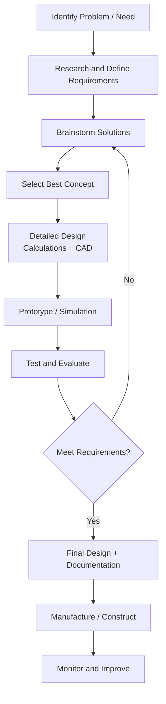

---
tags:
  - engineering
  - foundations
  - mathematics
  - physics
  - mechanics
source: "Council of Engineers Thailand; Thailand Accreditation Standards for Engineering (TABEE)"
created: 2026-07-27
domain: "Engineering Foundations"
prerequisites: ["Strong background in Math + Physics from ม.ปลาย"]
---

# 01 — Engineering Foundations

> *"Engineering is the art of applying science to the optimum conversion of natural resources to the benefit of man."* — Ralph J. Smith

Every engineer, regardless of discipline, shares a common foundation. These are the first 2 years of any B.Eng. program — heavy on math, physics, and core engineering sciences. If you love these, you'll love engineering. If you hate them... choose carefully.

---

## 1 | Engineering Mathematics

### 1.1 Core Math Sequence

| Course | Topics | Engineering Application |
|---|---|---|
| **Calculus I** (แคลคูลัส 1) | Limits, derivatives, integrals, Fundamental Theorem of Calculus | Rate of change, optimization, area/volume — EVERYWHERE |
| **Calculus II** (แคลคูลัส 2) | Integration techniques, series, polar coordinates, parametric equations | Advanced modeling, signal processing |
| **Calculus III** (แคลคูลัส 3) | Multivariable: partial derivatives, multiple integrals, vector calculus | Fluid flow, electromagnetic fields, stress analysis |
| **Differential Equations** (สมการเชิงอนุพันธ์) | ODEs, PDEs, Laplace transforms, numerical methods | Dynamic systems, circuits, vibrations, heat transfer |
| **Linear Algebra** (พีชคณิตเชิงเส้น) | Matrices, vectors, eigenvalues, linear transformations | Structural analysis, computer graphics, ML/AI |
| **Probability & Statistics** (ความน่าจะเป็นและสถิติ) | Distributions, hypothesis testing, regression, reliability | Quality control, risk analysis, data science |
| **Numerical Methods** (ระเบียบวิธีเชิงตัวเลข) | Root finding, interpolation, numerical integration | Computer-aided engineering (CAE), simulations |

### 1.2 Math Intensity by Discipline

| Discipline | Math Intensity | Key Math Topics |
|---|---|---|
| **Electrical / Computer** | ⭐⭐⭐⭐⭐ | Complex analysis, Fourier/Laplace, linear algebra, probability |
| **Mechanical / Aerospace** | ⭐⭐⭐⭐ | Differential equations, numerical methods, vector calculus |
| **Civil** | ⭐⭐⭐ | Structural matrix analysis, differential equations |
| **Chemical** | ⭐⭐⭐⭐ | Differential equations, numerical methods, statistics |
| **Industrial** | ⭐⭐⭐ | Optimization, statistics, operations research |

---

## 2 | Engineering Physics & Mechanics

### 2.1 Core Physics Sequence

| Course | Topics | Engineering Application |
|---|---|---|
| **Physics I — Mechanics** | Newton's laws, kinematics, work/energy, momentum, rotation | All structural/machine design |
| **Physics II — Electromagnetism** | Electric fields, circuits, magnetism, Maxwell's equations | EE, power systems, electronics |
| **Physics III — Waves & Modern** | Waves, optics, quantum basics, nuclear physics | Telecom, photonics, nuclear |

### 2.2 Engineering Mechanics

| Course | Topics |
|---|---|
| **Statics** (สถิตยศาสตร์) | Forces in equilibrium, trusses, frames, friction, centroids, moments of inertia |
| **Dynamics** (พลศาสตร์) | Kinematics, kinetics, work-energy, impulse-momentum, rigid body motion |
| **Mechanics of Materials** (กลศาสตร์วัสดุ) | Stress, strain, torsion, bending, deflection, buckling, failure theories |
| **Fluid Mechanics** (กลศาสตร์ของไหล) | Fluid statics, Bernoulli, pipe flow, pumps, boundary layers, drag/lift |
| **Thermodynamics** (เทอร์โมไดนามิกส์) | Laws of thermodynamics, cycles (Rankine, Otto, Brayton, refrigeration), entropy |

> **Statics + Dynamics + Mechanics of Materials = "The Big Three"** — every mechanical and civil engineer lives here.

---

## 3 | Core Engineering Sciences

### 3.1 Materials Science (วัสดุวิศวกรรม)

| Material Class | Examples | Key Properties |
|---|---|---|
| **Metals** | Steel, aluminum, titanium, copper | Strength, ductility, conductivity, fatigue |
| **Ceramics** | Glass, porcelain, silicon carbide | Hard, brittle, heat-resistant, insulating |
| **Polymers** | Plastics, rubber, composites | Light, moldable, corrosion-resistant |
| **Composites** | CFRP, fiberglass, concrete | Tailored properties, high strength-to-weight |
| **Semiconductors** | Silicon, gallium arsenide | Electronic properties — the foundation of computing |

### 3.2 Engineering Drawing & CAD

| Skill | Tools |
|---|---|
| **Technical drawing** | Orthographic projections, isometric views, section views, dimensioning |
| **2D CAD** | AutoCAD — industry standard for civil/mechanical drawings |
| **3D Modeling** | SolidWorks, Inventor, CATIA, Fusion 360 — parametric modeling |
| **BIM** (Building Information Modeling) | Revit — civil/architectural |
| **PCB Design** | Altium, KiCad, Eagle — electrical/electronics |

### 3.3 Computer Programming for Engineers

| Language | Primary Use |
|---|---|
| **Python** | Data analysis, automation, ML/AI, scientific computing (NumPy, SciPy, Matplotlib) |
| **MATLAB** | Numerical computing, signal processing, control systems, simulations |
| **C / C++** | Embedded systems, firmware, performance-critical applications |
| **Java** | Enterprise software, Android development |
| **PLC / Ladder Logic** | Industrial automation, factory control |
| **VBA / Excel** | Every engineer's "duct tape" — quick calculations, macros |

---

## 4 | The Engineering Design Process

> **This process, not just math, is what an engineer does.**

---

## 5 | Engineering Tools & Software

| Category | Software | Used By |
|---|---|---|
| **CAD (2D)** | AutoCAD, MicroStation | Civil, Mechanical |
| **CAD (3D)** | SolidWorks, CATIA, Inventor, Creo, Fusion 360 | Mechanical, Aerospace, Industrial |
| **FEA (Finite Element Analysis)** | ANSYS, Abaqus, COMSOL | All disciplines |
| **CFD (Computational Fluid Dynamics)** | ANSYS Fluent, OpenFOAM | Mechanical, Aerospace, Chemical |
| **Circuit Simulation** | SPICE, Multisim, LTspice | Electrical, Electronics |
| **PCB Design** | Altium Designer, KiCad, Eagle | Electronics |
| **PLC Programming** | Siemens TIA Portal, Allen-Bradley RSLogix | Industrial, Automation |
| **Math & Simulation** | MATLAB/Simulink, Mathematica, Maple | All disciplines |
| **Programming** | Python, C/C++, Julia | All disciplines (increasingly) |
| **Project Management** | MS Project, Primavera, Jira | Civil, Industrial |
| **GIS** | ArcGIS, QGIS | Civil (transportation, water), Environmental |

---

## 6 | Key Terminology

| Thai | English | Notes |
|---|---|---|
| แคลคูลัส | Calculus | Derivative + integral |
| สมการเชิงอนุพันธ์ | Differential Equations | Modeling dynamic systems |
| สถิตยศาสตร์ | Statics | Forces in equilibrium |
| พลศาสตร์ | Dynamics | Bodies in motion |
| กลศาสตร์วัสดุ | Mechanics of Materials | Stress, strain, failure |
| กลศาสตร์ของไหล | Fluid Mechanics | Fluids at rest and in motion |
| เทอร์โมไดนามิกส์ | Thermodynamics | Heat, work, energy |
| การเขียนแบบวิศวกรรม | Engineering Drawing | Technical communication |
| การออกแบบโดยใช้คอมพิวเตอร์ช่วย (CAD) | Computer-Aided Design | AutoCAD, SolidWorks, etc. |
| ระเบียบวิธีไฟไนต์เอลิเมนต์ (FEM) | Finite Element Method | Numerical stress/thermal analysis |

---

## Related Notes

- [[02_Civil_Engineering]] — Foundations applied to structures and infrastructure
- [[03_Mechanical_and_Industrial_Engineering]] — Foundations applied to machines and systems
- [[04_Electrical_and_Computer_Engineering]] — Foundations applied to circuits and computing
- [[Engineer - Overview]] — Return to engineering overview
