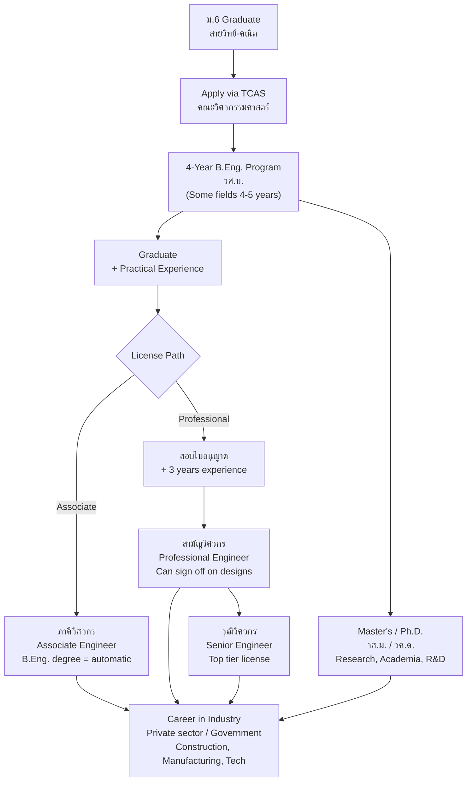

---
tags:
  - overview
  - engineering
  - career
  - thai-education
source: "Engineer Act B.E. 2542 (1999); Council of Engineers Thailand (สภาวิศวกร)"
created: 2026-07-27
profession: "วิศวกร (Engineer)"
degree: "วศ.บ. (วิศวกรรมศาสตรบัณฑิต) — Bachelor of Engineering (B.Eng.)"
duration: "4 ปี (4 years)"
---

# Engineering — วิชาชีพวิศวกร

> *"Scientists study the world as it is; engineers create the world that has never been."* — Theodore von Kármán

> *"วิศวกร คือ ผู้ประกอบวิชาชีพที่ใช้ความรู้ทางวิทยาศาสตร์และคณิตศาสตร์ในการออกแบบ สร้าง ควบคุม และบำรุงรักษาระบบ โครงสร้าง และเครื่องจักร เพื่อประโยชน์ต่อสังคมอย่างปลอดภัยและยั่งยืน"* — พ.ร.บ. วิศวกร พ.ศ. 2542

## What Is This?

This is a **career guidance knowledge base** for Thai students considering engineering as a profession. It covers what engineering is, the major disciplines, what you'll learn, where you can study, how to get licensed, and what career paths exist.

Engineering in Thailand is a **regulated profession** under the **Engineer Act B.E. 2542 (1999)** — พระราชบัญญัติวิศวกร. The **Council of Engineers Thailand (สภาวิศวกร)** issues engineering licenses and enforces professional standards.

> **⚡ Engineering is one of Thailand's most sought-after degrees** — strong industry demand, high salaries, and the backbone of Thailand 4.0 and EEC (Eastern Economic Corridor) development.

## Education Pathway

## The 7 Knowledge Domains

### 🧮 Foundations
- [[01_Engineering_Foundations|01 Engineering Foundations]] — Engineering math, physics, mechanics, materials, drawing/CAD, programming, thermodynamics, fluid mechanics

### 🏗️ Civil & Structural
- [[02_Civil_Engineering|02 Civil Engineering]] — Structural analysis, geotechnical, transportation, water resources, construction management, surveying

### ⚙️ Mechanical & Industrial
- [[03_Mechanical_and_Industrial_Engineering|03 Mechanical & Industrial Engineering]] — Machine design, thermodynamics, manufacturing, quality control, supply chain, automation

### ⚡ Electrical & Computer
- [[04_Electrical_and_Computer_Engineering|04 Electrical & Computer Engineering]] — Circuits, electronics, power systems, telecommunications, embedded systems, software engineering

### 🧪 Chemical & Environmental
- [[05_Chemical_and_Environmental_Engineering|05 Chemical & Environmental Engineering]] — Process design, petrochemicals, materials, water/waste treatment, air pollution control

### 🚀 Emerging Fields
- [[06_Emerging_Engineering_Fields|06 Emerging Engineering Fields]] — AI/Robotics, aerospace, biomedical, renewable energy, nanotechnology, mechatronics, data engineering

### 🎓 Career Pathways
- [[07_University_Guide_and_Career_Paths|07 University Guide & Career Paths]] — Top engineering faculties, TCAS, licensing levels, salaries by field, EEC opportunities, international careers

## The Engineering Profession in Thailand

### Regulatory Body

| Organization | Thai Name | Role |
|---|---|---|
| **Council of Engineers Thailand** | สภาวิศวกร | Licensure, professional standards, ethics enforcement, continuing education |
| **Engineering Institute of Thailand (EIT)** | วิศวกรรมสถานแห่งประเทศไทย (วสท.) | Professional development, standards, codes, conferences |

### Legal Framework

The profession is governed by the **Engineer Act B.E. 2542 (1999)** — พระราชบัญญัติวิศวกร พ.ศ. 2542.

Key provisions:
- Defines "engineering profession" and scope of practice
- Establishes **สภาวิศวกร (Council of Engineers)**
- Creates **3 license levels** — ภาคีวิศวกร, สามัญวิศวกร, วุฒิวิศวกร
- Defines professional conduct and disciplinary processes
- Penalties for unlicensed practice in controlled fields
- **Controlled engineering fields** (must be licensed): civil, electrical (power), mechanical (HVAC, elevators), industrial, mining, environmental

### Engineering License Levels

| Level | Thai | Requirements | Can... |
|---|---|---|---|
| **Associate Engineer** | ภาคีวิศวกร | B.Eng. degree (accredited program) | Work under supervision of higher-level engineer |
| **Professional Engineer** | สามัญวิศวกร | Associate + pass exam + ≥ 3 years experience | Independently practice; sign off on engineering designs |
| **Senior Engineer** | วุฒิวิศวกร | Professional + ≥ 5 additional years + advanced exam/portfolio | Lead major projects; expert witness; mentor |

### Common Fields & License Requirements

| Field | Thai | License Required? | Primary Industries |
|---|---|---|---|
| **Civil** | โยธา | ✅ YES — all structural work | Construction, infrastructure, real estate |
| **Electrical (Power)** | ไฟฟ้ากำลัง | ✅ YES — building electrical systems | Power generation, building systems |
| **Mechanical (HVAC/Elevator)** | เครื่องกล | ✅ YES — HVAC, elevators | Building services, factories |
| **Industrial** | อุตสาหการ | ✅ YES — factory systems | Manufacturing, automotive |
| **Mining** | เหมืองแร่ | ✅ YES | Mining, quarrying |
| **Environmental** | สิ่งแวดล้อม | ✅ YES — EIA, waste systems | Environmental consulting |
| **Chemical** | เคมี | Partial | Petrochemical, food, pharma |
| **Computer / Software** | คอมพิวเตอร์ | Not yet required | Tech, telecom, startups |
| **Telecom** | โทรคมนาคม | Partial | Telecom networks |
| **Aerospace** | อากาศยาน | Specialized | Aviation, defense |
| **Biomedical** | ชีวการแพทย์ | Specialized | Medical devices, hospitals |

---

## Key Terminology

| Thai | English | Notes |
|---|---|---|
| วิศวกร | Engineer | Licensed professional |
| วิศวกรรมศาสตรบัณฑิต (วศ.บ.) | Bachelor of Engineering (B.Eng.) | 4-year degree |
| สภาวิศวกร | Council of Engineers Thailand | Regulatory body |
| ภาคีวิศวกร | Associate Engineer | Entry license (B.Eng. = auto) |
| สามัญวิศวกร | Professional Engineer | Can sign designs independently |
| วุฒิวิศวกร | Senior Engineer | Top-tier expert license |
| ใบอนุญาตประกอบวิชาชีพวิศวกรรม | Engineering License | 5-year renewal |
| วสท. (EIT) | Engineering Institute of Thailand | Professional body |
| วิศวกรรมควบคุม (Controlled Engineering) | Controlled Engineering Fields | Must be licensed to practice |
| Engineering Drawing / CAD | การเขียนแบบวิศวกรรม | Core skill for all engineers |

---

## Reading Paths

- **High school student exploring:** Start here → [[07_University_Guide_and_Career_Paths|University Guide]] → Pick a discipline
- **Undecided engineering student:** [[01_Engineering_Foundations|Foundations]] → Browse disciplines (02–06)
- **Practicing engineer:** License level table above → Graduate studies
- **Parent/guidance counselor:** [[07_University_Guide_and_Career_Paths|University Guide]] → Return here

---

> **Related Careers:** [[../teacher/Teacher - Overview|Teaching]] (STEM), [[../architect/Architecture - Overview|Architecture]], [[Technician|ช่างเทคนิค]]
