---
tags:
  - law
  - university-guide
  - career-paths
  - TCAS
  - salary
  - lawyer-license
source: "Lawyers Council of Thailand; TCAS; University websites"
created: 2026-07-27
domain: "University Guide & Career Paths"
prerequisites: ["[[Lawyer - Overview]]"]
---

# 07 — University Guide & Career Paths

> *"Law is one of the few professions where your name, your reputation, and your word are your greatest assets."*

This is the practical guide: where to study law, how to get in, the licensing process, career tracks from courtroom to boardroom, and what you'll earn.

---

## Part A: University Guide

### 1 | Admission Requirements

| Requirement | Details |
|---|---|
| **Education** | ม.6 graduate — **ALL tracks accepted** (Science, Arts, Vocational) |
| **GPA** | Minimum GPAX typically 2.50–3.00 |
| **Key aptitude** | Reading comprehension, analytical writing, logical reasoning, memory |
| **Language** | Strong Thai language skills essential; English increasingly important |

> ✅ Law is one of the most accessible professions at entry — no math/science requirements, accepts all tracks.

### 2 | TCAS Admission Rounds

| Round | Period | Best For |
|---|---|---|
| **TCAS 1 — Portfolio** | Oct–Dec | Debate champions, essay winners, mock trial experience |
| **TCAS 2 — Quota** | Jan–Mar | Regional quotas |
| **TCAS 3 — Admission 1** | Mar–May | Central admission via TGAT + A-Level |
| **TCAS 4 — Admission 2** | May–Jun | Direct admission |
| **TCAS 5 — Direct** | Jun–Jul | Remaining seats |

### 3 | Exams Required for Law (TCAS 3)

| Exam | Subject | Typical Weight |
|---|---|---|
| **TGAT** | Thai General Aptitude Test | 30–40% |
| **A-Level Thai** | ภาษาไทย | 20–25% |
| **A-Level English** | ภาษาอังกฤษ | 15–20% |
| **A-Level Social Studies** | สังคมศึกษา | 15–20% |
| **A-Level subject** | Varies by university (sometimes Math or second language) | 5–10% |

> **No science/math requirement at most universities** — the emphasis is on language and analytical skills.

### Law Programs in Thailand

| University | Faculty | Location | Notable Features |
|---|---|---|---|
| **Thammasat University** | คณะนิติศาสตร์ | Bangkok (Tha Phra Chan) | 🔑 **#1 law school historically** — "ธรรมศาสตร์ = กฎหมาย"; produced most judges, prosecutors, and political leaders; strong public law tradition |
| **Chulalongkorn University** | คณะนิติศาสตร์ | Bangkok | Elite prestige; strong in business/international law; international LL.M. programs |
| **Ramkhamhaeng University** | คณะนิติศาสตร์ | Bangkok | 🔑 **Largest law school** — open admission; produced countless practitioners; accessible to all |
| **Kasetsart University** | คณะนิติศาสตร์ | Bangkok (Bang Khen) | Growing prestige; strong business law; good industry connections |
| **Chiang Mai University** | คณะนิติศาสตร์ | Chiang Mai | Northern legal hub; strong public law and environmental law |
| **Thammasat University (Lampang Campus)** | คณะนิติศาสตร์ | Lampang | Same curriculum as Bangkok campus; northern opportunity |
| **Prince of Songkla University** | คณะนิติศาสตร์ | Hat Yai | Southern legal hub; Islamic law component (unique) |
| **Sukhothai Thammathirat Open University** | สาขาวิชานิติศาสตร์ | Distance learning | Study while working; flexible |
| **Assumption University (ABAC)** | คณะนิติศาสตร์ | Bangkok (private) | International focus; business law; English instruction available |
| **Khon Kaen University** | คณะนิติศาสตร์ | Khon Kaen | - |
| **Burapha University** | คณะนิติศาสตร์ | Chonburi | - |
| **Naresuan University** | คณะนิติศาสตร์ | Phitsanulok | - |
| **Ubon Ratchathani University** | คณะนิติศาสตร์ | Ubon Ratchathani | - |
| **Mahasarakham University** | คณะนิติศาสตร์ | Maha Sarakham | - |
| **Walailak University** | คณะนิติศาสตร์ | Nakhon Si Thammarat | - |
| **Sripatum University** | คณะนิติศาสตร์ | Bangkok (private) | - |
| **Bangkok University** | คณะนิติศาสตร์ | Bangkok (private) | - |

### 5 | Special Considerations

| Consideration | Why It Matters |
|---|---|
| **Thammasat tradition** | "จิตวิญญาณธรรมศาสตร์" — law for the people; public interest law; progressive tradition |
| **Ramkhamhaeng access** | No entrance exam (open admission); but high dropout rate — self-discipline essential |
| **ABAC / International** | English-medium; good for corporate/international career; higher tuition |
| **PSU Pattani** | Unique Islamic law dimension; southern conflict resolution context |
| **Location matters** | Studying in Bangkok = access to courts, law firms, internships, and networking |

### 6 | Tuition & Costs

| Type | Tuition per Year (Approx.) |
|---|---|
| **Public University** | ฿10,000–฿30,000 |
| **Ramkhamhaeng (open)** | ฿3,000–฿8,000 (most affordable) |
| **Sukhothai Thammathirat (distance)** | ฿5,000–฿15,000 |
| **Private University** | ฿80,000–฿200,000 |
| **Additional** | Books, Bar Association training fees: ~฿15,000–฿30,000/year |

---

## Part B: Licensing & Professional Development

### 7 | Lawyer Licensing Process (ทนายความ)

| Step | Details |
|---|---|
| **1. LL.B. degree** | น.บ. from accredited university |
| **2. Apply to Lawyers Council** | Register as trainee |
| **3. Training course** | สำนักฝึกอบรมวิชาว่าความ — 120+ hours (substantive law, procedure, ethics, practice skills) |
| **4. Pass exam** | Written and/or oral examination by Lawyers Council |
| **5. Registration** | Register as lawyer (ทนายความ) — receive license |
| **6. License renewal** | Every 5 years; CPD (Continuing Professional Development) |

### 8 | Thai Bar Association (เนติบัณฑิตยสภา)

| Program | Duration | Purpose |
|---|---|---|
| **Barrister-at-Law (เนติบัณฑิตไทย)** | 1 year (part-time) | Advanced legal education — "เนติฯ" — prestigious; required for prosecutor/judge tracks |
| **Curriculum** | Civil & Commercial, Criminal, Civil Procedure, Criminal Procedure, Constitutional & Administrative, Bankruptcy, Tax, International Law, Legal English |
| **Exam** | Written + oral per subject; ~50% pass rate |

> **เนติบัณฑิต is NOT required to practice as a lawyer**, but it is highly valued and **REQUIRED to become a judge or prosecutor**.

### 9 | Judges & Prosecutors — How to Enter

| Path | Thai | Selection Process |
|---|---|---|
| **Judge** (ผู้พิพากษา) | Judicial Commission | 1. LL.B. + เนติบัณฑิต + 2 years legal experience; 2. Open competitive exam (written + oral); 3. 1 year training as ผู้ช่วยผู้พิพากษา; 4. Appointment |
| **Prosecutor** (อัยการ) | OAG | 1. LL.B. + เนติบัณฑิต; 2. Open competitive exam; 3. 1 year training as อัยการผู้ช่วย; 4. Appointment |
| **Administrative Court Judge** | Administrative Court | Similar to regular judge + public law specialization |
| **Constitutional Court Judge** | Constitutional Court | Appointed (not exam-based) |

> **Judge and prosecutor exams are among the most competitive in Thailand** — hundreds apply, dozens pass.

---

## Part C: Career Paths & Salaries

### 10 | Career Tracks

| Track | Work | License Needed? |
|---|---|---|
| **Litigation Lawyer** | Courtroom; civil & criminal cases | ✅ ทนายความ |
| **Corporate / Commercial Lawyer** | Contracts, M&A, due diligence, compliance | Not strictly required (but helps) |
| **In-House Counsel** (นิติกร) | Company legal department | Not required |
| **Public Prosecutor** (อัยการ) | Criminal prosecution | Civil service (no ทนายความ needed) |
| **Judge** (ผู้พิพากษา) | Adjudication | Judicial Commission appointment |
| **Government Legal Officer** | Ministries, regulatory agencies | Civil service |
| **Notary** | Document certification | ทนายความ + additional certification |
| **Legal Academic** | Teaching, research | LL.M./Ph.D. typically |
| **Legal Consultant** | Advisory, compliance, policy | Varies |
| **NGO / Human Rights Lawyer** | Public interest litigation | ✅ ทนายความ |
| **International Law / Diplomacy** | Foreign service, UN, international organizations | Varies |

### 11 | Salary Ranges

| Career Path | Starting | Mid-Career (5-10 yr) | Senior (15+ yr) |
|---|---|---|---|
| **Law firm — small/medium** | ฿15K–฿25K | ฿30K–฿60K | ฿50K–฿100K+ |
| **Law firm — large / international** | ฿25K–฿50K | ฿60K–฿150K | ฿150K–฿500K+ |
| **In-house counsel** | ฿25K–฿45K | ฿50K–฿120K | ฿120K–฿300K+ |
| **Public Prosecutor** | ฿20K–฿30K | ฿35K–฿60K | ฿60K–฿120K |
| **Judge** | ฿25K–฿35K | ฿40K–฿70K | ฿70K–฿150K |
| **Government legal officer** | ฿15K–฿25K | ฿30K–฿55K | ฿55K–฿100K |
| **Solo practitioner** | Highly variable | ฿30K–฿80K (building) | ฿80K–฿300K+ (established) |
| **Legal academic** | ฿25K–฿35K | ฿35K–฿60K | ฿60K–฿120K + research grants |

> **Law firm "rainmakers"** (partners who bring in clients) can earn several million baht annually. But it takes 10–15+ years to reach that level.

### 12 | Career Progression — Law Firm Track

```mermaid
flowchart TD
    A["Trainee Lawyer<br/>นักศึกษาฝึกงาน<br/>0 years"] --> B["Junior Associate<br/>ทนายความรุ่นน้อง<br/>1-3 years"]
    B --> C["Senior Associate<br/>ทนายความอาวุโส<br/>4-7 years"]
    C --> D["Junior Partner<br/>หุ้นส่วนรุ่นน้อง<br/>8-12 years"]
    D --> E["Senior / Managing Partner<br/>หุ้นส่วนอาวุโส<br/>12+ years"]
    C --> F["In-House Counsel<br/>นิติกรบริษัท<br/>&#40;exit option&#41;"]
    D --> G["Start own firm<br/>เปิดสำนักงานของตนเอง"]
```

### 13 | Top Law Firms in Thailand (ตัวอย่าง)

| Firm | Type | Notable Practice Areas |
|---|---|---|
| **Baker McKenzie** | International | Full-service corporate; M&A; tax |
| **Tilleke & Gibbins** | Regional | IP; corporate; regulatory |
| **Chandler MHM (Mori Hamada & Matsumoto)** | International (Japan-linked) | Corporate; energy; dispute resolution |
| **Weerawong, Chinnavat & Partners** | Thai independent | Capital markets; M&A; banking |
| **Allen & Overy (Thailand)** | International (UK) | Banking; project finance |
| **Linklaters (Thailand)** | International (UK) | Capital markets; M&A |
| **Herbert Smith Freehills** | International (UK/Australia) | Energy; infrastructure; dispute resolution |
| **DLA Piper (Thailand)** | International | Corporate; real estate |
| **Siam Premier** | Thai | Litigation; corporate |
| **Law Alliance** | Thai | Litigation; criminal defense |

### 14 | Scholarships

| Scholarship | Sponsor | Details |
|---|---|---|
| **ทุนเนติบัณฑิตยสภา** | Thai Bar Association | For barrister-at-law studies |
| **ทุน ก.พ.** | Government | For legal officers; study abroad |
| **ทุนมหาวิทยาลัย** | Individual universities | Merit-based |
| **ทุน Fulbright** | US Government | LL.M. in USA |
| **ทุน Chevening** | UK Government | LL.M. in UK |
| **ทุน DAAD** | German Government | Study in Germany |
| **ทุน กยศ.** | Government | Low-interest student loan |

### 15 | Summary: Is Law Right for You?

| ✅ You'll thrive if you... | ⚠️ Consider carefully if you... |
|---|---|
| Love reading — a LOT (hundreds of pages weekly) | Dislike reading or read slowly |
| Think analytically and logically | Prefer creative or hands-on work |
| Write clearly and persuasively | Struggle with writing |
| Have a strong memory for details and rules | Forget details easily |
| Are comfortable with confrontation and argument | Avoid conflict at all costs |
| Can handle pressure (deadlines, clients, court) | Get easily stressed |
| Have integrity — your reputation is everything | Are willing to cut ethical corners |
| Are a lifelong learner (laws change constantly) | Think graduation = done learning |
| Speak and write Thai at a high level | Struggle with formal Thai |
| Want a respected career with earning potential | Expect to get rich quickly |

> **Final thought:** Law is not for everyone. The reading load is immense. The pressure is real. The competition is fierce. But for those who love the intellectual challenge, the art of argument, and the craft of precise language — and who want a career where their words can change lives — there is no substitute. The law is a jealous mistress, but a rewarding one.

---

## Related Notes

- [[Lawyer - Overview]] — Start here for the big picture
- [[01_Foundations_of_Law]] — The legal system and core concepts
- [[02_Civil_and_Commercial_Law]] through [[06_Legal_Procedure_and_Litigation]] — Substantive law domains
- [[../teacher/Teacher - Overview|Teaching]] — Law lecturer career
