---
tags:
  - law
  - foundations
  - legal-philosophy
  - thai-legal-system
  - jurisprudence
source: "Thai Legal Education Standards; Thai Bar Association Curriculum"
created: 2026-07-27
domain: "Foundations of Law"
prerequisites: []
---

# 01 — Foundations of Law

> *"Where law ends, tyranny begins."* — William Pitt

The foundations of law cover what law IS, where it comes from, how the Thai legal system works, and the skills every lawyer needs — legal research, reasoning, and writing. These are the **Year 1–2** subjects of the LL.B.

---

## 1 | Legal Philosophy (นิติปรัชญา)

### 1.1 Major Schools of Legal Thought

| School | Key Thinkers | Core Idea |
|---|---|---|
| **Natural Law** | Aristotle, Aquinas, Fuller, Finnis | Law must align with moral principles; unjust law is no law at all |
| **Legal Positivism** | Austin, Hart, Kelsen | Law is what the sovereign commands; separation of "law as it is" from "law as it ought to be" |
| **Legal Realism** | Holmes, Llewellyn, Frank | "The life of the law has not been logic; it has been experience" — law is what judges actually do |
| **Sociological Jurisprudence** | Pound, Ehrlich | Law as social engineering; "law in books" vs. "law in action" |
| **Critical Legal Studies** | Unger, Kennedy | Law is indeterminate; it masks power relations |
| **Law & Economics** | Posner, Coase | Legal rules should maximize economic efficiency |

### 1.2 Thai Legal Philosophy

Thai law is deeply influenced by both **civil law tradition** (via European codification) and **Buddhist principles**:

| Influence | Expression in Thai Law |
|---|---|
| **Civil Law Tradition** | Codified system (ประมวลกฎหมาย) — Civil and Commercial Code, Penal Code, etc. |
| **Buddhism** | Restorative justice; mercy and compassion in sentencing; mediation preference |
| **Monarchical heritage** | King as fountain of justice; royal prerogative of pardon |
| **Customary law** | Traditional dispute resolution in communities; incorporated into formal law in some areas |

---

## 2 | Sources of Thai Law (ที่มาของกฎหมาย)

### 2.1 Hierarchy of Thai Law

```mermaid
flowchart TD
    A["1 Constitution <br/> รัฐธรรมนูญ"]
    B["2 Organic Laws<br/>พ.ร.บ.ประกอบรัฐธรรมนูญ"]
    C["3 Acts / Statutes<br/>พระราชบัญญัติ &#40;พ.ร.บ.&#41;"]
    D["4 Emergency Decrees<br/>พระราชกำหนด"]
    E["5 Royal Decrees<br/>พระราชกฤษฎีกา"]
    F["6 Ministerial Regulations<br/>กฎกระทรวง"]
    G["7 Local Ordinances<br/>ข้อบัญญัติท้องถิ่น"]
    H["8 Subordinate Regulations<br/>ประกาศ, ระเบียบ, คำสั่ง"]

    A --> B --> C --> D --> E --> F --> G --> H
```

| Source | Thai | Issued By | Example |
|---|---|---|---|
| **Constitution** | รัฐธรรมนูญ | Legislature + Referendum | Constitution B.E. 2560 (2017) |
| **Organic Law** | พ.ร.บ. ประกอบรัฐธรรมนูญ | Parliament | Organic Act on Political Parties |
| **Act / Statute** | พระราชบัญญัติ (พ.ร.บ.) | Parliament | Civil and Commercial Code, Penal Code |
| **Emergency Decree** | พระราชกำหนด (พ.ร.ก.) | Cabinet (urgent; must be approved by Parliament) | COVID-19 emergency decrees |
| **Royal Decree** | พระราชกฤษฎีกา | Cabinet | Tax exemptions, government reorganization |
| **Ministerial Regulation** | กฎกระทรวง | Minister | Detailed rules under an Act |

### 2.2 Other Sources

| Source | Thai | Authority |
|---|---|---|
| **Customary Law** | จารีตประเพณี | Long-standing practice accepted as law |
| **General Principles of Law** | หลักกฎหมายทั่วไป | Fundamental legal principles |
| **Judicial Precedent** | คำพิพากษาศาลฎีกา | Supreme Court decisions — highly persuasive but NOT formally binding like common law |
| **Legal Scholarship** | ตำรากฎหมาย / ความเห็นนักนิติศาสตร์ | Influential; cited in judgments |
| **International Law** | กฎหมายระหว่างประเทศ | Treaties ratified by Thailand; customary international law |

> **Thailand is a CIVIL LAW system (ระบบประมวลกฎหมาย)** — primary authority is written codes, not court precedent. BUT Supreme Court decisions are extremely influential in practice.

---

## 3 | The Thai Court System (ระบบศาลไทย)

```mermaid
flowchart TD
    subgraph subgraph Regular["Courts of Justice &#40;ศาลยุติธรรม&#41;"]
        direction TB
        A["Supreme Court<br/>ศาลฎีกา<br/>Final appeal"] --> B["Court of Appeal<br/>ศาลอุทธรณ์"]
        B --> C["Courts of First Instance<br/>ศาลชั้นต้น"]
        C --> D["Civil Court / Criminal Court<br/>Provincial / Municipal Courts"]
    end
    subgraph Specialized["Specialized Courts"]
        E["Administrative Court<br/>ศาลปกครอง"]
        F["Constitutional Court<br/>ศาลรัฐธรรมนูญ"]
        G["Military Court<br/>ศาลทหาร"]
        H["Specialized Courts<br/>Tax, IP, Bankruptcy,<br/>Labor, Juvenile"]
    end
```

| Court | Jurisdiction |
|---|---|
| **Civil Court** (ศาลแพ่ง) | Civil disputes; torts; contracts; property |
| **Criminal Court** (ศาลอาญา) | Criminal offenses |
| **Provincial Court** (ศาลจังหวัด) | General jurisdiction outside Bangkok |
| **Municipal Court** (ศาลแขวง) | Minor civil (< ฿300,000) and minor criminal |
| **Administrative Court** (ศาลปกครอง) | Disputes between citizens and government agencies |
| **Constitutional Court** (ศาลรัฐธรรมนูญ) | Constitutional interpretation; political disqualifications |
| **Juvenile & Family Court** (ศาลเยาวชนและครอบครัว) | Cases involving minors; family law |
| **Labour Court** (ศาลแรงงาน) | Employment disputes |
| **Tax Court** (ศาลภาษีอากร) | Tax disputes |
| **IP & IT Court** (ศาลทรัพย์สินทางปัญญาฯ) | Intellectual property; international trade |
| **Bankruptcy Court** (ศาลล้มละลาย) | Bankruptcy and business reorganization |

---

## 4 | Key Legal Concepts

### 4.1 Classifications of Law

| Classification | Definition | Examples |
|---|---|---|
| **Public Law** (กฎหมายมหาชน) | State-citizen relationship | Constitutional, administrative, criminal |
| **Private Law** (กฎหมายเอกชน) | Relationships between individuals | Civil code (contracts, torts, property, family) |
| **Substantive Law** (กฎหมายสารบัญญัติ) | Rights, duties, prohibitions | Penal Code, Civil Code |
| **Procedural Law** (กฎหมายวิธีสบัญญัติ) | How to enforce rights | Civil/Criminal Procedure Codes |

### 4.2 Legal Persons

| Type | Thai | Examples |
|---|---|---|
| **Natural Person** | บุคคลธรรมดา | Human beings |
| **Juristic Person** | นิติบุคคล | Companies, foundations, government agencies, temples |
| **Legal Capacity** | ความสามารถทางกฎหมาย | Minors, incompetents — limited capacity |

---

## 5 | Legal Skills

### 5.1 Legal Research (การค้นคว้าทางกฎหมาย)

| Resource | Use |
|---|---|
| **ประมวลกฎหมาย (Codes)** | Primary source — Civil Code, Penal Code, Procedure Codes |
| **พระราชบัญญัติ (Acts)** | Specific areas outside codes |
| **คำพิพากษาศาลฎีกา (Supreme Court Judgments)** | Persuasive authority; see how law is actually applied |
| **Thai Bar Association Library** | Comprehensive legal resources |
| **Online databases** | สำนักงานศาลยุติธรรม website; legal publishers (สูตรไพศาล, วิญญูชน) |
| **Law journals** | บทบัณฑิตย์ (Bar Association journal); university law reviews |

### 5.2 Legal Reasoning (IRAC Method)

| Step | Meaning |
|---|---|
| **I** — Issue | What is the legal question? |
| **R** — Rule | What law applies? Cite the code/section. |
| **A** — Application / Analysis | Apply the rule to the facts. This is where lawyers earn their fees. |
| **C** — Conclusion | What's the likely outcome? |

### 5.3 Legal Writing

| Document Type | Thai | Purpose |
|---|---|---|
| **Complaint / Plaint** | คำฟ้อง | Initiates lawsuit |
| **Answer** | คำให้การ | Defendant's response |
| **Legal Opinion** | ความเห็นทางกฎหมาย | Client advisory |
| **Contract** | สัญญา | Binding agreement |
| **Memorandum** | บันทึกข้อความ | Internal analysis |
| **ฎีกาวิเคราะห์** | Case analysis | Academic/scholarly analysis |

---

## 6 | Key Terminology

| Thai | English | Notes |
|---|---|---|
| นิติศาสตร์ | Jurisprudence / Law | The study of law |
| กฎหมายมหาชน / เอกชน | Public Law / Private Law | Fundamental classification |
| ประมวลกฎหมาย | Code | Codified law — civil law system |
| รัฐธรรมนูญ | Constitution | Supreme law of the land |
| พระราชบัญญัติ (พ.ร.บ.) | Act / Statute | Primary legislation |
| นิติบุคคล | Juristic Person | Legal entity |
| ศาลยุติธรรม | Court of Justice | Regular court system |
| ศาลฎีกา | Supreme Court | Highest court of appeal |
| การตีความกฎหมาย | Legal Interpretation | Determining meaning of legal text |
| หลักกฎหมายทั่วไป | General Principles of Law | Foundational legal concepts |

---

## Related Notes

- [[02_Civil_and_Commercial_Law]] — Thailand's main private law code
- [[03_Criminal_Law]] — The Penal Code and criminal justice
- [[04_Constitutional_and_Administrative_Law]] — Public law foundations
- [[Lawyer - Overview]] — Return to law overview
