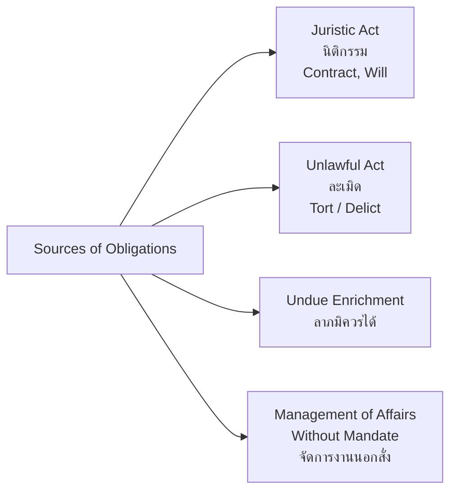

---
tags:
  - law
  - civil-law
  - commercial-law
  - contracts
  - torts
  - property
source: "Civil and Commercial Code of Thailand (ประมวลกฎหมายแพ่งและพาณิชย์)"
created: 2026-07-27
domain: "Civil & Commercial Law"
prerequisites: ["[[01_Foundations_of_Law]]"]
---

# 02 — Civil & Commercial Law (กฎหมายแพ่งและพาณิชย์)

> *"The life of the law has not been logic; it has been experience."* — Oliver Wendell Holmes

Civil and Commercial Law — codified in Thailand's **ประมวลกฎหมายแพ่งและพาณิชย์ (ป.พ.พ.)** — governs the relationships between private persons. This is the largest and most foundational code, covering everything from buying a coffee (contract) to inheriting a house (succession). Every lawyer, regardless of specialty, needs fluency here.

---

## 1 | Structure of the Civil and Commercial Code (ป.พ.พ.)

The Code has 6 Books:

| Book | Thai | Sections | Core Content |
|---|---|---|---|
| **Book I** | บุคคล (Persons) | §§ 1–193/39 | Natural persons, juristic persons, legal capacity |
| **Book II** | หนี้ (Obligations) | §§ 194–353 | General principles of obligations |
| **Book III** | เอกเทศสัญญา (Specific Contracts) | §§ 354–1010 | Sale, hire, loan, guarantee, mortgage, agency, insurance, partnership, company |
| **Book IV** | ทรัพย์สิน (Property) | §§ 1011–1434 | Ownership, possession, servitudes, land law |
| **Book V** | ครอบครัว (Family) | §§ 1435–1598/40 | Marriage, divorce, parent-child, adoption |
| **Book VI** | มรดก (Succession) | §§ 1599–1755 | Intestate and testate succession |

---

## 2 | Book I — Persons (บุคคล)

### 2.1 Natural Persons

| Concept | Thai | Rule |
|---|---|---|
| **Legal personality begins** | สภาพบุคคล | At birth (live birth) — § 15 |
| **Legal personality ends** | สิ้นสภาพบุคคล | At death |
| **Minors** | ผู้เยาว์ | Under 20 (or married before 20) — limited capacity |
| **Incompetents** | คนไร้ความสามารถ | Mentally incapacitated — court-ordered guardianship |
| **Quasi-incompetents** | คนเสมือนไร้ความสามารถ | Partially incapacitated (e.g., addiction, disability) |
| **Absent persons** | คนสาบสูญ | Missing — court can declare as such after time period |

### 2.2 Juristic Persons (นิติบุคคล)

| Type | Governing Law |
|---|---|
| **Registered partnership** | ห้างหุ้นส่วนจดทะเบียน — ป.พ.พ. |
| **Limited company** | บริษัทจำกัด — ป.พ.พ. |
| **Public limited company** | บริษัทมหาชนจำกัด — Public Company Act |
| **Foundation** | มูลนิธิ |
| **Association** | สมาคม |
| **Government agency** | Created by specific law |

---

## 3 | Book II — Obligations (หนี้)

### 3.1 Sources of Obligations (§ 194)

### 3.2 Juristic Acts (นิติกรรม — §§ 149–193)

A juristic act is a voluntary lawful act intended to create legal relations.

| Requirement | Thai |
|---|---|
| **Capacity** | Person must have legal capacity |
| **Declaration of intention** | Must not be vitiated (see below) |
| **Lawful object** | Must not be prohibited by law or against public order/good morals |
| **Form** (if required by law) | Some acts require specific form (e.g., sale of land must be in writing + registered) |

### 3.3 Vitiating Factors (เหตุที่ทำให้นิติกรรมเป็นโมฆะ/โมฆียะ)

| Factor | Thai | Effect |
|---|---|---|
| **Mistake** (essential) | สำคัญผิดในสาระสำคัญ | Void (โมฆะ) |
| **Fraud** | กลฉ้อฉล | Voidable (โมฆียะ) |
| **Duress** | ข่มขู่ | Voidable |
| **Undue influence** | — | Voidable |
| **Concealment of incapacity** | — | Cannot claim benefit |

### 3.4 Void vs. Voidable

| | Void (โมฆะ) | Voidable (โมฆียะ) |
|---|---|---|
| **Effect** | No legal effect from the start | Valid until avoided |
| **Who can challenge** | Anyone with interest | Only the protected party |
| **Time limit** | No limitation (generally) | 1 year from knowledge (usually) |
| **Ratification** | Cannot be ratified | Can be ratified |

---

## 4 | Book III — Specific Contracts (เอกเทศสัญญา)

### 4.1 Major Contract Types

| Contract | Thai | Key Sections | Essentials |
|---|---|---|---|
| **Sale** | ซื้อขาย | §§ 453–547 | Transfer of ownership for price |
| **Hire of Property** | เช่าทรัพย์ | §§ 537–571 | Temporary use for rent |
| **Hire of Services** | จ้างแรงงาน | §§ 575–586 | Work for wages (employment) |
| **Hire of Work** | จ้างทำของ | §§ 587–607 | Result, not effort (contractor) |
| **Loan** | ยืม / กู้ยืม | §§ 640–656 | Gratuitous vs. with interest |
| **Guarantee** | ค้ำประกัน | §§ 680–701 | Surety for another's debt |
| **Mortgage** | จำนอง | §§ 702–746 | Immovable property as security (no delivery) |
| **Pledge** | จำนำ | §§ 747–769 | Movable property as security (delivery required) |
| **Agency** | ตัวแทน | §§ 797–844 | Agent acts on behalf of principal |
| **Insurance** | ประกันภัย | §§ 861–897 | Indemnity against loss |
| **Partnership** | ห้างหุ้นส่วน | §§ 1012–1095 | Ordinary vs. registered; limited vs. unlimited liability |
| **Company** | บริษัท | §§ 1096–1273 | Limited company — most common business form |

---

## 5 | Book IV — Property (ทรัพย์สิน)

| Concept | Thai | Rule |
|---|---|---|
| **Ownership** | กรรมสิทธิ์ | Right to use, dispose, exclude others, follow the property |
| **Possession** | ครอบครอง | Physical control; protected even without ownership |
| **Immovable Property** | อสังหาริมทรัพย์ | Land and things permanently attached to land |
| **Movable Property** | สังหาริมทรัพย์ | Everything else |
| **Servitudes** | ภาระจำยอม | Right over another's land (e.g., right of way) |
| **Condominium** | อาคารชุด | Separate ownership of units + common property |

---

## 6 | Book V — Family (ครอบครัว)

| Topic | Key Rules |
|---|---|
| **Marriage** | Must be registered; monogamous; age ≥ 17 (with court permission if < 20) |
| **Property between spouses** | สินส่วนตัว (personal property) vs. สินสมรส (marital property) |
| **Divorce** | Mutual consent or court order on grounds (adultery, desertion, imprisonment, etc.) |
| **Parent-child** | Legitimate vs. illegitimate children; rights and duties |
| **Adoption** | Court order required; adoptee becomes legitimate child |
| **Guardianship** | For minors without parents |

---

## 7 | Law of Torts (ละเมิด) — §§ 420–452

| Element | Thai |
|---|---|
| **Unlawful act** | จงใจหรือประมาทเลินเล่อ (intentional or negligent) |
| **Injury** | Damage to life, body, health, liberty, property, or right |
| **Causation** | Defendant's act caused the injury |
| **Compensation** | ศาลวินิจฉัยตามพฤติการณ์และความร้ายแรงแห่งละเมิด |

**Key defenses:** Consent, self-defense, necessity, statutory authority, contributory negligence (reduces damages).

---

## 8 | Key Terminology

| Thai | English | Notes |
|---|---|---|
| ประมวลกฎหมายแพ่งและพาณิชย์ (ป.พ.พ.) | Civil and Commercial Code | Main private law code |
| นิติกรรม | Juristic Act | Voluntary lawful act |
| สัญญา | Contract | Agreement creating obligations |
| หนี้ | Obligation | Duty to perform |
| โมฆะ / โมฆียะ | Void / Voidable | Invalidity levels |
| ละเมิด | Tort / Delict | Civil wrong |
| กรรมสิทธิ์ | Ownership | Full property right |
| จำนอง / จำนำ | Mortgage / Pledge | Security interests |
| บุคคลธรรมดา / นิติบุคคล | Natural / Juristic Person | Legal persons |
| ค่าเสียหาย | Damages / Compensation | Monetary remedy |

---

## Related Notes

- [[01_Foundations_of_Law]] — Legal philosophy and system
- [[05_International_and_Business_Law]] — Modern commercial extensions
- [[06_Legal_Procedure_and_Litigation]] — Enforcing civil rights in court
- [[Lawyer - Overview]] — Return to law overview
