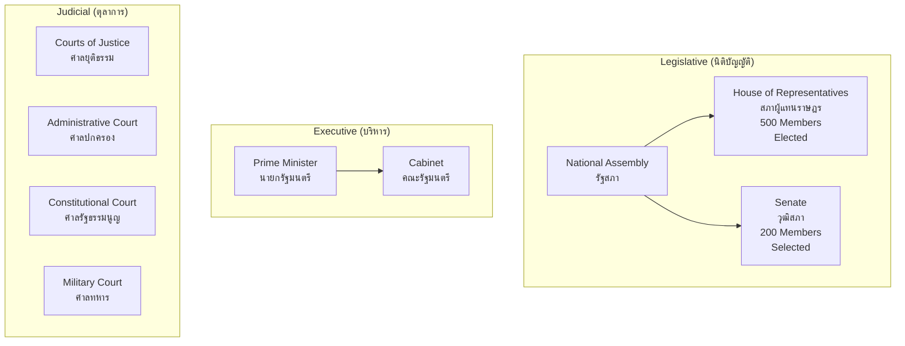

---
tags:
  - law
  - constitutional-law
  - administrative-law
  - public-law
source: "Constitution of Thailand B.E. 2560 (2017); Administrative Procedure Act B.E. 2539"
created: 2026-07-27
domain: "Constitutional & Administrative Law"
prerequisites: ["[[01_Foundations_of_Law]]"]
---

# 04 — Constitutional & Administrative Law

> *"A constitution is not the act of a government, but of a people constituting a government."* — Thomas Paine

Constitutional and Administrative Law form Thailand's **public law** framework — governing the relationship between the state and its citizens. These are among the most dynamic and politically significant areas of Thai law.

---

## Part A: Constitutional Law (กฎหมายรัฐธรรมนูญ)

### 1 | Thailand's Constitutional History

| Constitution | Year | Key Features |
|---|---|---|
| **First Constitution** | 1932 | End of absolute monarchy; constitutional monarchy established |
| **1997 "People's Constitution"** | 2540 (1997) | Most democratic — strong rights, independent bodies, participatory |
| **2007 Constitution** | 2550 (2007) | Post-2006 coup; partially rolled back 1997 innovations |
| **Current Constitution** | 2560 (2017) | Post-2014 coup; 20-year National Strategy; Senate reform |

> Thailand has had **20 constitutions** since 1932 — one of the highest counts in the world.

### 2 | Core Constitutional Principles

| Principle | Thai | Meaning |
|---|---|---|
| **Democratic regime with the King as Head of State** | ระบอบประชาธิปไตยอันมีพระมหากษัตริย์ทรงเป็นประมุข | Thailand's unique constitutional formula |
| **Separation of powers** | การแบ่งแยกอำนาจ | Legislative, Executive, Judicial |
| **Rule of law** | หลักนิติธรรม | Government bound by law |
| **Fundamental rights** | สิทธิและเสรีภาพขั้นพื้นฐาน | Individual rights protected |
| **State duties** | หน้าที่ของรัฐ | State obligations to citizens |
| **Constitutional supremacy** | ความเป็นกฎหมายสูงสุดของรัฐธรรมนูญ | Constitution prevails over all other law |

### 3 | Structure of Government

### 4 | Fundamental Rights (สิทธิและเสรีภาพ)

| Category | Key Rights |
|---|---|
| **Personal rights** | Life, bodily integrity, no torture, presumption of innocence, privacy |
| **Procedural rights** | Fair trial, access to courts, legal aid, no double jeopardy |
| **Property rights** | Protection from expropriation without fair compensation |
| **Liberties** | Expression, assembly, association, religion, movement, occupation |
| **Social rights** | Education (12 years free), healthcare, consumer protection |
| **Political rights** | Vote, run for office, petition government |

**Limitations:** Rights may be limited by law for national security, public order, public morals, or rights of others — but must be proportionate.

### 5 | Constitutional Organs

| Organ | Thai | Function |
|---|---|---|
| **Constitutional Court** | ศาลรัฐธรรมนูญ | Constitutional review; political disqualification; dissolve parties |
| **Election Commission** | คณะกรรมการการเลือกตั้ง (กกต.) | Organize elections; investigate electoral fraud |
| **Ombudsman** | ผู้ตรวจการแผ่นดิน | Investigate government maladministration |
| **NACC** (National Anti-Corruption Commission) | ป.ป.ช. | Investigate and prosecute corruption |
| **State Audit Commission** | คณะกรรมการตรวจเงินแผ่นดิน | Audit government spending |
| **National Human Rights Commission** | คณะกรรมการสิทธิมนุษยชนแห่งชาติ | Promote and protect human rights |
| **Auditor General** | ผู้ว่าการตรวจเงินแผ่นดิน | Independent audit |

---

## Part B: Administrative Law (กฎหมายปกครอง)

### 6 | Key Legislation

| Law | Thai | Year |
|---|---|---|
| **Administrative Procedure Act** | พ.ร.บ. วิธีปฏิบัติราชการทางปกครอง | B.E. 2539 (1996) |
| **Administrative Court Establishment Act** | พ.ร.บ. จัดตั้งศาลปกครองฯ | B.E. 2542 (1999) |
| **Government Liability Act** | พ.ร.บ. ความรับผิดทางละเมิดของเจ้าหน้าที่ | B.E. 2539 (1996) |
| **Official Information Act** | พ.ร.บ. ข้อมูลข่าวสารของราชการ | B.E. 2540 (1997) |

### 7 | Core Administrative Law Concepts

| Concept | Description |
|---|---|
| **Administrative act** (คำสั่งทางปกครอง) | Any exercise of legal power by an administrative agency affecting an individual |
| **Administrative contract** (สัญญาทางปกครอง) | Contract involving public service or public utility |
| **Rule-making** (การออกกฎ) | Issuing subordinate legislation (regulations, rules, orders) |
| **Discretion** (ดุลพินิจ) | Agency's power to choose among options — must not be arbitrary |
| **Due process** (กระบวนการที่ถูกต้อง) | Right to be heard; reasons for decisions; impartial decision-maker |

### 8 | Administrative Court Jurisdiction

| Case Type | Examples |
|---|---|
| **Unlawful administrative acts** | Challenge to orders, decisions, licenses |
| **Abuse of discretion** | Arbitrary, discriminatory, or unreasonable decisions |
| **Administrative contracts** | Disputes over government procurement, concessions |
| **Government tort liability** | State liability for officials' wrongful acts |
| **Official discipline** | Disciplinary actions against civil servants |

---

## 9 | Key Terminology

| Thai | English | Notes |
|---|---|---|
| รัฐธรรมนูญ | Constitution | Supreme law |
| รัฐสภา | National Assembly / Parliament | Legislative branch |
| สภาผู้แทนราษฎร | House of Representatives | Lower house — elected |
| วุฒิสภา | Senate | Upper house — selected |
| สิทธิและเสรีภาพ | Rights and Liberties | Fundamental protections |
| ศาลรัฐธรรมนูญ | Constitutional Court | Constitutional adjudication |
| ศาลปกครอง | Administrative Court | Administrative justice |
| คำสั่งทางปกครอง | Administrative Order | Agency decision |
| ดุลพินิจ | Discretion | Agency's choice |
| หลักความได้สัดส่วน | Proportionality | Limits on rights must be proportionate |

---

## Related Notes

- [[01_Foundations_of_Law]] — Court system and hierarchy of law
- [[06_Legal_Procedure_and_Litigation]] — Administrative court procedure
- [[05_International_and_Business_Law]] — Constitutional law applied to business regulation
- [[Lawyer - Overview]] — Return to law overview
