---
tags:
  - law
  - civil-procedure
  - criminal-procedure
  - evidence
  - litigation
source: "Civil Procedure Code; Criminal Procedure Code of Thailand"
created: 2026-07-27
domain: "Legal Procedure & Litigation"
prerequisites: ["[[02_Civil_and_Commercial_Law]]", "[[03_Criminal_Law]]"]
---

# 06 — Legal Procedure & Litigation

> *"Procedure is the heartbeat of justice. Without it, rights are just words on paper."*

Legal procedure — how cases actually move through the system — is where law comes alive. Whether you're filing a civil lawsuit, defending a criminal charge, or negotiating a settlement, procedure is your map and your weapon.

---

## Part A: Civil Procedure (วิธีพิจารณาความแพ่ง)

### 1 | Key Principles of Civil Procedure

| Principle | Thai | Meaning |
|---|---|---|
| **Party control** | หลักความศักดิ์สิทธิ์ของคู่ความ | Parties decide what to file, what evidence to present, when to settle |
| **Adversarial system** | ระบบกล่าวหา | Judge as neutral umpire; parties fight it out |
| **Orality** | หลักวาจา | Evidence and arguments presented orally in court |
| **Public trial** | หลักการพิจารณาคดีโดยเปิดเผย | Court proceedings open to public (with exceptions) |

### 2 | Civil Case Flow

```mermaid
flowchart TD
    A["1 Plaintiff files Complaint<br/>คำฟ้อง"] --> B["2 Court screens<br/>Not frivolous / within jurisdiction?"]
    B --> C["3 Summons served on Defendant<br/>หมายเรียก"]
    C --> D["4 Defendant files Answer<br/>คำให้การ<br/>&#40;within time limit&#41;"]
    D --> E["5 Settlement / Mediation<br/>ไกล่เกลี่ย<br/>&#40;encouraged by court&#41;"]
    E -->|Settled| F["Case ends<br/>ถอนฟ้อง / ยอมความ"]
    E -->|Not settled| G["6 Issues framed<br/>ชี้สองสถาน<br/>What's in dispute?"]
    G --> H["7 Trial<br/>สืบพยาน<br/>Plaintiff → Defendant<br/>Witnesses, documents"]
    H --> I["8 Closing arguments<br/>แถลงการณ์ปิดคดี"]
    I --> J["9 Judgment<br/>คำพิพากษา"]
    J --> K{Appeal?}
    K -->|Yes| L["Appeal Court<br/>ศาลอุทธรณ์"]
    L --> M{Further appeal?}
    M -->|Yes| N["Supreme Court<br/>ศาลฎีกา<br/>&#40;permission required for most cases&#41;"]
    K -->|No| O["Judgment final<br/>Execution"]
```

### 3 | Jurisdiction (เขตอำนาจศาล)

| Basis | Rule |
|---|---|
| **Subject matter** | Civil Court vs. specialized courts (labour, tax, IP, etc.) |
| **Territorial** | Defendant's domicile OR where cause of action arose |
| **Amount** | < ฿300,000 → Municipal Court (ศาลแขวง); ≥ ฿300,000 → Provincial/Civil Court |
| **Exclusive jurisdiction** | Some cases must go to specific courts |

### 4 | Key Pleadings

| Document | Thai | Filed By | Content |
|---|---|---|---|
| **Complaint (Plaint)** | คำฟ้อง | Plaintiff | Facts, legal basis, relief sought |
| **Answer** | คำให้การ | Defendant | Admission/denial of each allegation; affirmative defenses |
| **Counterclaim** | ฟ้องแย้ง | Defendant | Defendant's own claim against plaintiff |
| **Reply** | — | Plaintiff (to counterclaim) | Response to counterclaim |
| **Motion** | คำร้อง | Either party | Requests for court orders (e.g., interim injunction) |

---

## Part B: Criminal Procedure (วิธีพิจารณาความอาญา)

### 5 | Criminal Case Flow

```mermaid
flowchart TD
    A["1 Crime occurs / Complaint<br/>แจ้งความ"] --> B["2 Police investigation<br/>สอบสวน"]
    B --> C["3 Case file to Prosecutor<br/>สำนวนถึงอัยการ"]
    C --> D{Prosecutor's Decision}
    D -->|Prosecute| E["4 File charges in court<br/>ฟ้องคดี"]
    D -->|Not prosecute| F["Case dropped<br/>สั่งไม่ฟ้อง<br/>&#40;victim may prosecute privately&#41;"]
    E --> G["5 Arraignment<br/>ถามคำให้การ<br/>Guilty / Not guilty"]
    G -->|Guilty| H["Sentence<br/>&#40;no trial needed<br/>if court accepts&#41;"]
    G -->|Not guilty| I["6 Trial<br/>Prosecution → Defense<br/>Witnesses, cross-exam"]
    I --> J["7 Judgment<br/>Convicted / Acquitted"]
    J --> K{Appeal?}
    K -->|Yes| L["Court of Appeal<br/>→ Supreme Court"]
    K -->|No| M["Sentence final<br/>Prison / Fine / Probation"]
```

### 6 | Key Criminal Procedure Rights

| Right | Source |
|---|---|
| **Right to remain silent** | Criminal Procedure Code |
| **Right to counsel** | Constitution + CPC — lawyer at all stages, including police interrogation |
| **Presumption of innocence** | Constitution |
| **Bail** (ประกันตัว) | CPC — generally available unless flight risk, tampering, or serious offense |
| **Speedy trial** | Constitution |
| **No double jeopardy** | CPC — once acquitted/convicted, cannot be retried for same offense |
| **Appeal** | CPC — right to appeal (with limitations) |
| **Right to interpreter** | CPC |

### 7 | Arrest & Detention

| Stage | Rule |
|---|---|
| **Arrest with warrant** | Court issues arrest warrant (หมายจับ) — police execute |
| **Arrest without warrant** | Flagrant offense (ความผิดซึ่งหน้า) or certain conditions |
| **Detention period** | 48 hours (extendable by court in 12-day increments; max 84 days total for serious crimes) |
| **Habeas corpus** | Right to challenge unlawful detention |

---

## Part C: Law of Evidence (กฎหมายลักษณะพยาน)

### 8 | Types of Evidence

| Type | Thai | Examples |
|---|---|---|
| **Documentary** | พยานเอกสาร | Contracts, letters, records, electronic records |
| **Witness / Oral** | พยานบุคคล | Eyewitness, expert, character witness |
| **Physical / Real** | พยานวัตถุ | Weapon, stolen goods, DNA, fingerprints |
| **Circumstantial** | พยานพฤติเหตุแวดล้อมกรณี | Indirect evidence — inference |
| **Expert** | พยานผู้เชี่ยวชาญ | Forensic, medical, accounting, handwriting |
| **Electronic** | พยานหลักฐานอิเล็กทรอนิกส์ | Emails, chat logs, CCTV, GPS data |

### 9 | Key Evidence Rules

| Rule | Description |
|---|---|
| **Burden of proof** | Civil: preponderance (ฝ่ายใดมีพยานหลักฐานน่าเชื่อถือกว่า); Criminal: beyond reasonable doubt (ปราศจากข้อสงสัยอันสมควร) |
| **Relevance** | Evidence must be relevant to facts in issue |
| **Hearsay** | Generally inadmissible (with exceptions — dying declaration, business records, etc.) |
| **Best evidence rule** | Original document required (unless unavailable) |
| **Privilege** | Attorney-client, spousal, official secrets |
| **Illegally obtained evidence** | Thai courts may admit with caution (unlike US exclusionary rule) |

---

## Part D: Alternative Dispute Resolution (ADR)

### 10 | ADR Mechanisms

| Method | Thai | Description |
|---|---|---|
| **Negotiation** | การเจรจาต่อรอง | Direct discussion; no third party |
| **Mediation** | การไกล่เกลี่ย | Neutral third party facilitates agreement (non-binding) |
| **Arbitration** | อนุญาโตตุลาการ | Private judge; binding decision; governed by Arbitration Act B.E. 2545 |
| **Court-annexed mediation** | การไกล่เกลี่ยในศาล | Court encourages settlement before trial |

**Arbitration advantages:** Faster, confidential, expert decision-maker, final (limited appeal), internationally enforceable (New York Convention — Thailand is a party).

---

## 11 | Key Terminology

| Thai | English | Notes |
|---|---|---|
| คำฟ้อง | Complaint / Plaint | Initiates civil lawsuit |
| คำให้การ | Answer | Defendant's response |
| การสืบพยาน | Trial / Taking of Evidence | Witness examination |
| หมายเรียก | Summons | Court order to appear |
| หมายจับ | Arrest Warrant | Court order to arrest |
| การประกันตัว | Bail | Release pending trial |
| พยานหลักฐาน | Evidence | Proof offered in court |
| การไกล่เกลี่ย | Mediation | Facilitated settlement |
| อนุญาโตตุลาการ | Arbitration | Private adjudication |
| คำพิพากษา | Judgment | Court's final decision |
| อุทธรณ์ / ฎีกา | Appeal / Final Appeal | Challenging a judgment |

---

## Related Notes

- [[02_Civil_and_Commercial_Law]] — Substantive civil law
- [[03_Criminal_Law]] — Substantive criminal law
- [[01_Foundations_of_Law]] — Court system overview
- [[Lawyer - Overview]] — Return to law overview
