---
tags:
  - overview
  - law
  - legal-profession
  - career
  - thai-education
source: "Lawyer Act B.E. 2528 (1985); Lawyers Council of Thailand; Thai Bar Association"
created: 2026-07-27
profession: "นักกฎหมาย (Legal Professional)"
degree: "น.บ. (นิติศาสตรบัณฑิต) — Bachelor of Laws (LL.B.)"
duration: "3-4 ปี (3-4 years)"
---

# Law — วิชาชีพนักกฎหมาย

> *"The law is reason, free from passion."* — Aristotle

> *"ทนายความ คือ ผู้ที่ได้รับใบอนุญาตให้ว่าความต่างหากจากคู่ความหรือผู้ที่เกี่ยวข้องในคดี ต้องได้รับใบอนุญาตจากสภาทนายความ และปฏิบัติตามพระราชบัญญัติทนายความ พ.ศ. 2528"* — พระราชบัญญัติทนายความ

## What Is This?

This is a **career guidance knowledge base** for Thai students considering law as a profession. It covers what the legal profession is, what you'll learn, how to get licensed, where you can study, and what career paths exist — from courtroom litigator to corporate counsel to judge.

The legal profession in Thailand is regulated by the **Lawyer Act B.E. 2528 (1985)** — พระราชบัญญัติทนายความ, administered by the **Lawyers Council of Thailand (สภาทนายความในพระบรมราชูปถัมภ์)**.

> ⚠️ **"Lawyer" ≠ "Judge" ≠ "Prosecutor"** — These are different career tracks with different licensing and selection processes.

## Education & Licensing Pathways

```mermaid
flowchart TD
    A[ม.6 Graduate<br/>Any track] --> B[Apply via TCAS<br/>คณะนิติศาสตร์]
    B --> C["LL.B. &#40;น.บ.&#41;<br/>3-4 Years"]
    C --> D{Choose Path}
    D -->|Lawyer| E["Apply to Lawyers Council<br/>+ Pass training course<br/>สำนักฝึกอบรมวิชาว่าความ"]
    E --> F["Registered Lawyer<br/>ทนายความ<br/>Get license"]
    F --> G["Practice Law<br/>Litigation / Corporate / Government"]
    D -->|Prosecutor| H["Pass อัยการผู้ช่วย exam<br/>Open exam by OAG"]
    H --> I["Assistant Prosecutor<br/>อัยการผู้ช่วย<br/>1 year probation"]
    I --> J["Public Prosecutor<br/>อัยการ"]
    D -->|Judge| K["Pass ผู้ช่วยผู้พิพากษา exam<br/>Open exam by OJC"]
    K --> L["Judge Advocate<br/>ผู้ช่วยผู้พิพากษา<br/>1 year training"]
    L --> M["Judge<br/>ผู้พิพากษา"]
    D -->|In-House| N["Legal Officer / นิติกร<br/>No license required<br/>&#40;for corporate work&#41;"]
    F --> O["เนติบัณฑิต &#40;Barrister-at-Law&#41;<br/>Thai Bar Association<br/>1 year program"]
    G --> O
    O --> P["Advanced Practice<br/>Specialization, partnership"]
```

## The 6 Knowledge Domains

### 🏛️ Foundations
- [[01_Foundations_of_Law|01 Foundations of Law]] — Legal philosophy, Thai legal history, sources of law, court system, legal research and writing

### 👥 Private Law
- [[02_Civil_and_Commercial_Law|02 Civil & Commercial Law]] — Civil Code (persons, property, obligations, contracts, torts, family, succession), Commercial Code, consumer protection

### ⚖️ Public Law & Crime
- [[03_Criminal_Law|03 Criminal Law]] — Penal Code, criminal responsibility, defenses, specific offenses (property, person, state), juvenile justice
- [[04_Constitutional_and_Administrative_Law|04 Constitutional & Administrative Law]] — Constitution, fundamental rights, administrative procedure, judicial review

### 🌏 Modern Practice
- [[05_International_and_Business_Law|05 International & Business Law]] — International law, trade, IP, tax, labor, corporate law, M&A, ASEAN legal framework

### 📋 Procedure
- [[06_Legal_Procedure_and_Litigation|06 Legal Procedure & Litigation]] — Civil procedure, criminal procedure, evidence, trial advocacy, ADR

### 🎓 Career Pathways
- [[00_University_Guide_and_Career_Paths|University Guide & Career Paths]] — Top law faculties, licensing, career tracks (lawyer, judge, prosecutor, in-house), salaries

## The Legal Profession in Thailand

### Professional Bodies

| Organization | Thai Name | Role |
|---|---|---|
| **Lawyers Council of Thailand** | สภาทนายความในพระบรมราชูปถัมภ์ | License lawyers, ethics, training, discipline |
| **Thai Bar Association** | เนติบัณฑิตยสภา | Advanced legal education (Barrister-at-Law), legal research |
| **Office of the Judiciary** | สำนักงานศาลยุติธรรม | Administration of courts of justice |
| **Office of the Attorney General** | สำนักงานอัยการสูงสุด | Public prosecution |
| **Office of the Ombudsman** | สำนักงานผู้ตรวจการแผ่นดิน | Administrative justice |

### Legal Framework for the Profession

| Law | Year | Purpose |
|---|---|---|
| **พ.ร.บ. ทนายความ พ.ศ. 2528** | 1985 | Regulates lawyers — licensing, ethics, discipline |
| **พ.ร.บ. ระเบียบข้าราชการฝ่ายตุลาการ** | — | Regulates judges |
| **พ.ร.บ. ระเบียบข้าราชการฝ่ายอัยการ** | — | Regulates prosecutors |
| **ข้อบังคับสภาทนายความ** | — | Lawyers Council regulations |

### Who Can Practice Law in Thailand?

| Role | Thai | License From | Core Work |
|---|---|---|---|
| **Lawyer (Attorney)** | ทนายความ | Lawyers Council | Represent clients in court; legal advice |
| **Public Prosecutor** | อัยการ | OAG (civil service) | Prosecute criminal cases on behalf of state |
| **Judge** | ผู้พิพากษา | Judicial Commission | Adjudicate cases; deliver judgments |
| **Legal Officer / In-House Counsel** | นิติกร | No license required | Corporate legal work (not court representation) |
| **Notary** | ทนายความผู้รับรองเอกสาร | Lawyers Council (additional) | Certify documents |

---

## Key Terminology

| Thai | English | Notes |
|---|---|---|
| นิติศาสตรบัณฑิต (น.บ.) | Bachelor of Laws (LL.B.) | 3-4 year degree |
| ทนายความ | Lawyer / Attorney | Licensed by Lawyers Council |
| อัยการ | Public Prosecutor | State attorney — civil service |
| ผู้พิพากษา | Judge | Judicial officer — civil service |
| สภาทนายความ | Lawyers Council | Regulatory body |
| เนติบัณฑิต | Barrister-at-Law | Advanced qualification from Thai Bar |
| ใบอนุญาตว่าความ | Law License | Issued by Lawyers Council |
| นิติกร | Legal Officer | In-house counsel |
| คดีแพ่ง / คดีอาญา | Civil Case / Criminal Case | Two major case types |
| สำนักงานอัยการสูงสุด (OAG) | Office of the Attorney General | Prosecution service |

---

## Reading Paths

- **High school student exploring:** Start here → [[00_University_Guide_and_Career_Paths|University Guide]] → choose your track
- **Law student:** All domain notes → decide: litigator, corporate, or government
- **Career changer to law:** [[01_Foundations_of_Law|Foundations]] → [[00_University_Guide_and_Career_Paths|Pathways]]
- **Parent/guidance counselor:** [[00_University_Guide_and_Career_Paths|University Guide]] → Return here

---

> **Related Careers:** [[Judge / Prosecutor|Judicial Careers]], [[../teacher/Teacher - Overview|Teaching]] (law lecturer), [[Diplomat|Diplomatic Service]]
