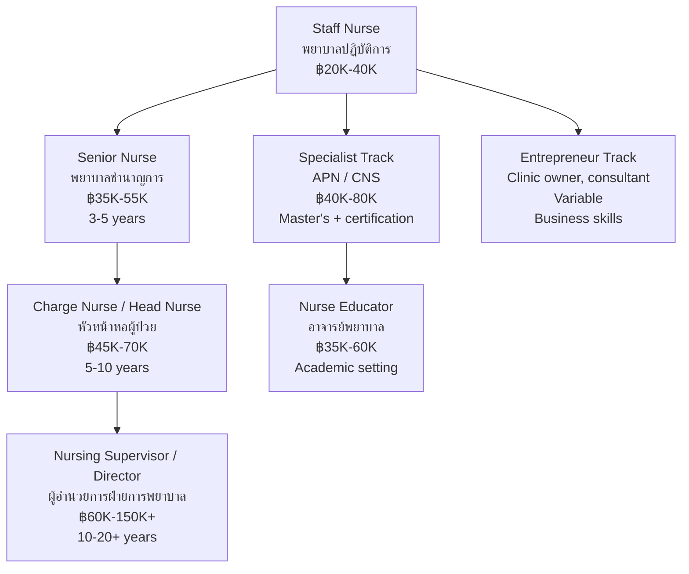

---
tags:
  - nursing
  - university-guide
  - career-paths
  - TCAS
  - salary
source: "Thai Nursing Council; TCAS; University websites; Ministry of Public Health"
created: 2026-07-27
domain: "University Guide & Career Paths"
prerequisites: ["[[Nursing - Overview]]"]
---

# 08 — University Guide & Career Paths

> *"Choose your school wisely — it shapes your first professional network, your clinical exposure, and your career trajectory."*

This is the practical guide: where to study, how to get in, what it costs, what you'll earn, and where nursing can take you. For students, parents, and guidance counselors.

---

## Part A: University Guide (แนวทางเข้าศึกษา)

### 1 | Admission Requirements (คุณสมบัติผู้สมัคร)

| Requirement | Details |
|---|---|
| **Education** | ม.6 (Matthayom 6) graduate, **Science-Math track (สายวิทย์-คณิต)** preferred/required |
| **GPA** | Minimum GPAX typically 2.00–2.75 (varies by university) |
| **GPA Science** | Some universities require GPA ≥ 2.50 in Biology, Chemistry |
| **Age** | Typically 17–25 years old at enrollment |
| **Health** | Physical and mental fitness for clinical practice (medical certificate) |
| **Height** | Some universities have minimum height (e.g., 150 cm women, 155 cm men) — varies |
| **Nationality** | Thai nationality (for public programs); international programs accept foreigners |

### 2 | TCAS Admission Rounds

| Round | Period | Description | Requires |
|---|---|---|---|
| **TCAS 1 — Portfolio** | Oct–Dec | Portfolio-based, no exam | Portfolio + GPAX + English proficiency |
| **TCAS 2 — Quota** | Jan–Mar | Regional/special quotas | Varies — some use exam, some portfolio |
| **TCAS 3 — Admission 1** | Mar–May | Central admission via TGAT/TPAT + A-Level | TGAT, TPAT1, A-Level scores |
| **TCAS 4 — Admission 2** | May–Jun | Direct admission (รับตรง) by each university | University-specific criteria |
| **TCAS 5 — Direct** | Jun–Jul | Final round, remaining seats | University-specific criteria |

### 3 | Exams Required for Nursing (TCAS 3)

| Exam | Subject | Weight (Typical) |
|---|---|---|
| **TGAT** (ทั่วไป) | Thai General Aptitude Test — communication, thinking, English | 20–30% |
| **TPAT 1** (ความถนัดแพทย์) | Medical Aptitude Test — biology, chemistry, physics, critical thinking | 20–30% |
| **A-Level Biology** | ชีววิทยา | 10–15% |
| **A-Level Chemistry** | เคมี | 10–15% |
| **A-Level English** | ภาษาอังกฤษ | 10–15% |
| **A-Level Math 1** | คณิตศาสตร์ 1 (พื้นฐาน+เพิ่มเติม) | 5–10% |

**Note:** The exact weight varies by university. The most competitive programs (Mahidol, CMU, etc.) may have higher TPAT1 weight.

### Nursing Programs in Thailand

| University | Faculty | Location | Notable Features |
|---|---|---|---|
| **Mahidol University** | คณะพยาบาลศาสตร์ ม.มหิดล | Bangkok (Salaya / Siriraj) | - |
| **Chiang Mai University** | คณะพยาบาลศาสตร์ ม.เชียงใหม่ (Nurse CMU) | Chiang Mai | - |
| **Khon Kaen University** | คณะพยาบาลศาสตร์ ม.ขอนแก่น | Khon Kaen | Srinagarind Hospital; NE Thailand hub; strong APN programs |
| **Prince of Songkla University** | คณะพยาบาลศาสตร์ ม.สงขลานครินทร์ | Hat Yai | Songklanagarind Hospital; Southern Thailand leader |
| **Thammasat University** | คณะพยาบาลศาสตร์ ม.ธรรมศาสตร์ | Pathum Thani (Rangsit) | Thammasat University Hospital; strong law/ethics component |
| **Srinakharinwirot University** | คณะพยาบาลศาสตร์ มศว | Bangkok (Ongkharak) | Strong clinical training; HRH Princess Maha Chakri Sirindhorn Medical Center |
| **Burapha University** | คณะพยาบาลศาสตร์ ม.บูรพา | Chonburi | Eastern seaboard hub; strong international programs |
| **Naresuan University** | คณะพยาบาลศาสตร์ ม.นเรศวร | Phitsanulok | Lower Northern Thailand; strong community nursing |
| **Walailak University** | คณะพยาบาลศาสตร์ | Nakhon Si Thammarat | - |
| **Mahasarakham University** | คณะพยาบาลศาสตร์ | Maha Sarakham | - |
| **Ubon Ratchathani University** | คณะพยาบาลศาสตร์ | Ubon Ratchathani | - |
| **Suranaree University of Technology** | สำนักวิชาพยาบาลศาสตร์ | Nakhon Ratchasima | - |
| **Mae Fah Luang University** | คณะพยาบาลศาสตร์ | Chiang Rai | - |
| **Silpakorn University** | คณะพยาบาลศาสตร์ | Nakhon Pathom | - |

### 5 | Tuition & Costs (ค่าใช้จ่าย)

| Type | Tuition per Year (Approx.) | Notes |
|---|---|---|
| **Public University** | ฿15,000–฿40,000 | Subsidized by government |
| **MOPH Nursing College** | ฿0–฿10,000 | Nearly free; government scholarship with service commitment |
| **Private University** | ฿80,000–฿200,000 | E.g., Assumption (ABAC), Rangsit, Eastern Asia |
| **International Program** | ฿150,000–฿400,000 | English-medium instruction |

**Additional costs:**
- Uniforms, books, equipment (stethoscope, etc.): ~฿10,000–฿20,000/year
- Dormitory/housing: ~฿2,000–฿8,000/month
- Living expenses: ~฿5,000–฿15,000/month

### 6 | Scholarships (ทุนการศึกษา)

| Scholarship | Sponsor | Details |
|---|---|---|
| **ทุนพยาบาลกระทรวงสาธารณสุข** | Ministry of Public Health | Free tuition + stipend; work commitment 2–4 years |
| **ทุน ก.พ.** | Civil Service Commission | For government hospital service |
| **ทุนพยาบาลทหาร** | Royal Thai Army/Navy/Air Force | Free education; military nursing career |
| **ทุนคณะพยาบาลศาสตร์** | Individual universities | Merit-based, need-based |
| **ทุนOne District One Scholarship (ODOS)** | Government | Students from rural districts |
| **ทุน กยศ. (Student Loan Fund)** | Government | Low-interest loan, repayment after employment |

---

## Part B: Career Paths (เส้นทางอาชีพ)

### 7 | Licensing & First Job

### 8 | Work Settings

| Setting | Description | Salary Range (Monthly) |
|---|---|---|
| **Public Hospital — Provincial/Regional** | General nursing, variety of units | ฿20,000–฿35,000 |
| **Public Hospital — University** | Teaching hospital, research opportunities | ฿25,000–฿40,000 |
| **Private Hospital** | Higher pay, standardized patient ratios | ฿30,000–฿60,000 |
| **Sub-district Health Center (รพ.สต.)** | Community health, home visits | ฿20,000–฿30,000 |
| **Clinic / Outpatient** | Regular hours, no night shifts | ฿25,000–฿45,000 |
| **School Nurse** | School setting, M-F schedule | ฿20,000–฿35,000 |
| **Occupational Health Nurse** | Factory/company, prevention focus | ฿30,000–฿70,000 |
| **Nursing Home / Elderly Care** | Growing sector in aging Thailand | ฿25,000–฿50,000 |
| **Airlines / Cruise Ship** | Travel nursing, first aid | ฿40,000–฿100,000+ |
| **International / Overseas** | USA, UK, Australia, Middle East | ฿80,000–฿300,000+ |

### 9 | Career Progression Ladder

### 10 | In-Demand Specialties in Thailand

| Specialty | Why In Demand |
|---|---|
| **Critical Care (ICU/CCU)** | Complex patients, advanced tech — always needed |
| **Emergency Nursing** | High turnover, requires strong assessment skills |
| **Geriatric Nursing** | Thailand's aging population — massive growth area |
| **Oncology Nursing** | Cancer rates rising — specialized chemo/radiation skills |
| **Dialysis Nursing** | CKD prevalence high — hemodialysis and PD |
| **Infection Control** | Post-COVID awareness — every hospital needs one |
| **Nurse Anesthetist (วิสัญญีพยาบาล)** | Critical shortage — 1-year certificate = high demand |
| **Home Healthcare** | Aging society + preference for home-based care |
| **Health Informatics** | Digital health transformation — nurses who code |
| **Aesthetic/Cosmetic Nursing** | Booming industry — laser, injectables, skincare |

### 11 | International Career Pathways

| Destination | Requirements | Salary Range |
|---|---|---|
| **USA** | NCLEX-RN + English (IELTS/TOEFL) + VisaScreen | $60,000–$120,000/yr (฿2.1M–฿4.2M) |
| **UK** | NMC registration + IELTS 7.0 | £25,000–£45,000/yr (฿1.1M–฿2M) |
| **Australia** | AHPRA registration + IELTS 7.0 | AUD 65,000–100,000/yr (฿1.5M–฿2.3M) |
| **Middle East (UAE, Saudi)** | License + experience (2+ years) | Tax-free, ฿80,000–฿200,000/month |
| **Japan** | Japanese language (N1/N2) + EPA program | ¥3.5–5M/yr (฿0.8M–฿1.2M) |
| **Singapore** | SNB registration + English | SGD 3,000–5,500/month (฿80K–฿150K) |

### 12 | Professional Organizations to Join

| Organization | Thai Name | Benefit |
|---|---|---|
| **Thailand Nursing and Midwifery Council** | สภาการพยาบาล | Mandatory — license and regulation |
| **Thai Nurses Association** | สมาคมพยาบาลแห่งประเทศไทยฯ | Professional development, conferences, journals |
| **Specialty nursing associations** | e.g., สมาคมวิสัญญีพยาบาล, ชมรมพยาบาลโรคหัวใจ | Networking, specialty education |
| **Sigma Theta Tau (STTI)** | Honor society (chapter at major universities) | International research network |
| **ICN (International Council of Nurses)** | สภาพยาบาลระหว่างประเทศ | Global voice for nursing |

---

## 13 | Key Terminology

| Thai | English | Notes |
|---|---|---|
| TCAS | Thai University Central Admission System | 5-round system |
| TGAT | Thai General Aptitude Test | Communication, thinking, English |
| TPAT 1 | Medical Aptitude Test | Biology, chemistry, physics focus |
| A-Level | Applied Knowledge Level | Subject-specific exams |
| คณะพยาบาลศาสตร์ | Faculty of Nursing | Most universities have this |
| วิทยาลัยพยาบาลบรมราชชนนี | Boromarajonani College of Nursing | MOPH nursing colleges |
| ทุนพยาบาล | Nursing Scholarship | Usually with work commitment |
| การสอบขึ้นทะเบียนฯ | National Licensure Examination | 8 subjects |
| เงินเดือน | Salary | Varies by setting and experience |
| พยาบาลขั้นสูง (APN) | Advanced Practice Nurse | Master's + specialty |

---

## 14 | Summary: Is Nursing Right for You?

| ✅ You'll thrive if you... | ⚠️ Consider carefully if you... |
|---|---|
| Care deeply about helping others | Dislike physical contact or body fluids |
| Stay calm under pressure | Get flustered by fast-paced environments |
| Enjoy science (biology, chemistry) | Strongly dislike science |
| Communicate well with all kinds of people | Prefer working alone |
| Are detail-oriented and organized | Find repetitive tasks boring |
| Can handle emotional situations | Take on others' emotional pain |
| Are physically fit (on feet 8–12 hrs) | Have physical limitations |
| Want a stable career with options | Are only in it for money (there are easier ways) |

> **Final thought:** Nursing isn't just a job — it's a vocation. It's hard. The hours are long. The responsibility is heavy. But few careers offer the same depth of human connection, the same sense of purpose, or the same variety of paths. If you're called to it, there's nothing quite like it.

---

## Related Notes

- [[Nursing - Overview]] — Start here for the big picture
- [[01_Foundation_Sciences]] — What you'll study in Year 1–2
- [[07_Clinical_Practice_and_Research]] — Advanced practice pathways
