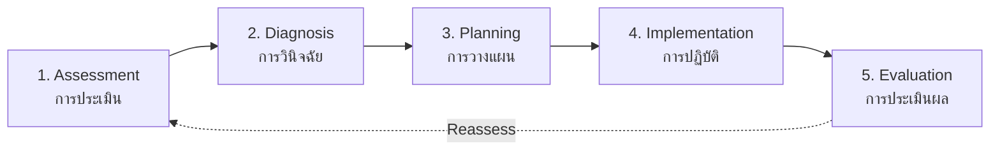

---
tags:
  - nursing
  - fundamentals
  - nursing-process
  - basic-care
source: "Thai Nursing Council B.N.S. Curriculum Standards"
created: 2026-07-27
domain: "Nursing Fundamentals"
prerequisites: ["[[01_Foundation_Sciences]]"]
---

# 02 — Nursing Fundamentals

> *"Nursing is an art: and if it is to be made an art, it requires an exclusive devotion as hard a preparation as any painter's or sculptor's work."* — Florence Nightingale

Nursing fundamentals is where theory meets practice. Students learn the **nursing process** — the systematic method nurses use to assess, plan, implement, and evaluate care. This is the core of all nursing practice, taught primarily in **Year 2**.

---

## 1 | The Nursing Process (กระบวนการพยาบาล)

### 1.1 Assessment (การประเมินภาวะสุขภาพ)

| Type | Method | Example |
|---|---|---|
| **Health history** | Interview | Chief complaint, past history, family history |
| **Physical examination** | Inspection, palpation, percussion, auscultation (IPPA) | Head-to-toe assessment |
| **Vital signs** | Measurement | Temperature, pulse, respiration, BP, SpO₂, pain |
| **Psychosocial** | Interview, observation | Mental status, coping, support system |
| **Functional** | ADL assessment | Barthel Index — bathing, dressing, toileting, mobility |
| **Diagnostic data** | Lab results, imaging | CBC, electrolytes, X-ray, CT |

### 1.2 Nursing Diagnosis (การวินิจฉัยทางการพยาบาล)

Uses **NANDA-I** (North American Nursing Diagnosis Association International) classification:

| Type | Definition | Example |
|---|---|---|
| **Actual** | Problem currently present | *Impaired Skin Integrity* related to immobility |
| **Risk** | Vulnerability to a problem | *Risk for Infection* related to surgical incision |
| **Health promotion** | Readiness to improve health | *Readiness for Enhanced Nutrition* |
| **Syndrome** | Cluster of related diagnoses | *Post-Trauma Syndrome* |

**Format:** Problem **related to** (r/t) Etiology **as evidenced by** (AEB) Signs/Symptoms

### 1.3 Planning (การวางแผน)

| Component | Description |
|---|---|
| **Priority setting** | Maslow's hierarchy: ABC (Airway-Breathing-Circulation) first |
| **Goals/Outcomes** | SMART: Specific, Measurable, Achievable, Relevant, Time-bound |
| **Nursing interventions** | Independent (nurse-initiated), dependent (physician-ordered), interdependent (collaborative) |
| **Care plan** | Written/electronic document guiding all care |

### 1.4 Implementation (การปฏิบัติการพยาบาล)

| Category | Examples |
|---|---|
| **Direct care** | Medication administration, wound dressing, bathing |
| **Indirect care** | Documentation, shift handover, equipment preparation |
| **Health teaching** | Patient education, discharge planning |
| **Emotional support** | Active listening, therapeutic communication |
| **Coordination** | Referral to PT, nutrition, social work |

### 1.5 Evaluation (การประเมินผล)

- Compare outcomes to goals: **Met / Partially met / Not met**
- If not met: revise care plan — return to assessment

---

## 2 | Core Nursing Skills

### 2.1 Vital Signs Measurement

| Sign | Normal Adult Range | Critical Values |
|---|---|---|
| **Temperature** | 36.5–37.5 °C | < 35 °C (hypothermia), > 39 °C (high fever) |
| **Pulse** | 60–100 bpm | < 50 (bradycardia), > 120 (tachycardia) |
| **Respiration** | 12–20 /min | < 10 (bradypnea), > 28 (tachypnea) |
| **Blood Pressure** | < 120/80 mmHg | < 90/60 (hypotension), > 180/110 (hypertensive crisis) |
| **SpO₂** | ≥ 95% | < 90% (hypoxemia — urgent!) |
| **Pain (0–10)** | 0 (no pain) | Document as "5th vital sign" |

### 2.2 Infection Prevention & Control

| Level | Practice | Example |
|---|---|---|
| **Standard precautions** | Applied to ALL patients | Hand hygiene, gloves when touching body fluids |
| **Contact precautions** | Added for MDRO, C. diff | Gown + gloves, private room |
| **Droplet precautions** | Added for influenza, meningitis | Surgical mask, eye protection |
| **Airborne precautions** | Added for TB, measles, varicella | N95/PAPR, negative pressure room |

### 2.3 Medication Administration

**The "5 Rights" + 3 Checks:**

| Right | Verification |
|---|---|
| Right **Patient** | 2 identifiers (name + HN/DOB) |
| Right **Drug** | Check label 3 times |
| Right **Dose** | Calculate, double-check high-alert |
| Right **Route** | PO, IV, IM, SC, topical, etc. |
| Right **Time** | Scheduled vs. PRN, frequency |
| Right **Documentation** | Record AFTER administration |
| Right **Reason** | Indication matches diagnosis |
| Right **Response** | Monitor for therapeutic/adverse effects |

### 2.4 Wound Care

| Type | Management |
|---|---|
| **Surgical wound** | Aseptic technique, monitor for dehiscence/evisceration |
| **Pressure injury** | Reposition q2h, specialty mattress, staging (Stage 1–4, Unstageable, DTI) |
| **Diabetic ulcer** | Offloading, glycemic control, debridement |
| **Burn** | Rule of Nines, fluid resuscitation (Parkland formula) |

### 2.5 Mobility & Safety

| Intervention | Rationale |
|---|---|
| **Fall risk assessment** | Morse Fall Scale — every shift |
| **Side rails** | Use with caution — can be a restraint |
| **Assistive devices** | Walker, cane, crutches — proper fitting |
| **Body mechanics** | Protect nurse's back — lift with legs |
| **Restraints** | Last resort — physician order, q2h release |

---

## 3 | Key Terminology

| Thai | English | Notes |
|---|---|---|
| กระบวนการพยาบาล | Nursing Process | ADPIE framework |
| การประเมินภาวะสุขภาพ | Health Assessment | Systematic data collection |
| ข้อวินิจฉัยทางการพยาบาล | Nursing Diagnosis | NANDA-I classification |
| แผนการพยาบาล | Nursing Care Plan | Individualized care roadmap |
| สัญญาณชีพ | Vital Signs | T, P, R, BP, SpO₂, Pain |
| การป้องกันการติดเชื้อ | Infection Control | Standard + transmission-based precautions |
| การให้ยา | Medication Administration | 5 Rights + 3 Checks |
| การทำแผล | Wound Care | Aseptic vs. clean technique |
| การเคลื่อนย้ายผู้ป่วย | Patient Transfer | Safety for patient and nurse |
| บันทึกทางการพยาบาล | Nursing Documentation | Legal record of care |

---

## Related Notes

- [[01_Foundation_Sciences]] — The science behind the fundamentals
- [[03_Medical_Surgical_Nursing]] — Applying fundamentals to adult patients
- [[Nursing - Overview]] — Return to nursing overview
