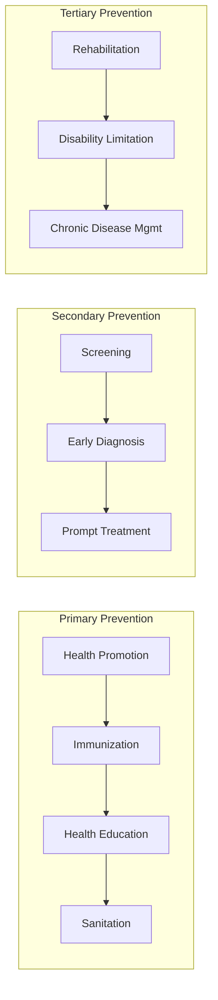

---
tags:
  - nursing
  - community-health
  - public-health
  - primary-care
source: "Thai Nursing Council B.N.S. Curriculum Standards"
created: 2026-07-27
domain: "Community & Public Health Nursing"
prerequisites: ["[[01_Foundation_Sciences]]", "[[02_Nursing_Fundamentals]]"]
---

# 05 — Community & Public Health Nursing

> *"The community is the patient — and the nurse's role is not just to cure, but to create the conditions where disease cannot thrive."*

Community Health Nursing (การพยาบาลอนามัยชุมชน) shifts focus from the individual patient to **populations, families, and communities**. In Thailand, community nursing is central to the **primary healthcare system**, where nurses are often the first and sometimes only healthcare provider in rural areas. Taught in **Year 3–4**.

---

## 1 | Foundations of Community Health

### 1.1 Levels of Prevention

### 1.2 Determinants of Health

| Determinant | Examples | Nursing Role |
|---|---|---|
| **Biological** | Genetics, age, sex | Risk assessment, genetic counseling |
| **Behavioral** | Diet, exercise, smoking, alcohol | Health education, motivational interviewing |
| **Social** | Income, education, housing, social support | Referral to social services, community organizing |
| **Environmental** | Water, air, sanitation, workplace safety | Environmental assessment, advocacy |
| **Healthcare access** | Distance, cost, cultural competence | Mobile clinics, telehealth, cultural bridging |

---

## 2 | The Thai Primary Healthcare System

### 2.1 Healthcare Structure in Thailand

| Level | Facility | Services |
|---|---|---|
| **Primary** | รพ.สต. (Sub-district Health Promoting Hospital), health center | Prevention, health promotion, basic treatment, home visits |
| **Secondary** | โรงพยาบาลชุมชน (Community Hospital, 10–120 beds) | General inpatient/outpatient, emergency, basic surgery |
| **Tertiary** | โรงพยาบาลจังหวัด (Provincial Hospital), โรงพยาบาลศูนย์ | Specialized care, ICU, referral center |
| **Quaternary** | โรงพยาบาลมหาวิทยาลัย (University Hospital), โรงพยาบาลเอกชนขนาดใหญ่ | Advanced subspecialty, academic medicine |

### 2.2 Universal Health Coverage (หลักประกันสุขภาพถ้วนหน้า)

| Scheme | Coverage |
|---|---|
| **บัตรทอง (Gold Card / UC)** | Universal Coverage Scheme — covers ~48 million Thais |
| **ประกันสังคม (Social Security)** | Formal employees — covers ~12 million |
| **สวัสดิการข้าราชการ (Civil Servant)** | Government employees and dependents — covers ~5 million |

Community nurses often serve as the **gatekeepers** of the system, determining when referral to higher levels is needed.

### 2.3 Village Health Volunteers (อสม. — อาสาสมัครสาธารณสุขประจำหมู่บ้าน)

> Thailand's 1+ million **Village Health Volunteers (อสม.)** are the community's first point of contact. Community nurses supervise, train, and work alongside อสม.

| อสม. Role | Nurse's Role |
|---|---|
| Health surveillance (door-to-door) | Train, supervise, verify data |
| Basic health education | Develop educational materials |
| Medication delivery (DOT for TB) | Monitor adherence, manage side effects |
| Disease outbreak notification | Investigate, report to district level |
| Maternal-child tracking | Home visits, high-risk referral |

---

## 3 | Core Community Health Services

### 3.1 Home Visit (การเยี่ยมบ้าน)

| Component | Description |
|---|---|
| **Purpose** | Assessment, care delivery, education, follow-up |
| **Process** | Pre-visit planning → visit → documentation → evaluation |
| **Bag technique** | Organize nursing bag: clean side (supplies) vs. dirty side (used items) |
| **Priority groups** | Postpartum, newborn, elderly, bedbound, chronic disease, TB, mental health |

### 3.2 School Health (การพยาบาลอนามัยโรงเรียน)

| Service | Activities |
|---|---|
| **Health screening** | Vision, hearing, growth, dental, scoliosis |
| **Immunization** | School-based vaccination programs (HPV, dT) |
| **Health education** | Hygiene, nutrition, sex education, substance abuse prevention |
| **First aid & emergency** | School clinic, injury management |
| **Special needs** | Chronic conditions (asthma, diabetes), mental health |

### 3.3 Occupational Health (การพยาบาลอาชีวอนามัย)

| Area | Nurse's Role |
|---|---|
| **Workplace assessment** | Identify hazards (chemical, physical, biological, ergonomic, psychosocial) |
| **Health surveillance** | Pre-employment exams, periodic check-ups |
| **Injury/illness prevention** | Safety training, PPE, ergonomics |
| **Return-to-work** | Rehabilitation, modified duties coordination |

---

## 4 | Epidemiology for Community Nurses

### 4.1 Key Concepts

| Term | Definition |
|---|---|
| **Incidence** | New cases in a time period / population at risk |
| **Prevalence** | All existing cases at a point in time / total population |
| **Endemic** | Constant presence of disease in an area (e.g., dengue in Thailand) |
| **Epidemic** | Cases exceed expected levels |
| **Pandemic** | Epidemic spanning multiple countries/continents |
| **Outbreak investigation** | Confirm → define → describe → hypothesis → test → control → report |

### 4.2 Major Public Health Issues in Thailand

| Issue | Key Facts |
|---|---|
| **Non-communicable diseases (NCDs)** | DM, HTN, CKD, cancer — leading cause of death |
| **Road traffic injuries** | Thailand ranks among highest globally — helmet/alcohol campaigns |
| **Dengue** | Endemic, seasonal outbreaks, vector control |
| **HIV/AIDS** | Declining incidence; focus on PrEP, PEP, ARV adherence |
| **Tuberculosis** | High burden country; DOT, contact tracing |
| **Aging population** | Thailand is an "aged society" (≥20% >60 yr by 2025) |
| **COVID-19** | Community nurses and อสม. were front-line for screening, home isolation |

---

## 5 | Health Promotion Models

| Model/Theory | Application |
|---|---|
| **Health Belief Model** | Perceived susceptibility, severity, benefits, barriers → behavior change |
| **Transtheoretical Model** | Stages of change: precontemplation → contemplation → preparation → action → maintenance |
| **Pender's Health Promotion** | Individual characteristics + behavior-specific cognitions → health behavior |
| **PRECEDE-PROCEED** | Comprehensive community assessment → planning → implementation → evaluation |

### Sufficiency Economy Health (สุขภาพตามแนวเศรษฐกิจพอเพียง)

Thailand integrates **King Rama IX's Sufficiency Economy Philosophy (ปรัชญาเศรษฐกิจพอเพียง)** into community health:
- **Moderation**: Appropriate health behaviors, not extremes
- **Reasonableness**: Evidence-based decisions
- **Self-immunity**: Building resilience, prevention focus
- **Knowledge + Ethics**: Informed, ethical health practice

---

## 6 | Key Terminology

| Thai | English | Notes |
|---|---|---|
| การพยาบาลอนามัยชุมชน | Community Health Nursing | Population-focused nursing |
| การเยี่ยมบ้าน | Home Visit | Core community nursing activity |
| การสร้างเสริมสุขภาพ | Health Promotion | Ottawa Charter principles |
| การป้องกันโรค | Disease Prevention | Primary, secondary, tertiary |
| ระบาดวิทยา | Epidemiology | Study of disease distribution |
| อสม. | Village Health Volunteer | Thailand's community health backbone |
| รพ.สต. | Sub-district Health Promoting Hospital | Primary care facility |
| หลักประกันสุขภาพถ้วนหน้า | Universal Health Coverage | Thailand's health insurance schemes |
| อาชีวอนามัย | Occupational Health | Workplace health and safety |
| เศรษฐกิจพอเพียง | Sufficiency Economy | Applied to community health |

---

## Related Notes

- [[04_Maternal_Child_and_Mental_Health_Nursing]] — Maternal-child care in community settings
- [[06_Nursing_Administration_Ethics_and_Law]] — Health policy and management
- [[Nursing - Overview]] — Return to nursing overview
