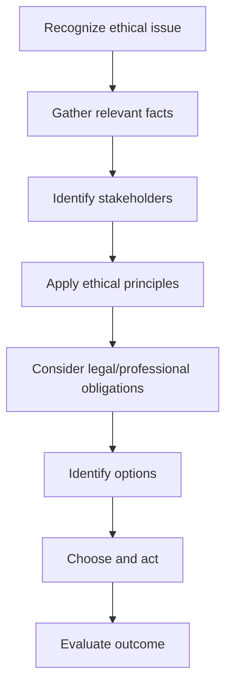

---
tags:
  - nursing
  - administration
  - ethics
  - law
  - leadership
source: "Thai Nursing Council B.N.S. Curriculum Standards; Nursing and Midwifery Profession Act B.E. 2540"
created: 2026-07-27
domain: "Nursing Administration, Ethics & Law"
prerequisites: ["[[02_Nursing_Fundamentals]]", "[[03_Medical_Surgical_Nursing]]"]
---

# 06 — Nursing Administration, Ethics & Law

> *"Good nursing care is not enough — it must be organized, led, ethical, and legal."*

This domain covers the professional framework within which all nursing practice occurs. From managing a ward to navigating ethical dilemmas to understanding your legal obligations, these topics are the scaffolding that supports safe, accountable nursing. Taught across **Year 2–4**.

---

## Part A: Nursing Administration & Leadership (การบริหารการพยาบาล)

### 1 | Management Functions (POSDC)

| Function | Nursing Application |
|---|---|
| **Planning** | Staffing schedules, care standards, disaster plans |
| **Organizing** | Assigning patients (team nursing, primary nursing), resource allocation |
| **Staffing** | Nurse-patient ratios, skill mix (RN, PN, NA), shift management |
| **Directing** | Delegation, supervision, motivation, conflict resolution |
| **Controlling** | Quality audits, incident reporting, performance evaluation |

### 2 | Nursing Care Delivery Models

| Model | Description | Pros / Cons |
|---|---|---|
| **Team Nursing** | RN leads team of PN, NA caring for group | Good for new grads; less continuity |
| **Primary Nursing** | One RN accountable for patient 24/7 | High continuity, RN-intensive |
| **Functional Nursing** | Each staff member does one task (meds, baths, VS) | Efficient but fragmented care |
| **Case Management** | RN coordinates across episodes for complex patients | Cost-effective, holistic |
| **Modular Nursing** | Small team cares for a small group in a geographic area | Blend of team + primary |

### 3 | Quality Improvement in Nursing

| Tool | Purpose |
|---|---|
| **PDCA Cycle** | Plan → Do → Check → Act — continuous improvement |
| **Root Cause Analysis (RCA)** | Why did an error happen? Fix the system, not just the person |
| **Key Performance Indicators (KPIs)** | Falls rate, HAI rate, pressure injury rate, patient satisfaction |
| **Nursing audit** | Retrospective review of documentation vs. standards |
| **Incident reporting** | Non-punitive culture — report to learn, not to blame |
| **HA (Hospital Accreditation)** | โรงพยาบาลคุณภาพ (HA) — Thailand's national accreditation |

### 4 | Thai Healthcare Accreditation

| Standard | Focus |
|---|---|
| **HA (Healthcare Accreditation)** | สถาบันรับรองคุณภาพสถานพยาบาล (องค์การมหาชน) — สรพ. |
| ** Nursing Division Standards** | กองการพยาบาล — nursing-specific standards |
| **ISO** | International standards for specific departments |

---

## Part B: Nursing Ethics (จริยธรรมทางการพยาบาล)

### 5 | Ethical Principles

| Principle | Meaning | Example |
|---|---|---|
| **Autonomy (การเคารพสิทธิ)** | Patient's right to make own decisions | Informed consent, advance directives |
| **Beneficence (การทำประโยชน์)** | Do good; act in patient's best interest | Evidence-based care, pain management |
| **Non-maleficence (การไม่ทำอันตราย)** | Do no harm; prevent harm | Medication safety, fall prevention |
| **Justice (ความยุติธรรม)** | Fair distribution of resources | Triage, equitable care regardless of status |
| **Veracity (ความจริง)** | Truthfulness | Honest communication about prognosis |
| **Fidelity (ความซื่อสัตย์)** | Keeping promises; loyalty | Following through on care plans |

### 6 | The ICN Code of Ethics for Nurses

The **International Council of Nurses (ICN) Code** — adopted by the Thai Nurses Association — has 4 elements:

| Element | Obligation |
|---|---|
| **Nurses and People** | Primary responsibility to those requiring nursing care |
| **Nurses and Practice** | Personal responsibility for maintaining competence |
| **Nurses and the Profession** | Active role in developing nursing's body of knowledge |
| **Nurses and Co-workers** | Collaborative, respectful relationships |

### 7 | Ethical Dilemmas in Thai Nursing

| Scenario | Ethical Conflict |
|---|---|
| **Withholding diagnosis** | Family asks not to tell patient (common in Thai culture) — autonomy vs. family-centered approach |
| **Resource allocation** | ICU bed shortage — who gets it? Justice vs. individual beneficence |
| **End-of-life care** | DNR orders, withdrawal of life support — autonomy vs. sanctity of life (Buddhist context) |
| **Traditional vs. Western medicine** | Patient wants traditional remedy — respect culture vs. evidence-based practice |
| **Informed consent** | Language barrier, low health literacy — how "informed" is informed? |

### 8 | Ethical Decision-Making Framework

---

## Part C: Nursing Law in Thailand (กฎหมายวิชาชีพการพยาบาล)

### 9 | The Nursing and Midwifery Profession Act B.E. 2540 (1997), amended B.E. 2550 (2007)

**พระราชบัญญัติวิชาชีพการพยาบาลและการผดุงครรภ์**

| Section | Content |
|---|---|
| **Section 3** | Definitions: "nursing," "midwifery," "profession," "license" |
| **Section 25–29** | Establishment, composition, and powers of the Nursing Council |
| **Section 30** | **License required** — no one may practice nursing/midwifery without a valid license |
| **Section 31** | Qualifications for licensure examination |
| **Section 32** | Licensure examination requirements |
| **Section 39** | **Professional misconduct (จรรยาบรรณ)** grounds for disciplinary action |
| **Section 44–49** | Penalties: fines up to ฿40,000, imprisonment up to 3 years for unlicensed practice |

### 10 | Professional Standards (มาตรฐานวิชาชีพ)

Issued by the Nursing Council under Section 25(5):

| Standard Domain | Content |
|---|---|
| **Standard 1** | Use nursing process in practice |
| **Standard 2** | Maintain quality of nursing practice |
| **Standard 3** | Provide health information and education |
| **Standard 4** | Ethical practice |
| **Standard 5** | Professional development |

### 11 | License Maintenance

| Requirement | Details |
|---|---|
| **Renewal** | Every 5 years (ทุก 5 ปี) |
| **CNE Credits** | 50 CNE units per 5-year cycle (หน่วยคะแนนการศึกษาต่อเนื่อง 50 หน่วย) |
| **Sources** | Conferences, workshops, online courses, journal reading with quiz, academic publication |
| **Lapsed license** | Must complete additional CNE + re-application to Nursing Council |

### 12 | Legal Documentation in Nursing

| Document | Legal Significance |
|---|---|
| **Nurse's Notes** | Legal record of care — "If it wasn't documented, it wasn't done" |
| **Medication Administration Record (MAR)** | Proof of medication given; signature = legal attestation |
| **Incident Report** | Internal quality tool — typically not part of medical record |
| **Informed Consent** | Patient's legal agreement to treatment — nurse often witnesses |
| **Advance Directive / Living Will** | Patient's pre-stated wishes (พินัยกรรมชีวิต) |

---

## 13 | Key Terminology

| Thai | English | Notes |
|---|---|---|
| การบริหารการพยาบาล | Nursing Administration | Management and leadership |
| ภาวะผู้นำทางการพยาบาล | Nursing Leadership | Vision, influence, advocacy |
| จริยธรรมทางการพยาบาล | Nursing Ethics | Moral principles guiding practice |
| จรรยาบรรณวิชาชีพ | Professional Code of Ethics | Enforceable by Nursing Council |
| พ.ร.บ. วิชาชีพการพยาบาลฯ | Nursing Profession Act | B.E. 2540 (1997) |
| ใบอนุญาตประกอบวิชาชีพ | Professional License | Must be renewed every 5 years |
| หน่วยคะแนน CNE | CNE Credits | 50 units per 5-year cycle |
| มาตรฐานวิชาชีพ | Professional Standards | Issued by Nursing Council |
| การประกันคุณภาพ | Quality Assurance | HA, internal audits |
| การบันทึกทางการพยาบาล | Nursing Documentation | Legal and professional record |

---

## Related Notes

- [[02_Nursing_Fundamentals]] — Documentation and the nursing process
- [[05_Community_and_Public_Health_Nursing]] — Health policy context
- [[08_University_Guide_and_Career_Paths]] — Career advancement into leadership roles
- [[Nursing - Overview]] — Return to nursing overview
